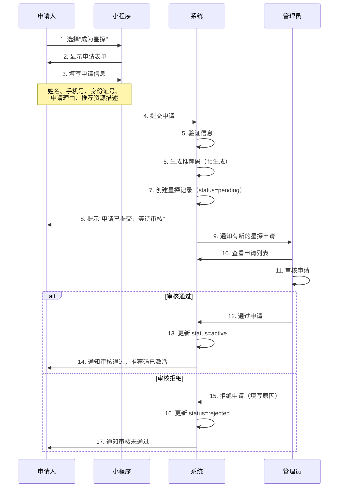
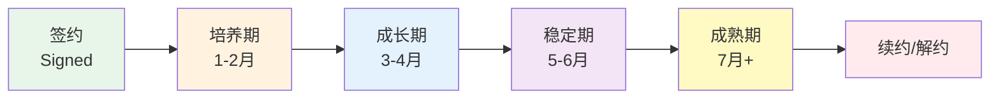

# 星探体系改造设计文档

> 星探体系从分销模式改为直营模式的完整改造方案

**创建日期**: 2026-03-13
**最后更新**: 2026-03-13
**维护者**: 开发团队
**版本**: v1.0

---

## 目录

- [改造背景](#改造背景)
- [新三级等级体系](#新三级等级体系)
- [佣金标准表](#佣金标准表)
- [星探审核制流程](#星探审核制流程)
- [主播定级与结算规则](#主播定级与结算规则)
- [主播6阶段生命周期](#主播6阶段生命周期)
- [数据结构变更](#数据结构变更)
- [分阶段实施计划](#分阶段实施计划)

---

## 改造背景

### 现状问题

当前星探体系采用**分销模式**（SP/SS两级结构），存在以下问题：

1. **上下级关系复杂** - SP（星探合伙人）可发展下级SS（特约星探），层级关系维护成本高
2. **邀请码机制冗余** - SP有邀请码、SS无邀请码，两种注册方式增加了系统复杂度
3. **降级/删除连锁反应** - SP降级或删除时需自动处理所有下级，逻辑复杂且容易出错
4. **佣金规则单一** - 统一的 ¥500签约奖金 + 5%月佣金，不区分星探贡献度
5. **缺乏审核机制** - 任何人都可以直接注册成为星探，质量难以把控

### 改造目标

将星探体系从**分销模式**改为**直营模式**：

1. **扁平化管理** - 取消上下级关系，所有星探直接由平台管理
2. **三级等级制** - 根据签约人数自动升级，激励星探持续推荐
3. **审核准入制** - 新增星探申请审核，保障星探质量
4. **差异化佣金** - 根据等级和主播级别，实行差异化佣金标准
5. **主播生命周期管理** - 引入6阶段生命周期，精细化结算

### 核心变更对比

| 维度 | 旧模式（分销） | 新模式（直营） |
|------|--------------|--------------|
| 层级结构 | SP/SS 两级 | 新锐/特约/合伙人 三级 |
| 上下级关系 | SP可发展下级SS | 无上下级，扁平管理 |
| 注册方式 | SP直接注册，SS需邀请码 | 统一申请 + 审核制 |
| 邀请码 | SP有邀请码 | 取消邀请码机制 |
| 推荐码 | 所有星探有推荐码 | 所有星探有推荐码 |
| 升级方式 | 管理员手动升降级 | 基于签约人数自动升级 |
| 佣金标准 | 统一 ¥500 + 5% | 按等级和主播级别差异化 |
| 结算周期 | 前3个月 | 按主播生命周期阶段 |

---

## 新三级等级体系

### 等级定义


| 等级 | 英文名称 | 等级代码 | 升级条件 | 特点 |
|------|---------|---------|---------|------|
| 新锐星探 | Rookie Scout | `rookie` | 审核通过即为新锐 | 基础佣金，入门等级 |
| 特约星探 | Special Scout | `special` | 累计签约 ≥ 5 人 | 中等佣金，稳定贡献者 |
| 合伙人星探 | Partner Scout | `partner` | 累计签约 ≥ 20 人 | 高佣金，核心合作者 |

### 等级特性对比

| 特性 | 新锐星探 | 特约星探 | 合伙人星探 |
|------|---------|---------|----------|
| **推荐码** | 有 | 有 | 有 |
| **推荐候选人** | 可以 | 可以 | 可以 |
| **签约奖金** | ¥300/人 | ¥500/人 | ¥800/人 |
| **月度佣金比例** | 3% | 5% | 8% |
| **佣金周期** | 培养期+成长期 | 培养期+成长期+稳定期 | 全生命周期 |
| **升级方式** | - | 自动（签约≥5人） | 自动（签约≥20人） |
| **工作台功能** | 基础 | 增强 | 完整 |

### 自动升级机制

```javascript
// 每次候选人签约成功后检查星探等级
async function checkAndUpgradeScoutGrade(scoutId) {
  const scout = await db.collection('scouts').doc(scoutId).get();
  const signedCount = scout.data.stats.signedCount;
  const currentGrade = scout.data.grade;

  let newGrade = currentGrade;

  if (signedCount >= 20 && currentGrade !== 'partner') {
    newGrade = 'partner';
  } else if (signedCount >= 5 && currentGrade === 'rookie') {
    newGrade = 'special';
  }

  if (newGrade !== currentGrade) {
    await db.collection('scouts').doc(scoutId).update({
      data: {
        grade: newGrade,
        gradeUpgradedAt: db.serverDate(),
        gradeHistory: _.push({
          from: currentGrade,
          to: newGrade,
          signedCount: signedCount,
          upgradedAt: db.serverDate()
        })
      }
    });

    // 发送升级通知
    await notifyScoutGradeUpgrade(scoutId, currentGrade, newGrade);
  }
}
```

---

## 佣金标准表

### 签约奖金（一次性）

| 星探等级 | 主播级别 SS | 主播级别 S | 主播级别 A | 主播级别 B |
|---------|-----------|-----------|-----------|-----------|
| 新锐星探 | ¥500 | ¥400 | ¥300 | ¥200 |
| 特约星探 | ¥800 | ¥600 | ¥500 | ¥300 |
| 合伙人星探 | ¥1,200 | ¥1,000 | ¥800 | ¥500 |

### 月度佣金比例

| 星探等级 | 培养期(1-2月) | 成长期(3-4月) | 稳定期(5-6月) | 成熟期(7月+) |
|---------|-------------|-------------|-------------|-------------|
| 新锐星探 | 3% | 2% | - | - |
| 特约星探 | 5% | 4% | 3% | - |
| 合伙人星探 | 8% | 6% | 5% | 3% |

### 佣金计算示例

```
星探：张三（特约星探）
推荐主播：李四（A级主播）

签约奖金：¥500（一次性）

第1个月（培养期）：
  主播收益：¥8,000
  星探佣金：¥8,000 × 5% = ¥400

第2个月（培养期）：
  主播收益：¥12,000
  星探佣金：¥12,000 × 5% = ¥600

第3个月（成长期）：
  主播收益：¥15,000
  星探佣金：¥15,000 × 4% = ¥600

第4个月（成长期）：
  主播收益：¥18,000
  星探佣金：¥18,000 × 4% = ¥720

第5个月（稳定期）：
  主播收益：¥20,000
  星探佣金：¥20,000 × 3% = ¥600

第6个月（稳定期）：
  主播收益：¥22,000
  星探佣金：¥22,000 × 3% = ¥660

第7个月起：佣金停止

总计：¥500 + ¥400 + ¥600 + ¥600 + ¥720 + ¥600 + ¥660 = ¥4,080
```

### 结算周期

- **签约奖金**：主播签约后，次月15日结算
- **月度佣金**：每月1日计算上月佣金，15日发放
- **最低提现**：¥100 起提
- **结算方式**：银行转账 / 微信转账

---

## 星探审核制流程

### 流程图



### 申请表单字段

| 字段 | 类型 | 必填 | 验证规则 | 说明 |
|------|------|------|---------|------|
| 姓名 | 文本 | 是 | 1-20位，中文/英文 | 真实姓名 |
| 手机号 | 文本 | 是 | 11位手机号格式 | 联系电话 |
| 身份证号 | 文本 | 是 | 18位身份证格式 | 身份验证 |
| 申请理由 | 多行文本 | 是 | 10-500字 | 为什么想成为星探 |
| 推荐资源描述 | 多行文本 | 否 | ≤500字 | 拥有的推荐渠道和资源 |

### 审核标准

管理员审核时参考以下标准：
1. **身份真实性** - 姓名和身份证是否匹配
2. **申请理由** - 是否有明确的推荐意愿和资源
3. **历史记录** - 是否有被拒绝或封禁的历史
4. **推荐资源** - 是否有可靠的候选人来源渠道

---

## 主播定级与结算规则

### 主播级别定义

| 级别 | 代码 | 定级标准 | 说明 |
|------|------|---------|------|
| SS级 | `ss` | 面试评分S级 + 社交粉丝≥10万 | 顶级主播，强烈推荐 |
| S级 | `s` | 面试评分S级 或 社交粉丝≥5万 | 优秀主播，推荐签约 |
| A级 | `a` | 面试评分A级 | 良好主播，正常签约 |
| B级 | `b` | 面试评分B级 | 合格主播，培养型 |

### 定级时机

- **初始定级**：候选人签约时，由管理员根据面试评分和综合评估确定
- **动态调整**：签约后每季度根据直播数据复评，可升降级

### 定级数据结构

```javascript
{
  anchorLevel: {
    current: 'a',           // 当前级别
    initialLevel: 'b',      // 初始定级
    lastReviewAt: '2026-06-01',  // 最近复评时间
    history: [
      {
        from: 'b',
        to: 'a',
        reason: '季度复评：直播数据优秀',
        reviewedBy: 'admin_id',
        reviewedAt: '2026-06-01'
      }
    ]
  }
}
```

---

## 主播6阶段生命周期

### 阶段定义



| 阶段 | 代码 | 时间范围 | 特点 | 星探佣金状态 |
|------|------|---------|------|------------|
| 签约 | `signed` | 签约当天 | 完成签约手续 | 触发签约奖金 |
| 培养期 | `nurturing` | 第1-2个月 | 新人培训，熟悉平台 | 所有等级星探有佣金 |
| 成长期 | `growing` | 第3-4个月 | 开始独立直播 | 特约和合伙人有佣金 |
| 稳定期 | `stable` | 第5-6个月 | 数据稳定增长 | 仅合伙人有佣金 |
| 成熟期 | `mature` | 第7个月起 | 独立运营 | 仅合伙人有佣金（低比例） |
| 续约/解约 | `renewal` | 合同到期 | 续约谈判或解约 | 佣金停止 |

### 阶段自动流转

```javascript
// 定时任务：每日检查主播生命周期阶段
async function updateAnchorLifecycleStage() {
  const anchors = await db.collection('candidates').where({
    status: 'signed'
  }).get();

  for (const anchor of anchors.data) {
    const signedAt = new Date(anchor.signedAt);
    const now = new Date();
    const monthsDiff = getMonthsDiff(signedAt, now);

    let newStage;
    if (monthsDiff < 1) {
      newStage = 'signed';
    } else if (monthsDiff <= 2) {
      newStage = 'nurturing';
    } else if (monthsDiff <= 4) {
      newStage = 'growing';
    } else if (monthsDiff <= 6) {
      newStage = 'stable';
    } else {
      newStage = 'mature';
    }

    if (anchor.lifecycleStage !== newStage) {
      await db.collection('candidates').doc(anchor._id).update({
        data: {
          lifecycleStage: newStage,
          lifecycleHistory: _.push({
            from: anchor.lifecycleStage,
            to: newStage,
            changedAt: db.serverDate()
          })
        }
      });
    }
  }
}
```

---

## 数据结构变更

### scouts 集合 - 变更对比

**旧结构**：
```javascript
{
  _id: "scout_id",
  profile: { name, phone, idCard },
  level: {
    depth: 1,               // 1=SP, 2=SS（已移除）
    parentScoutId: null,     // 上级星探ID（已移除）
    parentScoutName: "",     // 上级星探名称（已移除）
    parentInviteCode: ""     // 上级邀请码（已移除）
  },
  inviteCode: "SC-EXT-...", // 邀请码（已移除，改为统一推荐码）
  team: {
    directScouts: 5,        // 直接下级数量（已移除）
    totalScouts: 15          // 团队总数（已移除）
  },
  referrals: [],
  commissions: [],
  status: "active",
  createdAt, updatedAt
}
```

**新结构**：
```javascript
{
  _id: "scout_id",
  // 基本信息
  profile: {
    name: "张星探",
    phone: "13800138000",
    idCard: "110101199001011234"
  },

  // 等级信息（新）
  grade: "rookie",            // rookie/special/partner
  gradeUpgradedAt: null,      // 最近升级时间
  gradeHistory: [],           // 等级变更历史

  // 申请审核信息（新）
  application: {
    reason: "有丰富的主播资源渠道",
    resourceDesc: "拥有抖音10万粉丝账号",
    appliedAt: "2026-03-13",
    status: "approved",       // pending/approved/rejected
    reviewedBy: "admin_id",
    reviewedAt: "2026-03-14",
    reviewNote: "资源描述可信"
  },

  // 推荐码（统一使用shareCode字段）
  shareCode: "SC-EXT-20260313-A3B9",

  // 统计数据（新）
  stats: {
    referredCount: 15,        // 推荐总人数
    signedCount: 5,           // 签约人数
    totalCommission: 12500,   // 累计佣金
    paidCommission: 10000,    // 已发放佣金
    pendingCommission: 2500   // 待发放佣金
  },

  // 推荐记录
  referrals: [],
  // 佣金记录
  commissions: [],

  status: "active",           // pending/active/rejected/deleted
  createdAt: "2026-03-13",
  updatedAt: "2026-03-13"
}
```

### candidates 集合 - referral 字段变更

**旧结构**：
```javascript
{
  referral: {
    scoutId: "scout_id",
    scoutName: "张星探",
    scoutShareCode: "SC-EXT-20260310-A3B9",
    scoutLevel: 1,            // SP=1, SS=2（已移除）
    referredAt: "2026-03-10"
  }
}
```

**新结构**：
```javascript
{
  referral: {
    scoutId: "scout_id",
    scoutName: "张星探",
    scoutShareCode: "SC-EXT-20260313-A3B9",
    scoutGrade: "special",    // rookie/special/partner（新增）
    referredAt: "2026-03-13"
  },

  // 主播定级（新增）
  anchorLevel: {
    current: "a",             // ss/s/a/b
    initialLevel: "a",
    lastReviewAt: null,
    history: []
  },

  // 生命周期阶段（新增）
  lifecycleStage: "nurturing", // signed/nurturing/growing/stable/mature/renewal
  lifecycleHistory: [],
  signedAt: "2026-03-13"
}
```

### 移除的字段和功能

| 移除项 | 原用途 | 替代方案 |
|--------|-------|---------|
| `level.depth` | SP=1, SS=2 层级标识 | `grade` 字段（rookie/special/partner） |
| `level.parentScoutId` | 上级星探ID | 无需替代，扁平化管理 |
| `level.parentScoutName` | 上级星探名称 | 无需替代 |
| `level.parentInviteCode` | 上级邀请码 | 无需替代 |
| `inviteCode` | SP的邀请码 | `shareCode` 统一推荐码 |
| `team.directScouts` | 直接下级数量 | 无需替代 |
| `team.totalScouts` | 团队总数 | 无需替代 |
| `referral.scoutLevel` | 推荐时星探层级 | `referral.scoutGrade` |

---

## 分阶段实施计划

### 第1阶段：数据结构和后端改造

**目标**：完成数据结构迁移和云函数改造

**任务**：
- [ ] scouts 集合结构迁移（添加 grade、application 字段，移除 level、team 字段）
- [ ] 编写数据迁移脚本（SP → partner, SS → special）
- [ ] 新增星探申请审核云函数（applyScout、reviewScout）
- [ ] 改造星探注册流程（移除邀请码逻辑）
- [ ] 实现自动升级检查函数
- [ ] 更新佣金计算云函数（支持差异化佣金）
- [ ] candidates 集合添加 anchorLevel、lifecycleStage 字段

**状态**: 未开始

### 第2阶段：管理后台改造

**目标**：更新管理后台的星探管理功能

**任务**：
- [ ] 星探管理页面改造（移除升降级，改为等级展示）
- [ ] 新增星探申请审核页面
- [ ] 新增主播定级功能
- [ ] 更新佣金管理页面（支持差异化佣金展示）
- [ ] 移除星探邀请码相关功能
- [ ] 移除上下级关系管理功能

**状态**: 未开始

### 第3阶段：小程序端改造

**目标**：更新星探小程序端功能

**任务**：
- [ ] 星探注册页改为申请制（新增申请理由字段）
- [ ] 星探工作台改造（等级卡片、升级进度、差异化佣金展示）
- [ ] 移除邀请码相关页面和功能
- [ ] 新增等级升级提示和引导
- [ ] 更新佣金明细页面（展示生命周期阶段佣金）

**状态**: 未开始

### 第4阶段：数据迁移和测试

**目标**：完成现有数据迁移和全面测试

**任务**：
- [ ] 执行数据迁移脚本
- [ ] 验证迁移后数据一致性
- [ ] 全面回归测试
- [ ] 佣金计算准确性验证
- [ ] 更新所有相关文档

**状态**: 未开始

---

## 风险与注意事项

### 数据迁移风险

1. **现有SP星探** → 根据签约人数映射到对应等级（≥20人→合伙人，≥5人→特约，其他→新锐）
2. **现有SS星探** → 同样根据签约人数映射，不再区分上下级
3. **历史佣金数据** → 保留不变，新佣金规则仅适用于迁移后的新签约

### 向后兼容

1. 迁移期间保留旧字段（标记为废弃），待确认无遗漏后统一清理
2. 推荐码格式不变，现有推荐码继续有效
3. 已产生的佣金按原规则执行，不追溯调整

### 用户通知

1. 所有星探需收到体系变更通知
2. 明确说明等级对应关系和新佣金规则
3. 提供咨询渠道处理异议

---

## 相关文档

- [业务流程总览](../../guides/business/workflows/business-processes-overview.md)
- [星探推荐流程](../../guides/business/workflows/scout-referral.md)
- [候选人旅程](../../guides/business/workflows/candidate-journey.md)
- [角色定义](../../guides/business/architecture/role-definitions.md)

---

**文档结束**

如有问题或建议，请联系开发团队。
