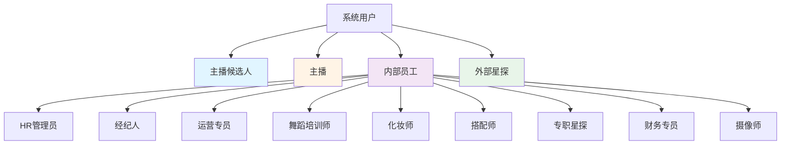
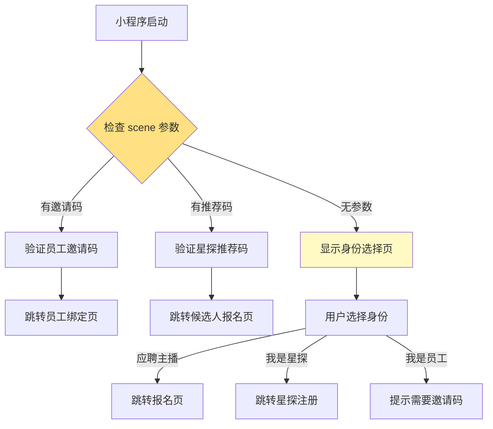

# 多角色系统概述

> 基于微信小程序的多角色统一入口设计方案

**创建日期**: 2025-11-05
**最后更新**: 2025-11-05
**维护者**: 产品团队
**源文档**: multi-role-system.md

---

## 相关文档
- [返回业务文档中心](../README.md)
- [角色定义详解](./role-definitions.md)
- [角色升级机制](./upgrade-mechanism.md)
- [登录流程设计](../workflows/login-flow.md)

---

## 系统概述

### 设计目标

本系统通过微信小程序实现多角色统一入口，根据用户身份自动匹配相应的工作界面，支持以下核心场景:

1. ✅ **主播招聘流程**：候选人投递简历 → 在线面试 → 查看结果
2. ✅ **主播工作管理**：已入职主播的日常工作台
3. ✅ **员工协同办公**：9种内部员工角色的专属工作台
4. ✅ **外部星探推荐**：外部合作星探推荐主播并获得佣金

### 核心特性

- 🔐 **微信免登录**：利用微信授权，无需账号密码
- 🎯 **智能路由**：根据角色自动跳转对应工作台
- 🔗 **场景码识别**：支持推荐码、邀请码等多种进入方式
- 🛡️ **安全可控**：邀请码机制防止随意注册
- 📱 **多端统一**：一个小程序满足所有角色需求

---

## 四大用户类型

### 系统架构图



### 用户类型概览

| 用户类型 | 角色代码 | 主要场景 | 进入方式 |
|---------|---------|---------|---------|
| **主播候选人** | `candidate` | 应聘、面试、查看审核进度 | 星探推荐码、直接搜索小程序 |
| **主播** | `streamer` | 查看排班、培训任务、直播数据 | 从候选人自动升级 |
| **内部员工** | `hr_admin`, `agent`, `operator` 等 | 各角色专属工作台 | 员工邀请码 |
| **外部星探** | `scout_external` | 推荐主播、查看佣金 | 注册申请 |

---

## 核心设计原则

### 1. 单一入口，智能分流

**设计理念**：
- 所有用户都从同一个小程序进入
- 系统根据场景参数和用户身份自动识别
- 自动跳转到对应的工作台界面

**实现方式**：
```
用户打开小程序
    ↓
检查启动参数（scene、query）
    ↓
微信授权登录（获取 openid）
    ↓
查询用户角色
    ↓
自动路由到对应工作台
```

### 2. 渐进式用户体验

**候选人旅程**：
```
扫码/搜索小程序 → 微信授权 → 填写报名表 →
创建账号（candidate） → 查看审核进度 →
接收面试通知 → 参加面试 → 签署合同 →
角色升级（streamer） → 主播工作台
```

**特点**：
- ✅ 每个阶段都有明确的状态反馈
- ✅ 用户可以随时查看当前进度
- ✅ 状态变更会收到微信通知

### 3. 严格的权限控制

**权限设计**：
- 🔒 **候选人**：只能查看自己的申请信息
- 🔒 **主播**：只能查看自己的排班和数据
- 🔒 **经纪人**：只能查看名下主播的数据
- 🔒 **HR**：可以查看所有候选人信息
- 🔒 **星探**：只能查看自己推荐的候选人

**实现方式**：
- 云函数中验证用户身份
- 数据查询时自动添加权限过滤
- 前端页面根据角色显示不同功能

---

## 场景参数路由机制

### 支持的进入场景

| 场景 | 场景参数 | 用途 | 示例 |
|-----|---------|------|------|
| 扫描二维码 | `scene: 1011` | 员工邀请、星探推荐 | `query: { invite_code: 'INV-HR-XXX' }` |
| 扫描小程序码 | `scene: 1047` | 员工邀请、星探推荐 | `query: { scout_code: 'SC-EXT-XXX' }` |
| 发现栏入口 | `scene: 1001` | 直接搜索小程序 | 无参数，显示身份选择页 |
| 聊天附件栏 | `scene: 1104` | 星探分享链接 | `query: { scout_code: 'SC-EXT-XXX' }` |

### 场景参数解析流程



---

## 工作台设计原则

### 1. 角色专属界面

每个角色看到完全不同的工作台：

**候选人工作台**：
- 📋 申请进度追踪
- 📅 面试安排
- 📨 消息通知
- ℹ️ 帮助中心

**主播工作台**：
- 📊 本周数据概览
- 📅 排班信息
- 📚 培训任务
- 💰 收益明细

**经纪人工作台**：
- 👥 团队管理（12-15人）
- 📊 团队数据分析
- 📅 排班确认
- 📝 周报复盘

**星探工作台**：
- 📱 推荐码管理
- 👥 推荐记录
- 💰 佣金明细
- 💳 提现申请

### 2. 数据隔离

**设计原则**：
- 每个用户只能看到权限范围内的数据
- 云函数自动添加数据过滤条件
- 前端不依赖权限控制，后端强制验证

**实现示例**：
```javascript
// 云函数查询主播数据
async function getStreamerData(userId, targetStreamerId) {
  const user = await getUser(userId);

  if (user.role === 'agent') {
    // 经纪人只能查看名下主播
    const streamer = await db.collection('streamers')
      .where({
        _id: targetStreamerId,
        agent_id: user.role_id
      })
      .get();
  } else if (user.role === 'streamer') {
    // 主播只能查看自己的数据
    if (targetStreamerId !== user.role_id) {
      throw new Error('无权限');
    }
  }
}
```

---

## 技术实现要点

### 1. 微信授权集成

```javascript
// app.js - 小程序启动
onLaunch(options) {
  // 保存场景参数
  this.globalData.sceneParams = {
    scene: options.scene,
    query: options.query,
    referrerInfo: options.referrerInfo
  };

  // 检查授权状态
  wx.getSetting({
    success: (res) => {
      if (res.authSetting['scope.userInfo']) {
        this.silentLogin();
      } else {
        wx.navigateTo({
          url: '/pages/auth/login/login'
        });
      }
    }
  });
}
```

### 2. 角色识别与路由

```javascript
// 根据角色自动跳转
routeToWorkspace(roleType) {
  const routeMap = {
    'candidate': '/pages/candidate/home/home',
    'streamer': '/pages/streamer/home/home',
    'hr_admin': '/pages/employee/hr/home/home',
    'agent': '/pages/employee/agent/home/home',
    'operator': '/pages/employee/operator/home/home',
    'scout_external': '/pages/scout-external/home/home'
  };

  const targetPage = routeMap[roleType] || '/pages/auth/role-select/role-select';
  wx.reLaunch({ url: targetPage });
}
```

### 3. CustomTabBar 动态切换

```javascript
// custom-tab-bar/index.js
Component({
  data: {
    tabConfig: {
      candidate: [
        { text: '首页', icon: 'home', url: '/pages/candidate/home/home' },
        { text: '面试', icon: 'interview', url: '/pages/candidate/interview/interview' },
        { text: '我的', icon: 'user', url: '/pages/candidate/profile/profile' }
      ],
      streamer: [
        { text: '首页', icon: 'home', url: '/pages/streamer/home/home' },
        { text: '排班', icon: 'schedule', url: '/pages/streamer/schedule/schedule' },
        { text: '培训', icon: 'training', url: '/pages/streamer/training/training' },
        { text: '我的', icon: 'user', url: '/pages/streamer/profile/profile' }
      ]
      // ... 其他角色的 TabBar 配置
    }
  },

  methods: {
    updateTabBar(userRole) {
      this.setData({
        list: this.data.tabConfig[userRole] || []
      });
    }
  }
});
```

---

## 安全机制

### 1. 防止重复注册

```javascript
async function checkDuplicateRegistration(openid, phone) {
  // 检查 openid 是否已注册
  const existByOpenid = await db.collection('users')
    .where({ openid })
    .count();

  if (existByOpenid.total > 0) {
    throw new Error('该微信账号已注册，一个微信账号只能绑定一个身份');
  }

  // 检查手机号是否已被使用
  if (roleType === 'candidate' || roleType === 'scout_external') {
    const existByPhone = await db.collection('candidates')
      .where({ phone })
      .count();

    if (existByPhone.total > 0) {
      throw new Error('该手机号已被注册');
    }
  }
}
```

### 2. 邀请码验证

```javascript
async function verifyInviteCode(code) {
  const invite = await db.collection('invite_codes')
    .where({ code })
    .get();

  // 检查1: 邀请码是否存在
  if (invite.data.length === 0) {
    throw new Error('邀请码不存在');
  }

  const inviteData = invite.data[0];

  // 检查2: 是否已使用
  if (inviteData.used) {
    throw new Error('该邀请码已被使用');
  }

  // 检查3: 是否过期
  if (new Date() > new Date(inviteData.expires_at)) {
    throw new Error('邀请码已过期');
  }

  return inviteData;
}
```

---

## 场景值对照表

| 场景值 | 说明 | 示例 |
|--------|------|------|
| 1001 | 发现栏小程序主入口 | - |
| 1011 | 扫描二维码 | 星探推荐码、员工邀请码 |
| 1047 | 扫描小程序码 | 星探推荐码、员工邀请码 |
| 1089 | 微信聊天主界面下拉 | - |
| 1104 | 聊天附件栏 | 星探分享链接 |

---

## 下一步阅读

- [角色定义详解](./role-definitions.md) - 了解四大用户类型的详细说明
- [角色升级机制](./upgrade-mechanism.md) - 候选人如何升级为主播
- [登录流程设计](../workflows/login-flow.md) - 完整的登录和角色识别流程
- [候选人旅程](../workflows/candidate-journey.md) - 候选人完整体验流程

---

**文档版本**: v1.0
**最后更新**: 2025-11-05
**维护者**: 产品团队
