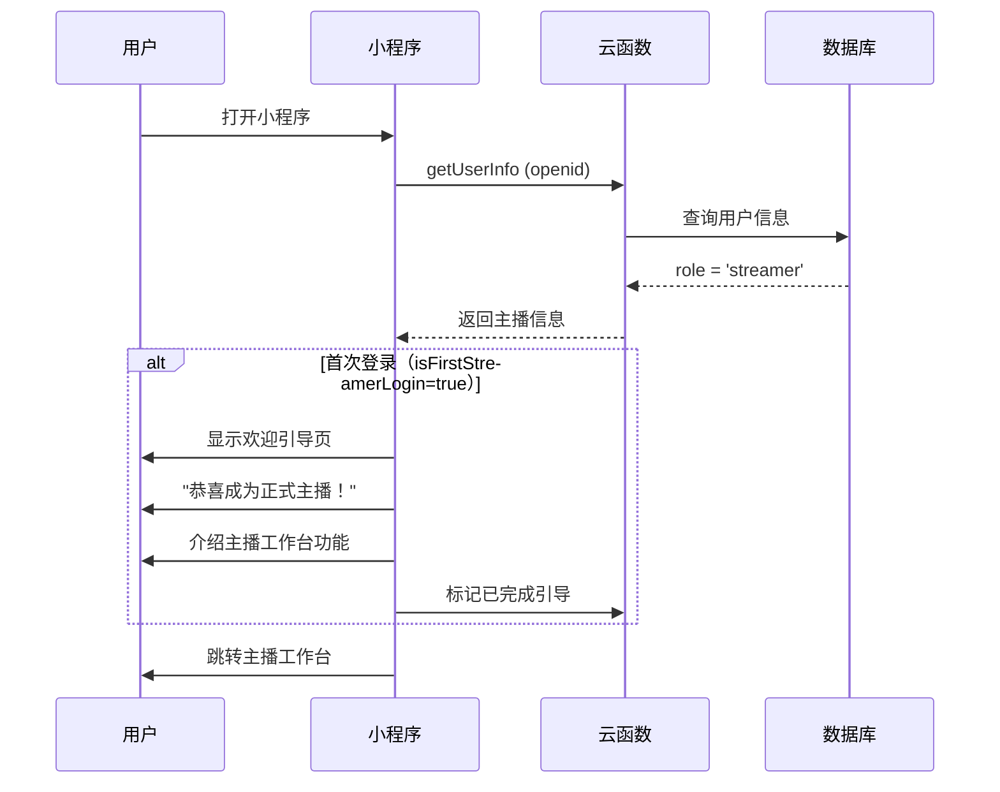
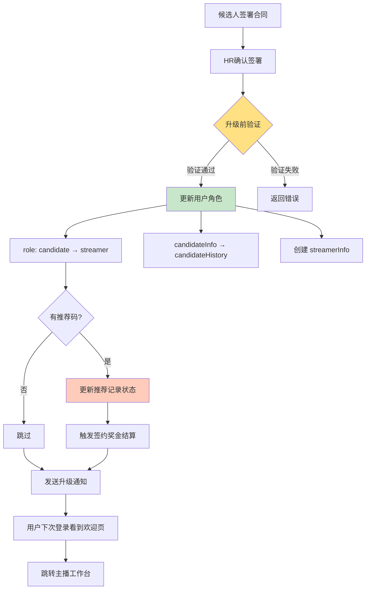

# 角色升级机制

> 候选人到主播的自动升级流程设计

**创建日期**: 2025-11-05
**最后更新**: 2025-11-05
**维护者**: 产品团队
**源文档**: multi-role-system.md

---

## 相关文档
- [返回业务文档中心](../README.md)
- [系统概述](./multi-role-overview.md)
- [角色定义详解](./role-definitions.md)
- [候选人旅程](../workflows/candidate-journey.md)

---

## 候选人 → 主播升级流程

### 触发条件

当候选人完成以下所有步骤后，系统自动将角色从 `candidate` 升级为 `streamer`：

1. ✅ 通过所有面试环节
2. ✅ 获得录用Offer
3. ✅ 完成电子合同签署
4. ✅ HR确认入职

### 升级时机

**关键节点**：HR确认合同签署完成后

```javascript
// 云函数：confirmContract - HR确认合同签署完成后调用
exports.main = async (event, context) => {
  const { userId, contractId } = event;

  // 1. 验证合同状态
  const contract = await db.collection('contracts')
    .doc(contractId)
    .get();

  if (contract.data.status !== 'signed') {
    throw new Error('合同尚未签署');
  }

  // 2. 更新用户角色
  await db.collection('users').doc(userId).update({
    data: {
      role: 'streamer', // 从 candidate 升级为 streamer
      roleUpgradedAt: new Date(),

      // 保留候选人信息作为历史记录
      candidateHistory: {
        appliedAt: _.get('candidateInfo.applyAt'),
        source: _.get('candidateInfo.source'),
        scoutCode: _.get('candidateInfo.scoutCode'),
        upgradedAt: new Date()
      },

      // 初始化主播信息
      streamerInfo: {
        status: 'onboarding', // 入职中
        stageLevel: 'trainee', // 实习主播
        agentId: contract.data.agentId, // 分配的经纪人
        contractId: contractId,
        joinedAt: new Date(),

        // 初始数据
        totalLiveHours: 0,
        totalIncome: 0,
        followerCount: 0
      }
    }
  });

  // 3. 如果有星探推荐，更新推荐状态为"已转化"
  if (contract.data.scoutCode) {
    await db.collection('referral_records')
      .where({
        userId: userId,
        scoutCode: contract.data.scoutCode
      })
      .update({
        data: {
          status: 'converted', // 从 pending 变为 converted
          convertedAt: new Date(),
          contractId: contractId
        }
      });
  }

  // 4. 发送通知
  await sendTemplateMessage({
    touser: contract.data.candidateOpenid,
    template_id: 'WELCOME_STREAMER',
    data: {
      name: contract.data.candidateName,
      agent: contract.data.agentName,
      startDate: contract.data.startDate
    }
  });

  return { success: true, newRole: 'streamer' };
};
```

---

## 数据变更对比

### 用户记录变更

| 字段 | 升级前（candidate） | 升级后（streamer） |
|------|-------------------|-------------------|
| **role** | `candidate` | `streamer` |
| **candidateInfo** | 完整信息 | 移至 candidateHistory |
| **streamerInfo** | 不存在 | 新建，包含主播档案 |
| **工作台访问** | `/pages/candidate/home` | `/pages/streamer/home` |
| **权限** | 查看申请进度、面试 | 查看排班、培训、直播数据 |

### 详细数据结构

**升级前**：
```javascript
{
  _id: 'user_001',
  openId: 'wx_xxx',
  role: 'candidate',

  candidateInfo: {
    status: 'contract_pending',
    source: 'scout_referral',
    scoutCode: 'SC-EXT-20250102-A3B9',
    applyData: { /* 报名信息 */ },
    applyAt: '2025-01-05'
  },

  profile: {
    name: '张三',
    phone: '13800138000'
  }
}
```

**升级后**：
```javascript
{
  _id: 'user_001',
  openId: 'wx_xxx',
  role: 'streamer', // ✅ 角色已升级
  roleUpgradedAt: '2025-01-20',

  // ✅ 候选人信息移至历史
  candidateHistory: {
    appliedAt: '2025-01-05',
    source: 'scout_referral',
    scoutCode: 'SC-EXT-20250102-A3B9',
    upgradedAt: '2025-01-20'
  },

  // ✅ 新建主播信息
  streamerInfo: {
    status: 'onboarding',
    stageLevel: 'trainee',
    agentId: 'agent_001',
    contractId: 'contract_001',
    joinedAt: '2025-01-20',
    totalLiveHours: 0,
    totalIncome: 0,
    followerCount: 0
  },

  profile: {
    name: '张三',
    stageName: '小星星', // ✅ 可添加艺名
    phone: '13800138000'
  }
}
```

---

## 升级后首次登录流程

### 流程图



### 欢迎引导页设计

**页面元素**：
```
┌─────────────────────────────────┐
│  🎉 恭喜您成为正式主播！          │
│                                  │
│  ✅ 您已完成签约                 │
│  ✅ 您的经纪人：李经理            │
│  ✅ 入职日期：2025-01-20         │
│                                  │
│  接下来您可以：                   │
│  📅 查看本周排班                 │
│  📚 开始培训任务                 │
│  💰 查看收益明细                 │
│                                  │
│  [开始使用]                      │
└─────────────────────────────────┘
```

**实现代码**：
```javascript
// pages/streamer/welcome/welcome.js
Page({
  data: {
    userInfo: null,
    agentInfo: null
  },

  async onLoad() {
    // 获取用户信息
    const res = await wx.cloud.callFunction({
      name: 'getUserInfo'
    });

    this.setData({
      userInfo: res.result.user,
      agentInfo: res.result.agent
    });
  },

  async onStartUse() {
    // 标记已完成引导
    await wx.cloud.callFunction({
      name: 'markWelcomeComplete'
    });

    // 跳转主播工作台
    wx.reLaunch({
      url: '/pages/streamer/home/home'
    });
  }
});
```

---

## 角色升级后的消息通知

### 1. 微信模板消息

```javascript
{
  touser: 'OPENID',
  template_id: 'ROLE_UPGRADE_TEMPLATE',
  page: '/pages/streamer/home/home',
  data: {
    title: '角色升级通知',
    content: '恭喜您成为正式主播！',
    time: '2025-01-15 10:00',
    remark: '点击查看您的主播工作台'
  }
}
```

### 2. 站内消息

```javascript
{
  userId: 'USER_ID',
  type: 'role_upgrade',
  title: '🎉 欢迎加入主播团队',
  content: '您已完成签约，角色升级为正式主播。\n\n您的经纪人：李经理\n首次培训时间：2025-01-16 14:00\n\n请访问主播工作台查看详细信息。',
  read: false,
  createdAt: new Date()
}
```

---

## 星探佣金结算触发

### 推荐记录状态更新

当候选人升级为主播时，自动更新推荐记录状态：

```javascript
// 更新推荐记录
await db.collection('referral_records')
  .where({
    userId: userId,
    scoutCode: scoutCode
  })
  .update({
    data: {
      status: 'converted', // 从 pending 变为 converted
      convertedAt: new Date(),
      contractId: contractId,

      // 初始化佣金信息
      commission: {
        signBonus: 500, // 签约奖金
        monthlyRate: 0.05, // 月佣金比例 5%
        totalCommission: 500, // 累计佣金（初始为签约奖金）
        paidCommission: 0, // 已支付佣金
        status: 'pending' // pending / approved / paid
      }
    }
  });
```

### 签约奖金结算

```javascript
// 云函数：approveSignBonus
exports.main = async (event, context) => {
  const { referralId } = event;

  // 1. 更新推荐记录
  await db.collection('referral_records')
    .doc(referralId)
    .update({
      data: {
        'commission.status': 'approved',
        'commission.signBonusApprovedAt': new Date()
      }
    });

  // 2. 创建佣金结算记录
  await db.collection('commission_settlements').add({
    data: {
      referralId: referralId,
      scoutId: scoutId,
      type: 'sign_bonus',
      amount: 500,
      status: 'pending_payment',
      createdAt: new Date()
    }
  });

  return { success: true };
};
```

---

## 回退机制（特殊情况）

### 使用场景

在极少数情况下（如合同签署出错、候选人放弃入职等），HR可以回退角色。

### 回退权限

- ✅ HR管理员
- ✅ 超级管理员

### 回退实现

```javascript
// 云函数：rollbackRole（需要HR权限）
exports.main = async (event, context) => {
  const { userId, reason } = event;

  // 验证权限
  const caller = await getCurrentUser(context.OPENID);
  if (!['hr_admin', 'super_admin'].includes(caller.roleType)) {
    throw new Error('无权限执行此操作');
  }

  // 回退角色
  await db.collection('users').doc(userId).update({
    data: {
      role: 'candidate',

      // 从历史记录恢复候选人信息
      candidateInfo: _.get('candidateHistory'),

      // 清除主播信息
      streamerInfo: _.remove(),

      // 记录回退日志
      roleChangeLog: _.push({
        from: 'streamer',
        to: 'candidate',
        reason: reason,
        operator: caller.userId,
        operatedAt: new Date()
      })
    }
  });

  return { success: true };
};
```

### 回退影响

**数据变更**：
- ✅ 角色从 `streamer` 回退到 `candidate`
- ✅ candidateInfo 从 candidateHistory 恢复
- ✅ streamerInfo 清除
- ✅ 记录回退日志

**关联数据**：
- ⚠️ 推荐记录状态从 `converted` 回退到 `pending`
- ⚠️ 签约奖金（如已发放）需要手动追回
- ⚠️ 经纪人团队中移除该主播

---

## 注意事项

### ⚠️ 重要提醒

1. **不可逆性**：角色升级通常不可逆，除非HR手动回退
2. **数据完整性**：升级前确保所有候选人信息完整
3. **权限变更**：升级后候选人工作台将不可访问
4. **通知及时性**：升级后立即发送通知，避免用户困惑
5. **历史记录**：candidateHistory保留完整的应聘历史，不可删除
6. **星探佣金**：角色升级会触发星探佣金结算流程

### 升级前检查清单

```javascript
// 升级前验证函数
async function validateBeforeUpgrade(userId) {
  const user = await db.collection('users').doc(userId).get();
  const candidate = user.data;

  // 检查1: 是否是候选人
  if (candidate.role !== 'candidate') {
    throw new Error('只有候选人可以升级为主播');
  }

  // 检查2: 是否已签约
  if (candidate.candidateInfo.status !== 'signed') {
    throw new Error('候选人尚未完成签约');
  }

  // 检查3: 是否有有效合同
  const contract = await db.collection('contracts')
    .where({
      candidateId: userId,
      status: 'signed'
    })
    .get();

  if (contract.data.length === 0) {
    throw new Error('未找到有效的签约合同');
  }

  // 检查4: 是否已分配经纪人
  if (!contract.data[0].agentId) {
    throw new Error('尚未分配经纪人');
  }

  return {
    canUpgrade: true,
    contract: contract.data[0]
  };
}
```

---

## 升级流程总览



---

## 下一步阅读

- [候选人旅程](../workflows/candidate-journey.md) - 候选人完整流程
- [员工入职流程](../workflows/employee-onboarding.md) - 员工邀请码机制
- [星探推荐流程](../workflows/scout-referral.md) - 星探佣金结算

---

**文档版本**: v1.0
**最后更新**: 2025-11-05
**维护者**: 产品团队
