# ⚡ 主播全生命周期业务流程详解

> 从报名到结算的完整业务流程说明

**创建日期**: 2025-11-01
**最后更新**: 2025-11-02
**维护者**: 产品团队
**状态**: 已发布

---

## 📑 目录

- [流程总览](#流程总览)
- [阶段0：用户注册和角色识别](#阶段0用户注册和角色识别)
- [阶段1：候选人报名](#阶段1候选人报名)
- [阶段2：HR审核与面试官分配](#阶段2hr审核与面试官分配)
- [阶段3：线上测试](#阶段3线上测试)
- [阶段4：线下面试与素材上传](#阶段4线下面试与素材上传)
- [阶段5：系统评级](#阶段5系统评级)
- [阶段6：签约入职](#阶段6签约入职)
- [阶段7：培训阶段](#阶段7培训阶段)
- [阶段8：直播运营阶段](#阶段8直播运营阶段)
- [阶段9：结算阶段](#阶段9结算阶段)
- [关键决策点汇总](#关键决策点汇总)

---

## 流程总览

### 完整生命周期流程图

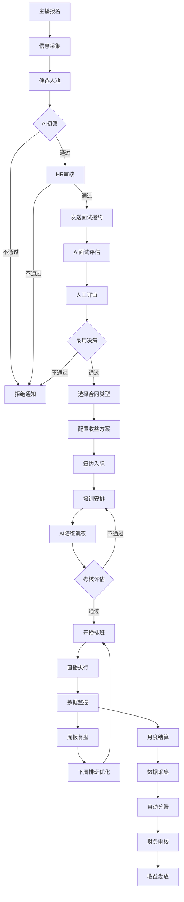
```mermaid
graph TD
    A[主播报名] --> B[信息采集]
    B --> C[候选人池]
    C --> D{AI初筛}
    D -->|不通过| E[拒绝通知]
    D -->|通过| F[HR审核]
    F -->|不通过| E
    F -->|通过| G[发送面试邀约]
    G --> H[AI面试评估]
    H --> I[人工评审]
    I --> J{录用决策}
    J -->|不通过| E
    J -->|通过| K[选择合同类型]
    K --> L[配置收益方案]
    L --> M[签约入职]
    M --> N[培训安排]
    N --> O[AI陪练训练]
    O --> P{考核评估}
    P -->|不通过| N
    P -->|通过| Q[开播排班]
    Q --> R[直播执行]
    R --> S[数据监控]
    S --> T[周报复盘]
    T --> U[下周排班优化]
    U --> Q
    S --> V[月度结算]
    V --> W[数据采集]
    W --> X[自动分账]
    X --> Y[财务审核]
    Y --> Z[收益发放]
```

### 10大阶段概览

| 阶段 | 名称 | 核心目标 | 关键决策点 | 主导角色 | 周期 |
|------|------|---------|-----------|---------|------|
| 0 | 用户注册和角色识别 | 识别用户身份并路由 | ✅ 身份选择/邀请码验证 | 系统自动 | 即时 |
| 1 | 候选人报名 | 采集候选人信息 | - | 候选人 | 10-15分钟 |
| 2 | HR审核与面试官分配 | 筛选并安排面试 | ✅ 通过/拒绝 | HR管理员 | 1-2天 |
| 3 | 线上测试 | 性格测评 | - | 候选人 | 20-30分钟 |
| 4 | 线下面试与素材上传 | 采集面试素材和评价 | - | 摄像师+导师+经纪人 | 半天 |
| 5 | 系统评级 | 综合评估候选人 | ✅ 通过/拒绝 | 系统+HR+经纪人 | 1天 |
| 6 | 签约入职 | 确立合作关系 | ✅ 合同签署/角色升级 | 经纪人+财务 | 1-2天 |
| 7 | 培训阶段 | 提升主播能力 | ✅ 考核通过/继续培训 | 经纪人+导师团队 | 2-4周 |
| 8 | 直播运营阶段 | 产出商业价值 | ✅ 排班调整/问题干预 | 经纪人+运营 | 持续进行 |
| 9 | 结算阶段 | 分配收益 | ✅ 异常处理/审批 | 财务+经纪人 | 月度/周度 |

---

## 阶段0：用户注册和角色识别

### 🎯 阶段目标
用户首次进入小程序时,根据不同入口和身份快速完成注册并路由到对应工作台。

### 📋 三种入口场景

#### 场景1：星探推荐码进入

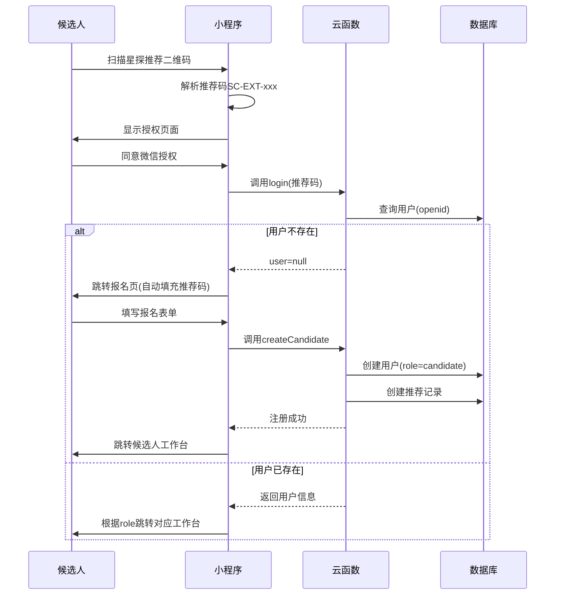
```mermaid
sequenceDiagram
    participant C as 候选人
    participant MP as 小程序
    participant CF as 云函数
    participant DB as 数据库

    C->>MP: 扫描星探推荐二维码
    MP->>MP: 解析推荐码SC-EXT-xxx
    MP->>C: 显示授权页面
    C->>MP: 同意微信授权
    MP->>CF: 调用login(推荐码)
    CF->>DB: 查询用户(openid)

    alt 用户不存在
    CF-->>MP: user=null
    MP->>C: 跳转报名页(自动填充推荐码)
    C->>MP: 填写报名表单
    MP->>CF: 调用createCandidate
    CF->>DB: 创建用户(role=candidate)
    CF->>DB: 创建推荐记录
    CF-->>MP: 注册成功
    MP->>C: 跳转候选人工作台
    else 用户已存在
    CF-->>MP: 返回用户信息
    MP->>C: 根据role跳转对应工作台
    end
```

**候选人体验**：
1. 扫码后看到"XX星探推荐您应聘主播"
2. 微信授权登录
3. 填写报名表(推荐码自动填充,不可见)
4. 提交后立即进入候选人工作台,可查看进度

---

#### 场景2：员工邀请码进入

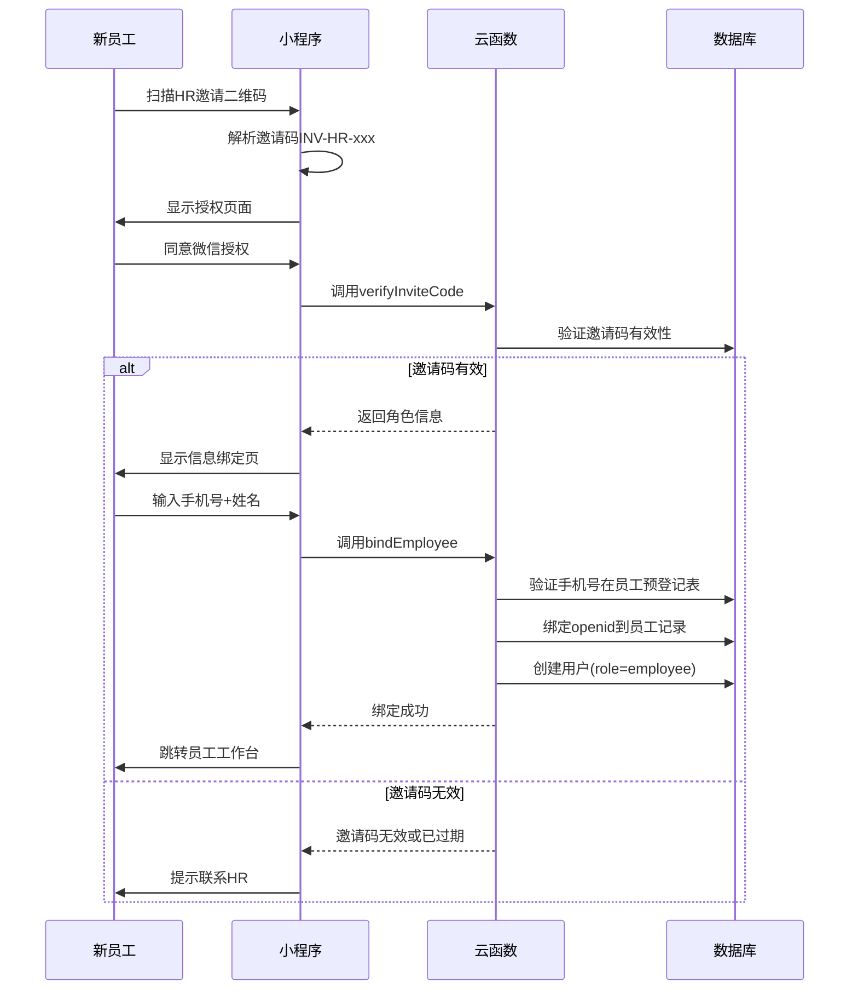
```mermaid
sequenceDiagram
    participant E as 新员工
    participant MP as 小程序
    participant CF as 云函数
    participant DB as 数据库

    E->>MP: 扫描HR邀请二维码
    MP->>MP: 解析邀请码INV-HR-xxx
    MP->>E: 显示授权页面
    E->>MP: 同意微信授权
    MP->>CF: 调用verifyInviteCode
    CF->>DB: 验证邀请码有效性

    alt 邀请码有效
    CF-->>MP: 返回角色信息
    MP->>E: 显示信息绑定页
    E->>MP: 输入手机号+姓名
    MP->>CF: 调用bindEmployee
    CF->>DB: 验证手机号在员工预登记表
    CF->>DB: 绑定openid到员工记录
    CF->>DB: 创建用户(role=employee)
    CF-->>MP: 绑定成功
    MP->>E: 跳转员工工作台
    else 邀请码无效
    CF-->>MP: 邀请码无效或已过期
    MP->>E: 提示联系HR
    end
```

**员工体验**：
1. 扫描HR发送的邀请码
2. 输入手机号和姓名验证身份
3. 绑定成功后直接进入对应角色工作台

---

#### 场景3：直接搜索进入

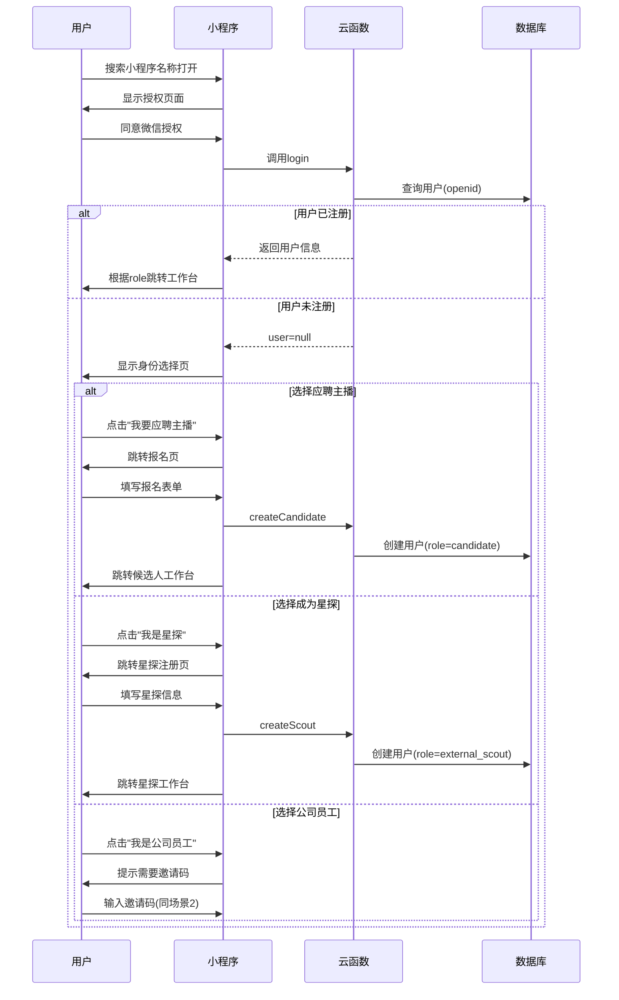
```mermaid
sequenceDiagram
    participant U as 用户
    participant MP as 小程序
    participant CF as 云函数
    participant DB as 数据库

    U->>MP: 搜索小程序名称打开
    MP->>U: 显示授权页面
    U->>MP: 同意微信授权
    MP->>CF: 调用login
    CF->>DB: 查询用户(openid)

    alt 用户已注册
    CF-->>MP: 返回用户信息
    MP->>U: 根据role跳转工作台
    else 用户未注册
    CF-->>MP: user=null
    MP->>U: 显示身份选择页

    alt 选择应聘主播
    U->>MP: 点击"我要应聘主播"
    MP->>U: 跳转报名页
    U->>MP: 填写报名表单
    MP->>CF: createCandidate
    CF->>DB: 创建用户(role=candidate)
    MP->>U: 跳转候选人工作台

    else 选择成为星探
    U->>MP: 点击"我是星探"
    MP->>U: 跳转星探注册页
    U->>MP: 填写星探信息
    MP->>CF: createScout
    CF->>DB: 创建用户(role=external_scout)
    MP->>U: 跳转星探工作台

    else 选择公司员工
    U->>MP: 点击"我是公司员工"
    MP->>U: 提示需要邀请码
    U->>MP: 输入邀请码(同场景2)
    end
    end
```

**用户体验**：
1. 搜索小程序打开
2. 如果已注册,直接进入对应工作台
3. 如果未注册,选择身份后完成注册流程

---

### 🎯 关键设计要点

1. **候选人即时注册**：
   - ✅ 候选人报名时立即创建账号(role=candidate)
   - ✅ 不需要等到签约才绑定微信
   - ✅ 注册后可实时查看申请进度

2. **角色唯一性**：
   - ✅ 一个微信只能注册一个角色
   - ✅ 重复注册会提示已有身份

3. **推荐码追踪**：
   - ✅ 星探推荐码自动记录在candidateInfo中
   - ✅ 用于后续佣金结算

4. **员工邀请验证**：
   - ✅ 员工需通过手机号+姓名验证
   - ✅ 确保只有预登记的员工才能绑定

---

## 阶段1：候选人报名

### 🎯 阶段目标
候选人通过小程序完成微信登录并提交报名信息，系统创建候选人账号。

### 📋 流程详解

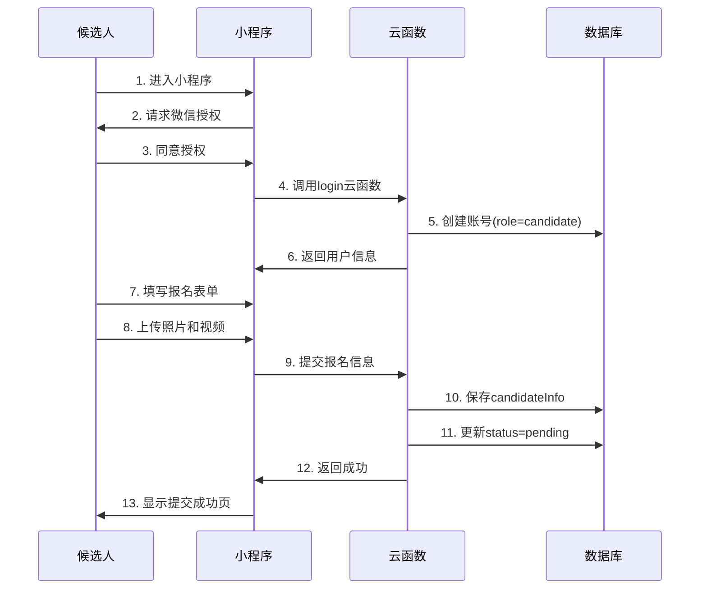
```mermaid
sequenceDiagram
    participant C as 候选人
    participant MP as 小程序
    participant CF as 云函数
    participant DB as 数据库

    C->>MP: 1. 进入小程序
    MP->>C: 2. 请求微信授权
    C->>MP: 3. 同意授权
    MP->>CF: 4. 调用login云函数
    CF->>DB: 5. 创建账号(role=candidate)
    CF->>MP: 6. 返回用户信息
    C->>MP: 7. 填写报名表单
    C->>MP: 8. 上传照片和视频
    MP->>CF: 9. 提交报名信息
    CF->>DB: 10. 保存candidateInfo
    CF->>DB: 11. 更新status=pending
    CF->>MP: 12. 返回成功
    MP->>C: 13. 显示提交成功页
```

### 📝 信息采集清单

#### 1. 基础信息（必填）
- 真实姓名、艺名
- 年龄、性别
- 身高、体重
- 联系方式（手机、微信）
- 所在地（省市区）
- 身份证号（加密存储）

#### 2. 形象资料（必填）
- 生活照 3张
  - 正面照（五官清晰）
  - 侧面照（展示轮廓）
  - 全身照（展示身材比例）
- 艺术照 3张（不同风格）
- 自我介绍视频 1分钟
- **系统自动生成**：AI颜值评分报告

#### 3. 才艺信息
- 主修才艺（多选）：唱歌、舞蹈、乐器、脱口秀、其他
- 才艺等级：1-10级自评
- 代表作品链接（如有）
- 特殊才艺说明

#### 4. 经验信息
- 直播经验：有/无
- 曾用平台：抖音、快手、B站等（多选）
- 历史最高粉丝数
- 历史最高月收入
- 代表性内容链接

#### 5. 性格特质
- MBTI人格类型
- 抗压能力自评：1-5分
- 团队协作意愿：1-5分
- 职业目标描述（文本）

#### 6. 期望条件
- 期望薪资范围：底薪区间
- 可投入时间：全职/兼职，每周时长
- 内容方向偏好：舞蹈、才艺、聊天、游戏等
- 其他特殊要求

### 🔄 状态变化
- **输入状态**：无（新用户）
- **输出状态**：`pending`（待审核）

### 📊 数据记录
- ✅ 创建users集合记录（role=candidate）
- ✅ 创建candidateInfo子文档
- ✅ 记录推荐码（如来自星探推荐）
- ✅ 记录提交时间和渠道来源

### 👥 涉及角色
- **候选人**：填写报名表单
- **系统**：创建账号，保存数据

### 👤 候选人视角

#### 操作步骤
1. **进入小程序**：通过星探推荐码/员工邀请/直接搜索进入
2. **微信授权**：同意授权获取微信信息，系统自动创建账号
3. **填写报名表**：完成6大类信息采集(约10-15分钟)
4. **上传素材**：照片6张+视频1个
5. **提交审核**：点击提交，状态变为"待审核"

#### 看到的界面
- **报名进度条**：实时显示填写进度(0%-100%)
- **提交成功页**：
  - "您的简历已提交成功!"
  - "HR将在1-2个工作日内审核"
  - "审核结果将通过微信消息通知您"
  - [进入我的工作台] 按钮

#### 进入候选人工作台后
- **申请状态**：显示"待审核" (status=pending)
- **提交时间**：2025-01-05 14:30
- **可操作**：
  - 查看完整简历
  - 修改简历(审核前可修改)

#### 收到的通知
- **微信模板消息**：
  - "您的主播应聘简历已提交"
  - "预计1-2个工作日内完成审核"
  - 点击查看详情→候选人工作台

---

## 阶段2：HR审核与面试官分配

### 🎯 阶段目标
HR审核候选人简历，筛选合格者并分配面试官团队。

### 📋 流程详解

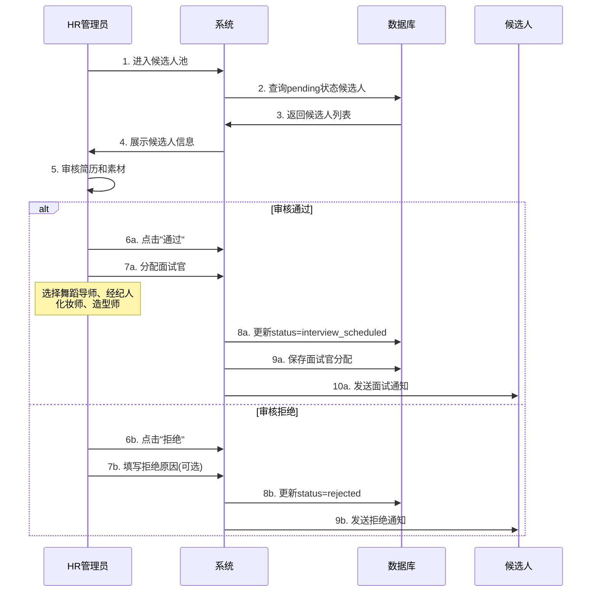
```mermaid
sequenceDiagram
    participant HR as HR管理员
    participant S as 系统
    participant DB as 数据库
    participant C as 候选人

    HR->>S: 1. 进入候选人池
    S->>DB: 2. 查询pending状态候选人
    DB->>S: 3. 返回候选人列表
    S->>HR: 4. 展示候选人信息
    HR->>HR: 5. 审核简历和素材

    alt 审核通过
        HR->>S: 6a. 点击"通过"
        HR->>S: 7a. 分配面试官
        Note over HR: 选择舞蹈导师、经纪人<br/>化妆师、造型师
        S->>DB: 8a. 更新status=interview_scheduled
        S->>DB: 9a. 保存面试官分配
        S->>C: 10a. 发送面试通知
    else 审核拒绝
        HR->>S: 6b. 点击"拒绝"
        HR->>S: 7b. 填写拒绝原因(可选)
        S->>DB: 8b. 更新status=rejected
        S->>C: 9b. 发送拒绝通知
    end
```

### 📋 HR审核要点

#### 审核重点
1. **基本条件检查**
   - 年龄、身高等基本要求
   - 信息完整性

2. **形象评估**
   - 照片真实性和质量
   - 镜头表现力
   - 整体气质

3. **素材质量**
   - 自我介绍视频流畅度
   - 表达能力初步判断

4. **经验和潜力**
   - 相关经验（如有）
   - 学习意愿和可塑性

### 👥 面试官分配

HR审核通过后，需要分配以下面试官：
- **舞蹈导师**：评估舞蹈能力和协调性
- **经纪人**：评估商业价值和潜力
- **化妆师**：评估妆容适配度
- **造型师**：评估造型可塑性

### 🔄 状态变化
- **输入状态**：`pending`（待审核）
- **输出状态**：
  - `rejected`（已拒绝）
  - `interview_scheduled`（已安排面试）

### 📊 数据记录
- ✅ HR审核结果和时间
- ✅ 拒绝原因（如被拒绝）
- ✅ 面试官分配记录（如通过）
- ✅ 面试时间安排

### 👥 涉及角色
- **HR管理员**：主导审核和面试官分配
- **系统**：状态更新和通知发送

### ⏱ 时间周期
- HR审核：1-2个工作日

### 👤 候选人视角

#### 等待期间
- **工作台显示**：
  - 申请状态："HR审核中" (status=pending)
  - 进度条：已完成"报名提交"，当前在"HR审核"
  - 预计反馈时间：1-2个工作日

#### 审核通过后
- **收到通知**：
  - 微信消息："您已通过初审，请按时参加面试"
  - 面试时间和地点
- **工作台更新**：
  - 状态变更："已安排面试" (status=interview_scheduled)
  - 显示面试时间、地点、联系人

#### 审核拒绝后
- **收到通知**：
  - 微信消息："感谢您的应聘"
  - 拒绝原因（可选）
- **工作台更新**：
  - 状态变更："未通过审核" (status=rejected)
  - 显示反馈信息（如有）

---

## 阶段3：线上测试

### 🎯 阶段目标
候选人来公司完成线上性格测试，为后续面试评估提供参考数据。

### 📋 流程详解

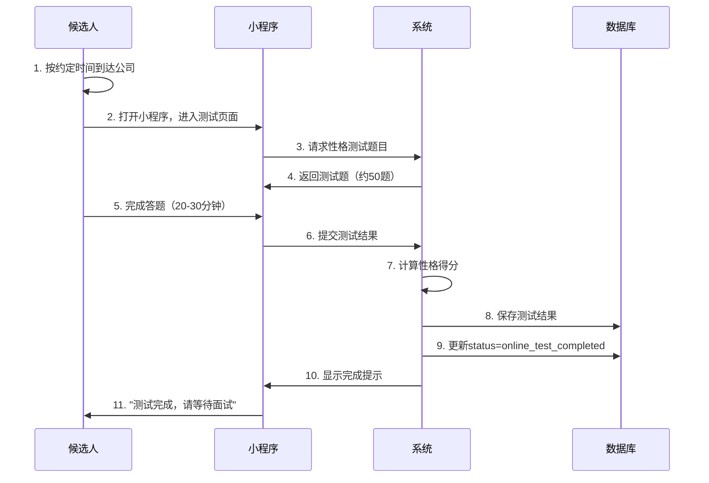
```mermaid
sequenceDiagram
    participant C as 候选人
    participant MP as 小程序
    participant S as 系统
    participant DB as 数据库

    C->>C: 1. 按约定时间到达公司
    C->>MP: 2. 打开小程序，进入测试页面
    MP->>S: 3. 请求性格测试题目
    S->>MP: 4. 返回测试题（约50题）
    C->>MP: 5. 完成答题（20-30分钟）
    MP->>S: 6. 提交测试结果
    S->>S: 7. 计算性格得分
    S->>DB: 8. 保存测试结果
    S->>DB: 9. 更新status=online_test_completed
    S->>MP: 10. 显示完成提示
    MP->>C: 11. "测试完成，请等待面试"
```

### 📝 测试内容

#### 性格测试（16PF人格测试）
- **测试时长**：20-30分钟
- **题目数量**：约50题
- **测试维度**：
  - 乐群性、聪慧性、稳定性、恃强性
  - 兴奋性、有恒性、敢为性、敏感性
  - 怀疑性、幻想性、世故性、忧虑性
  - 实验性、独立性、自律性、紧张性

#### 测试结果
系统自动生成性格特质报告，包括：
- 性格类型（16种人格类型之一）
- 各维度得分
- 适合的主播类型建议
- 潜在优势和风险提示

### 🔄 状态变化
- **输入状态**：`interview_scheduled`（已安排面试）
- **输出状态**：`online_test_completed`（线上测试完成）

### 📊 数据记录
- ✅ 保存性格测试结果
- ✅ 生成人格特质报告
- ✅ 更新候选人状态
- ✅ 记录测试完成时间

### 👥 涉及角色
- **候选人**：完成线上测试
- **系统**：提供题目、计算结果、保存数据

### ⏱ 时间周期
- 测试时长：20-30分钟
- 即时完成，无需等待审核

### 👤 候选人视角

#### 操作步骤
1. **到达公司**：按HR通知的时间到达
2. **打开小程序**：使用已注册的账号登录
3. **进入测试页面**：点击"开始测试"
4. **完成答题**：逐题作答，可随时保存进度
5. **提交测试**：完成所有题目后提交

#### 看到的界面
- **测试进度条**：显示已完成题目数（1/50）
- **答题页面**：每页1-2道题，清晰易读
- **完成页面**：
  - "测试已完成！"
  - "请等待线下面试通知"
  - 性格类型简要说明（可选展示）

#### 工作台状态
- **申请状态**：显示"线上测试已完成" (status=online_test_completed)
- **下一步提示**："等待线下面试安排"
- **可查看**：测试完成时间

---

## 阶段4：线下面试与素材上传

### 🎯 阶段目标
候选人完成线下面试，摄像师、舞蹈导师、经纪人分别上传面试素材和评价（内部使用，候选人不可见）。

### 📋 流程详解

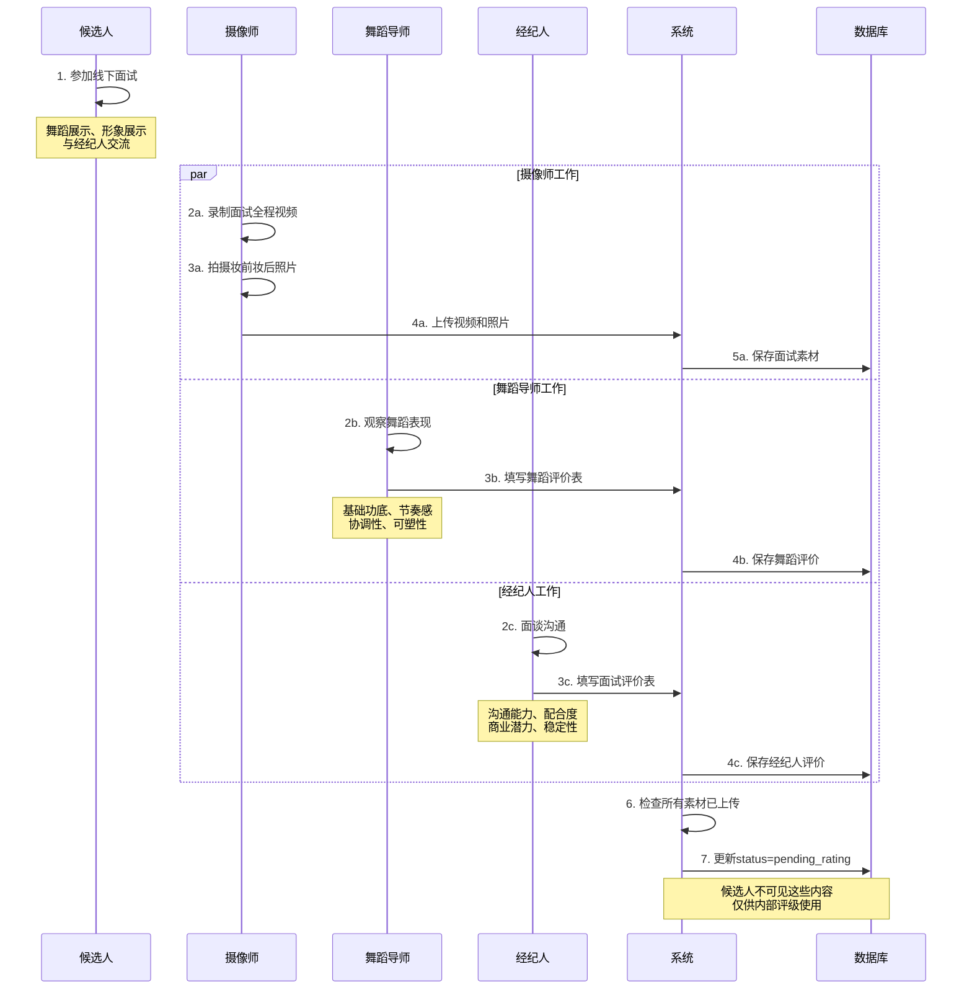
```mermaid
sequenceDiagram
    participant C as 候选人
    participant V as 摄像师
    participant D as 舞蹈导师
    participant A as 经纪人
    participant S as 系统
    participant DB as 数据库

    C->>C: 1. 参加线下面试
    Note over C: 舞蹈展示、形象展示<br/>与经纪人交流

    par 摄像师工作
        V->>V: 2a. 录制面试全程视频
        V->>V: 3a. 拍摄妆前妆后照片
        V->>S: 4a. 上传视频和照片
        S->>DB: 5a. 保存面试素材
    and 舞蹈导师工作
        D->>D: 2b. 观察舞蹈表现
        D->>S: 3b. 填写舞蹈评价表
        Note over D: 基础功底、节奏感<br/>协调性、可塑性
        S->>DB: 4b. 保存舞蹈评价
    and 经纪人工作
        A->>A: 2c. 面谈沟通
        A->>S: 3c. 填写面试评价表
        Note over A: 沟通能力、配合度<br/>商业潜力、稳定性
        S->>DB: 4c. 保存经纪人评价
    end

    S->>S: 6. 检查所有素材已上传
    S->>DB: 7. 更新status=pending_rating
    Note over S,DB: 候选人不可见这些内容<br/>仅供内部评级使用
```

### 📋 各角色职责

#### 摄像师职责
1. **面试录制**：
   - 录制候选人完整面试过程
   - 确保视频清晰度和音质
   - 录制时长：约30-45分钟

2. **照片拍摄**：
   - 妆前照片：3-5张（正面、侧面、全身）
   - 妆后照片：3-5张（不同角度和表情）
   - 确保光线充足，照片清晰

3. **素材上传**：
   - 登录小程序摄像师工作台
   - 选择对应候选人
   - 上传视频和照片到云存储
   - 关联到候选人档案

#### 舞蹈导师职责
1. **现场观察**：
   - 观看候选人舞蹈展示（5-10分钟）
   - 评估基础功底和可塑性

2. **填写评价**：
   - 登录小程序导师工作台
   - 选择对应候选人
   - 填写舞蹈评价表：
     - 基础功底：1-10分
     - 节奏感：1-10分
     - 身体协调性：1-10分
     - 表现力：1-10分
     - 可塑性：1-10分
     - 文字评语（选填）

#### 经纪人职责
1. **面试沟通**：
   - 与候选人面谈20-30分钟
   - 了解职业意愿、时间安排、期望薪资

2. **填写评价**：
   - 登录小程序经纪人工作台
   - 选择对应候选人
   - 填写面试评价表：
     - 沟通能力：1-10分
     - 配合度：1-10分
     - 稳定性评估：1-10分
     - 商业潜力：1-10分
     - 综合印象：1-10分
     - 录用建议：推荐/待定/不推荐
     - 文字评语（选填）

### 🔄 状态变化
- **输入状态**：`online_test_completed`（线上测试完成）
- **输出状态**：`pending_rating`（待评级）

### 📊 数据记录
- ✅ 面试视频（云存储URL）
- ✅ 妆前妆后照片（云存储URLs）
- ✅ 舞蹈导师评价（evaluations集合）
- ✅ 经纪人评价（evaluations集合）
- ✅ 素材上传时间和上传者
- ✅ 候选人状态更新

### 👥 涉及角色
- **候选人**：参加线下面试
- **摄像师**：录制视频和拍照
- **舞蹈导师**：评估舞蹈能力
- **经纪人**：评估综合素质
- **系统**：汇总素材和评价

### ⏱ 时间周期
- 面试时长：约1-2小时
- 素材上传：当天完成

### 👤 候选人视角

#### 面试当天
- **到达公司**：按通知时间到达
- **签到**：前台签到，等待面试
- **面试流程**：
  1. 舞蹈展示（10分钟）
  2. 形象展示（化妆师观察，10分钟）
  3. 与经纪人面谈（20-30分钟）
  4. 全程有摄像师录制

#### 工作台状态
- **申请状态**：显示"面试进行中" → "待评级"
- **下一步提示**："面试已完成，等待评估结果"
- **注意**：候选人无法查看面试视频、照片和评价内容

---

## 阶段5：系统评级

### 🎯 阶段目标
系统根据舞蹈导师评价和妆容AI分析，自动生成候选人评级和建议薪资，HR和经纪人确认结果。

### 📋 流程详解

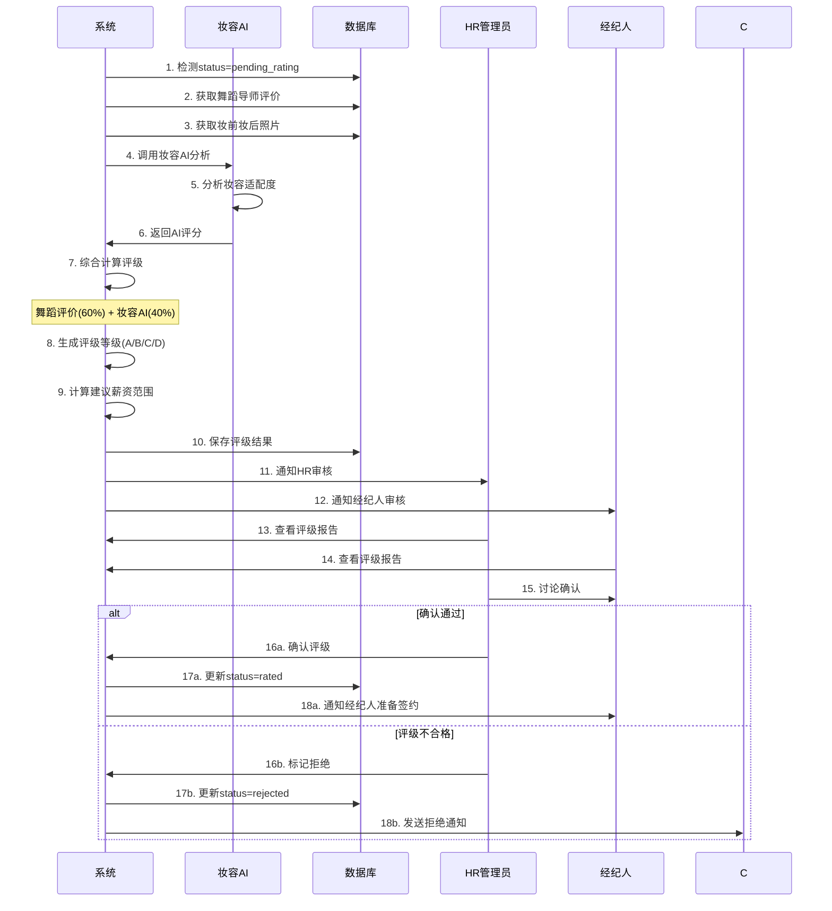
```mermaid
sequenceDiagram
    participant S as 系统
    participant AI as 妆容AI
    participant DB as 数据库
    participant HR as HR管理员
    participant A as 经纪人

    S->>DB: 1. 检测status=pending_rating
    S->>DB: 2. 获取舞蹈导师评价
    S->>DB: 3. 获取妆前妆后照片
    S->>AI: 4. 调用妆容AI分析
    AI->>AI: 5. 分析妆容适配度
    AI->>S: 6. 返回AI评分
    S->>S: 7. 综合计算评级
    Note over S: 舞蹈评价(60%) + 妆容AI(40%)
    S->>S: 8. 生成评级等级(A/B/C/D)
    S->>S: 9. 计算建议薪资范围
    S->>DB: 10. 保存评级结果
    S->>HR: 11. 通知HR审核
    S->>A: 12. 通知经纪人审核

    HR->>S: 13. 查看评级报告
    A->>S: 14. 查看评级报告
    HR->>A: 15. 讨论确认

    alt 确认通过
        HR->>S: 16a. 确认评级
        S->>DB: 17a. 更新status=rated
        S->>A: 18a. 通知经纪人准备签约
    else 评级不合格
        HR->>S: 16b. 标记拒绝
        S->>DB: 17b. 更新status=rejected
        S->>C: 18b. 发送拒绝通知
    end
```

### 📊 评级算法

#### 评分计算（100分制）
- **舞蹈导师评分**（60分）
  - 基础功底 × 15%
  - 节奏感 × 10%
  - 身体协调性 × 15%
  - 表现力 × 10%
  - 可塑性 × 10%

- **妆容AI评分**（40分）
  - 妆前妆后对比度 × 15%
  - 五官适配度 × 15%
  - 镜头表现力 × 10%

#### 评级等级划分
- **A级**（85-100分）：优秀
  - 建议薪资：8000-12000元/月
  - 培训周期：2周
  - 预期表现：快速上手，高潜力

- **B级**（70-84分）：良好
  - 建议薪资：6000-8000元/月
  - 培训周期：3周
  - 预期表现：正常培养，稳定发展

- **C级**（60-69分）：合格
  - 建议薪资：5000-6000元/月
  - 培训周期：4周
  - 预期表现：需加强培训，潜力待发掘

- **D级**（<60分）：不合格
  - 建议：拒绝录用

### 🔄 状态变化
- **输入状态**：`pending_rating`（待评级）
- **输出状态**：
  - `rated`（已评级，通过）
  - `rejected`（已拒绝，不通过）

### 📊 数据记录
- ✅ 评级结果（A/B/C/D）
- ✅ 综合得分（1-100）
- ✅ 舞蹈评分明细
- ✅ 妆容AI评分明细
- ✅ 建议薪资范围
- ✅ 建议培训周期
- ✅ HR确认记录

### 👥 涉及角色
- **系统**：自动计算评级
- **妆容AI**：分析妆容适配度
- **HR管理员**：审核评级结果
- **经纪人**：参与确认决策

### ⏱ 时间周期
- 系统评级：实时自动完成
- HR确认：1个工作日

### 👤 HR/经纪人视角

#### 评级报告内容
- **候选人基本信息**：姓名、年龄、照片
- **评级结果**：
  - 等级：A级
  - 综合得分：88分
  - 舞蹈评分：52/60分
  - 妆容评分：36/40分
- **建议薪资**：8000-12000元/月
- **培训建议**：2周基础培训
- **详细评分**：各项明细得分
- **面试素材**：视频和照片（可查看）

#### 操作选项
- **确认通过**：进入签约流程
- **标记拒绝**：拒绝录用，发送通知
- **调整薪资**：修改建议薪资范围（经纪人权限）

### 👤 候选人视角

#### 工作台状态
- **申请状态**：显示"评估中" (status=pending_rating)
- **等待时间**：预计1个工作日
- **不可见内容**：评级分数、面试素材、评价内容

#### 评级通过后
- **收到通知**：
  - 微信消息："恭喜通过面试评估"
  - "HR将联系您安排签约事宜"
- **工作台更新**：
  - 状态："已通过评估" (status=rated)
  - 下一步："等待签约通知"

#### 评级未通过
- **收到通知**：
  - 微信消息："感谢您参加面试"
  - 标准礼貌用语
- **工作台更新**：
  - 状态："未通过评估" (status=rejected)

---

## 阶段6：签约入职

### 🎯 阶段目标
线下签约，经纪人上传合同，系统自动将候选人角色升级为主播（candidate → streamer）。

### 📋 流程详解

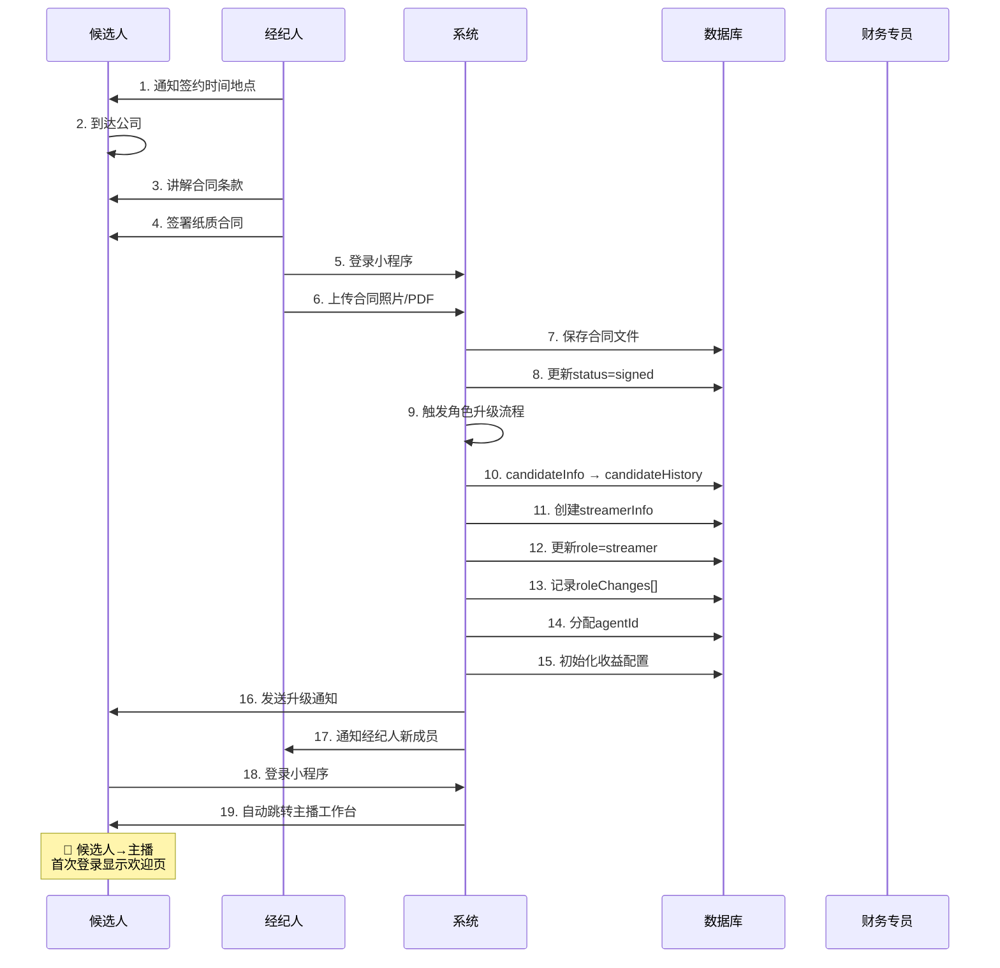
```mermaid
sequenceDiagram
    participant C as 候选人
    participant A as 经纪人
    participant S as 系统
    participant DB as 数据库
    participant F as 财务专员

    A->>C: 1. 通知签约时间地点
    C->>C: 2. 到达公司
    A->>C: 3. 讲解合同条款
    A->>C: 4. 签署纸质合同
    A->>S: 5. 登录小程序
    A->>S: 6. 上传合同照片/PDF
    S->>DB: 7. 保存合同文件
    S->>DB: 8. 更新status=signed

    S->>S: 9. 触发角色升级流程
    S->>DB: 10. candidateInfo → candidateHistory
    S->>DB: 11. 创建streamerInfo
    S->>DB: 12. 更新role=streamer
    S->>DB: 13. 记录roleChanges[]
    S->>DB: 14. 分配agentId
    S->>DB: 15. 初始化收益配置

    S->>C: 16. 发送升级通知
    S->>A: 17. 通知经纪人新成员

    C->>S: 18. 登录小程序
    S->>C: 19. 自动跳转主播工作台
    Note over C: 🎉 候选人→主播<br/>首次登录显示欢迎页
```

### 📋 签约流程

#### 1. 合同准备
- **经纪人职责**：
  - 根据评级结果选择合同模板
  - 填写薪资和收益分成比例
  - 打印纸质合同

#### 2. 线下签约
- **签约地点**：公司会议室
- **签约时长**：约30分钟
- **签约内容**：
  - 讲解合同条款
  - 确认薪资和分成
  - 双方签字盖章

#### 3. 合同上传
- **经纪人操作**：
  - 拍摄合同照片或扫描为PDF
  - 登录小程序经纪人工作台
  - 选择对应候选人
  - 上传合同文件
  - 填写合同基本信息（开始日期、薪资等）

### 🔄 角色升级机制

#### 自动触发条件
- 合同上传成功
- status更新为signed

#### 升级操作（系统自动）
1. **数据迁移**：
   - candidateInfo → candidateHistory（历史记录）
   - 保留完整的候选人数据

2. **创建主播档案**：
   - 创建streamerInfo子文档
   - 初始化直播数据字段
   - 设置初始等级和状态

3. **角色变更**：
   - role: candidate → streamer
   - 记录在roleChanges数组

4. **关系绑定**：
   - 分配agentId（经纪人ID）
   - 建立师徒关系

5. **权限更新**：
   - 工作台权限：候选人 → 主播
   - 数据访问权限更新

### 🔄 状态变化
- **输入状态**：`rated`（已评级）
- **输出状态**：`signed`（已签约）
- **角色变化**：`candidate` → `streamer`

### 📊 数据记录
- ✅ 合同文件（云存储URL）
- ✅ 合同基本信息（日期、薪资、分成）
- ✅ 签约时间和上传者
- ✅ candidateHistory（候选人历史数据）
- ✅ streamerInfo（主播档案）
- ✅ roleChanges（角色变更记录）
- ✅ agentId（经纪人绑定）

### 👥 涉及角色
- **候选人**：签署合同
- **经纪人**：组织签约、上传合同
- **系统**：自动角色升级
- **财务专员**：审核合同（后续）

### ⏱ 时间周期
- 签约流程：约30分钟
- 角色升级：即时自动完成

### 👤 候选人视角

#### 签约前
- **收到通知**：
  - 经纪人电话/微信联系
  - 告知签约时间和地点
  - 需要携带的证件

#### 签约当天
- **流程体验**：
  1. 到达公司
  2. 与经纪人见面
  3. 阅读并签署合同
  4. 收到合同副本

#### 签约后
- **收到通知**：
  - 微信消息："恭喜您正式成为主播！"
  - "请登录小程序查看主播工作台"

- **首次登录**：
  - 显示欢迎页："欢迎加入XX直播"
  - 引导页：介绍主播工作台功能
  - 自动跳转到主播工作台

- **工作台变化**：
  - 身份标识：候选人 → 主播
  - 新增功能：培训、排班、直播数据、收益等模块
  - 显示经纪人信息
  - 显示培训安排

### 👤 经纪人视角

#### 签约后
- **收到通知**：
  - "XX已完成签约，成为您的主播"
  - 新成员提醒

- **工作台更新**：
  - "我的主播"列表新增成员
  - 显示该主播基本信息
  - 可安排培训计划

---

## 阶段7：培训阶段

### 🎯 阶段目标
通过系统化培训和考核，提升主播的专业能力，确保达到开播标准。

### 📋 流程详解

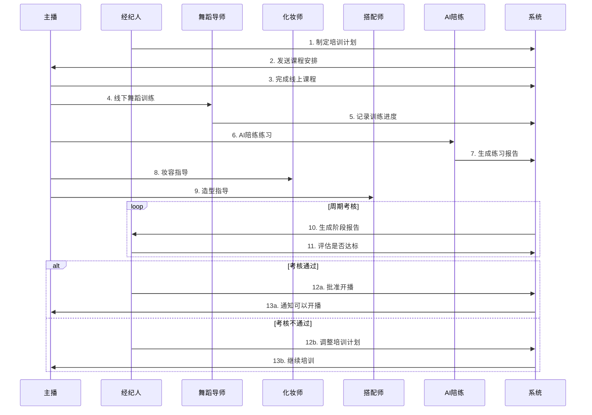
```mermaid
sequenceDiagram
    participant M as 主播
    participant A as 经纪人
    participant T1 as 舞蹈导师
    participant T2 as 化妆师
    participant T3 as 搭配师
    participant AI as AI陪练
    participant S as 系统

    A->>S: 1. 制定培训计划
    S->>M: 2. 发送课程安排
    M->>S: 3. 完成线上课程
    M->>T1: 4. 线下舞蹈训练
    T1->>S: 5. 记录训练进度
    M->>AI: 6. AI陪练练习
    AI->>S: 7. 生成练习报告
    M->>T2: 8. 妆容指导
    M->>T3: 9. 造型指导
    loop 周期考核
        S->>A: 10. 生成阶段报告
        A->>S: 11. 评估是否达标
    end
    alt 考核通过
        A->>S: 12a. 批准开播
        S->>M: 13a. 通知可以开播
    else 考核不通过
        A->>S: 12b. 调整培训计划
        S->>M: 13b. 继续培训
    end
```

### 📚 课程体系设计

#### 1. 新人必修课程（总计30课时）

**直播话术技巧（8课时）**
- 第1-2课：开场话术设计
- 第3-4课：互动话术技巧
- 第5-6课：产品推广话术
- 第7-8课：危机处理话术

**镜头感训练（12课时）**
- 第1-3课：表情管理训练
- 第4-6课：肢体语言训练
- 第7-9课：镜头位置和角度
- 第10-12课：综合表现力提升

**粉丝维护方法（6课时）**
- 第1-2课：粉丝心理分析
- 第3-4课：粉丝互动技巧
- 第5-6课：粉丝留存策略

**法律法规知识（4课时）**
- 第1课：直播行业法律法规
- 第2课：内容安全规范
- 第3课：版权意识培养
- 第4课：合规操作指南

#### 2. 才艺提升课程

**声乐训练（每周2次，共8周）**
- 基础发声训练
- 音准节奏训练
- 呼吸控制训练
- 歌曲演绎训练

**舞蹈训练（每周3次，共8周）**
- 基础舞步训练
- 韩舞/现代舞专项
- 舞台表现力训练
- 即兴编舞能力

**形象管理（4课时）**
- 日常妆容技巧
- 直播妆容要点
- 服装搭配基础
- 个人风格塑造

**内容创作（8课时）**
- 内容选题方法
- 脚本编写技巧
- 视频剪辑基础
- 热点追踪能力

#### 3. 进阶专业课程

**个人IP打造（6课时）**
- 人设定位
- 内容差异化
- 个人品牌建设
- 粉丝社群运营

**数据分析能力（4课时）**
- 直播数据解读
- 数据驱动优化
- 竞品分析方法

**商业合作谈判（4课时）**
- 商业合作类型
- 报价技巧
- 合同注意事项

**团队管理基础（4课时）**
- 团队协作技巧
- 新人带教方法

### 🤖 AI陪练系统

#### 声乐训练辅助

**实时音准纠正**
- 唱歌时实时检测音准
- 偏离音准立即提示
- 正确音高示范

**节奏感训练**
- 节拍器辅助训练
- 节奏准确度评分
- 进步曲线展示

**呼吸技巧指导**
- 呼吸点位提示
- 呼吸深度检测
- 呼吸控制训练

**演唱表现力提升**
- 情感表达评分
- 演唱技巧建议
- 对比优秀范例

#### 舞蹈训练辅助

**动作标准度比对**
- 关键点位置检测
- 与标准动作对比
- 错误动作高亮提示

**节奏准确性分析**
- 动作与音乐同步度
- 节奏准确性评分

**表现力评估**
- 表情丰富度
- 肢体力度评估
- 整体舞台效果

**进步轨迹追踪**
- 每日练习记录
- 进步曲线图
- 薄弱环节提示

#### 直播模拟训练

**虚拟观众互动**
- 模拟观众提问
- 模拟各类弹幕
- 互动反应训练

**突发情况处理**
- 模拟技术故障
- 模拟恶意评论
- 应急处理训练

**话术优化建议**
- 识别话术问题
- 给出优化建议
- 优秀话术示例

**表情管理指导**
- 实时表情识别
- 表情多样性评估
- 镜头感评分

### 👨‍🏫 线下指导

#### 舞蹈导师工作流

1. **制定月度训练计划**
   - 根据主播基础制定计划
   - 设定阶段性目标

2. **录制教学视频**
   - 分解动作教学
   - 上传到系统供主播学习

3. **线下实地训练**
   - 每周2-3次线下课
   - 动作纠正指导
   - 现场答疑

4. **跟踪训练进度**
   - 查看AI陪练数据
   - 记录训练表现
   - 调整训练计划

5. **阶段效果评估**
   - 每2周一次考核
   - 评估达标情况
   - 反馈给经纪人

#### 化妆师工作流

1. **建立妆容档案**
   - 拍摄素颜照
   - 记录肤质特点
   - 分析适合风格

2. **风格妆容设计**
   - 设计3-5种风格妆容
   - 教授化妆技巧
   - 拍摄对比照

3. **直播妆容指导**
   - 直播前妆容检查
   - 镜头效果测试
   - 妆容调整建议

4. **效果数据分析**
   - 关联直播数据
   - 分析观众反馈
   - 优化妆容方案

#### 搭配师工作流

1. **风格测试**
   - 尝试不同风格服装
   - 拍摄造型照片
   - 确定适合风格

2. **建立服装库**
   - 记录主播尺码
   - 建立服装搭配方案库
   - 按场合分类

3. **造型指导**
   - 直播前造型建议
   - 教授搭配技巧
   - 配饰选择指导

4. **效果追踪**
   - 记录造型与直播效果
   - 优化搭配方案

### 🎯 考核评估

#### 考核周期
- **周考核**：每周五总结本周表现
- **月考核**：每月底综合评估是否达标

#### 考核标准（100分制）

| 考核项 | 分值 | 达标标准 |
|--------|------|---------|
| 课程完成度 | 20分 | 完成≥90%课程 |
| 舞蹈能力 | 25分 | AI评分≥7分，导师评分≥70分 |
| 镜头表现力 | 25分 | 模拟直播评分≥75分 |
| 妆容造型 | 15分 | 独立完成合格妆容 |
| 话术能力 | 15分 | 模拟互动评分≥70分 |

#### 考核结果判定
- **总分≥80分** → 考核通过，批准开播
- **总分70-79分** → 基本达标，观察期开播
- **总分<70分** → 继续培训，调整计划

### 📊 输出数据
- ✅ 培训计划
- ✅ 课程完成记录
- ✅ AI陪练报告
- ✅ 导师评估记录
- ✅ 考核结果报告

### 👥 涉及角色
- **经纪人**：制定计划、总体把控、考核决策
- **舞蹈导师**：舞蹈训练、进度跟踪
- **化妆师**：妆容指导、风格设计
- **搭配师**：造型指导、搭配方案
- **运营专员**：课程安排、资源协调
- **AI陪练系统**：辅助训练、数据记录

### ⏱ 时间周期
- **新人主播**：2-4周
- **有经验主播**：1-2周（快速通道）

---

## 阶段8：直播运营阶段

### 🎯 阶段目标
通过科学排班和精细化运营，最大化主播的商业价值，持续提升直播表现。

### 📋 流程详解

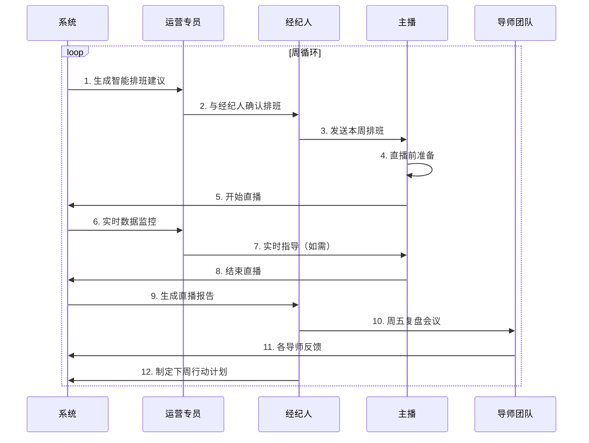
```mermaid
sequenceDiagram
    participant S as 系统
    participant O as 运营专员
    participant A as 经纪人
    participant M as 主播
    participant T as 导师团队

    loop 周循环
        S->>O: 1. 生成智能排班建议
        O->>A: 2. 与经纪人确认排班
        A->>M: 3. 发送本周排班
        M->>M: 4. 直播前准备
        M->>S: 5. 开始直播
        S->>O: 6. 实时数据监控
        O->>M: 7. 实时指导（如需）
        M->>S: 8. 结束直播
        S->>A: 9. 生成直播报告
        A->>T: 10. 周五复盘会议
        T->>S: 11. 各导师反馈
        A->>S: 12. 制定下周行动计划
    end
```

### 📅 智能排班系统

#### 排班因素考虑

**1. 粉丝活跃时段分析**
- 分析历史数据，识别粉丝活跃高峰
- 考虑工作日vs周末差异
- 考虑节假日特殊情况

**2. 主播状态规律识别**
- 识别主播表现最佳时段
- 考虑主播作息习惯
- 避免过度疲劳

**3. 内容类型匹配**
- 不同时段适配不同内容
- 避免同类型主播同时段竞争

**4. 团队联动机会**
- 识别适合联动的主播组合
- 安排联动直播场次

#### 档期分类管理

**🥇 黄金档（19:00-23:00）**
- **特点**：观众最活跃，流量最大
- **分配原则**：
  - 优先分配给头部主播
  - 新人每周至少1次黄金档机会
  - 根据上周表现动态调整
- **目标**：收益最大化

**🥈 白银档（14:00-17:00）**
- **特点**：学生党、休息时间观众
- **分配原则**：
  - 中层主播主场
  - 内容偏轻松娱乐
- **目标**：稳定流量和收益

**🌱 培养档（10:00-13:00，23:00-01:00）**
- **特点**：流量相对较少
- **分配原则**：
  - 新人主播练手专场
  - 测试新内容、新玩法
- **目标**：能力培养和内容测试

**🎉 特殊档期（节假日、活动日）**
- **特点**：流量和收益爆发期
- **分配原则**：
  - 根据主播特点匹配活动
  - 联动直播增加曝光
- **目标**：抓住流量红利

#### 排班规则

**时长规定**
- 新人主播：每次≥2小时，每周≥4次
- 成熟主播：每次≥3小时，每周≥5次
- 单日直播不超过6小时

**休息规定**
- 每周至少1天完全休息
- 避免连续7天直播

**冲突解决机制**
- **档期冲突预警**：系统自动检测主播时间冲突
- **自动调班建议**：根据优先级给出调整方案
- **紧急替代方案**：建立替补主播名单
- **特殊需求协调**：主播请假流程

### 📊 直播监控系统

#### 实时数据监控

**核心指标监控（每5分钟更新）**

| 指标 | 说明 | 预警阈值 |
|------|------|---------|
| 在线人数 | 实时在线观众数 | 较均值下降30% |
| 互动率 | 评论/点赞/礼物互动比例 | <3% |
| 收益 | 实时打赏收入 | 较均值下降40% |
| 新增粉丝 | 本场新关注数 | 较均值下降50% |
| 留存率 | 观众停留时间 | 平均<5分钟 |

**流量来源分析**
- 推荐流量占比
- 粉丝直接进入占比
- 搜索进入占比
- 其他渠道占比

**异常检测**
- 流量突然暴跌
- 大量观众短时间离开
- 礼物收入异常
- 负面评论激增

#### 内容安全监控

**敏感词自动过滤**
- 政治敏感词
- 低俗色情词汇
- 广告引流信息
- 辱骂攻击言论

**违规行为检测**
- 穿着不当检测
- 危险动作检测
- 违规内容检测

**内容质量评估**
- 画面清晰度
- 声音质量
- 内容丰富度

**实时干预机制**
- 系统自动警告主播
- 运营人员私信提醒
- 紧急情况中断直播

#### 表现评估系统

**状态稳定性监测**
- 表情变化丰富度
- 语速和能量值
- 疲劳度检测

**互动质量评估**
- 回复评论及时性
- 互动内容质量
- 粉丝情感倾向

**内容创新度评分**
- 与以往内容差异度
- 热点追踪及时性
- 创意表现力

**粉丝反馈收集**
- 实时情感分析
- 粉丝建议收集
- 满意度评估

### 🎬 直播前准备

**设备检查（提前30分钟）**
- 直播设备测试
- 网络连接测试
- 灯光音效调试

**形象准备**
- 化妆完成
- 服装搭配确认
- 整体造型检查

**内容准备**
- 今日直播主题确认
- 互动话术准备
- 特殊活动准备

### 📈 直播中优化

**数据实时反馈**
- 运营专员监控大屏数据
- 异常情况立即提醒主播
- 给出优化建议

**内容动态调整**
- 根据观众反馈调整内容
- 热门话题及时切入
- 低谷时段调整策略

**突发情况处理**
- 技术故障快速响应
- 恶意评论及时处理
- 直播事故应急预案

### 📝 周报复盘机制

#### 周报自动生成

**数据自动汇总**（系统自动生成草稿）
- 本周直播场次和时长
- 收益数据（打赏、礼物、活动）
- 流量数据（观看、互动、涨粉）
- 内容数据（热门内容、低谷内容）

#### 多角色协同填写

**经纪人填写**
- ✅ 本周亮点总结
- ✅ 存在的问题
- ✅ 下周目标和计划

**舞蹈导师填写**
- ✅ 表现力评估
- ✅ 才艺展示评价
- ✅ 训练建议

**化妆师填写**
- ✅ 妆容效果分析
- ✅ 观众反馈汇总
- ✅ 下周妆容建议

**搭配师填写**
- ✅ 造型效果分析
- ✅ 不同造型数据对比
- ✅ 下周搭配方案

**运营专员填写**
- ✅ 数据趋势解读
- ✅ 竞品分析
- ✅ 优化建议

#### 复盘会议（每周五）

**会议流程**（1小时）
1. **数据回顾**（15分钟）
   - 经纪人展示周报数据
   - 对比上周和目标

2. **问题分析**（20分钟）
   - 各角色提出发现的问题
   - 分析根本原因
   - 集体讨论解决方案

3. **亮点总结**（10分钟）
   - 本周做得好的地方
   - 可复制的经验

4. **下周计划**（15分钟）
   - 制定下周目标
   - 明确行动计划
   - 分配任务责任人

**输出物**
- 完整版周报（归档）
- 下周行动计划
- 问题跟踪清单

### 📊 输出数据
- ✅ 周排班表
- ✅ 每场直播数据报告
- ✅ 实时监控预警记录
- ✅ 周报复盘报告
- ✅ 行动计划

### 👥 涉及角色
- **经纪人**：排班确认、目标管理、复盘主持
- **运营专员**：排班执行、实时监控、数据分析
- **舞蹈导师**：表现力评估、训练调整
- **化妆师**：每日妆容、效果分析
- **搭配师**：每日造型、效果追踪
- **主播**：执行直播、反馈问题

### ⏱ 时间周期
- 持续进行
- 每周一次复盘
- 每月一次深度复盘

---

## 阶段9：结算阶段

### 🎯 阶段目标
准确、及时地计算和发放主播收益，确保财务数据透明可追溯。

### 📋 流程详解

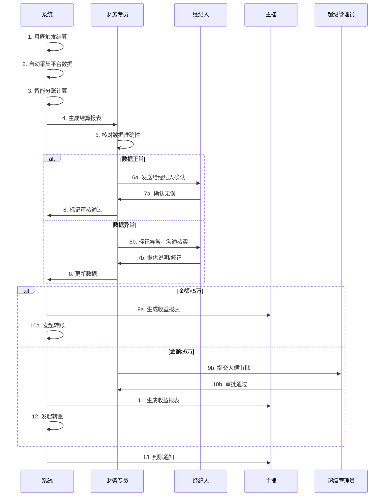
```mermaid
sequenceDiagram
    participant S as 系统
    participant F as 财务专员
    participant A as 经纪人
    participant M as 主播
    participant Admin as 超级管理员

    S->>S: 1. 月底触发结算
    S->>S: 2. 自动采集平台数据
    S->>S: 3. 智能分账计算
    S->>F: 4. 生成结算报表
    F->>F: 5. 核对数据准确性
    alt 数据正常
        F->>A: 6a. 发送给经纪人确认
        A->>F: 7a. 确认无误
        F->>S: 8. 标记审核通过
    else 数据异常
        F->>A: 6b. 标记异常，沟通核实
        A->>F: 7b. 提供说明/修正
        F->>S: 8. 更新数据
    end
    alt 金额<5万
        S->>M: 9a. 生成收益报表
        S->>S: 10a. 发起转账
    else 金额≥5万
        F->>Admin: 9b. 提交大额审批
        Admin->>F: 10b. 审批通过
        S->>M: 11. 生成收益报表
        S->>S: 12. 发起转账
    end
    S->>M: 13. 到账通知
```

### 💰 自动化对账系统

#### 数据采集

**平台流水自动抓取**
- 每日自动同步平台数据
- 抓取打赏明细
- 抓取礼物流水
- 抓取广告分成
- 异常数据标记

**数据分类统计**

| 数据类型 | 说明 | 来源 |
|---------|------|------|
| 直播打赏 | 观众打赏礼物收入 | 直播平台API |
| 活动奖励 | 参与活动获得的奖励 | 平台活动数据 |
| 广告分成 | 品牌合作广告收入 | 商务合作记录 |
| 其他收入 | 特殊奖励、补贴等 | 财务手动录入 |

**异常数据标记**
- 收入突增（单日超过月均3倍）
- 收入突降（连续7天收入为0）
- 数据缺失（某天数据未同步）
- 数据异常（负数、超大金额）

#### 智能分账

**计算公式**

```
主播实际收入 = 基础薪资 + 流量奖励 + 打赏分成 + 特殊奖励 - 扣款项
```

**1. 基础薪资计算**
```
底薪：根据合同约定
全勤奖：直播天数≥22天 → 全勤奖
时长补贴：超过基础时长 × 单价
绩效奖金：达成目标 → 对应档位奖金
```

**2. 流量奖励计算**
```
观看时长奖励：根据累计观看时长阶梯
新增粉丝奖励：根据月新增粉丝阶梯
留存率奖励：次日留存≥30% 且 7日留存≥20%
互动奖励：平均互动率≥5%
```

**3. 打赏分成计算**
```
按阶梯分成比例计算
月打赏收入 × 对应档位分成比例

特殊礼物加成：特定礼物 +5%
活动倍率：活动期间 ×1.2
团队合作：联动直播 +10%
```

**4. 特殊奖励**
```
活动排名奖金：根据排名发放
内容创新奖：爆款内容奖励
进步奖励：数据增长达标奖励
师徒奖励：带新人奖励
```

**5. 扣款项**
```
违约扣款：迟到、早退、缺勤
质量扣款：直播质量问题
违规扣款：违反平台规则
其他扣款：借款、赔偿等
```

**税务计算辅助**
```
月收入≤5000元：免税
月收入5000-8000元：3%税率
月收入8000-17000元：10%税率
月收入≥17000元：20%税率
（实际税率以国家政策为准）
```

### 📊 财务审核

#### 审核内容

**1. 数据准确性核对**
- 核对平台数据与系统数据是否一致
- 检查分账计算是否正确
- 验证奖励扣款是否合理

**2. 异常数据处理**
- 调查异常数据原因
- 与经纪人沟通确认
- 决定是否修正或保留

**3. 合同条款验证**
- 确认分成比例正确
- 检查特殊条款执行
- 验证奖惩规则应用

**4. 成本合理性评估**
- 计算公司成本和利润
- 评估收益分配是否合理
- 识别异常成本项

#### 审核流程

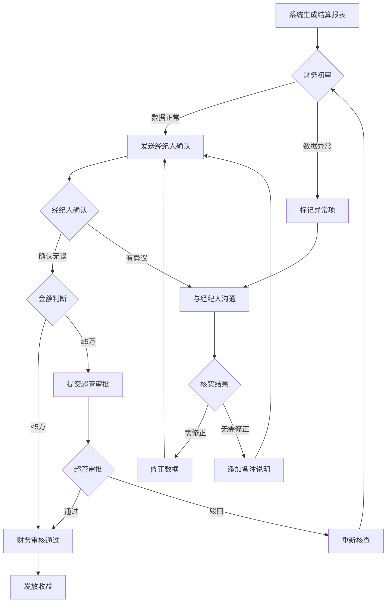
```mermaid
graph TD
    A[系统生成结算报表] --> B{财务初审}
    B -->|数据正常| C[发送经纪人确认]
    B -->|数据异常| D[标记异常项]
    D --> E[与经纪人沟通]
    E --> F{核实结果}
    F -->|需修正| G[修正数据]
    F -->|无需修正| H[添加备注说明]
    G --> C
    H --> C
    C --> I{经纪人确认}
    I -->|确认无误| J{金额判断}
    I -->|有异议| E
    J -->|<5万| K[财务审核通过]
    J -->|≥5万| L[提交超管审批]
    L --> M{超管审批}
    M -->|通过| K
    M -->|驳回| N[重新核查]
    N --> B
    K --> O[发放收益]
```

### 💳 收益发放

#### 发放时间
- **月度结算**：每月5号发放上月收益
- **周度预付**（可选）：每周预付部分收益

#### 发放方式
- 银行卡转账（主要方式）
- 微信/支付宝（小额补发）

#### 发放记录
- 记录转账时间
- 记录转账金额
- 记录转账凭证号
- 生成电子收据

### 📋 个人收益报表

#### 报表内容

**收入明细**
```
基础薪资
  ├─ 底薪：3000元
  ├─ 全勤奖：500元
  ├─ 时长补贴：20小时 × 20元 = 400元
  └─ 绩效奖金：1000元

流量奖励
  ├─ 观看时长奖励：500元
  ├─ 新增粉丝奖励：1500元
  ├─ 留存率奖励：1000元
  └─ 互动奖励：300元

打赏分成
  ├─ 基础分成：30000元 × 40% = 12000元
  ├─ 特殊礼物加成：+500元
  └─ 活动倍率加成：+1000元

特殊奖励
  ├─ 排名奖金：2000元
  └─ 进步奖励：1000元

扣款项
  ├─ 迟到扣款：-100元
  └─ 个人所得税：-3000元

实际到账：20600元
```

**分成比例说明**
- 当月打赏收入档位
- 适用分成比例
- 特殊条款说明

**税务计算明细**
- 应税收入
- 适用税率
- 已扣税款

**历史对比数据**
- 近3个月收入对比
- 同比环比增长率
- 收入构成变化

### 📊 输出数据
- ✅ 平台流水明细
- ✅ 分账计算明细
- ✅ 财务审核记录
- ✅ 个人收益报表
- ✅ 转账凭证记录

### 👥 涉及角色
- **财务专员**：数据审核、分账计算、发放管理
- **经纪人**：收益确认、异常处理
- **超级管理员**：大额收益审批
- **系统**：自动采集数据、智能分账

### ⏱ 时间周期
- **月度结算**：每月1-5号
  - 1号：数据采集和分账计算
  - 2-3号：财务审核和经纪人确认
  - 4号：超管审批（如需）
  - 5号：发放收益

---

## 关键决策点汇总

### 决策点总览

| 阶段 | 决策点 | 决策者 | 决策标准 | 影响 |
|------|--------|--------|---------|------|
| 筛选 | 通过/拒绝/待定 | HR管理员 | AI匹配度+人工判断 | 是否进入面试 |
| 面试 | 录用/拒绝 | HR+经纪人 | 综合评分≥70分 | 是否签约 |
| 签约 | 合同类型选择 | HR+经纪人 | 主播经验和潜力 | 收益模式 |
| 签约 | 收益方案配置 | 经纪人+财务 | 评估结果和成本 | 主播收入 |
| 培训 | 考核通过/继续培训 | 经纪人 | 考核≥80分 | 是否开播 |
| 运营 | 排班调整 | 运营+经纪人 | 数据表现和档期 | 曝光和收益 |
| 运营 | 问题干预 | 运营专员 | 实时监控预警 | 直播质量 |
| 结算 | 异常数据处理 | 财务+经纪人 | 数据核实结果 | 收益准确性 |
| 结算 | 大额审批 | 超级管理员 | 金额≥5万 | 资金安全 |

### 关键决策流程图

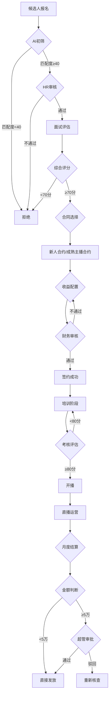
```mermaid
graph TD
    A[候选人报名] --> B{AI初筛}
    B -->|匹配度<40| C1[拒绝]
    B -->|匹配度≥40| D{HR审核}
    D -->|不通过| C1
    D -->|通过| E[面试评估]
    E --> F{综合评分}
    F -->|<70分| C1
    F -->|≥70分| G{合同选择}
    G --> H[新人合约/成熟主播合约]
    H --> I{收益配置}
    I --> J{财务审核}
    J -->|不通过| I
    J -->|通过| K[签约成功]
    K --> L[培训阶段]
    L --> M{考核评估}
    M -->|<80分| L
    M -->|≥80分| N[开播]
    N --> O[直播运营]
    O --> P{月度结算}
    P --> Q{金额判断}
    Q -->|<5万| R[直接发放]
    Q -->|≥5万| S{超管审批}
    S -->|通过| R
    S -->|驳回| T[重新核查]
```

---

## 附录

### 术语说明

- **候选人池**：通过报名表单提交信息的所有待筛选候选人集合
- **黄金档**：流量和收益最高的时间段（19:00-23:00）
- **周报复盘**：每周五多角色协同分析本周表现并制定下周计划的会议
- **阶梯分成**：根据收入档位不同采用不同分成比例的模式
- **AI陪练**：基于AI技术的自动化训练辅助系统

### 相关文档

- [requirements.md](./requirements.md) - 完整需求文档
- [roles-responsibilities.md](./roles-responsibilities.md) - 角色职责详解
- [data-flow.md](./data-flow.md) - 数据流转设计

---

**文档版本**: v1.1
**最后更新**: 2025-11-02
**维护者**: 产品团队
**审核状态**: 已审核

**v1.1 更新内容**:
- 重构招聘流程：8阶段 → 10阶段
- 新增阶段3：线上测试（性格测评）
- 新增阶段4：线下面试与素材上传（含摄像师角色）
- 新增阶段5：系统评级（舞蹈+妆容AI）
- 新增阶段6：签约入职（角色升级机制）
- 原阶段5-7 重新编号为阶段7-9
