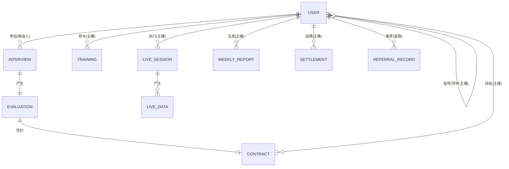
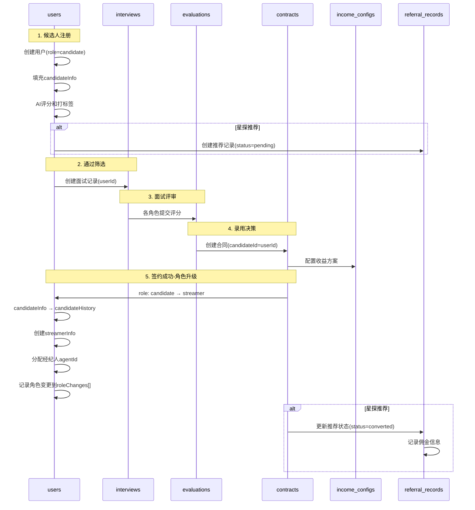
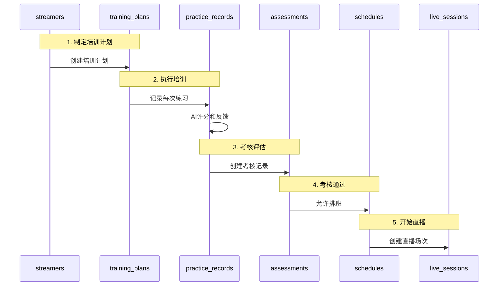
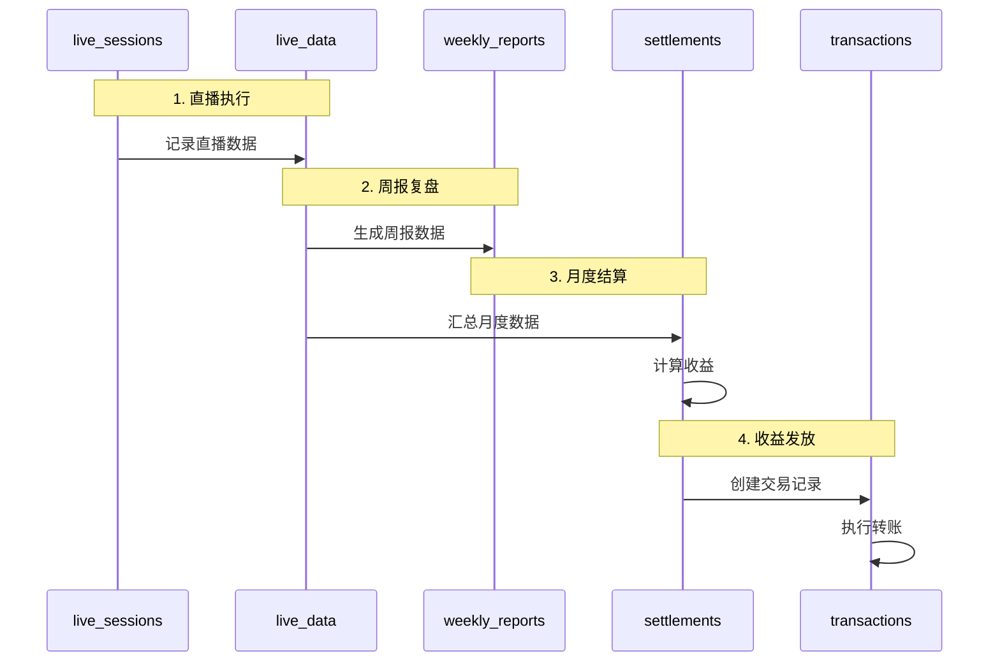
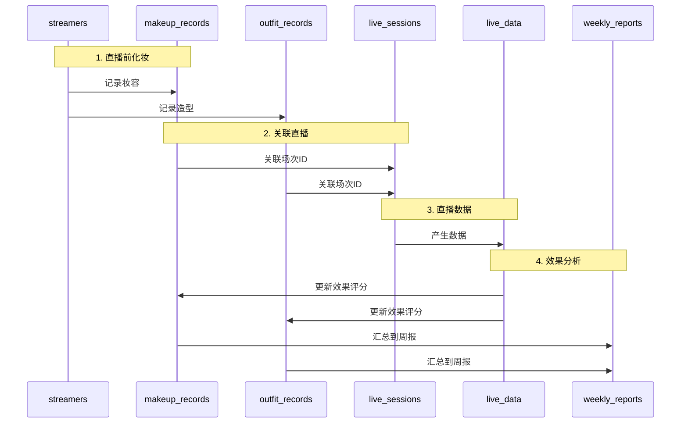

# 💾 数据流转设计

> 数据库设计指南和数据流转路径

**创建日期**: 2025-11-01
**最后更新**: 2025-11-02
**维护者**: 技术团队
**状态**: 已发布

---

## 🔧 技术栈说明

本项目使用**微信云开发**作为后端服务，数据库采用**NoSQL文档数据库**（类似MongoDB）。

### 数据库特点

- **文档型存储**：每条记录是一个JSON文档
- **无需预定义Schema**：字段灵活可扩展
- **支持嵌套对象和数组**：可以在文档内嵌套复杂数据结构
- **自动生成_id**：无需手动管理主键
- **内置权限控制**：支持基于角色的数据访问控制

### 与SQL的对比

| SQL术语 | NoSQL术语 | 说明 |
|---------|-----------|------|
| Table | Collection | 数据集合 |
| Row | Document | 单条记录 |
| Column | Field | 字段 |
| Index | Index | 索引（相同概念） |
| JOIN | Embedded/Reference | 通过嵌套或引用关联 |

> ⚠️ **注意**：本文档中的表格设计仅为逻辑结构说明，实际实现时应转换为文档结构。

---

## 📑 目录

- [数据实体总览](#数据实体总览)
- [核心数据表设计](#核心数据表设计)
- [数据流转路径](#数据流转路径)
- [数据权限控制](#数据权限控制)
- [数据安全设计](#数据安全设计)

---

## 数据实体总览

### 核心数据实体关系图



**说明**：
- **USER**是核心实体，通过`role`字段区分不同身份（candidate/streamer/employee/external_scout）
- **候选人(candidate)**和**主播(streamer)**是同一USER实体的不同状态
- 候选人签约后，role从`candidate`升级为`streamer`，candidateInfo保留为历史记录

### 数据实体分类

| 类别 | 核心实体 | 说明 |
|------|---------|------|
| **用户相关** | User, Invite_Code, Referral_Record | 用户账号(含候选人、主播、员工)、邀请码、推荐记录 |
| **招聘相关** | Interview, Evaluation | 面试和评审数据（候选人信息在User内） |
| **签约相关** | Contract, Income_Config | 合同和收益配置 |
| **培训相关** | Training, Course, Practice_Record | 培训课程和练习记录 |
| **运营相关** | Schedule, Live_Session, Live_Data | 排班和直播数据 |
| **形象相关** | Makeup_Record, Outfit_Record | 妆容和造型记录 |
| **复盘相关** | Weekly_Report, Action_Plan | 周报和行动计划 |
| **财务相关** | Settlement, Transaction | 结算和交易记录 |

**关键变更说明**：
- ✅ **候选人不再是独立实体**：候选人作为User的一种角色(role='candidate')，相关信息存储在User.candidateInfo字段
- ✅ **主播不再是独立实体**：主播作为User的一种角色(role='streamer')，相关信息存储在User.streamerInfo字段
- ✅ **角色可升级**：候选人签约后自动升级为主播，原candidateInfo移至candidateHistory保留
- ✅ **新增Referral_Record**：追踪星探推荐关系和佣金结算

---

## 核心数据表设计

### 1. 用户和权限相关

#### 1.1 users (用户集合)

**说明**：核心用户集合，所有系统用户（候选人、主播、员工、星探）统一存储在此集合。

**文档结构示例**：

```javascript
{
  _id: "user_xxx",                    // 自动生成的文档ID
  openId: "oXXXXXXXXXXXXXXXXXXXXX",  // 微信OpenID (UNIQUE)

  // === 基础信息 ===
  role: "candidate",                  // 角色: candidate | streamer | employee | external_scout
  userType: "candidate",              // 用户类型（冗余字段，便于查询）

  profile: {
    name: "张三",                     // 姓名
    phone: "13800138000",             // 手机号 (UNIQUE)
    idCard: "encrypted_id_card",      // 身份证号（加密）
    avatar: "cloud://avatar.jpg",     // 头像
    gender: "female",                 // 性别: male | female
    birthday: "1998-05-20",           // 出生日期
    province: "浙江省",               // 省份
    city: "杭州市",                   // 城市
    district: "西湖区"                // 区县
  },

  // === 候选人信息（role=candidate时有效）===
  candidateInfo: {
    status: "pending",                // 状态流: pending → rejected | interview_scheduled →
                                      //       online_test_completed → pending_rating →
                                      //       rated | rejected → signed
    source: "scout_referral",         // 来源: scout_referral | self_apply | employee_invite
    scoutCode: "SC-EXT-xxx",          // 星探推荐码（如有）

    applyData: {                      // 报名表单数据
      basicInfo: { /* ... */ },
      experience: { /* ... */ },
      talents: { /* ... */ },
      photos: ["url1", "url2"],       // 报名照片
      video: "cloud://video.mp4",     // 自我介绍视频
    },

    // === 时间戳 ===
    applyAt: ISODate("2025-01-05T10:00:00Z"),     // 报名时间
    reviewedAt: null,                              // HR审核时间
    interviewScheduledAt: null,                    // 面试安排时间
    onlineTestCompletedAt: null,                   // 线上测试完成时间
    ratedAt: null,                                 // 评级完成时间
    rejectedAt: null,                              // 拒绝时间
    signedAt: null,                                // 签约时间

    // === 面试相关 ===
    interviewAssignments: {                        // 面试官分配（HR分配）
      danceTeacher: "user_teacher_xxx",
      agent: "user_agent_xxx",
      makeupArtist: "user_makeup_xxx",
      stylist: "user_stylist_xxx"
    },
    interviewTime: ISODate("2025-01-10T14:00:00Z"), // 面试时间

    // === 线上测试结果 ===
    onlineTestResult: {
      personalityType: "ENFP",                     // 性格类型
      scores: {                                     // 各维度得分
        extroversion: 8,
        thinking: 6,
        // ...更多维度
      },
      completedAt: ISODate("2025-01-10T14:30:00Z")
    },

    // === 面试素材（内部使用，候选人不可见）===
    interviewMaterials: {
      video: "cloud://interview_xxx.mp4",          // 面试视频（摄像师上传）
      photosBeforeMakeup: [                        // 妆前照片
        "cloud://photo1.jpg",
        "cloud://photo2.jpg"
      ],
      photosAfterMakeup: [                         // 妆后照片
        "cloud://photo3.jpg",
        "cloud://photo4.jpg"
      ],
      uploadedBy: "user_videographer_xxx",         // 上传者（摄像师）
      uploadedAt: ISODate("2025-01-10T16:00:00Z")
    },

    // === 评价记录（内部使用，候选人不可见）===
    evaluations: {
      danceTeacher: {                               // 舞蹈导师评价
        scores: {
          basicSkills: 8,                           // 基础功底
          rhythm: 7,                                // 节奏感
          coordination: 8,                          // 协调性
          performance: 7,                           // 表现力
          potential: 9                              // 可塑性
        },
        totalScore: 39,                             // 总分（满分50）
        comment: "基础不错，有潜力",
        evaluatedBy: "user_teacher_xxx",
        evaluatedAt: ISODate("2025-01-10T17:00:00Z")
      },
      agent: {                                       // 经纪人评价
        scores: {
          communication: 8,                          // 沟通能力
          cooperation: 9,                            // 配合度
          stability: 8,                              // 稳定性
          potential: 8,                              // 商业潜力
          impression: 8                              // 综合印象
        },
        totalScore: 41,                              // 总分（满分50）
        recommendation: "recommended",               // 推荐/待定/不推荐
        comment: "沟通顺畅，配合度高",
        evaluatedBy: "user_agent_xxx",
        evaluatedAt: ISODate("2025-01-10T17:30:00Z")
      }
    },

    // === 系统评级结果 ===
    rating: {
      level: "A",                                    // 评级: A/B/C/D
      totalScore: 88,                                // 综合得分（100分制）
      danceScore: 52,                                // 舞蹈评分（60分）
      makeupAIScore: 36,                             // 妆容AI评分（40分）
      suggestedSalary: {                             // 建议薪资
        min: 8000,
        max: 12000
      },
      trainingPeriod: 2,                             // 建议培训周期（周）
      ratedAt: ISODate("2025-01-11T10:00:00Z"),
      confirmedBy: "user_hr_xxx",                    // HR确认人
      confirmedAt: ISODate("2025-01-11T14:00:00Z")
    },

    // === 拒绝信息 ===
    rejectionReason: null,                           // 拒绝原因
    rejectedBy: null                                 // 拒绝操作人
  },

  // === 主播信息（role=streamer时有效）===
  streamerInfo: {
    status: "active",                 // 状态: onboarding | active | inactive | suspended
    stageLevel: "mature",             // 等级: trainee | newbie | mature | star
    stageName: "小星星",              // 艺名

    agentId: "user_agent_xxx",        // 经纪人ID
    agentName: "李经理",              // 经纪人姓名

    contractId: "contract_xxx",       // 当前合同ID
    contractType: "mature",           // 合同类型
    joinedAt: ISODate("2025-01-15T00:00:00Z"),

    // 统计数据
    totalLiveHours: 120,              // 累计直播时长(小时)
    totalIncome: 25800,               // 累计收入(元)
    followerCount: 3500,              // 粉丝数
    avgViewerCount: 85,               // 平均在线人数

    // 绩效数据
    monthlyTarget: 30000,             // 月度目标(元)
    currentMonthIncome: 18500,        // 本月收入
    targetCompletionRate: 0.62        // 目标完成率
  },

  // === 员工信息（role=employee时有效）===
  employeeInfo: {
    employeeNo: "EMP2025001",         // 工号
    roleType: "agent",                // 职位: hr_admin | agent | operator | dance_teacher |
                                      //       makeup_artist | stylist | scout_internal | finance |
                                      //       videographer
    department: "经纪部",             // 部门
    level: "senior",                  // 级别: junior | middle | senior | expert
    hireDate: ISODate("2024-01-01T00:00:00Z"),

    supervisor: "user_xxx",           // 直属上级
    teamMembers: ["user_xxx", ...],   // 管理的团队成员

    permissions: ["candidate:review", "interview:schedule"], // 权限列表
    status: "active"                  // 状态: active | inactive | resigned
  },

  // === 外部星探信息（role=external_scout时有效）===
  externalScoutInfo: {
    scoutCode: "SC-EXT-20250102-A3B9", // 星探推荐码
    level: "gold",                     // 等级: bronze | silver | gold | platinum
    commissionRate: 0.05,              // 佣金比例

    // 统计数据
    totalReferrals: 8,                 // 推荐人数
    successfulConversions: 3,          // 成功签约数
    totalCommission: 4500,             // 累计佣金
    pendingCommission: 1500,           // 待结算佣金

    status: "active",                  // 状态: active | inactive | suspended
    joinedAt: ISODate("2024-06-01T00:00:00Z")
  },

  // === 候选人历史（角色升级后保留）===
  candidateHistory: {
    appliedAt: ISODate("2025-01-05T10:00:00Z"),
    source: "scout_referral",
    scoutCode: "SC-EXT-xxx",
    upgradedAt: ISODate("2025-01-15T10:00:00Z"),
    finalStatus: "signed"
  },

  // === 角色变更记录 ===
  roleChanges: [
    {
      from: "candidate",
      to: "streamer",
      reason: "签约完成",
      operator: "user_hr_xxx",
      changedAt: ISODate("2025-01-15T10:00:00Z")
    }
  ],

  // === 账户状态 ===
  accountStatus: {
    isActivated: true,                // 是否激活
    isFirstLogin: false,              // 是否首次登录
    isProfileComplete: true,          // 资料是否完整
    isBanned: false,                  // 是否被封禁
    banReason: null
  },

  // === 时间戳 ===
  createdAt: ISODate("2025-01-05T10:00:00Z"),
  updatedAt: ISODate("2025-01-15T10:00:00Z"),
  lastLoginAt: ISODate("2025-01-20T08:30:00Z")
}
```

**索引策略**：
```javascript
// 1. OpenID索引（唯一）
db.users.createIndex({ openId: 1 }, { unique: true })

// 2. 手机号索引（唯一）
db.users.createIndex({ "profile.phone": 1 }, { unique: true, sparse: true })

// 3. 角色索引
db.users.createIndex({ role: 1 })

// 4. 候选人状态索引
db.users.createIndex({ "candidateInfo.status": 1 }, { sparse: true })

// 5. 星探推荐码索引
db.users.createIndex({ "externalScoutInfo.scoutCode": 1 }, { sparse: true, unique: true })

// 6. 经纪人管理的主播索引
db.users.createIndex({ "streamerInfo.agentId": 1 }, { sparse: true })
```

---

#### 1.2 roles (角色表)

| 字段名 | 类型 | 约束 | 说明 |
|--------|------|------|------|
| id | INT | PK, AUTO_INCREMENT | 角色ID |
| role_name | VARCHAR(50) | UNIQUE, NOT NULL | 角色名称 |
| role_code | VARCHAR(50) | UNIQUE, NOT NULL | 角色代码 |
| description | TEXT | | 角色描述 |
| level | INT | NOT NULL | 权限级别：1-5 |
| created_at | TIMESTAMP | NOT NULL | 创建时间 |

**预设角色**：
- `super_admin`: 超级管理员
- `hr_admin`: HR管理员
- `agent`: 经纪人
- `operator`: 运营专员
- `dance_teacher`: 舞蹈导师
- `makeup_artist`: 化妆师
- `stylist`: 搭配师
- `finance`: 财务专员

---

#### 1.3 user_roles (用户角色关联表)

| 字段名 | 类型 | 约束 | 说明 |
|--------|------|------|------|
| id | BIGINT | PK, AUTO_INCREMENT | ID |
| user_id | BIGINT | FK, NOT NULL | 用户ID |
| role_id | INT | FK, NOT NULL | 角色ID |
| assigned_at | TIMESTAMP | NOT NULL | 分配时间 |
| assigned_by | BIGINT | FK | 分配人 |

**索引**：
- `idx_user_id`: user_id
- `idx_role_id`: role_id
- `unique_user_role`: (user_id, role_id) UNIQUE

---

### 2. 邀请和推荐相关

#### 2.1 invite_codes (员工邀请码集合)

**说明**：HR生成的员工邀请码，用于新员工首次绑定微信账号。

```javascript
{
  _id: "invite_xxx",
  code: "INV-HR-20250102-X7Y9",        // 邀请码
  roleType: "hr_admin",                // 目标角色
  employeeName: "张三",                 // 预期员工姓名

  createdBy: "user_hr_xxx",            // 创建人
  createdAt: ISODate("2025-01-02T10:00:00Z"),
  expiresAt: ISODate("2025-01-09T10:00:00Z"),  // 7天有效期

  used: false,                         // 是否已使用
  usedBy: null,                        // 使用者ID
  usedAt: null,                        // 使用时间

  status: "active"                     // 状态: active | expired | revoked
}
```

**索引**：
```javascript
db.invite_codes.createIndex({ code: 1 }, { unique: true })
db.invite_codes.createIndex({ expiresAt: 1 })
db.invite_codes.createIndex({ used: 1, status: 1 })
```

---

#### 2.2 referral_records (星探推荐记录集合)

**说明**：记录星探推荐候选人的关系，用于佣金结算。

```javascript
{
  _id: "referral_xxx",
  userId: "user_candidate_xxx",        // 候选人/主播ID
  scoutId: "user_scout_xxx",           // 星探ID
  scoutCode: "SC-EXT-20250102-A3B9",   // 星探推荐码

  referredAt: ISODate("2025-01-05T10:00:00Z"),  // 推荐时间

  status: "pending",                   // 状态: pending | converted | failed
  // pending: 候选人还在应聘流程中
  // converted: 候选人已签约成为主播
  // failed: 候选人被拒绝或放弃

  convertedAt: null,                   // 转化时间（签约时间）
  contractId: null,                    // 关联合同ID

  commissionRate: 0.05,                // 佣金比例(5%)
  commissionAmount: 0,                 // 佣金金额
  commissionStatus: "pending",         // 佣金状态: pending | calculated | paid
  commissionPaidAt: null,              // 佣金支付时间

  notes: ""                            // 备注
}
```

**索引**：
```javascript
db.referral_records.createIndex({ userId: 1 })
db.referral_records.createIndex({ scoutId: 1 })
db.referral_records.createIndex({ scoutCode: 1 })
db.referral_records.createIndex({ status: 1 })
db.referral_records.createIndex({ commissionStatus: 1 })
```

---

### 3. 招聘相关

> ⚠️ **注意**：候选人信息已整合到users集合的candidateInfo字段中，不再使用独立的candidates表。

#### 3.1 interviews (面试记录集合)

| 字段名 | 类型 | 约束 | 说明 |
|--------|------|------|------|
| id | BIGINT | PK, AUTO_INCREMENT | 面试ID |
| candidate_id | BIGINT | FK, NOT NULL | 候选人ID |
| interview_date | DATE | NOT NULL | 面试日期 |
| interview_time | TIME | NOT NULL | 面试时间 |
| location | VARCHAR(255) | | 面试地点 |
| video_url | VARCHAR(255) | | 面试视频URL |
| ai_report | JSON | | AI评估报告JSON |
| status | ENUM | NOT NULL | 状态：scheduled/completed/cancelled |
| created_by | BIGINT | FK | 创建人 |
| created_at | TIMESTAMP | NOT NULL | 创建时间 |
| updated_at | TIMESTAMP | NOT NULL | 更新时间 |

**索引**：
- `idx_candidate_id`: candidate_id
- `idx_interview_date`: interview_date
- `idx_status`: status

---

#### 2.3 evaluations (评审打分表)

| 字段名 | 类型 | 约束 | 说明 |
|--------|------|------|------|
| id | BIGINT | PK, AUTO_INCREMENT | 评审ID |
| interview_id | BIGINT | FK, NOT NULL | 面试ID |
| evaluator_id | BIGINT | FK, NOT NULL | 评审人ID |
| evaluator_role | VARCHAR(50) | NOT NULL | 评审人角色 |
| talent_score | DECIMAL(4,1) | | 才艺水平(20分) |
| learning_score | DECIMAL(4,1) | | 学习能力(10分) |
| plasticity_score | DECIMAL(4,1) | | 可塑性(10分) |
| image_score | DECIMAL(4,1) | | 形象气质(15分) |
| affinity_score | DECIMAL(4,1) | | 观众缘(10分) |
| potential_score | DECIMAL(4,1) | | 话题潜力(5分) |
| cooperation_score | DECIMAL(4,1) | | 配合度(10分) |
| stability_score | DECIMAL(4,1) | | 稳定性(10分) |
| motivation_score | DECIMAL(4,1) | | 上进心(10分) |
| total_score | DECIMAL(5,1) | | 总分(100分) |
| comments | TEXT | | 评语 |
| team_fit | TEXT | | 团队适配度评估 |
| recommendation | ENUM | NOT NULL | 推荐：approve/reject/pending |
| created_at | TIMESTAMP | NOT NULL | 评审时间 |

**索引**：
- `idx_interview_id`: interview_id
- `idx_evaluator_id`: evaluator_id
- `idx_total_score`: total_score

---

### 3. 签约相关

#### 3.1 contracts (合同表)

| 字段名 | 类型 | 约束 | 说明 |
|--------|------|------|------|
| id | BIGINT | PK, AUTO_INCREMENT | 合同ID |
| contract_no | VARCHAR(50) | UNIQUE, NOT NULL | 合同编号 |
| streamer_id | BIGINT | FK, NOT NULL | 主播ID |
| contract_type | ENUM | NOT NULL | 合同类型：newbie/mature/exclusive/activity |
| start_date | DATE | NOT NULL | 开始日期 |
| end_date | DATE | NOT NULL | 结束日期 |
| contract_file | VARCHAR(255) | | 合同文件URL |
| special_terms | TEXT | | 特殊条款 |
| status | ENUM | NOT NULL | 状态：draft/pending/active/expired/terminated |
| created_by | BIGINT | FK | 创建人 |
| approved_by | BIGINT | FK | 审批人 |
| signed_at | TIMESTAMP | | 签署时间 |
| created_at | TIMESTAMP | NOT NULL | 创建时间 |
| updated_at | TIMESTAMP | NOT NULL | 更新时间 |

**索引**：
- `idx_contract_no`: contract_no
- `idx_streamer_id`: streamer_id
- `idx_status`: status
- `idx_end_date`: end_date

---

#### 3.2 income_configs (收益配置表)

| 字段名 | 类型 | 约束 | 说明 |
|--------|------|------|------|
| id | BIGINT | PK, AUTO_INCREMENT | 配置ID |
| contract_id | BIGINT | FK, UNIQUE, NOT NULL | 合同ID |
| base_salary | DECIMAL(10,2) | | 底薪 |
| attendance_bonus | DECIMAL(10,2) | | 全勤奖 |
| duration_subsidy | DECIMAL(10,2) | | 时长补贴单价 |
| reward_config | JSON | | 流量激励配置JSON |
| commission_tiers | JSON | | 阶梯分成配置JSON |
| special_rewards | JSON | | 特殊奖励配置JSON |
| created_by | BIGINT | FK | 创建人 |
| approved_by | BIGINT | FK | 审批人（财务） |
| created_at | TIMESTAMP | NOT NULL | 创建时间 |
| updated_at | TIMESTAMP | NOT NULL | 更新时间 |

**commission_tiers JSON 结构示例**：
```json
[
  {"min": 0, "max": 5000, "rate": 0.30},
  {"min": 5001, "max": 10000, "rate": 0.35},
  {"min": 10001, "max": 30000, "rate": 0.40},
  {"min": 30001, "max": null, "rate": 0.45}
]
```

---

### 4. 主播相关

#### 4.1 streamers (主播表)

| 字段名 | 类型 | 约束 | 说明 |
|--------|------|------|------|
| id | BIGINT | PK, AUTO_INCREMENT | 主播ID |
| user_id | BIGINT | FK, UNIQUE, NOT NULL | 用户ID |
| real_name | VARCHAR(50) | NOT NULL | 真实姓名 |
| stage_name | VARCHAR(50) | UNIQUE, NOT NULL | 艺名 |
| gender | ENUM | NOT NULL | 性别 |
| birthday | DATE | NOT NULL | 生日 |
| phone | VARCHAR(20) | UNIQUE, NOT NULL | 手机号 |
| id_card | VARCHAR(255) | UNIQUE | 身份证（加密） |
| agent_id | BIGINT | FK, NOT NULL | 经纪人ID |
| level | ENUM | NOT NULL | 级别：S/A/B/C |
| status | ENUM | NOT NULL | 状态：training/active/inactive/quit |
| join_date | DATE | NOT NULL | 入职日期 |
| quit_date | DATE | | 离职日期 |
| created_at | TIMESTAMP | NOT NULL | 创建时间 |
| updated_at | TIMESTAMP | NOT NULL | 更新时间 |

**索引**：
- `idx_user_id`: user_id
- `idx_agent_id`: agent_id
- `idx_stage_name`: stage_name
- `idx_level`: level
- `idx_status`: status

---

#### 4.2 streamer_profiles (主播档案表)

| 字段名 | 类型 | 约束 | 说明 |
|--------|------|------|------|
| id | BIGINT | PK, AUTO_INCREMENT | 档案ID |
| streamer_id | BIGINT | FK, UNIQUE, NOT NULL | 主播ID |
| height | INT | | 身高(cm) |
| weight | INT | | 体重(kg) |
| measurements | VARCHAR(50) | | 三围 |
| avatar | VARCHAR(255) | | 头像URL |
| intro_video | VARCHAR(255) | | 介绍视频 |
| talents | JSON | | 才艺信息 |
| personality | JSON | | 性格特质 |
| style_tags | JSON | | 风格标签 |
| strength | TEXT | | 优势 |
| weakness | TEXT | | 劣势 |
| goals | TEXT | | 目标 |
| notes | TEXT | | 备注 |
| updated_at | TIMESTAMP | NOT NULL | 更新时间 |

---

### 5. 培训相关

#### 5.1 training_plans (培训计划表)

| 字段名 | 类型 | 约束 | 说明 |
|--------|------|------|------|
| id | BIGINT | PK, AUTO_INCREMENT | 计划ID |
| streamer_id | BIGINT | FK, NOT NULL | 主播ID |
| plan_name | VARCHAR(100) | NOT NULL | 计划名称 |
| start_date | DATE | NOT NULL | 开始日期 |
| end_date | DATE | NOT NULL | 结束日期 |
| courses | JSON | | 课程列表JSON |
| goals | TEXT | | 培训目标 |
| status | ENUM | NOT NULL | 状态：ongoing/completed/cancelled |
| created_by | BIGINT | FK | 创建人（经纪人） |
| created_at | TIMESTAMP | NOT NULL | 创建时间 |
| updated_at | TIMESTAMP | NOT NULL | 更新时间 |

**索引**：
- `idx_streamer_id`: streamer_id
- `idx_status`: status

---

#### 5.2 practice_records (练习记录表)

| 字段名 | 类型 | 约束 | 说明 |
|--------|------|------|------|
| id | BIGINT | PK, AUTO_INCREMENT | 记录ID |
| streamer_id | BIGINT | FK, NOT NULL | 主播ID |
| practice_type | ENUM | NOT NULL | 类型：vocal/dance/livestream |
| practice_date | DATE | NOT NULL | 练习日期 |
| duration | INT | NOT NULL | 时长(分钟) |
| video_url | VARCHAR(255) | | 练习视频 |
| ai_score | DECIMAL(4,1) | | AI评分 |
| ai_feedback | TEXT | | AI反馈 |
| teacher_id | BIGINT | FK | 导师ID |
| teacher_feedback | TEXT | | 导师反馈 |
| created_at | TIMESTAMP | NOT NULL | 创建时间 |

**索引**：
- `idx_streamer_id`: streamer_id
- `idx_practice_date`: practice_date
- `idx_practice_type`: practice_type

---

#### 5.3 assessments (考核记录表)

| 字段名 | 类型 | 约束 | 说明 |
|--------|------|------|------|
| id | BIGINT | PK, AUTO_INCREMENT | 考核ID |
| streamer_id | BIGINT | FK, NOT NULL | 主播ID |
| assessment_date | DATE | NOT NULL | 考核日期 |
| course_completion | DECIMAL(4,1) | | 课程完成度(20分) |
| dance_ability | DECIMAL(4,1) | | 舞蹈能力(25分) |
| camera_presence | DECIMAL(4,1) | | 镜头表现力(25分) |
| makeup_skill | DECIMAL(4,1) | | 妆容造型(15分) |
| communication | DECIMAL(4,1) | | 话术能力(15分) |
| total_score | DECIMAL(5,1) | | 总分(100分) |
| result | ENUM | NOT NULL | 结果：pass/fail |
| feedback | TEXT | | 反馈意见 |
| created_by | BIGINT | FK | 考核人（经纪人） |
| created_at | TIMESTAMP | NOT NULL | 考核时间 |

**索引**：
- `idx_streamer_id`: streamer_id
- `idx_assessment_date`: assessment_date
- `idx_result`: result

---

### 6. 运营相关

#### 6.1 schedules (排班表)

| 字段名 | 类型 | 约束 | 说明 |
|--------|------|------|------|
| id | BIGINT | PK, AUTO_INCREMENT | 排班ID |
| streamer_id | BIGINT | FK, NOT NULL | 主播ID |
| schedule_date | DATE | NOT NULL | 日期 |
| start_time | TIME | NOT NULL | 开始时间 |
| end_time | TIME | NOT NULL | 结束时间 |
| time_slot | ENUM | NOT NULL | 档期：gold/silver/training/special |
| content_theme | VARCHAR(255) | | 内容主题 |
| status | ENUM | NOT NULL | 状态：scheduled/completed/cancelled |
| created_by | BIGINT | FK | 创建人（运营） |
| confirmed_by | BIGINT | FK | 确认人（经纪人） |
| created_at | TIMESTAMP | NOT NULL | 创建时间 |
| updated_at | TIMESTAMP | NOT NULL | 更新时间 |

**索引**：
- `idx_streamer_id`: streamer_id
- `idx_schedule_date`: schedule_date
- `idx_time_slot`: time_slot
- `unique_streamer_time`: (streamer_id, schedule_date, start_time) UNIQUE

---

#### 6.2 live_sessions (直播场次表)

| 字段名 | 类型 | 约束 | 说明 |
|--------|------|------|------|
| id | BIGINT | PK, AUTO_INCREMENT | 场次ID |
| schedule_id | BIGINT | FK, NOT NULL | 排班ID |
| streamer_id | BIGINT | FK, NOT NULL | 主播ID |
| start_time | TIMESTAMP | NOT NULL | 实际开始时间 |
| end_time | TIMESTAMP | | 实际结束时间 |
| duration | INT | | 实际时长(分钟) |
| platform | VARCHAR(50) | | 直播平台 |
| room_id | VARCHAR(100) | | 直播间ID |
| recording_url | VARCHAR(255) | | 录播URL |
| status | ENUM | NOT NULL | 状态：live/ended/cancelled |
| created_at | TIMESTAMP | NOT NULL | 创建时间 |

**索引**：
- `idx_streamer_id`: streamer_id
- `idx_schedule_id`: schedule_id
- `idx_start_time`: start_time

---

#### 6.3 live_data (直播数据表)

| 字段名 | 类型 | 约束 | 说明 |
|--------|------|------|------|
| id | BIGINT | PK, AUTO_INCREMENT | 数据ID |
| session_id | BIGINT | FK, NOT NULL | 场次ID |
| peak_viewers | INT | | 最高在线人数 |
| avg_viewers | INT | | 平均在线人数 |
| total_views | INT | | 总观看人次 |
| new_followers | INT | | 新增粉丝 |
| comments | INT | | 评论数 |
| likes | INT | | 点赞数 |
| shares | INT | | 分享数 |
| gifts_count | INT | | 礼物数量 |
| gifts_income | DECIMAL(10,2) | | 礼物收入 |
| interaction_rate | DECIMAL(5,2) | | 互动率(%) |
| retention_rate | DECIMAL(5,2) | | 留存率(%) |
| traffic_sources | JSON | | 流量来源JSON |
| created_at | TIMESTAMP | NOT NULL | 创建时间 |

**索引**：
- `idx_session_id`: session_id UNIQUE
- `idx_gifts_income`: gifts_income

---

### 7. 形象管理相关

#### 7.1 makeup_records (妆容记录表)

| 字段名 | 类型 | 约束 | 说明 |
|--------|------|------|------|
| id | BIGINT | PK, AUTO_INCREMENT | 记录ID |
| streamer_id | BIGINT | FK, NOT NULL | 主播ID |
| session_id | BIGINT | FK | 直播场次ID |
| makeup_date | DATE | NOT NULL | 化妆日期 |
| style | VARCHAR(50) | | 妆容风格 |
| before_photo | VARCHAR(255) | | 妆前照片 |
| after_photo | VARCHAR(255) | | 妆后照片 |
| products_used | JSON | | 使用产品JSON |
| notes | TEXT | | 备注 |
| effect_score | DECIMAL(3,1) | | 效果评分(1-10) |
| audience_feedback | TEXT | | 观众反馈 |
| created_by | BIGINT | FK | 化妆师ID |
| created_at | TIMESTAMP | NOT NULL | 创建时间 |

**索引**：
- `idx_streamer_id`: streamer_id
- `idx_session_id`: session_id
- `idx_makeup_date`: makeup_date

---

#### 7.2 outfit_records (造型记录表)

| 字段名 | 类型 | 约束 | 说明 |
|--------|------|------|------|
| id | BIGINT | PK, AUTO_INCREMENT | 记录ID |
| streamer_id | BIGINT | FK, NOT NULL | 主播ID |
| session_id | BIGINT | FK | 直播场次ID |
| outfit_date | DATE | NOT NULL | 造型日期 |
| style | VARCHAR(50) | | 造型风格 |
| outfit_photo | VARCHAR(255) | | 造型照片 |
| items | JSON | | 服装配饰清单JSON |
| notes | TEXT | | 备注 |
| effect_score | DECIMAL(3,1) | | 效果评分(1-10) |
| audience_feedback | TEXT | | 观众反馈 |
| created_by | BIGINT | FK | 搭配师ID |
| created_at | TIMESTAMP | NOT NULL | 创建时间 |

**索引**：
- `idx_streamer_id`: streamer_id
- `idx_session_id`: session_id
- `idx_outfit_date`: outfit_date

---

### 8. 复盘相关

#### 8.1 weekly_reports (周报表)

| 字段名 | 类型 | 约束 | 说明 |
|--------|------|------|------|
| id | BIGINT | PK, AUTO_INCREMENT | 周报ID |
| streamer_id | BIGINT | FK, NOT NULL | 主播ID |
| week_start | DATE | NOT NULL | 周开始日期 |
| week_end | DATE | NOT NULL | 周结束日期 |
| live_count | INT | | 直播场次 |
| total_duration | INT | | 总时长(分钟) |
| total_income | DECIMAL(10,2) | | 总收入 |
| new_followers | INT | | 新增粉丝 |
| avg_viewers | INT | | 平均观众 |
| interaction_rate | DECIMAL(5,2) | | 平均互动率 |
| highlights | TEXT | | 亮点总结 |
| issues | TEXT | | 问题分析 |
| next_goals | TEXT | | 下周目标 |
| action_plans | JSON | | 行动计划JSON |
| agent_feedback | TEXT | | 经纪人反馈 |
| dance_feedback | TEXT | | 舞蹈导师反馈 |
| makeup_feedback | TEXT | | 化妆师反馈 |
| outfit_feedback | TEXT | | 搭配师反馈 |
| operator_feedback | TEXT | | 运营反馈 |
| status | ENUM | NOT NULL | 状态：draft/published |
| created_by | BIGINT | FK | 创建人（经纪人） |
| created_at | TIMESTAMP | NOT NULL | 创建时间 |
| updated_at | TIMESTAMP | NOT NULL | 更新时间 |

**索引**：
- `idx_streamer_id`: streamer_id
- `idx_week_start`: week_start
- `unique_streamer_week`: (streamer_id, week_start) UNIQUE

---

### 9. 财务相关

#### 9.1 settlements (结算表)

| 字段名 | 类型 | 约束 | 说明 |
|--------|------|------|------|
| id | BIGINT | PK, AUTO_INCREMENT | 结算ID |
| settlement_no | VARCHAR(50) | UNIQUE, NOT NULL | 结算单号 |
| streamer_id | BIGINT | FK, NOT NULL | 主播ID |
| period_start | DATE | NOT NULL | 结算周期开始 |
| period_end | DATE | NOT NULL | 结算周期结束 |
| base_salary | DECIMAL(10,2) | | 底薪 |
| attendance_bonus | DECIMAL(10,2) | | 全勤奖 |
| duration_subsidy | DECIMAL(10,2) | | 时长补贴 |
| performance_bonus | DECIMAL(10,2) | | 绩效奖金 |
| traffic_rewards | DECIMAL(10,2) | | 流量奖励 |
| gift_commission | DECIMAL(10,2) | | 打赏分成 |
| special_rewards | DECIMAL(10,2) | | 特殊奖励 |
| deductions | DECIMAL(10,2) | | 扣款 |
| tax | DECIMAL(10,2) | | 个人所得税 |
| net_income | DECIMAL(10,2) | | 实际到账 |
| calculation_details | JSON | | 计算明细JSON |
| status | ENUM | NOT NULL | 状态：draft/reviewing/approved/paid |
| reviewed_by | BIGINT | FK | 审核人（财务） |
| approved_by | BIGINT | FK | 批准人（超管，大额） |
| paid_at | TIMESTAMP | | 支付时间 |
| created_at | TIMESTAMP | NOT NULL | 创建时间 |
| updated_at | TIMESTAMP | NOT NULL | 更新时间 |

**索引**：
- `idx_settlement_no`: settlement_no
- `idx_streamer_id`: streamer_id
- `idx_period`: (period_start, period_end)
- `idx_status`: status

---

#### 9.2 transactions (交易记录表)

| 字段名 | 类型 | 约束 | 说明 |
|--------|------|------|------|
| id | BIGINT | PK, AUTO_INCREMENT | 交易ID |
| transaction_no | VARCHAR(50) | UNIQUE, NOT NULL | 交易流水号 |
| settlement_id | BIGINT | FK, NOT NULL | 结算ID |
| streamer_id | BIGINT | FK, NOT NULL | 主播ID |
| amount | DECIMAL(10,2) | NOT NULL | 金额 |
| payment_method | VARCHAR(50) | | 支付方式 |
| bank_account | VARCHAR(255) | | 银行账号（加密） |
| receipt_url | VARCHAR(255) | | 凭证URL |
| status | ENUM | NOT NULL | 状态：pending/success/failed |
| error_msg | TEXT | | 失败原因 |
| executed_by | BIGINT | FK | 执行人（财务） |
| executed_at | TIMESTAMP | | 执行时间 |
| created_at | TIMESTAMP | NOT NULL | 创建时间 |

**索引**：
- `idx_transaction_no`: transaction_no
- `idx_settlement_id`: settlement_id
- `idx_streamer_id`: streamer_id
- `idx_status`: status

---

## 数据流转路径

### 招聘到签约流程（候选人 → 主播角色升级）



**关键变更说明**：
- ✅ 候选人和主播不再是独立表，而是users集合中的同一用户文档
- ✅ 角色升级通过更新`role`字段实现(candidate → streamer)
- ✅ 原候选人信息移至`candidateHistory`保留历史
- ✅ 新增`streamerInfo`字段存储主播信息
- ✅ 所有变更记录在`roleChanges`数组中

### 培训到开播流程



### 直播到结算流程



### 形象管理数据流



---

## 数据权限控制

### 行级数据权限（Row-Level Security）

#### 经纪人数据访问规则

```sql
-- 经纪人只能查看和管理名下主播的数据
CREATE POLICY agent_streamer_access ON streamers
FOR ALL
USING (agent_id = current_user_id());

-- 应用到相关表
CREATE POLICY agent_live_data_access ON live_sessions
FOR SELECT
USING (streamer_id IN (
    SELECT id FROM streamers WHERE agent_id = current_user_id()
));
```

#### 导师数据访问规则

```sql
-- 导师只能查看相关培训数据
CREATE POLICY teacher_practice_access ON practice_records
FOR ALL
USING (teacher_id = current_user_id() OR teacher_id IS NULL);
```

#### 财务数据访问规则

```sql
-- 财务专员可以查看所有结算数据，但修改需要审核流程
CREATE POLICY finance_settlement_access ON settlements
FOR SELECT
TO finance_role
USING (true);

CREATE POLICY finance_settlement_update ON settlements
FOR UPDATE
TO finance_role
USING (status = 'draft' OR status = 'reviewing');
```

### 字段级权限（Column-Level Security）

#### 敏感字段加密访问

```sql
-- 身份证号只有特定角色能解密查看
CREATE FUNCTION decrypt_id_card(encrypted_id_card VARCHAR)
RETURNS VARCHAR
AS $$
BEGIN
    IF current_user_role() IN ('super_admin', 'hr_admin', 'finance') THEN
        RETURN decrypt_aes(encrypted_id_card);
    ELSE
        RETURN '***************';
    END IF;
END;
$$ LANGUAGE plpgsql;
```

#### 收益数据权限

```sql
-- 主播只能看自己的收益，经纪人能看名下主播的收益
CREATE VIEW streamer_income_view AS
SELECT
    s.id,
    s.streamer_id,
    CASE
        WHEN current_user_id() = st.user_id THEN s.net_income
        WHEN current_user_id() IN (
            SELECT user_id FROM users u
            JOIN user_roles ur ON u.id = ur.user_id
            JOIN roles r ON ur.role_id = r.id
            WHERE r.role_code IN ('agent', 'finance', 'super_admin')
        ) THEN s.net_income
        ELSE NULL
    END AS net_income
FROM settlements s
JOIN streamers st ON s.streamer_id = st.id;
```

### 操作权限矩阵实现

#### 数据库权限表

```sql
CREATE TABLE permissions (
    id INT PRIMARY KEY AUTO_INCREMENT,
    role_id INT NOT NULL,
    resource VARCHAR(50) NOT NULL,
    action ENUM('create', 'read', 'update', 'delete', 'export') NOT NULL,
    condition TEXT,  -- JSON条件，如 {"agent_id": "${user.agent_id}"}
    created_at TIMESTAMP DEFAULT CURRENT_TIMESTAMP,
    FOREIGN KEY (role_id) REFERENCES roles(id),
    UNIQUE KEY unique_role_resource_action (role_id, resource, action)
);
```

#### 权限检查函数

```sql
CREATE FUNCTION check_permission(
    p_user_id BIGINT,
    p_resource VARCHAR(50),
    p_action VARCHAR(20)
) RETURNS BOOLEAN
AS $$
DECLARE
    has_permission BOOLEAN;
BEGIN
    SELECT EXISTS(
        SELECT 1 FROM permissions p
        JOIN user_roles ur ON p.role_id = ur.role_id
        WHERE ur.user_id = p_user_id
        AND p.resource = p_resource
        AND p.action = p_action
    ) INTO has_permission;

    RETURN has_permission;
END;
$$ LANGUAGE plpgsql;
```

---

## 数据安全设计

### 1. 敏感数据加密

#### 加密字段列表

| 表名 | 字段名 | 加密方式 | 说明 |
|------|--------|---------|------|
| candidates | id_card | AES-256 | 身份证号 |
| streamers | id_card | AES-256 | 身份证号 |
| transactions | bank_account | AES-256 | 银行账号 |
| users | password | BCrypt | 密码 |

#### 加密实现示例

```sql
-- 插入时加密
INSERT INTO candidates (real_name, id_card, ...)
VALUES ('张三', AES_ENCRYPT('123456789012345678', 'secret_key'), ...);

-- 查询时解密（需要权限）
SELECT real_name,
       AES_DECRYPT(id_card, 'secret_key') AS id_card
FROM candidates
WHERE id = 1;
```

### 2. 数据脱敏

#### 脱敏规则

```sql
-- 手机号脱敏：显示前3后4位
CREATE FUNCTION mask_phone(phone VARCHAR(20))
RETURNS VARCHAR(20)
AS $$
BEGIN
    RETURN CONCAT(LEFT(phone, 3), '****', RIGHT(phone, 4));
END;
$$ LANGUAGE plpgsql;

-- 身份证脱敏：显示前6后4位
CREATE FUNCTION mask_id_card(id_card VARCHAR(18))
RETURNS VARCHAR(18)
AS $$
BEGIN
    RETURN CONCAT(LEFT(id_card, 6), '********', RIGHT(id_card, 4));
END;
$$ LANGUAGE plpgsql;
```

### 3. 操作日志审计

#### 审计日志表

```sql
CREATE TABLE audit_logs (
    id BIGINT PRIMARY KEY AUTO_INCREMENT,
    user_id BIGINT NOT NULL,
    action VARCHAR(50) NOT NULL,
    resource VARCHAR(50) NOT NULL,
    resource_id VARCHAR(100),
    old_data JSON,
    new_data JSON,
    ip_address VARCHAR(50),
    user_agent TEXT,
    created_at TIMESTAMP DEFAULT CURRENT_TIMESTAMP,
    FOREIGN KEY (user_id) REFERENCES users(id),
    INDEX idx_user_id (user_id),
    INDEX idx_resource (resource),
    INDEX idx_created_at (created_at)
);
```

#### 自动记录触发器

```sql
-- 示例：记录结算数据修改
CREATE TRIGGER audit_settlement_update
AFTER UPDATE ON settlements
FOR EACH ROW
BEGIN
    INSERT INTO audit_logs (user_id, action, resource, resource_id, old_data, new_data)
    VALUES (
        current_user_id(),
        'update',
        'settlement',
        NEW.id,
        JSON_OBJECT(
            'net_income', OLD.net_income,
            'status', OLD.status
        ),
        JSON_OBJECT(
            'net_income', NEW.net_income,
            'status', NEW.status
        )
    );
END;
```

### 4. 数据备份策略

#### 备份计划

| 备份类型 | 频率 | 保留期 | 说明 |
|---------|------|--------|------|
| 全量备份 | 每天凌晨2点 | 30天 | 完整数据库备份 |
| 增量备份 | 每4小时 | 7天 | 变更数据备份 |
| 关键表实时备份 | 实时 | 24小时 | settlements, transactions |

#### 备份脚本示例

```bash
#!/bin/bash
# 全量备份脚本
DATE=$(date +%Y%m%d_%H%M%S)
BACKUP_DIR="/backup/mysql"
DB_NAME="streamer_management"

mysqldump -u root -p${DB_PASSWORD} \
    --single-transaction \
    --routines \
    --triggers \
    ${DB_NAME} | gzip > ${BACKUP_DIR}/full_backup_${DATE}.sql.gz

# 删除30天前的备份
find ${BACKUP_DIR} -name "full_backup_*.sql.gz" -mtime +30 -delete
```

### 5. 数据访问监控

#### 异常访问检测规则

```sql
-- 检测短时间内大量数据导出
SELECT user_id, COUNT(*) as export_count
FROM audit_logs
WHERE action = 'export'
AND created_at >= NOW() - INTERVAL 1 HOUR
GROUP BY user_id
HAVING export_count > 10;

-- 检测非工作时间访问敏感数据
SELECT user_id, resource, COUNT(*) as access_count
FROM audit_logs
WHERE resource IN ('settlements', 'contracts', 'candidates')
AND (HOUR(created_at) < 8 OR HOUR(created_at) > 22)
AND created_at >= NOW() - INTERVAL 1 DAY
GROUP BY user_id, resource;
```

---

## 数据库优化建议

### 1. 索引优化

#### 复合索引建议

```sql
-- 直播数据查询优化
CREATE INDEX idx_live_data_streamer_date
ON live_sessions(streamer_id, start_time DESC);

-- 结算数据查询优化
CREATE INDEX idx_settlement_streamer_period
ON settlements(streamer_id, period_start, period_end);

-- 排班冲突检测优化
CREATE INDEX idx_schedule_date_time
ON schedules(schedule_date, start_time, end_time);
```

#### 全文索引

```sql
-- 候选人搜索优化
CREATE FULLTEXT INDEX idx_candidate_search
ON candidates(real_name, stage_name, phone);

-- 使用全文搜索
SELECT * FROM candidates
WHERE MATCH(real_name, stage_name, phone) AGAINST('张三' IN NATURAL LANGUAGE MODE);
```

### 2. 分区策略

#### 按时间分区（适用于日志类表）

```sql
-- 直播数据按月分区
ALTER TABLE live_sessions
PARTITION BY RANGE (YEAR(start_time) * 100 + MONTH(start_time)) (
    PARTITION p202501 VALUES LESS THAN (202502),
    PARTITION p202502 VALUES LESS THAN (202503),
    PARTITION p202503 VALUES LESS THAN (202504),
    -- ...
    PARTITION pmax VALUES LESS THAN MAXVALUE
);

-- 审计日志按月分区
ALTER TABLE audit_logs
PARTITION BY RANGE (TO_DAYS(created_at)) (
    PARTITION p202501 VALUES LESS THAN (TO_DAYS('2025-02-01')),
    PARTITION p202502 VALUES LESS THAN (TO_DAYS('2025-03-01')),
    -- ...
    PARTITION pmax VALUES LESS THAN MAXVALUE
);
```

### 3. 查询优化

#### 常用查询模板

```sql
-- 主播月度业绩查询（优化版）
SELECT
    s.id,
    s.stage_name,
    COUNT(DISTINCT ls.id) as live_count,
    SUM(ls.duration) as total_duration,
    SUM(ld.gifts_income) as total_income,
    SUM(ld.new_followers) as total_new_followers
FROM streamers s
JOIN live_sessions ls ON s.id = ls.streamer_id
JOIN live_data ld ON ls.id = ld.session_id
WHERE ls.start_time >= '2025-01-01'
  AND ls.start_time < '2025-02-01'
  AND s.agent_id = 1
GROUP BY s.id, s.stage_name
ORDER BY total_income DESC;

-- 使用索引优化
-- 确保以下索引存在：
-- idx_live_sessions(streamer_id, start_time)
-- idx_live_data(session_id)
-- idx_streamers(agent_id)
```

### 4. 缓存策略

#### Redis 缓存建议

```python
# 缓存主播基本信息（1小时）
cache_key = f"streamer:profile:{streamer_id}"
redis.setex(cache_key, 3600, json.dumps(streamer_data))

# 缓存实时直播数据（5分钟）
cache_key = f"live:data:{session_id}"
redis.setex(cache_key, 300, json.dumps(live_data))

# 缓存排班信息（每日凌晨清除）
cache_key = f"schedule:date:{date}"
redis.setex(cache_key, get_seconds_until_midnight(), json.dumps(schedules))
```

---

## 附录

### 数据字典导出脚本

```sql
-- 导出所有表结构和字段说明
SELECT
    TABLE_NAME as '表名',
    COLUMN_NAME as '字段名',
    DATA_TYPE as '数据类型',
    COLUMN_TYPE as '完整类型',
    IS_NULLABLE as '是否可空',
    COLUMN_KEY as '键类型',
    COLUMN_DEFAULT as '默认值',
    COLUMN_COMMENT as '字段说明'
FROM INFORMATION_SCHEMA.COLUMNS
WHERE TABLE_SCHEMA = 'streamer_management'
ORDER BY TABLE_NAME, ORDINAL_POSITION;
```

### ER图工具推荐

- **MySQL Workbench**: 官方工具，支持逆向工程
- **dbdiagram.io**: 在线ER图设计工具
- **DrawDB**: 开源ER图设计工具

### 相关文档

- [requirements.md](./requirements.md) - 完整需求文档
- [business-flow.md](./business-flow.md) - 业务流程详解
- [roles-responsibilities.md](./roles-responsibilities.md) - 角色职责矩阵

---

**文档版本**: v1.1
**最后更新**: 2025-11-02
**维护者**: 技术团队
**审核状态**: 已审核

**v1.1 更新内容**:
- 更新候选人状态流：pending → interview_scheduled → online_test_completed → pending_rating → rated/rejected → signed
- 新增字段：interviewAssignments（面试官分配）
- 新增字段：onlineTestResult（线上测试结果）
- 新增字段：interviewMaterials（面试素材：视频、照片）
- 新增字段：evaluations（舞蹈导师和经纪人评价）
- 新增字段：rating（系统评级结果）
- 新增员工角色类型：videographer（摄像师）

**注意**: 本文档提供的是数据库设计参考，实际实施时需要根据具体技术栈（MySQL、PostgreSQL、MongoDB等）和业务需求进行调整。
