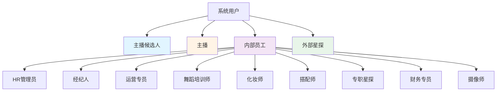
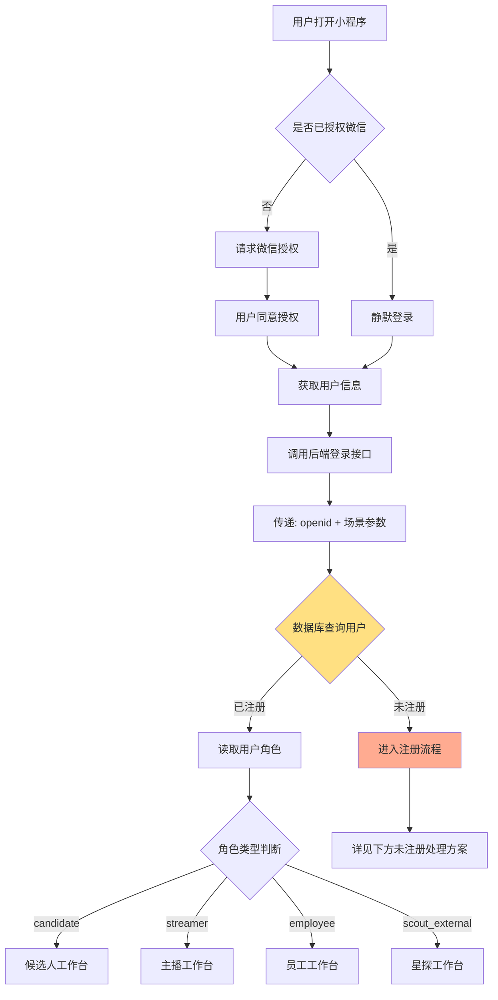
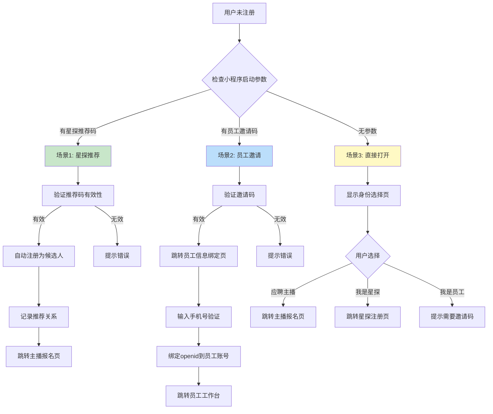
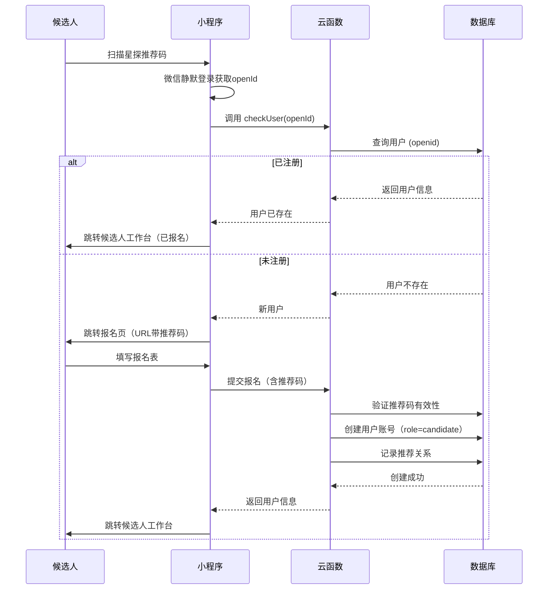
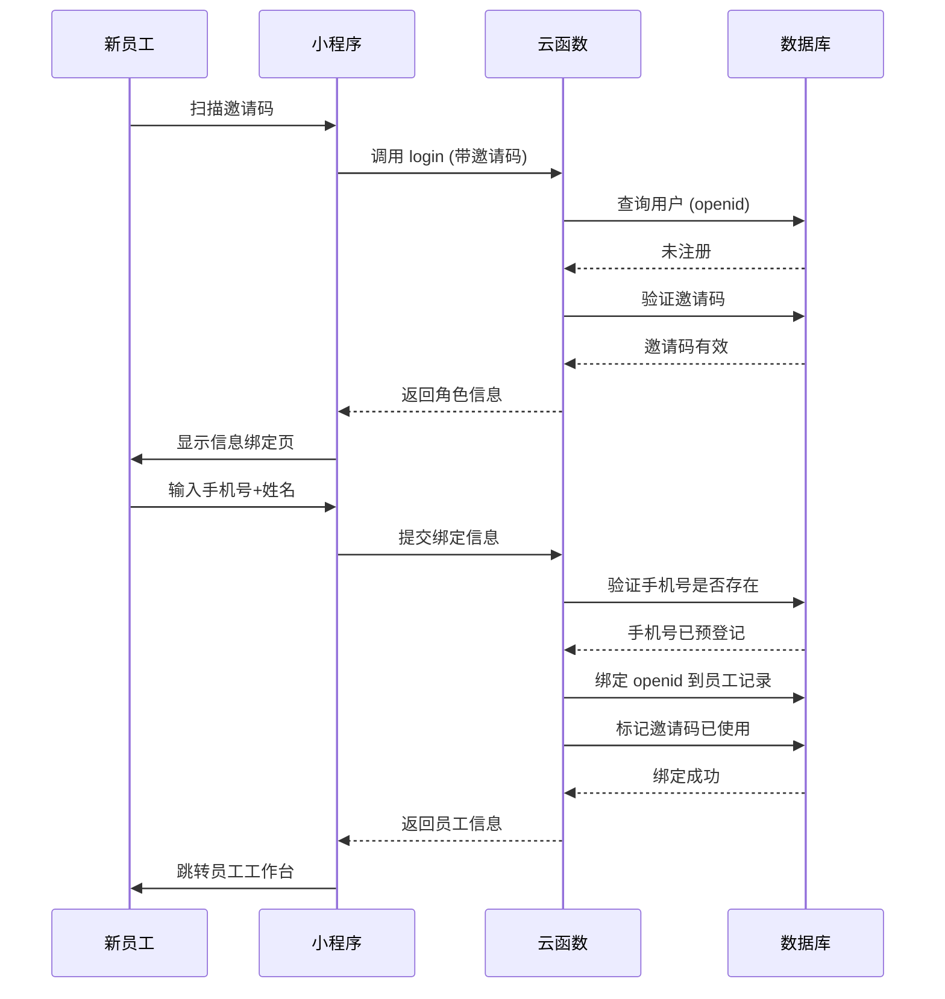
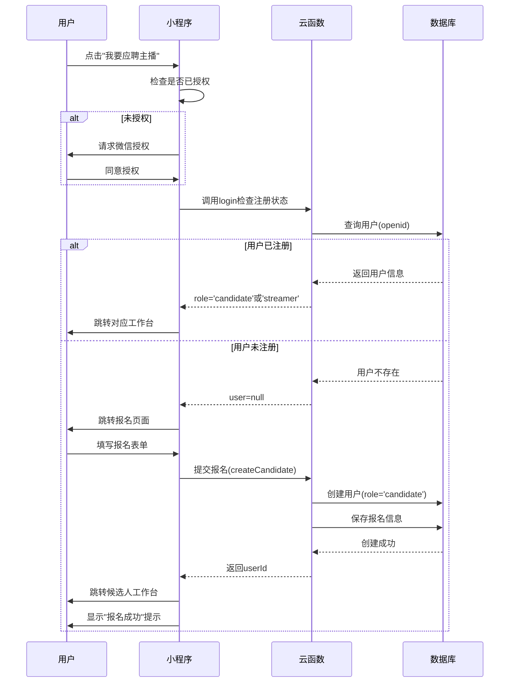
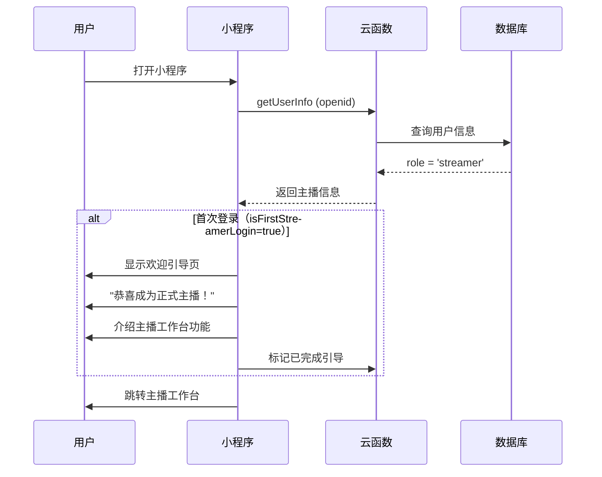
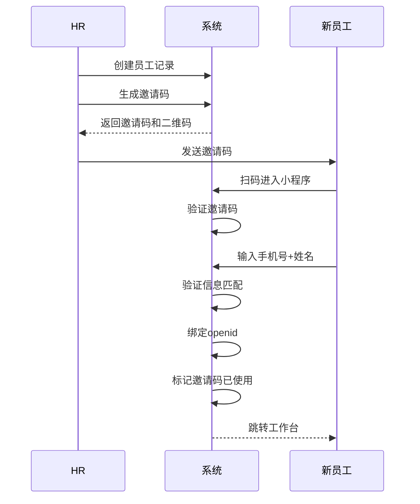

# 🎭 多角色系统设计

> 基于微信小程序的多角色登录和工作台设计方案

**创建日期**: 2025-11-02
**最后更新**: 2025-11-02
**维护者**: 产品团队
**状态**: 已发布

---

## 📑 目录

- [系统概述](#系统概述)
- [用户角色分类](#用户角色分类)
- [登录和角色识别流程](#登录和角色识别流程)
- [用户未注册处理方案](#用户未注册处理方案)
- [小程序页面架构](#小程序页面架构)
- [各角色工作台设计](#各角色工作台设计)
- [邀请码和推荐码机制](#邀请码和推荐码机制)
- [安全防护机制](#安全防护机制)

---

## 系统概述

### 设计目标

本系统通过微信小程序实现多角色统一入口，根据用户身份自动匹配相应的工作界面，支持以下核心场景：

1. ✅ **主播招聘流程**：候选人投递简历 → 在线面试 → 查看结果
2. ✅ **主播工作管理**：已入职主播的日常工作台
3. ✅ **员工协同办公**：9种内部员工角色的专属工作台
4. ✅ **外部星探推荐**：外部合作星探推荐主播并获得佣金

### 核心特性

- 🔐 **微信免登录**：利用微信授权，无需账号密码
- 🎯 **智能路由**：根据角色自动跳转对应工作台
- 🔗 **场景码识别**：支持推荐码、邀请码等多种进入方式
- 🛡️ **安全可控**：邀请码机制防止随意注册
- 📱 **多端统一**：一个小程序满足所有角色需求

---

## 用户角色分类

### 四大用户类型



### 角色详细说明

#### 1️⃣ 主播候选人（Candidate）

**定义**：已提交报名但尚未签约的应聘者（**也是系统用户**）

**重要说明**：
- ✅ **候选人报名时就创建微信账号**（role=candidate）
- ✅ 拥有独立的候选人工作台
- ✅ 可以查看审核进度、接收面试通知
- ✅ 签约后角色自动升级为主播（candidate → streamer）

**主要功能**：
- 填写和提交报名表
- 查看审核状态（实时）
- 接收面试通知（小程序消息推送）
- 参加在线面试
- 查看面试结果
- 查看录用通知
- 联系HR

**状态流转**：
```
扫码/搜索小程序
    ↓
微信登录 + 填写报名表
    ↓
创建账号（role=candidate）
    ↓
状态：pending → reviewing → interviewed → offered → signed
    ↓
签约后：role升级为streamer
```

---

#### 2️⃣ 主播（Streamer）

**定义**：已签约入职的正式主播

**主要功能**：
- 查看本周排班
- 查看培训任务
- 提交练习视频
- 查看直播数据
- 查看收益明细
- 查看周报反馈

**权限范围**：只能查看自己的数据

---

#### 3️⃣ 内部员工（Employee）

**9种角色类型**：

| 角色 | 代码 | 主要工作 |
|------|------|---------|
| HR管理员 | `hr_admin` | 候选人管理、面试安排、合同签署 |
| 经纪人 | `agent` | 团队管理、排班确认、周报复盘 |
| 运营专员 | `operator` | 排班管理、实时监控、数据分析 |
| 舞蹈培训师 | `dance_teacher` | 舞蹈训练、进度跟踪、考核评估 |
| 化妆师 | `makeup_artist` | 妆容设计、形象指导、效果分析 |
| 搭配师 | `stylist` | 造型设计、服装搭配、风格塑造 |
| 专职星探 | `scout_internal` | 主播招募、候选人筛选 |
| 财务专员 | `finance` | 收益结算、财务审核、发放管理 |
| 摄像师 | `videographer` | 面试录制、素材上传、视频管理 |

**权限特点**：
- 🔒 数据访问受限（只能看权限范围内的数据）
- 🎯 功能模块定制（每个角色看到的页面不同）
- 👥 需要邀请码才能注册（防止随意注册）

---

#### 4️⃣ 外部星探（External Scout）

**定义**：与公司签约的外部合作推荐人

**主要功能**：
- 生成专属推荐码
- 分享推荐链接/二维码
- 查看推荐记录
- 查看佣金明细
- 提现申请

**佣金机制**：
- 推荐主播入职 → 获得签约奖金
- 主播持续直播 → 获得持续佣金（如前3个月收益的5%）

---

## 登录和角色识别流程

### 完整流程图



### 技术实现要点

#### 1. 微信授权登录

**首次登录**：
```javascript
// app.js - 小程序启动
onLaunch(options) {
  // 获取场景参数
  this.globalData.sceneParams = {
    scene: options.scene,
    query: options.query,
    referrerInfo: options.referrerInfo
  };

  // 检查是否授权
  wx.getSetting({
    success: (res) => {
      if (res.authSetting['scope.userInfo']) {
        // 已授权，静默登录
        this.silentLogin();
      } else {
        // 未授权，跳转授权页
        wx.navigateTo({
          url: '/pages/auth/login/login'
        });
      }
    }
  });
}
```

**静默登录**：
```javascript
// 已授权情况下的静默登录
silentLogin() {
  wx.cloud.callFunction({
    name: 'login',
    data: {
      sceneParams: this.globalData.sceneParams
    }
  }).then(res => {
    if (res.result.registered) {
      // 已注册，跳转对应工作台
      this.routeToWorkspace(res.result.userRole);
    } else {
      // 未注册，进入注册流程
      this.handleUnregistered(res.result);
    }
  });
}
```

#### 2. 角色识别逻辑

**后端云函数**：
```javascript
// cloudfunctions/login/index.js
exports.main = async (event, context) => {
  const { OPENID } = cloud.getWXContext();
  const { sceneParams } = event;

  // 1. 查询用户是否已注册
  const userRecord = await db.collection('users')
    .where({ openid: OPENID })
    .get();

  if (userRecord.data.length > 0) {
    // 已注册，返回角色信息
    const user = userRecord.data[0];
    return {
      registered: true,
      userId: user._id,
      userRole: user.role_type,
      roleData: await getRoleData(user.role_type, user.role_id)
    };
  } else {
    // 未注册，返回场景参数用于注册
    return {
      registered: false,
      openid: OPENID,
      sceneParams: sceneParams
    };
  }
};
```

#### 3. 自动路由跳转

**根据角色跳转**：
```javascript
// app.js
routeToWorkspace(roleType) {
  const routeMap = {
    'candidate': '/pages/candidate/home/home',
    'streamer': '/pages/streamer/home/home',
    'hr_admin': '/pages/employee/hr/home/home',
    'agent': '/pages/employee/agent/home/home',
    'operator': '/pages/employee/operator/home/home',
    'dance_teacher': '/pages/employee/teacher/home/home',
    'makeup_artist': '/pages/employee/teacher/home/home',
    'stylist': '/pages/employee/teacher/home/home',
    'finance': '/pages/employee/finance/home/home',
    'scout_external': '/pages/scout-external/home/home'
  };

  const targetPage = routeMap[roleType] || '/pages/auth/role-select/role-select';

  wx.reLaunch({ url: targetPage });
}
```

---

## 用户未注册处理方案

### 决策树



---

### 场景1：通过星探推荐码进入 ⭐

#### 触发方式

用户扫描星探分享的二维码或点击分享链接进入小程序。

#### 小程序启动参数

```javascript
// 场景值示例
{
  scene: 1047, // 扫描小程序码
  query: {
    scout_code: 'SC-EXT-20250102-A3B9' // 星探推荐码
  }
}
```

#### 处理流程



#### 关键代码实现

**1. 小程序端处理**
```javascript
// pages/auth/login.js
Page({
  async onLoad(options) {
    const { scout_code } = options;

    // 1. 微信静默登录
    const loginRes = await wx.cloud.callFunction({
      name: 'login'
    });
    const { openId } = loginRes.result;

    // 2. 检查用户是否已注册
    const checkRes = await wx.cloud.callFunction({
      name: 'checkUser',
      data: { openId }
    });

    if (checkRes.result.exists) {
      // 已注册，直接跳转工作台
      const user = checkRes.result.user;
      this.routeToWorkspace(user.role);
    } else {
      // 未注册，跳转报名页
      wx.navigateTo({
        url: `/pages/candidate/apply/apply?scout_code=${scout_code || ''}`
      });
    }
  }
});
```

**2. 报名页处理**
```javascript
// pages/candidate/apply/apply.js
Page({
  data: {
    scoutCode: '',
    formData: { /* 报名信息 */ }
  },

  onLoad(options) {
    // 获取推荐码
    this.setData({
      scoutCode: options.scout_code || ''
    });

    // 如果有推荐码，显示推荐人信息
    if (options.scout_code) {
      this.loadScoutInfo(options.scout_code);
    }
  },

  // 提交报名
  async submitApplication() {
    const result = await wx.cloud.callFunction({
      name: 'createCandidate',
      data: {
        ...this.data.formData,
        scoutCode: this.data.scoutCode
      }
    });

    if (result.result.success) {
      // 提交成功，跳转工作台
      wx.reLaunch({
        url: '/pages/candidate/home/home'
      });
    }
  }
});
```

**3. 云函数创建账号**
```javascript
// cloudfunctions/createCandidate/index.js
exports.main = async (event, context) => {
  const { OPENID } = cloud.getWXContext();
  const { formData, scoutCode } = event;

  // 1. 验证推荐码（如果有）
  let scoutInfo = null;
  if (scoutCode) {
    const scout = await db.collection('scouts')
      .where({ code: scoutCode, status: 'active' })
      .get();

    if (scout.data.length === 0) {
      throw new Error('推荐码无效或已失效');
    }
    scoutInfo = scout.data[0];
  }

  // 2. 创建用户账号（role=candidate）
  const userId = await db.collection('users').add({
    data: {
      openId: OPENID,
      userType: 'candidate',
      role: 'candidate',

      candidateInfo: {
        status: 'pending', // 待审核
        source: scoutCode ? 'scout_referral' : 'self_apply',
        applyData: formData,
        applyAt: new Date()
      },

      accountStatus: {
        isActivated: true,
        isFirstLogin: false, // 报名即完成首次使用
        isProfileComplete: true
      },

      profile: {
        name: formData.basicInfo.name,
        phone: formData.basicInfo.phone
      },

      createdAt: new Date()
    }
  });

  // 3. 记录推荐关系（如果有）
  if (scoutInfo) {
    await db.collection('referral_records').add({
      data: {
        userId: userId._id,
        scoutId: scoutInfo._id,
        scoutCode: scoutCode,
        referredAt: new Date(),
        status: 'pending', // 待转化
        commissionRate: 0.05
      }
    });
  }

  return { success: true, userId: userId._id };
};
```

#### 用户体验流程

```
用户扫描推荐码
    ↓
自动微信登录（无感知）
    ↓
【已报名用户】 → 直接进入候选人工作台
【新用户】 → 进入报名页
    ↓
显示推荐人信息（如：星探张三推荐）
    ↓
填写报名表
    ↓
提交 → 创建账号（role=candidate）
    ↓
跳转候选人工作台
```

---

### 场景2：通过员工邀请码进入 👔

#### 触发方式

HR发送给新员工的专属邀请链接。

#### 小程序启动参数

```javascript
// 场景值示例
{
  scene: 1011, // 扫描小程序码
  query: {
    invite_code: 'INV-HR-20250102-X7Y9' // 员工邀请码
  }
}
```

#### 邀请码生成（HR后台功能）

```javascript
// 云函数：HR生成邀请码
exports.main = async (event, context) => {
  const { roleType, employeeName } = event;

  // 1. 验证调用者权限
  const caller = await getCurrentUser(context.OPENID);
  if (!['hr_admin', 'super_admin'].includes(caller.role_type)) {
    throw new Error('无权限生成邀请码');
  }

  // 2. 生成唯一邀请码
  const timestamp = Date.now().toString(36);
  const random = Math.random().toString(36).substring(2, 6).toUpperCase();
  const inviteCode = `INV-${roleType.split('_')[0].toUpperCase()}-${timestamp}-${random}`;

  // 3. 保存到数据库
  await db.collection('invite_codes').add({
    data: {
      code: inviteCode,
      role_type: roleType,
      employee_name: employeeName,
      created_by: caller.user_id,
      created_at: new Date(),
      expires_at: new Date(Date.now() + 7 * 24 * 60 * 60 * 1000), // 7天有效期
      used: false,
      used_by: null,
      used_at: null
    }
  });

  // 4. 生成小程序码
  const qrCodeBuffer = await cloud.openapi.wxacode.getUnlimited({
    scene: `invite_code=${inviteCode}`,
    page: 'pages/auth/login/login'
  });

  return {
    inviteCode,
    qrCode: qrCodeBuffer.buffer
  };
};
```

#### 处理流程



#### 员工信息绑定页面

**页面元素**：
- 📱 手机号输入框（必填）
- 👤 真实姓名输入框（必填）
- ✅ 验证码输入框（可选）
- 📋 员工角色显示（只读，从邀请码获取）

**验证逻辑**：
```javascript
// 云函数：绑定员工信息
async function bindEmployee(inviteCode, phone, realName) {
  // 1. 验证邀请码
  const invite = await db.collection('invite_codes')
    .where({
      code: inviteCode,
      used: false,
      expires_at: _.gt(new Date())
    })
    .get();

  if (invite.data.length === 0) {
    throw new Error('邀请码无效或已过期');
  }

  // 2. 检查手机号是否已预登记
  const employee = await db.collection('employees')
    .where({
      phone,
      status: 'pending_bind' // 待绑定状态
    })
    .get();

  if (employee.data.length === 0) {
    throw new Error('该手机号未在系统中预登记，请联系HR确认');
  }

  // 3. 验证姓名是否匹配
  if (employee.data[0].real_name !== realName) {
    throw new Error('姓名不匹配，请输入正确的姓名');
  }

  // 4. 验证角色是否匹配
  if (employee.data[0].role_type !== invite.data[0].role_type) {
    throw new Error('邀请码与您的职位不匹配');
  }

  // 5. 绑定 openid
  await db.collection('employees').doc(employee.data[0]._id).update({
    data: {
      openid: OPENID,
      status: 'active',
      bound_at: new Date()
    }
  });

  // 6. 创建用户记录
  await db.collection('users').add({
    data: {
      openid: OPENID,
      role_type: employee.data[0].role_type,
      role_id: employee.data[0]._id,
      created_at: new Date()
    }
  });

  // 7. 标记邀请码已使用
  await db.collection('invite_codes').doc(invite.data[0]._id).update({
    data: {
      used: true,
      used_by: employee.data[0]._id,
      used_at: new Date()
    }
  });

  return {
    success: true,
    employeeId: employee.data[0]._id,
    roleType: employee.data[0].role_type
  };
}
```

#### 员工预登记流程

**HR后台操作**：
1. HR在后台创建员工记录（预登记）
   ```javascript
   // 创建待绑定的员工记录
   await db.collection('employees').add({
     data: {
       real_name: '张三',
       phone: '13800138000',
       role_type: 'agent',
       department: '经纪部',
       openid: null, // 暂时为空
       status: 'pending_bind', // 待绑定
       created_by: hrUserId,
       created_at: new Date()
     }
   });
   ```

2. 生成对应角色的邀请码

3. 发送邀请码给新员工（微信/短信）

4. 新员工扫码后自动绑定

---

### 场景3：无参数直接打开 🎯

#### 触发方式

- 用户在微信搜索小程序名称
- 从小程序历史记录打开
- 收藏后打开

#### 处理流程

显示**身份选择页**，引导用户选择身份。

#### 页面设计

```
┌─────────────────────────────┐
│    欢迎使用 Aomi Star       │
│      请选择您的身份          │
└─────────────────────────────┘

┌─────────────────────────────┐
│  📸                         │
│  我要应聘主播                │
│  投递简历，开启直播之旅       │
└─────────────────────────────┘

┌─────────────────────────────┐
│  🔍                         │
│  我是星探                    │
│  推荐优质主播，赚取佣金       │
└─────────────────────────────┘

┌─────────────────────────────┐
│  💼                         │
│  我是公司员工                │
│  首次登录需要邀请码          │
└─────────────────────────────┘
```

#### 选择处理逻辑

```javascript
// pages/auth/role-select/role-select.js
Page({
  data: {
    userInfo: null
  },

  onLoad() {
    // 获取微信授权
    this.getUserProfile();
  },

  // 获取用户授权
  async getUserProfile() {
    try {
      const { userInfo } = await wx.getUserProfile({
        desc: '用于完善用户资料'
      });
      this.setData({ userInfo });
    } catch (err) {
      console.log('用户取消授权', err);
    }
  },

  // 选择应聘主播
  async onSelectCandidate() {
    // 1. 确保已授权
    if (!this.data.userInfo) {
      await this.getUserProfile();
      if (!this.data.userInfo) {
        return; // 用户拒绝授权
      }
    }

    // 2. 调用登录，检查是否已注册
    wx.showLoading({ title: '加载中...' });

    try {
      const loginRes = await wx.cloud.callFunction({
        name: 'login',
        data: {}
      });

      const user = loginRes.result.user;

      if (user) {
        // 用户已注册，根据角色跳转
        wx.hideLoading();

        if (user.role === 'candidate') {
          // 已是候选人，跳转到候选人工作台
          wx.reLaunch({
            url: '/pages/candidate/home/home'
          });
        } else if (user.role === 'streamer') {
          // 已是主播，跳转到主播工作台
          wx.reLaunch({
            url: '/pages/streamer/home/home'
          });
        } else {
          // 其他角色，提示不能重复注册
          wx.showModal({
            title: '提示',
            content: '您已有其他身份，不能重复注册',
            showCancel: false
          });
        }
      } else {
        // 未注册，跳转到报名页
        wx.hideLoading();
        wx.navigateTo({
          url: '/pages/candidate/apply/apply'
        });
      }
    } catch (err) {
      wx.hideLoading();
      wx.showToast({
        title: '加载失败',
        icon: 'none'
      });
    }
  },

  // 选择星探
  async onSelectScout() {
    // 1. 确保已授权
    if (!this.data.userInfo) {
      await this.getUserProfile();
      if (!this.data.userInfo) {
        return;
      }
    }

    // 2. 检查是否已注册
    wx.showLoading({ title: '加载中...' });

    try {
      const loginRes = await wx.cloud.callFunction({
        name: 'login',
        data: {}
      });

      const user = loginRes.result.user;

      if (user && user.role === 'external_scout') {
        // 已是星探，跳转到星探工作台
        wx.hideLoading();
        wx.reLaunch({
          url: '/pages/scout-external/home/home'
        });
      } else if (user) {
        // 已有其他角色
        wx.hideLoading();
        wx.showModal({
          title: '提示',
          content: '您已有其他身份，不能重复注册',
          showCancel: false
        });
      } else {
        // 未注册，跳转到星探注册页
        wx.hideLoading();
        wx.navigateTo({
          url: '/pages/scout-external/register/register'
        });
      }
    } catch (err) {
      wx.hideLoading();
      wx.showToast({
        title: '加载失败',
        icon: 'none'
      });
    }
  },

  // 选择员工
  onSelectEmployee() {
    wx.showModal({
      title: '需要邀请码',
      content: '员工首次登录需要使用公司HR发送的邀请链接。\n\n如果您已收到邀请码，请点击"我有邀请码"输入。\n\n如果尚未收到，请联系您的HR。',
      confirmText: '我有邀请码',
      cancelText: '联系HR',
      success: (res) => {
        if (res.confirm) {
          // 显示邀请码输入框
          this.showInviteCodeInput();
        } else {
          // 显示HR联系方式
          this.showHRContact();
        }
      }
    });
  },

  // 输入邀请码
  showInviteCodeInput() {
    wx.navigateTo({
      url: '/pages/auth/invite-code-input/invite-code-input'
    });
  },

  // 显示HR联系方式
  showHRContact() {
    wx.showModal({
      title: 'HR联系方式',
      content: 'HR电话：400-123-4567\n工作时间：周一至周五 9:00-18:00',
      confirmText: '拨打电话',
      cancelText: '我知道了',
      success: (res) => {
        if (res.confirm) {
          wx.makePhoneCall({
            phoneNumber: '4001234567'
          });
        }
      }
    });
  }
});
```

#### "我要应聘主播"完整流程

用户选择"我要应聘主播"后的处理流程：



#### 报名页面实现

```javascript
// pages/candidate/apply/apply.js
Page({
  data: {
    formData: {
      basicInfo: {
        name: '',
        phone: '',
        idCard: '',
        birthday: '',
        height: '',
        weight: ''
      },
      experience: {
        hasExperience: false,
        platforms: [],
        followersCount: ''
      },
      // ... 其他表单字段
    }
  },

  // 提交报名表单
  async submitApplication() {
    // 1. 表单验证
    if (!this.validateForm()) {
      return;
    }

    wx.showLoading({ title: '提交中...' });

    try {
      // 2. 调用云函数创建候选人账号
      const res = await wx.cloud.callFunction({
        name: 'createCandidate',
        data: {
          formData: this.data.formData,
          scoutCode: null // 直接报名无推荐码
        }
      });

      if (res.result.success) {
        wx.hideLoading();

        // 3. 显示成功提示
        await wx.showModal({
          title: '报名成功',
          content: '您的简历已提交，HR将在3个工作日内审核。\n\n审核结果将通过微信消息通知您。',
          showCancel: false,
          confirmText: '查看进度'
        });

        // 4. 跳转到候选人工作台
        wx.reLaunch({
          url: '/pages/candidate/home/home'
        });
      }
    } catch (err) {
      wx.hideLoading();
      wx.showModal({
        title: '提交失败',
        content: err.message || '网络错误，请稍后重试',
        showCancel: false
      });
    }
  },

  // 表单验证
  validateForm() {
    const { basicInfo } = this.data.formData;

    if (!basicInfo.name) {
      wx.showToast({ title: '请输入姓名', icon: 'none' });
      return false;
    }

    if (!basicInfo.phone || !/^1[3-9]\d{9}$/.test(basicInfo.phone)) {
      wx.showToast({ title: '请输入正确的手机号', icon: 'none' });
      return false;
    }

    // ... 其他验证逻辑

    return true;
  }
});
```

---

## 小程序页面架构

### 目录结构

```
miniprogram/
├── app.js                      # 小程序入口
├── app.json                    # 全局配置
├── app.wxss                    # 全局样式
│
├── pages/
│   │
│   ├── auth/                   # 认证相关
│   │   ├── login/              # 授权登录页
│   │   ├── role-select/        # 身份选择页
│   │   └── invite-input/       # 邀请码输入页
│   │
│   ├── candidate/              # 主播候选人端
│   │   ├── home/               # 候选人首页
│   │   ├── apply/              # 简历投递
│   │   ├── interview/          # 面试相关
│   │   │   ├── notice/         # 面试通知
│   │   │   ├── online/         # 在线面试
│   │   │   └── result/         # 面试结果
│   │   └── profile/            # 个人资料
│   │
│   ├── streamer/               # 主播端
│   │   ├── home/               # 主播首页
│   │   ├── schedule/           # 排班查看
│   │   ├── training/           # 培训任务
│   │   │   ├── courses/        # 课程列表
│   │   │   ├── practice/       # 练习提交
│   │   │   └── assessment/     # 考核记录
│   │   ├── live/               # 直播相关
│   │   │   ├── prepare/        # 直播准备
│   │   │   └── data/           # 直播数据
│   │   ├── income/             # 收益查看
│   │   └── profile/            # 个人中心
│   │
│   ├── employee/               # 员工端（统一框架）
│   │   ├── home/               # 员工通用首页
│   │   │
│   │   ├── hr/                 # HR 专属模块
│   │   │   ├── candidates/     # 候选人管理
│   │   │   │   ├── list/       # 候选人列表
│   │   │   │   ├── detail/     # 候选人详情
│   │   │   │   └── review/     # 审核候选人
│   │   │   ├── interviews/     # 面试管理
│   │   │   │   ├── schedule/   # 面试安排
│   │   │   │   ├── evaluation/ # 评审打分
│   │   │   │   └── result/     # 结果通知
│   │   │   ├── contracts/      # 合同管理
│   │   │   │   ├── templates/  # 合同模板
│   │   │   │   ├── create/     # 创建合同
│   │   │   │   └── list/       # 合同列表
│   │   │   └── invites/        # 邀请码管理
│   │   │       ├── generate/   # 生成邀请码
│   │   │       └── list/       # 邀请码列表
│   │   │
│   │   ├── agent/              # 经纪人专属模块
│   │   │   ├── team/           # 团队管理
│   │   │   │   ├── list/       # 主播列表
│   │   │   │   ├── detail/     # 主播详情
│   │   │   │   └── goals/      # 目标管理
│   │   │   ├── schedule/       # 排班管理
│   │   │   │   ├── week/       # 周排班
│   │   │   │   └── confirm/    # 排班确认
│   │   │   ├── training/       # 培训管理
│   │   │   │   ├── plans/      # 培训计划
│   │   │   │   └── assessment/ # 考核评估
│   │   │   ├── reports/        # 周报复盘
│   │   │   │   ├── create/     # 创建周报
│   │   │   │   ├── list/       # 周报列表
│   │   │   │   └── meeting/    # 复盘会议
│   │   │   └── income/         # 收益确认
│   │   │
│   │   ├── operator/           # 运营专属模块
│   │   │   ├── schedule/       # 排班系统
│   │   │   │   ├── create/     # 创建排班
│   │   │   │   └── manage/     # 排班管理
│   │   │   ├── monitor/        # 实时监控
│   │   │   │   ├── dashboard/  # 监控大屏
│   │   │   │   └── alert/      # 预警处理
│   │   │   └── data/           # 数据分析
│   │   │       ├── daily/      # 日报
│   │   │       └── weekly/     # 周报
│   │   │
│   │   ├── teacher/            # 导师专属模块（通用）
│   │   │   ├── students/       # 学员管理
│   │   │   │   ├── list/       # 学员列表
│   │   │   │   └── detail/     # 学员详情
│   │   │   ├── training/       # 培训计划
│   │   │   │   ├── plans/      # 计划列表
│   │   │   │   └── create/     # 创建计划
│   │   │   ├── records/        # 训练记录
│   │   │   │   ├── list/       # 记录列表
│   │   │   │   └── add/        # 添加记录
│   │   │   └── resources/      # 教学资源
│   │   │       ├── videos/     # 教学视频
│   │   │       └── upload/     # 上传资源
│   │   │
│   │   ├── finance/            # 财务专属模块
│   │       ├── settlement/     # 结算管理
│   │       │   ├── list/       # 结算列表
│   │       │   ├── review/     # 审核结算
│   │       │   └── detail/     # 结算详情
│   │       ├── transactions/   # 交易记录
│   │       └── reports/        # 财务报表
│   │   │
│   │   └── videographer/      # 摄像师专属模块
│   │       ├── interviews/     # 面试录制
│   │       │   ├── list/       # 待录制列表
│   │       │   ├── record/     # 录制页面
│   │       │   └── upload/     # 素材上传
│   │       ├── materials/      # 素材管理
│   │       │   ├── list/       # 素材列表
│   │       │   └── detail/     # 素材详情
│   │       └── schedule/       # 录制排期
│   │
│   └── scout-external/         # 外部星探端
│       ├── home/               # 星探首页
│       ├── register/           # 星探注册
│       ├── recommend/          # 推荐主播
│       │   ├── share/          # 分享推荐码
│       │   └── qrcode/         # 生成二维码
│       ├── candidates/         # 推荐记录
│       │   ├── list/           # 候选人列表
│       │   └── detail/         # 候选人详情
│       └── commission/         # 佣金管理
│           ├── list/           # 佣金明细
│           └── withdraw/       # 提现申请
│
├── components/                 # 公共组件
│   ├── role-header/            # 角色专属头部
│   ├── data-card/              # 数据卡片
│   └── timeline/               # 时间线组件
│
└── utils/                      # 工具函数
    ├── auth.js                 # 认证相关
    ├── router.js               # 路由跳转
    └── permission.js           # 权限检查
```

---

## 各角色工作台设计

### 1. 候选人工作台

#### 首页布局

```
┌─────────────────────────────────────────┐
│  👤 张三                                 │
│  📱 138****8888                         │
└─────────────────────────────────────────┘

┌─────────────────────────────────────────┐
│  🔄 申请进度                             │
│  ━━━●━━━━━━━━━━━━━━━━━━━━━━━━━       │
│  ✅ 已提交   ⏳ 审核中   ⏸️ 待面试      │
│  ⏸️ 待录用   ⏸️ 待签约                  │
│                                          │
│  当前状态：审核中                        │
│  预计反馈时间：3个工作日内                │
└─────────────────────────────────────────┘

┌─────────────────────────────────────────┐
│  📋 我的申请                             │
│  提交时间：2025-01-05 14:30             │
│  来源：星探推荐 (张星探)                 │
│  [查看完整简历] [修改简历]               │
└─────────────────────────────────────────┘

┌─────────────────────────────────────────┐
│  📅 面试安排                             │
│                                          │
│  📍 线上面试                             │
│  🕐 2025-01-10 14:00-15:00             │
│  👥 面试官：HR-李经理、经纪人-王总       │
│                                          │
│  [查看面试须知] [加入面试间]             │
│  [重新预约时间]                          │
└─────────────────────────────────────────┘

┌─────────────────────────────────────────┐
│  📨 最新消息 (2条未读)                   │
│                                          │
│  🔔 您的简历已通过初审                   │
│     HR-李经理 | 1小时前                  │
│                                          │
│  📞 面试邀请通知                         │
│     系统通知 | 2天前                     │
│                                          │
│  [查看全部消息]                          │
└─────────────────────────────────────────┘

┌─────────────────────────────────────────┐
│  ℹ️ 帮助中心                             │
│  • 如何准备面试？                        │
│  • 面试常见问题                          │
│  • 联系HR（工作日 9:00-18:00）          │
└─────────────────────────────────────────┘
```

#### 状态说明

候选人状态会经历以下流转：

| 状态 | 说明 | 候选人可见内容 | 可操作功能 |
|------|------|---------------|----------|
| **pending** | 简历待审核 | "您的简历已提交，HR正在审核中" | 查看简历、修改简历 |
| **reviewing** | 初审中 | "初审进行中，预计3个工作日反馈" | 查看简历 |
| **interview_scheduled** | 已安排面试 | 面试时间、地点、面试官信息 | 查看面试须知、加入面试、改约 |
| **interviewed** | 面试已完成 | "面试已完成，等待最终结果" | 查看面试记录 |
| **offered** | 已发放Offer | Offer详情、薪资待遇、签约须知 | 确认接受、申请协商 |
| **contract_pending** | 待签署合同 | 电子合同内容 | 签署合同 |
| **signed** | 已签约 | "恭喜！即将成为正式主播" | 查看合同、等待入职 |
| **rejected** | 未通过 | 不通过原因（可选）、鼓励语 | 查看反馈、6个月后重新申请 |

#### 核心功能

**1. 实时进度追踪**
- ✅ 可视化进度条显示当前阶段
- ✅ 每个状态变更都会收到微信模板消息通知
- ✅ 显示预计反馈时间，设置用户期望

**2. 简历管理**
- ✅ 查看已提交的完整简历
- ✅ 在审核前可以修改简历（pending状态）
- ✅ 审核后不可修改，但可以查看HR备注

**3. 面试管理**
- ✅ 查看面试时间、地点、面试官信息
- ✅ 查看面试准备须知和常见问题
- ✅ 一键加入在线面试间（腾讯会议/钉钉）
- ✅ 面试时间冲突可申请改约
- ✅ 面试结束后可查看评价反馈

**4. 消息中心**
- ✅ 接收系统通知（状态变更、面试邀请）
- ✅ 接收HR消息（初审反馈、面试评价）
- ✅ 未读消息红点提醒
- ✅ 消息与微信模板消息同步

**5. 电子签约**
- ✅ 查看Offer详情（岗位、薪资、福利）
- ✅ 在线签署电子合同
- ✅ 查看已签署的合同副本
- ✅ 合同条款可点击查看详细说明

**6. 帮助支持**
- ✅ 面试准备指南
- ✅ 常见问题解答
- ✅ 在线联系HR（工作时间）

---

### 2. 主播工作台

#### 首页布局

```
┌─────────────────────────────┐
│  👤 艺名：小星星             │
│  经纪人：李经理  级别：B级   │
└─────────────────────────────┘

┌─────────────────────────────┐
│  📊 本周数据概览             │
│  直播: 5场  时长: 18小时     │
│  收益: ¥8,500               │
│  涨粉: +320                 │
└─────────────────────────────┘

┌─────────────────────────────┐
│  📅 本周排班                 │
│  周一 19:00-22:00 黄金档     │
│  周三 14:00-17:00 白银档     │
│  ...                        │
│  [查看完整排班]              │
└─────────────────────────────┘

┌─────────────────────────────┐
│  📚 培训任务                 │
│  待完成课程: 2个             │
│  待提交练习: 1个             │
│  [查看详情]                  │
└─────────────────────────────┘

┌─────────────────────────────┐
│  💰 收益明细                 │
│  本月预估: ¥25,800          │
│  [查看详情]                  │
└─────────────────────────────┘
```

#### 核心功能

- ✅ 查看排班信息
- ✅ 查看培训任务
- ✅ 提交练习视频
- ✅ 查看直播数据
- ✅ 查看收益明细
- ✅ 查看周报反馈
- ✅ 个人档案管理

---

### 3. 员工工作台（以经纪人为例）

#### 首页布局

```
┌─────────────────────────────┐
│  💼 经纪人：李明             │
│  部门：经纪部                │
└─────────────────────────────┘

┌─────────────────────────────┐
│  👥 我的团队 (12人)          │
│  S级: 2人  A级: 4人          │
│  B级: 5人  C级: 1人          │
│  [查看团队]                  │
└─────────────────────────────┘

┌─────────────────────────────┐
│  📊 本周团队数据             │
│  总收益: ¥125,000           │
│  总涨粉: +2,580             │
│  完成率: 95%                │
│  [查看详情]                  │
└─────────────────────────────┘

┌─────────────────────────────┐
│  📅 本周排班                 │
│  待确认: 3人                │
│  [去确认]                   │
└─────────────────────────────┘

┌─────────────────────────────┐
│  📝 周报复盘                 │
│  本周五 15:00 复盘会议       │
│  [查看上周周报]              │
└─────────────────────────────┘

┌─────────────────────────────┐
│  ⚠️ 待办事项                │
│  • 小星星周报待填写           │
│  • 新人考核待评估             │
│  [查看全部]                  │
└─────────────────────────────┘
```

#### 核心功能

- ✅ 团队管理（12-15名主播）
- ✅ 排班确认
- ✅ 培训计划制定
- ✅ 周报复盘
- ✅ 收益确认
- ✅ 数据分析

---

### 4. 外部星探工作台

#### 首页布局

```
┌─────────────────────────────┐
│  🔍 星探：王推荐             │
│  佣金等级：金牌星探          │
└─────────────────────────────┘

┌─────────────────────────────┐
│  📊 本月数据                 │
│  推荐人数: 8人               │
│  成功签约: 3人               │
│  佣金收入: ¥4,500           │
└─────────────────────────────┘

┌─────────────────────────────┐
│  📱 我的推荐码               │
│  SC-EXT-20250102-A3B9       │
│  [复制] [生成二维码]         │
└─────────────────────────────┘

┌─────────────────────────────┐
│  👥 推荐记录 (8人)           │
│  待面试: 2人                │
│  面试中: 3人                │
│  已签约: 3人                │
│  [查看详情]                  │
└─────────────────────────────┘

┌─────────────────────────────┐
│  💰 佣金明细                 │
│  本月: ¥4,500               │
│  累计: ¥28,900              │
│  可提现: ¥15,000            │
│  [去提现]                   │
└─────────────────────────────┘
```

#### 核心功能

- ✅ 生成推荐码
- ✅ 分享推荐链接
- ✅ 查看推荐记录
- ✅ 查看佣金明细
- ✅ 申请提现
- ✅ 查看转化数据

---

## 角色升级机制

### 候选人 → 主播升级流程

#### 触发条件

当候选人完成以下所有步骤后，系统自动将角色从 `candidate` 升级为 `streamer`：

1. ✅ 通过所有面试环节
2. ✅ 获得录用Offer
3. ✅ 完成电子合同签署
4. ✅ HR确认入职

#### 升级时机

```javascript
// 云函数：confirmContract - HR确认合同签署完成后调用
exports.main = async (event, context) => {
  const { userId, contractId } = event;

  // 1. 验证合同状态
  const contract = await db.collection('contracts')
    .doc(contractId)
    .get();

  if (contract.data.status !== 'signed') {
    throw new Error('合同尚未签署');
  }

  // 2. 更新用户角色
  await db.collection('users').doc(userId).update({
    data: {
      role: 'streamer', // 从 candidate 升级为 streamer
      roleUpgradedAt: new Date(),

      // 保留候选人信息作为历史记录
      candidateHistory: {
        appliedAt: _.get('candidateInfo.applyAt'),
        source: _.get('candidateInfo.source'),
        scoutCode: _.get('candidateInfo.scoutCode'),
        upgradedAt: new Date()
      },

      // 初始化主播信息
      streamerInfo: {
        status: 'onboarding', // 入职中
        stageLevel: 'trainee', // 实习主播
        agentId: contract.data.agentId, // 分配的经纪人
        contractId: contractId,
        joinedAt: new Date(),

        // 初始数据
        totalLiveHours: 0,
        totalIncome: 0,
        followerCount: 0
      }
    }
  });

  // 3. 如果有星探推荐，更新推荐状态为"已转化"
  if (contract.data.scoutCode) {
    await db.collection('referral_records')
      .where({
        userId: userId,
        scoutCode: contract.data.scoutCode
      })
      .update({
        data: {
          status: 'converted', // 从 pending 变为 converted
          convertedAt: new Date(),
          contractId: contractId
        }
      });
  }

  // 4. 发送通知
  await sendTemplateMessage({
    touser: contract.data.candidateOpenid,
    template_id: 'WELCOME_STREAMER',
    data: {
      name: contract.data.candidateName,
      agent: contract.data.agentName,
      startDate: contract.data.startDate
    }
  });

  return { success: true, newRole: 'streamer' };
};
```

#### 数据变更对比

| 字段 | 升级前（candidate） | 升级后（streamer） |
|------|-------------------|-------------------|
| **role** | `candidate` | `streamer` |
| **candidateInfo** | 完整信息 | 移至 candidateHistory |
| **streamerInfo** | 不存在 | 新建，包含主播档案 |
| **工作台访问** | `/pages/candidate/home` | `/pages/streamer/home` |
| **权限** | 查看申请进度、面试 | 查看排班、培训、直播数据 |

#### 升级后首次登录流程



#### 角色升级后的消息通知

**1. 微信模板消息**
```javascript
{
  touser: 'OPENID',
  template_id: 'ROLE_UPGRADE_TEMPLATE',
  page: '/pages/streamer/home/home',
  data: {
    title: '角色升级通知',
    content: '恭喜您成为正式主播！',
    time: '2025-01-15 10:00',
    remark: '点击查看您的主播工作台'
  }
}
```

**2. 站内消息**
```javascript
{
  userId: 'USER_ID',
  type: 'role_upgrade',
  title: '🎉 欢迎加入主播团队',
  content: '您已完成签约，角色升级为正式主播。\n\n您的经纪人：李经理\n首次培训时间：2025-01-16 14:00\n\n请访问主播工作台查看详细信息。',
  read: false,
  createdAt: new Date()
}
```

#### 回退机制（特殊情况）

在极少数情况下（如合同签署出错、候选人放弃入职等），HR可以回退角色：

```javascript
// 云函数：rollbackRole（需要HR权限）
exports.main = async (event, context) => {
  const { userId, reason } = event;

  // 验证权限
  const caller = await getCurrentUser(context.OPENID);
  if (!['hr_admin', 'super_admin'].includes(caller.roleType)) {
    throw new Error('无权限执行此操作');
  }

  // 回退角色
  await db.collection('users').doc(userId).update({
    data: {
      role: 'candidate',

      // 从历史记录恢复候选人信息
      candidateInfo: _.get('candidateHistory'),

      // 清除主播信息
      streamerInfo: _.remove(),

      // 记录回退日志
      roleChangeLog: _.push({
        from: 'streamer',
        to: 'candidate',
        reason: reason,
        operator: caller.userId,
        operatedAt: new Date()
      })
    }
  });

  return { success: true };
};
```

#### 注意事项

⚠️ **重要提醒**：

1. **不可逆性**：角色升级通常不可逆，除非HR手动回退
2. **数据完整性**：升级前确保所有候选人信息完整
3. **权限变更**：升级后候选人工作台将不可访问
4. **通知及时性**：升级后立即发送通知，避免用户困惑
5. **历史记录**：candidateHistory保留完整的应聘历史，不可删除
6. **星探佣金**：角色升级会触发星探佣金结算流程

---

## 邀请码和推荐码机制

### 员工邀请码机制

#### 生成规则

**格式**：`INV-{角色简称}-{时间戳}-{随机码}`

**示例**：
- `INV-HR-20250102-X7Y9` - HR邀请码
- `INV-AG-20250102-B3K8` - 经纪人邀请码
- `INV-OP-20250102-M5N2` - 运营专员邀请码

#### 有效期管理

- ⏱ **默认有效期**：7天
- ♻️ **可重新生成**：过期后HR可重新生成
- 🔒 **一次性使用**：每个邀请码只能使用一次
- ❌ **可作废**：HR可手动作废未使用的邀请码

#### 使用流程



---

### 星探推荐码机制

#### 生成规则

**格式**：`SC-{类型}-{时间戳}-{随机码}`

**类型**：
- `INT` - 内部专职星探
- `EXT` - 外部合作星探

**示例**：
- `SC-INT-20250102-A3B9` - 内部星探推荐码
- `SC-EXT-20250102-K7M5` - 外部星探推荐码

#### 推荐码特性

- 🔄 **永久有效**：星探推荐码长期有效
- ♾️ **无限使用**：可以推荐无限多人
- 📊 **数据追踪**：记录每个推荐的转化情况
- 💰 **佣金绑定**：自动绑定佣金关系

#### 佣金计算规则

**签约奖金**：
- 候选人成功签约 → 星探获得 ¥500 签约奖金

**持续佣金**（前3个月）：
- 主播月收益 × 5% = 星探月佣金

**示例**：
```
第1个月：主播收益 ¥10,000 → 星探佣金 ¥500
第2个月：主播收益 ¥15,000 → 星探佣金 ¥750
第3个月：主播收益 ¥20,000 → 星探佣金 ¥1,000
─────────────────────────────────────────
签约奖金：¥500
持续佣金：¥2,250
总计佣金：¥2,750
```

#### 推荐关系追踪

```sql
-- referral_records 表
{
  candidate_id: 123,
  scout_id: 456,
  scout_type: 'external',
  scout_code: 'SC-EXT-20250102-K7M5',
  referred_at: '2025-01-05',
  status: 'signed', // pending/interviewed/signed/rejected
  commission_rate: 0.05,
  total_commission: 2750.00,
  paid_commission: 2750.00,
  last_commission_date: '2025-04-30'
}
```

---

## 安全防护机制

### 1. 防止重复注册

#### 检查规则

```javascript
async function checkDuplicateRegistration(openid, phone) {
  // 1. 检查 openid 是否已注册
  const existByOpenid = await db.collection('users')
    .where({ openid })
    .count();

  if (existByOpenid.total > 0) {
    throw new Error('该微信账号已注册，一个微信账号只能绑定一个身份');
  }

  // 2. 检查手机号是否已被使用（仅候选人和星探）
  if (roleType === 'candidate' || roleType === 'scout_external') {
    const existByPhone = await db.collection('candidates')
      .where({ phone })
      .count();

    if (existByPhone.total > 0) {
      throw new Error('该手机号已被注册');
    }
  }
}
```

---

### 2. 防止角色混乱

#### 原则

- ✅ 一个微信账号只能绑定一个主要身份
- ✅ 候选人 → 主播是自然升级（同一账号）
- ❌ 不允许一人既是主播又是星探
- ❌ 不允许一人既是员工又是外部星探

#### 实现

```javascript
// 用户表设计
{
  _id: 'user_001',
  openid: 'wx_xxx',
  role_type: 'streamer', // 当前角色
  role_id: 123, // 对应角色表的ID
  role_history: [
    { role: 'candidate', changed_at: '2025-01-05' },
    { role: 'streamer', changed_at: '2025-01-20' }
  ],
  can_switch_role: false // 是否允许切换角色
}
```

---

### 3. 邀请码安全

#### 验证规则

```javascript
async function verifyInviteCode(code) {
  const invite = await db.collection('invite_codes')
    .where({ code })
    .get();

  // 检查1: 邀请码是否存在
  if (invite.data.length === 0) {
    throw new Error('邀请码不存在');
  }

  const inviteData = invite.data[0];

  // 检查2: 是否已使用
  if (inviteData.used) {
    throw new Error('该邀请码已被使用');
  }

  // 检查3: 是否过期
  if (new Date() > new Date(inviteData.expires_at)) {
    throw new Error('邀请码已过期');
  }

  return inviteData;
}
```

#### 防止暴力破解

```javascript
// 限制邀请码验证次数
const MAX_VERIFY_ATTEMPTS = 5;
const LOCK_DURATION = 30 * 60 * 1000; // 30分钟

async function checkVerifyAttempts(openid) {
  const attempts = await redis.get(`invite_verify:${openid}`);

  if (attempts && attempts >= MAX_VERIFY_ATTEMPTS) {
    const lockExpire = await redis.ttl(`invite_verify:${openid}`);
    throw new Error(`验证次数过多，请在${Math.ceil(lockExpire / 60)}分钟后重试`);
  }

  // 增加尝试次数
  await redis.incr(`invite_verify:${openid}`);
  await redis.expire(`invite_verify:${openid}`, LOCK_DURATION / 1000);
}
```

---

### 4. 推荐码防滥用

#### 限制规则

- ⏱ **频率限制**：同一星探每天最多推荐10人
- 🔍 **异常检测**：识别批量注册行为
- ❌ **黑名单机制**：作弊星探永久封禁

#### 实现

```javascript
// 检查推荐频率
async function checkRecommendFrequency(scoutId) {
  const today = new Date().toISOString().split('T')[0];

  const count = await db.collection('referral_records')
    .where({
      scout_id: scoutId,
      referred_at: db.command.gte(new Date(today))
    })
    .count();

  if (count.total >= 10) {
    throw new Error('今日推荐次数已达上限（10人/天）');
  }
}

// 异常检测
async function detectAbnormalBehavior(scoutId) {
  // 检测1: 短时间内大量推荐
  const last1Hour = await db.collection('referral_records')
    .where({
      scout_id: scoutId,
      referred_at: db.command.gte(new Date(Date.now() - 60 * 60 * 1000))
    })
    .count();

  if (last1Hour.total > 5) {
    await flagScoutForReview(scoutId, '短时间内大量推荐');
  }

  // 检测2: 推荐的候选人质量过低
  const recentCandidates = await db.collection('referral_records')
    .where({
      scout_id: scoutId,
      referred_at: db.command.gte(new Date(Date.now() - 7 * 24 * 60 * 60 * 1000))
    })
    .get();

  const rejectedCount = recentCandidates.data.filter(r => r.status === 'rejected').length;
  const rejectionRate = rejectedCount / recentCandidates.data.length;

  if (rejectionRate > 0.8 && recentCandidates.data.length > 5) {
    await flagScoutForReview(scoutId, '推荐质量过低');
  }
}
```

---

### 5. 数据访问权限

#### 中间件验证

```javascript
// 权限检查中间件
async function checkPermission(openid, resource, action) {
  // 1. 获取用户角色
  const user = await db.collection('users')
    .where({ openid })
    .get();

  if (user.data.length === 0) {
    throw new Error('用户不存在');
  }

  const { role_type, role_id } = user.data[0];

  // 2. 检查资源访问权限
  const hasPermission = await checkRolePermission(
    role_type,
    resource,
    action,
    role_id
  );

  if (!hasPermission) {
    throw new Error('无权限访问该资源');
  }

  return true;
}

// 示例：经纪人只能查看名下主播的数据
async function checkRolePermission(roleType, resource, action, roleId) {
  if (roleType === 'agent' && resource === 'streamer_data') {
    // 验证该主播是否归属于该经纪人
    const streamer = await db.collection('streamers')
      .where({
        _id: resourceId,
        agent_id: roleId
      })
      .count();

    return streamer.total > 0;
  }

  // 其他角色权限规则...
}
```

---

## 附录

### 场景值对照表

| 场景值 | 说明 | 示例 |
|--------|------|------|
| 1001 | 发现栏小程序主入口 | - |
| 1011 | 扫描二维码 | 星探推荐码、员工邀请码 |
| 1047 | 扫描小程序码 | 星探推荐码、员工邀请码 |
| 1089 | 微信聊天主界面下拉 | - |
| 1104 | 聊天附件栏 | 星探分享链接 |

### 相关文档

- [requirements.md](./requirements.md) - 完整需求文档
- [business-flow.md](./business-flow.md) - 业务流程详解
- [roles-responsibilities.md](./roles-responsibilities.md) - 角色职责矩阵
- [data-flow.md](./data-flow.md) - 数据流转设计

---

**文档版本**: v1.0
**最后更新**: 2025-11-02
**维护者**: 产品团队
**审核状态**: 已审核
