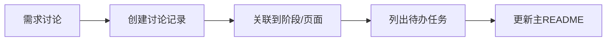
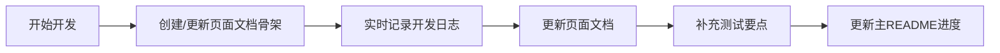

# 📚 招聘系统文档中心

> 候选人从报名到签约入职的完整流程文档跟踪

**文档状态**：🚧 持续更新中
**最后更新**：2025-11-05
**维护团队**：开发团队

---

## 🎯 文档目标

本文档体系旨在：
1. **实时记录**：同步记录需求讨论和开发实施过程
2. **知识沉淀**：形成可查询、可参考的知识库
3. **指导测试**：为测试提供清晰的功能说明和测试流程
4. **后续参考**：为后续阶段（7-9）和新功能提供开发模板

---

## 📖 快速导航

### 🔥 最常用文档

| 文档 | 说明 | 状态 |
|------|------|------|
| [业务流程文档](../business-flow.md) | **10阶段完整业务流程** | ✅ 完整 |
| [实施报告](../../../../miniprogram/RECRUITMENT_IMPLEMENTATION_REPORT.md) | **阶段1-6实施总结** | ✅ 完整 |
| [页面功能文档](./pages/) | 各页面详细功能说明 | 🚧 补充中 |
| [开发日志](./dev-logs/2025-11/) | 开发过程记录 | 🚧 补充中 |

### 📁 文档分类导航

#### 1. 📝 需求讨论记录
**位置**：[discussions/](./discussions/)

记录每次需求讨论的完整过程，包括讨论背景、方案对比、最终决策。

**最新讨论**：
- [2025-11-05 HR审核功能需求讨论](./discussions/2025-11/2025-11-05-hr-review.md) 🚧

**历史讨论**：
- [11月讨论索引](./discussions/2025-11/README.md)

**使用指南**：
- 每次需求讨论后，使用[讨论记录模板](./discussions/TEMPLATE.md)创建文档
- 记录讨论过程、备选方案、最终决策
- 关联到相应的阶段和页面

---

#### 2. 📄 页面功能文档
**位置**：[pages/](./pages/)

详细记录每个页面的功能、交互、数据结构、技术实现。

**阶段1：候选人报名**
- [报名页面](./pages/stage-1-apply.md) ⏳ 待补充

**阶段2：HR审核与面试官分配**
- [HR候选人列表页](./pages/stage-2-hr-candidates-list.md) ⏳ 待补充
- [HR候选人详情页](./pages/stage-2-hr-candidate-detail.md) ⏳ 待补充

**阶段3：线上测试**
- [16PF性格测试页](./pages/stage-3-online-test.md) ⏳ 待补充

**阶段4：线下面试与素材上传**
- [摄像师素材上传页](./pages/stage-4-materials-upload.md) ⏳ 待补充
- [舞蹈导师评价页](./pages/stage-4-dance-evaluation.md) ⏳ 待补充
- [化妆师评价页](./pages/stage-4-makeup-evaluation.md) ⏳ 待补充
- [造型师评价页](./pages/stage-4-stylist-evaluation.md) ⏳ 待补充
- [经纪人评价页](./pages/stage-4-agent-evaluation.md) ⏳ 待补充

**阶段5：系统评级**
- [系统评级页](./pages/stage-5-rating.md) ⏳ 待补充

**阶段6：签约入职**
- [合同上传页](./pages/stage-6-contract-upload.md) ⏳ 待补充
- [合同签署页](./pages/stage-6-contract-sign.md) ⏳ 待补充

**使用指南**：
- 开发前使用[页面文档模板](./pages/TEMPLATE.md)创建骨架
- 开发中实时更新技术实现部分
- 开发后补充测试要点和优化项

---

#### 3. 📋 开发日志
**位置**：[dev-logs/](./dev-logs/)

记录具体的开发过程、遇到的问题、解决方案。

**最新日志**：
- [2025-11-05 HR审核功能实现](./dev-logs/2025-11/2025-11-05-hr-review-implementation.md) 🚧

**计划补充**：
- [2025-11-02 阶段1-2实施日志](./dev-logs/2025-11/2025-11-02-stage1-2-implementation.md) ⏳
- [2025-11-03 阶段3-4实施日志](./dev-logs/2025-11/2025-11-03-stage3-4-implementation.md) ⏳
- [2025-11-04 阶段5-6实施日志](./dev-logs/2025-11/2025-11-04-stage5-6-implementation.md) ⏳

**历史日志**：
- [11月开发日志索引](./dev-logs/2025-11/README.md)

**使用指南**：
- 每天开发结束前使用[开发日志模板](./dev-logs/TEMPLATE.md)创建/更新日志
- 记录开发步骤、遇到的问题、解决方案
- 关联相关的需求讨论和页面文档

---

#### 4. 🎯 技术决策记录
**位置**：[decisions/](./decisions/)

记录重要的技术选型和架构决策。

**已有决策**：
- [ADR-001 Mock数据结构设计](./decisions/001-mock-data-structure.md) ⏳ 待补充
- [ADR-002 评级算法设计](./decisions/002-rating-algorithm.md) ⏳ 待补充
- [ADR-003 角色升级机制](./decisions/003-role-upgrade.md) ⏳ 待补充

**使用指南**：
- 做重要技术决策时使用[决策记录模板](./decisions/TEMPLATE.md)
- 记录背景、备选方案、决策理由、影响分析
- 定期回顾决策效果

---

## 🗺️ 招聘流程6阶段概览

### 阶段1：候选人报名 ✅ 已完成
**核心功能**：候选人填写报名表单，提交基本信息和才艺资料

**涉及页面**：
- 招聘首页：`pages/recruit/index/`
- 报名表单页：`pages/recruit/apply/`

**关键数据**：
- Mock文件：`mock/candidates.js`
- 状态：`pending`（待HR审核）

**相关文档**：
- 页面文档：[报名页面](./pages/stage-1-apply.md) ⏳
- 开发日志：[阶段1-2实施](./dev-logs/2025-11/2025-11-02-stage1-2-implementation.md) ⏳

---

### 阶段2：HR审核与面试官分配 ✅ 已完成
**核心功能**：HR审核候选人资料，通过后分配5位面试官（摄像师、舞蹈导师、化妆师、造型师、经纪人）

**涉及页面**：
- HR候选人列表：`pages/hr/candidates/`
- HR候选人详情：`pages/hr/candidate-detail/`

**关键数据**：
- Mock文件：`mock/employees.js`（员工数据）
- Mock文件：`mock/candidates.js`（添加`hrReview`和`interviewSchedule`字段）
- 状态流转：`pending` → `interview_scheduled`（通过）或 `rejected`（拒绝）

**相关文档**：
- 页面文档：[HR审核页](./pages/stage-2-hr-candidate-detail.md) ⏳
- 开发日志：[HR审核功能实现](./dev-logs/2025-11/2025-11-05-hr-review-implementation.md) 🚧
- 需求讨论：[HR审核需求](./discussions/2025-11/2025-11-05-hr-review.md) 🚧

---

### 阶段3：线上测试 ✅ 已完成
**核心功能**：候选人完成16PF性格测试，系统生成性格分析报告

**涉及页面**：
- 线上测试页：`pages/recruit/online-test/`

**关键数据**：
- Mock文件：`mock/candidates.js`（添加`onlineTest`字段）
- 测试维度：16个性格维度（warmth, reasoning, emotionalStability...）
- 状态流转：`interview_scheduled` → `online_test_completed`

**相关文档**：
- 页面文档：[16PF测试页](./pages/stage-3-online-test.md) ⏳
- 开发日志：[阶段3-4实施](./dev-logs/2025-11/2025-11-03-stage3-4-implementation.md) ⏳

---

### 阶段4：线下面试与素材上传 ✅ 已完成
**核心功能**：摄像师上传面试素材，4位导师（舞蹈、化妆、造型、经纪人）分别评价

**涉及页面**：
- 素材上传：`pages/recruit/materials-upload/`
- 舞蹈评价：`pages/recruit/dance-evaluation/`
- 经纪人评价：`pages/recruit/agent-evaluation/`
- [其他评价页面]

**关键数据**：
- Mock文件：`mock/candidates.js`（添加`interviewMaterials`和`evaluations`字段）
- 评价维度：
  - 舞蹈导师：基础功底、节奏感、协调性、表现力、可塑性（/10分）
  - 经纪人：商业潜力、沟通能力等
- 状态流转：`online_test_completed` → `pending_rating`

**相关文档**：
- 页面文档：[素材上传页](./pages/stage-4-materials-upload.md) ⏳
- 页面文档：[舞蹈评价页](./pages/stage-4-dance-evaluation.md) ⏳
- 开发日志：[阶段3-4实施](./dev-logs/2025-11/2025-11-03-stage3-4-implementation.md) ⏳

---

### 阶段5：系统评级 ✅ 已完成
**核心功能**：系统根据评价数据自动计算评级（A/B/C级）

**涉及页面**：
- 评级审核：`pages/recruit/rating-review/`

**关键数据**：
- Mock文件：`mock/candidates.js`（添加`rating`字段）
- 评级算法：**舞蹈60% + 妆容AI40%**
  - 舞蹈分：舞蹈导师总分 × 6（换算成60分）
  - 妆容分：AI评分 × 4（换算成40分）
  - 总分 = 舞蹈分 + 妆容分
- 等级划分：
  - A级：85-100分
  - B级：70-84分
  - C级：60-69分
- 状态流转：`pending_rating` → `rated`

**相关文档**：
- 页面文档：[系统评级页](./pages/stage-5-rating.md) ⏳
- 技术决策：[评级算法设计](./decisions/002-rating-algorithm.md) ⏳
- 开发日志：[阶段5-6实施](./dev-logs/2025-11/2025-11-04-stage5-6-implementation.md) ⏳

---

### 阶段6：签约入职 ✅ 已完成
**核心功能**：经纪人上传合同，候选人签署合同，角色自动升级为主播

**涉及页面**：
- 合同上传：`pages/recruit/contract-upload/`

**关键数据**：
- Mock文件：`mock/candidates.js`（添加`contract`和`roleUpgrade`字段）
- 合同内容：
  - 合同类型（A/B/C级对应不同合同）
  - 薪资结构（底薪、全勤奖、超时补贴、分档提成、奖金）
  - 合同期限（通常12个月）
- 角色升级：`candidate` → `streamer`
- 状态流转：`rated` → `signed`

**相关文档**：
- 页面文档：[合同上传页](./pages/stage-6-contract-upload.md) ⏳
- 技术决策：[角色升级机制](./decisions/003-role-upgrade.md) ⏳
- 开发日志：[阶段5-6实施](./dev-logs/2025-11/2025-11-04-stage5-6-implementation.md) ⏳

---

## 📊 项目实施进度

### 整体进度：70% ✅

| 阶段 | 名称 | 页面实现 | 数据模型 | Mock数据 | 文档 | 状态 |
|-----|------|---------|---------|---------|------|------|
| 0 | 用户注册识别 | ✅ | ✅ | ✅ | ✅ | ✅ 完成 |
| 1 | 候选人报名 | ✅ | ✅ | ✅ | ⏳ | ✅ 完成 |
| 2 | HR审核分配 | ✅ | ✅ | ✅ | 🚧 | ✅ 完成 |
| 3 | 线上测试 | ✅ | ✅ | ✅ | ⏳ | ✅ 完成 |
| 4 | 线下面试评价 | ✅ | ✅ | ✅ | ⏳ | ✅ 完成 |
| 5 | 系统评级 | ✅ | ✅ | ✅ | ⏳ | ✅ 完成 |
| 6 | 签约入职 | ✅ | ✅ | ✅ | ⏳ | ✅ 完成 |
| 7 | 培训阶段 | ⚠️ | ✅ | ✅ | ❌ | 🚧 部分完成 |
| 8 | 直播运营 | ⚠️ | ✅ | ✅ | ❌ | 🚧 部分完成 |
| 9 | 结算阶段 | ❌ | ⚠️ | ⚠️ | ❌ | 🚧 未开始 |

**图例**：
- ✅ 已完成
- 🚧 进行中
- ⏳ 计划中
- ⚠️ 部分完成
- ❌ 未开始

---

## 👥 涉及角色清单

### 完全实现的角色（11个）

| 角色 | 工作台路径 | 主要功能 | 文档 |
|------|-----------|---------|------|
| 🎭 候选人 | `pages/candidate/` | 报名、测试、查看进度 | [查看](./pages/role-candidate.md) ⏳ |
| 💼 HR | `pages/hr/` | 审核候选人、分配面试官 | [查看](./pages/role-hr.md) ⏳ |
| 📸 摄像师 | `pages/photographer/` | 拍摄面试素材 | [查看](./pages/role-photographer.md) ⏳ |
| 💃 舞蹈导师 | `pages/dance-teacher/` | 评价舞蹈能力 | [查看](./pages/role-dance-teacher.md) ⏳ |
| 💄 化妆师 | `pages/makeup-artist/` | 评价妆容效果 | [查看](./pages/role-makeup-artist.md) ⏳ |
| ✨ 造型师 | `pages/stylist/` | 评价造型风格 | [查看](./pages/role-stylist.md) ⏳ |
| 🤝 经纪人 | `pages/agent/` | 综合评价、上传合同 | [查看](./pages/role-agent.md) ⏳ |
| 🎬 主播 | `pages/anchor/` | 直播运营 | [查看](./pages/role-anchor.md) ⏳ |
| 📊 运营专员 | `pages/operations/` | 运营管理 | [查看](./pages/role-operations.md) ⏳ |
| 🔍 外部星探 | `pages/external-scout/` | 推荐候选人 | [查看](./pages/role-scout.md) ⏳ |
| ⚙️ 管理员 | `pages/admin/` | 系统管理 | [查看](./pages/role-admin.md) ⏳ |

### 待完善的角色（2个）

| 角色 | 涉及阶段 | 状态 |
|------|---------|------|
| 💰 财务专员 | 阶段9：结算 | ⏳ 待开发 |
| 📚 培训导师 | 阶段7：培训 | ⏳ 待完善 |

---

## 📂 文件结构

### 当前文档结构

```
recruitment-system/
├── README.md                        # 📍 当前文件 - 招聘系统文档导航
│
├── discussions/                     # 需求讨论记录
│   ├── TEMPLATE.md                  # 讨论记录模板
│   └── 2025-11/                     # 11月讨论记录
│       ├── README.md                # 月度索引
│       └── 2025-11-05-hr-review.md  # HR审核需求讨论
│
├── pages/                           # 页面功能文档
│   ├── TEMPLATE.md                  # 页面文档模板
│   ├── stage-1-apply.md             # 阶段1：报名页
│   ├── stage-2-hr-*.md              # 阶段2：HR审核页
│   ├── stage-3-online-test.md       # 阶段3：线上测试页
│   ├── stage-4-*.md                 # 阶段4：面试评价页
│   ├── stage-5-rating.md            # 阶段5：评级页
│   └── stage-6-contract.md          # 阶段6：签约页
│
├── dev-logs/                        # 开发日志
│   ├── TEMPLATE.md                  # 开发日志模板
│   └── 2025-11/                     # 11月开发日志
│       ├── README.md                # 月度索引
│       └── 2025-11-*.md             # 具体开发日志
│
└── decisions/                       # 技术决策记录
    ├── TEMPLATE.md                  # 决策记录模板
    ├── 001-mock-data-structure.md   # Mock数据结构设计
    ├── 002-rating-algorithm.md      # 评级算法设计
    └── 003-role-upgrade.md          # 角色升级机制
```

### 代码文件结构

```
miniprogram/
├── pages/
│   ├── recruit/                     # 招聘流程页面
│   │   ├── index/                   # 招聘首页
│   │   ├── apply/                   # 报名表单
│   │   ├── online-test/             # 线上测试
│   │   ├── materials-upload/        # 素材上传
│   │   ├── dance-evaluation/        # 舞蹈评价
│   │   ├── agent-evaluation/        # 经纪人评价
│   │   ├── rating-review/           # 评级审核
│   │   └── contract-upload/         # 合同上传
│   │
│   ├── hr/                          # HR工作台
│   │   ├── home/                    # HR首页
│   │   ├── candidates/              # 候选人列表
│   │   └── candidate-detail/        # 候选人详情
│   │
│   ├── candidate/                   # 候选人工作台
│   ├── photographer/                # 摄像师工作台
│   ├── dance-teacher/               # 舞蹈导师工作台
│   ├── agent/                       # 经纪人工作台
│   └── ...                          # 其他角色工作台
│
└── mock/
    ├── candidates.js                # 候选人数据（核心）
    ├── employees.js                 # 员工数据
    ├── test-data.js                 # 测试数据（6个阶段）
    └── ...                          # 其他Mock数据
```

---

## 🔄 实时更新工作流

### 需求讨论 → 文档记录



**操作步骤**：
1. 讨论结束后，使用[讨论记录模板](./discussions/TEMPLATE.md)创建文档
2. 记录讨论背景、备选方案、最终决策
3. 关联到相应的阶段和页面文档
4. 列出后续的开发任务
5. 更新本README中的"最新讨论"部分

---

### 开发实施 → 文档跟进



**操作步骤**：
1. **开发前**：创建页面文档骨架（功能概述、业务流程）
2. **开发中**：实时更新开发日志，记录问题和解决方案
3. **开发后**：完善页面文档（技术实现、测试要点）
4. **测试后**：更新测试结果，记录待优化项
5. **定期更新**：更新本README中的进度表和最新动态

---

## 📝 文档规范

### 命名规范

**讨论记录**：`YYYY-MM-DD-[简短主题].md`
- 示例：`2025-11-05-hr-review.md`

**开发日志**：`YYYY-MM-DD-[功能名称].md`
- 示例：`2025-11-05-hr-review-implementation.md`

**页面文档**：`stage-[N]-[页面名].md`
- 示例：`stage-2-hr-candidate-detail.md`

**决策记录**：`[编号]-[决策名称].md`
- 示例：`001-mock-data-structure.md`

### 状态标记

- ✅ 已完成
- 🚧 进行中
- ⏳ 计划中
- ⚠️ 需要关注
- ❌ 已废弃

### 更新频率

| 文档类型 | 更新频率 | 说明 |
|---------|---------|------|
| 讨论记录 | 讨论后立即 | 趁热打铁，避免遗忘 |
| 开发日志 | 每天结束前 | 记录当天的工作内容 |
| 页面文档 | 开发过程中 | 分阶段更新：前-中-后 |
| 决策记录 | 决策后立即 | 重要决策及时记录 |
| 主README | 每周一次 | 更新进度和最新动态 |

---

## 🎯 待办任务清单

### Phase 1：文档体系搭建 ✅ 已完成
- [x] 创建文档目录结构
- [x] 创建4个核心模板（讨论/日志/决策/页面）
- [x] 创建主README导航文档

### Phase 2：补充已完成阶段文档 🚧 进行中

#### 页面功能文档（6个）
- [ ] [报名页面](./pages/stage-1-apply.md) - 阶段1
- [ ] [HR审核页](./pages/stage-2-hr-candidate-detail.md) - 阶段2
- [ ] [16PF测试页](./pages/stage-3-online-test.md) - 阶段3
- [ ] [面试评价页面集](./pages/stage-4-interviews.md) - 阶段4
- [ ] [系统评级页](./pages/stage-5-rating.md) - 阶段5
- [ ] [签约页](./pages/stage-6-contract.md) - 阶段6

#### 回溯讨论记录（3-5个）
- [ ] [Mock数据结构讨论](./discussions/2025-11/2025-11-02-mock-data-structure.md)
- [ ] [评级算法讨论](./discussions/2025-11/2025-11-03-rating-algorithm.md)
- [ ] [HR审核流程讨论](./discussions/2025-11/2025-11-05-hr-review.md) 🚧

#### 回溯开发日志（2-3个）
- [ ] [阶段1-2实施日志](./dev-logs/2025-11/2025-11-02-stage1-2-implementation.md)
- [ ] [阶段3-4实施日志](./dev-logs/2025-11/2025-11-03-stage3-4-implementation.md)
- [ ] [阶段5-6实施日志](./dev-logs/2025-11/2025-11-04-stage5-6-implementation.md)

#### 技术决策记录（3个）
- [ ] [ADR-001 Mock数据结构设计](./decisions/001-mock-data-structure.md)
- [ ] [ADR-002 评级算法设计](./decisions/002-rating-algorithm.md)
- [ ] [ADR-003 角色升级机制](./decisions/003-role-upgrade.md)

### Phase 3：后续持续更新 ⏳ 计划中
- [ ] 每次讨论后更新讨论记录
- [ ] 每天更新开发日志
- [ ] 每周更新主README进度
- [ ] 月末创建月度总结

---

## 🔗 相关文档

### 业务文档
- [业务流程文档](../business-flow.md) - **10阶段完整流程**
- [需求文档](../requirements.md)
- [多角色系统设计](../multi-role-system.md)
- [角色职责详解](../roles-responsibilities.md)

### 技术文档
- [实施报告](../../../../miniprogram/RECRUITMENT_IMPLEMENTATION_REPORT.md)
- [注册系统报告](../../../../miniprogram/DEVELOPMENT_REPORT.md)
- [系统架构](../../../architecture/system-overview.md)

### 项目文档
- [项目文档中心](../../../README.md)
- [开发指南](../../development/)

---

## 💡 使用建议

### 给开发者
1. **开始新功能前**：先查看相关的讨论记录和页面文档
2. **开发过程中**：实时更新开发日志，记录问题和解决方案
3. **完成开发后**：补充页面文档的技术实现和测试要点
4. **遇到问题时**：先查看开发日志，看是否有类似问题

### 给测试人员
1. **测试前准备**：阅读页面功能文档，了解功能和交互流程
2. **测试过程中**：按照文档中的测试要点进行测试
3. **发现问题时**：在页面文档的"已知问题"部分记录
4. **测试完成后**：更新测试结果，补充边界情况

### 给产品/业务人员
1. **了解功能**：阅读页面功能文档的"功能概述"和"业务流程"部分
2. **提出需求**：创建讨论记录，详细描述需求背景和期望目标
3. **跟进进度**：查看主README的进度表和待办清单
4. **验收功能**：参考页面文档的"验收标准"部分

---

## 📞 联系方式

**文档维护团队**：开发团队
**问题反馈**：[GitHub Issues](../../issues/)
**协作方式**：[Git工作流程](../../guides/development/git-workflow.md)

---

**最后更新**：2025-11-05
**文档版本**：v1.0
**维护状态**：🚧 持续更新中

> 💡 提示：建议将本文件加入书签，作为招聘系统文档的快速入口！
