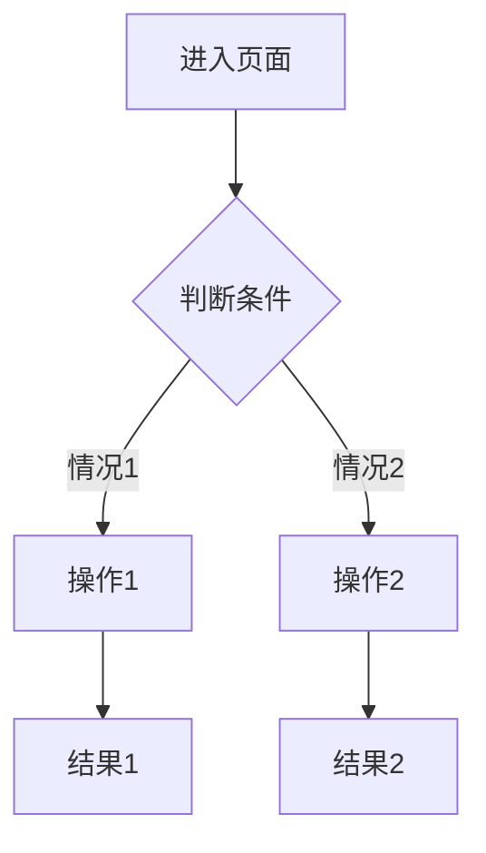

# [页面名称] 功能文档

**所属阶段**：阶段X - [阶段名称]
**关联角色**：[候选人 / HR / 面试官 / 经纪人 / 等]
**文件路径**：`miniprogram/pages/xxx/xxx/`
**页面路由**：`/pages/xxx/xxx/xxx`
**状态**：✅ 已完成 / 🚧 开发中 / ⏳ 计划中 / ❌ 已废弃

---

## 📋 功能概述

### 主要功能
[用1-2段话概括页面的核心功能和作用]

### 使用场景
1. **场景1**：[描述用户在什么情况下会使用这个页面]
2. **场景2**：[描述]
3. **场景3**：[描述]

### 页面价值
- **对用户的价值**：[描述]
- **对业务的价值**：[描述]

---

## 🎯 业务流程

### 流程图



### 详细流程说明

#### 1. 页面进入
**触发条件**：
- 条件1：[描述]
- 条件2：[描述]

**进入方式**：
- 方式1：[描述]
- 方式2：[描述]

**入口检查**：
- [x] 权限检查：[描述检查逻辑]
- [x] 状态检查：[描述检查逻辑]
- [x] 数据准备：[描述]

#### 2. 用户操作
**步骤1：[操作名称]**
- 操作方式：[点击/输入/选择/等]
- 操作对象：[按钮/表单/等]
- 验证规则：[描述]
- 错误提示：[描述]

**步骤2：[操作名称]**
[同样的结构...]

#### 3. 数据处理
**处理流程**：
1. [步骤1]
2. [步骤2]
3. [步骤3]

**数据验证**：
- 验证1：[描述]
- 验证2：[描述]

#### 4. 页面跳转/关闭
**成功时**：
- 跳转到：[目标页面]
- 携带参数：[参数列表]
- 提示信息：[描述]

**失败时**：
- 错误提示：[描述]
- 停留页面：[是/否]
- 错误处理：[描述]

---

## 🖼️ 页面结构

### 布局设计

**整体布局**：
```
┌─────────────────────┐
│     页面标题         │
├─────────────────────┤
│                     │
│    主要内容区域      │
│                     │
├─────────────────────┤
│   底部操作按钮      │
└─────────────────────┘
```

### 组件清单

| 组件名称 | 类型 | 用途 | 必填 |
|---------|------|------|------|
| [组件1] | [input/picker/etc] | [描述] | ✅ / ❌ |
| [组件2] | [type] | [描述] | ✅ / ❌ |
| [组件3] | [type] | [描述] | ✅ / ❌ |

---

## 📝 数据输入

### 表单字段

#### 字段1：[字段名称]
- **字段名**：`fieldName`
- **字段类型**：string / number / boolean / object / array
- **是否必填**：✅ 必填 / ❌ 选填
- **验证规则**：
  - 规则1：[描述]
  - 规则2：[描述]
- **错误提示**：[提示文案]
- **默认值**：[如有]
- **取值范围**：[如有限制]
- **示例值**：`"example"`

#### 字段2：[字段名称]
[同样的结构...]

### 数据验证

**前端验证**：
```javascript
// 验证逻辑示例
function validateForm(data) {
  if (!data.field1) {
    return { valid: false, message: '请填写字段1' };
  }
  // ...
  return { valid: true };
}
```

**后端验证**：
- 验证1：[描述]
- 验证2：[描述]

---

## 🎨 交互逻辑

### 页面加载
**onLoad 生命周期**：
1. [步骤1]
2. [步骤2]
3. [步骤3]

**初始化数据**：
```javascript
// 代码示例
data: {
  field1: '',
  field2: []
}
```

### 用户交互

#### 交互1：[交互名称]
**触发方式**：[点击/输入/选择/等]

**交互流程**：
1. [步骤1]
2. [步骤2]
3. [步骤3]

**交互反馈**：
- 视觉反馈：[描述]
- 文字提示：[描述]
- 状态变化：[描述]

#### 交互2：[交互名称]
[同样的结构...]

### 页面跳转

**跳转列表**：
| 触发条件 | 目标页面 | 跳转方式 | 携带参数 |
|---------|---------|---------|---------|
| [条件1] | `/pages/xxx` | navigateTo | `{id: xxx}` |
| [条件2] | `/pages/yyy` | redirectTo | `{status: xxx}` |

---

## 💾 数据处理

### Mock数据结构

**使用的Mock文件**：`miniprogram/mock/xxx.js`

**数据结构**：
```javascript
// Mock数据示例
{
  id: 'xxx',
  field1: 'value1',
  field2: {
    subField1: 'value2',
    subField2: [...]
  },
  field3: [...],
  status: 'pending',
  createdAt: '2025-11-05 14:30:00'
}
```

### 数据获取

**获取方法**：
```javascript
// 代码示例
import { getDataById } from '../../../mock/xxx.js';

// 在页面中使用
const data = getDataById(id);
```

### 数据更新

**更新方法**：
```javascript
// 代码示例
import { updateData } from '../../../mock/xxx.js';

// 更新数据
const result = updateData(id, {
  field1: newValue,
  field2: newValue
});
```

### 状态流转

**状态定义**：
```javascript
const STATUS = {
  PENDING: 'pending',      // 待处理
  PROCESSING: 'processing', // 处理中
  COMPLETED: 'completed',   // 已完成
  REJECTED: 'rejected'      // 已拒绝
};
```

**状态流转规则**：
```
pending → processing → completed
        ↘ rejected
```

**状态验证**：
```javascript
// 状态流转验证
function canTransitionTo(currentStatus, targetStatus) {
  // 验证逻辑
}
```

---

## 🔧 技术实现

### 使用的技术

**核心技术**：
- 微信小程序框架
- [其他技术栈]

**使用的API**：
- `wx.showToast()` - [用途]
- `wx.navigateTo()` - [用途]
- [其他API]

**使用的组件**：

#### 自定义组件
- 组件1：`components/xxx/xxx` - [用途]
- 组件2：`components/yyy/yyy` - [用途]

#### 第三方组件
- 组件1：[组件名] - [用途]

### 关键代码

#### WXML结构
```xml
<!-- 关键布局代码 -->
<view class="container">
  <view class="content">
    <!-- ... -->
  </view>
</view>
```

#### WXSS样式
```css
/* 关键样式代码 */
.container {
  /* ... */
}
```

#### JS逻辑
```javascript
// 关键逻辑代码
Page({
  data: {
    // 数据
  },

  onLoad() {
    // 初始化
  },

  handleSubmit() {
    // 提交处理
  }
});
```

### 性能优化

**优化点**：
1. [优化1]：[描述和效果]
2. [优化2]：[描述和效果]

**性能指标**：
- 页面加载时间：约 X ms
- 首屏渲染时间：约 X ms
- 交互响应时间：约 X ms

---

## ✅ 测试要点

### 功能测试

#### 测试用例1：[用例名称]
**测试目的**：[描述]

**前置条件**：
- 条件1：[描述]
- 条件2：[描述]

**测试步骤**：
1. [步骤1]
2. [步骤2]
3. [步骤3]

**预期结果**：
- [描述预期的结果]

**实际结果**：
- ✅ 通过 / ❌ 失败 / ⏳ 待测试

**测试截图**：
[如有截图]

#### 测试用例2：[用例名称]
[同样的结构...]

### 边界测试

- [ ] **空数据测试**：[测试内容和预期]
- [ ] **异常数据测试**：[测试内容和预期]
- [ ] **极限数据测试**：[测试内容和预期]
- [ ] **并发操作测试**：[测试内容和预期]

### 兼容性测试

- [ ] iOS测试 - [测试设备/系统版本]
- [ ] Android测试 - [测试设备/系统版本]
- [ ] 不同屏幕尺寸测试
  - [ ] 小屏（320px）
  - [ ] 中屏（375px）
  - [ ] 大屏（414px+）

### 性能测试

- [ ] 页面加载性能
- [ ] 交互流畅度
- [ ] 内存占用
- [ ] 网络请求优化

---

## 🔗 相关文档

### 业务文档
- [业务流程文档](../../business-flow.md#阶段X)
- [需求讨论记录](../discussions/2025-11/xxx.md)

### 开发文档
- [开发日志](../dev-logs/2025-11/xxx.md)
- [技术决策](../decisions/xxx.md)

### API文档
- [相关API文档](../../api/xxx.md)

### 参考资料
- [微信小程序官方文档](https://developers.weixin.qq.com/miniprogram/dev/)
- [其他参考]

---

## 🐛 已知问题

### 问题1：[问题描述]
- **问题现象**：[描述]
- **影响范围**：[描述]
- **临时方案**：[描述]
- **计划修复**：[是/否] - 预计时间：[日期]
- **跟踪链接**：[Issue链接]

### 问题2：[问题描述]
[同样的结构...]

---

## 🎯 待优化项

### 功能优化
- [ ] **优化项1**：[描述] - 优先级：高/中/低
- [ ] **优化项2**：[描述] - 优先级：高/中/低

### 体验优化
- [ ] **优化项1**：[描述]
- [ ] **优化项2**：[描述]

### 性能优化
- [ ] **优化项1**：[描述]
- [ ] **优化项2**：[描述]

---

## 📊 数据统计

### 使用数据
- 日均访问量：[数据]
- 平均停留时间：[数据]
- 转化率：[数据]

### 错误统计
- 错误率：[数据]
- 常见错误：[描述]

---

## 📝 变更记录

| 版本 | 日期 | 变更内容 | 变更人 |
|------|------|---------|--------|
| v1.0 | YYYY-MM-DD | 初始版本 | [开发者] |
| v1.1 | YYYY-MM-DD | [变更内容] | [开发者] |

---

**创建时间**：YYYY-MM-DD
**最后更新**：YYYY-MM-DD
**文档状态**：🚧 草稿 / ✅ 已发布 / 🔄 已更新
**文档维护**：[维护人]

---

## 💡 使用提示

### 开发者提示
- [提示1]
- [提示2]

### 测试者提示
- [提示1]
- [提示2]

### 用户使用提示
- [提示1]
- [提示2]
