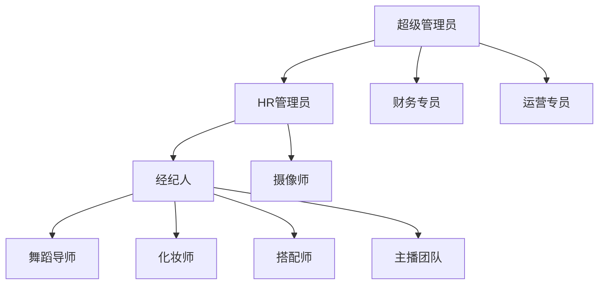
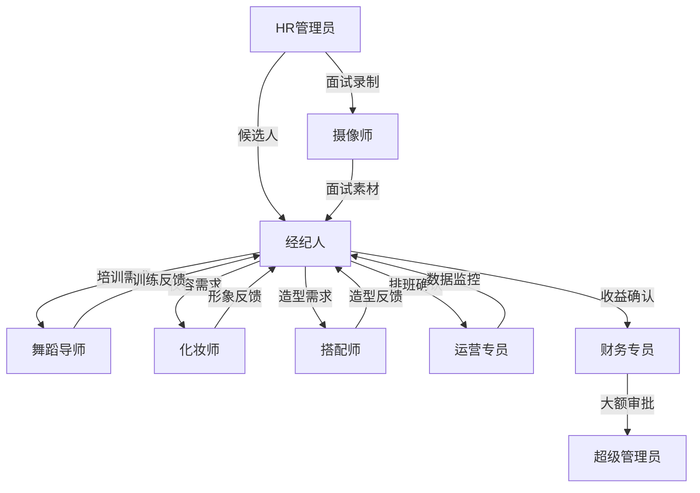

# 👥 角色职责矩阵

> 9大核心角色的详细职责和协作关系

**创建日期**: 2025-11-01
**最后更新**: 2025-11-02
**维护者**: 人力资源部
**状态**: 已发布

---

## 📑 目录

- [角色总览](#角色总览)
- [角色详细职责](#角色详细职责)
- [角色协同关系](#角色协同关系)
- [权限设计](#权限设计)
- [工作流程示例](#工作流程示例)

---

## 角色总览

### 9大核心角色



### 角色分类

| 角色类别 | 角色 | 核心职能 | 权限级别 |
|---------|------|---------|---------|
| **管理层** | 超级管理员 | 全局管理和配置 | ⭐⭐⭐⭐⭐ |
| **运营层** | HR管理员 | 招聘和入职管理 | ⭐⭐⭐⭐ |
| **运营层** | 经纪人 | 主播全生命周期管理 | ⭐⭐⭐⭐ |
| **运营层** | 运营专员 | 直播运营和数据监控 | ⭐⭐⭐ |
| **专业服务层** | 舞蹈导师 | 才艺培训和指导 | ⭐⭐ |
| **专业服务层** | 化妆师 | 妆容设计和指导 | ⭐⭐ |
| **专业服务层** | 搭配师 | 造型设计和指导 | ⭐⭐ |
| **专业服务层** | 摄像师 | 面试录制和素材管理 | ⭐⭐ |
| **财务层** | 财务专员 | 收益结算和财务管理 | ⭐⭐⭐⭐ |

---

## 角色详细职责

### 1. 超级管理员

#### 🎯 核心定位
系统的最高权限拥有者，负责全局配置、用户管理和重大决策审批。

#### 📋 主要职责

**系统管理**
- ✅ 用户角色创建和删除
- ✅ 权限分配和调整
- ✅ 系统参数配置
- ✅ 功能模块开关控制

**数据管理**
- ✅ 全局数据查看权限
- ✅ 数据导出审批
- ✅ 敏感数据访问控制
- ✅ 数据备份和恢复

**审批管理**
- ✅ 大额收益审批（≥5万元）
- ✅ 特殊合同条款审批
- ✅ 重大人事变动审批
- ✅ 系统配置变更审批

**监督管理**
- ✅ 监控系统运行状态
- ✅ 审查各部门工作报告
- ✅ 处理异常和投诉
- ✅ 制定和调整管理规则

#### 📊 在各阶段的参与度

| 阶段 | 参与度 | 主要工作 |
|------|-------|---------|
| 招募 | 低 | 监督招聘流程合规性 |
| 筛选 | 低 | 无直接参与 |
| 面试 | 低 | 特殊情况参与决策 |
| 签约 | 中 | 审批特殊合同条款 |
| 培训 | 低 | 监督培训质量 |
| 运营 | 中 | 审查运营报告 |
| 结算 | 高 | 大额收益审批 |

#### 🔑 关键权限
- 全局数据访问
- 用户角色管理
- 系统配置修改
- 审批流程配置
- 数据导出（无限制）

---

### 2. HR管理员

#### 🎯 核心定位
主播招聘的全流程负责人，从候选人筛选到签约入职的主导者。

#### 📋 主要职责

**招聘管理**
- ✅ 配置和优化报名表单
- ✅ 管理候选人池
- ✅ 审核候选人资料
- ✅ 发送面试邀约

**面试评估**
- ✅ 组织和主持面试
- ✅ 协调各导师参与评审
- ✅ 汇总评分结果
- ✅ 做出录用决策

**合同管理**
- ✅ 选择和配置合同模板
- ✅ 生成正式合同
- ✅ 管理合同签署流程
- ✅ 合同归档和管理

**入职管理**
- ✅ 办理入职手续
- ✅ 分配给对应经纪人
- ✅ 开通系统账号
- ✅ 新人引导培训

#### 📊 在各阶段的参与度

| 阶段 | 参与度 | 主要工作 |
|------|-------|---------|
| 招募 | ⭐⭐⭐⭐⭐ | 主导整个招募流程 |
| 筛选 | ⭐⭐⭐⭐⭐ | 主导候选人筛选 |
| 面试 | ⭐⭐⭐⭐⭐ | 主持面试和评审 |
| 签约 | ⭐⭐⭐⭐⭐ | 主导合同签署 |
| 培训 | ⭐⭐ | 协助培训安排 |
| 运营 | ⭐ | 偶尔参与问题处理 |
| 结算 | ⭐ | 查看招聘效果数据 |

#### 🔑 关键权限
- 候选人信息管理
- 面试流程管理
- 合同模板管理
- 录用决策权
- 入职账号开通

#### ⏱ 典型工作日安排

**上午（9:00-12:00）**
- 审核新提交的候选人资料
- 查看AI推荐列表
- 做出筛选决策

**下午（14:00-18:00）**
- 组织和参与面试
- 汇总评分结果
- 处理合同签署事宜

**晚上（19:00-20:00）**
- 查看今日招聘数据
- 回复候选人咨询
- 准备明日面试安排

---

### 3. 经纪人

#### 🎯 核心定位
主播的全生命周期管理者，是连接主播和公司各部门的核心枢纽。

#### 📋 主要职责

**团队管理**
- ✅ 管理名下10-15名主播
- ✅ 制定主播发展规划
- ✅ 设定和跟踪目标
- ✅ 处理日常问题和需求

**培训管理**
- ✅ 制定个性化培训计划
- ✅ 协调各导师资源
- ✅ 跟踪培训进度
- ✅ 考核评估决策

**运营管理**
- ✅ 确认每周排班
- ✅ 直播前内容指导
- ✅ 查看直播数据
- ✅ 主持周报复盘

**收益管理**
- ✅ 配置收益方案
- ✅ 确认月度收益
- ✅ 处理收益异议
- ✅ 解释收益构成

**问题协调**
- ✅ 主播心理疏导
- ✅ 团队冲突调解
- ✅ 跨部门资源协调
- ✅ 特殊情况处理

#### 📊 在各阶段的参与度

| 阶段 | 参与度 | 主要工作 |
|------|-------|---------|
| 招募 | ⭐⭐ | 提出招聘需求 |
| 筛选 | ⭐⭐⭐ | 参与审核（如团队空缺） |
| 面试 | ⭐⭐⭐⭐ | 商业价值评估 |
| 签约 | ⭐⭐⭐⭐ | 配置收益方案 |
| 培训 | ⭐⭐⭐⭐⭐ | 主导培训全流程 |
| 运营 | ⭐⭐⭐⭐⭐ | 主导运营全流程 |
| 结算 | ⭐⭐⭐⭐ | 确认收益数据 |

#### 🔑 关键权限
- 名下主播全部数据访问
- 培训计划制定和调整
- 排班确认
- 收益方案配置（需财务审核）
- 资源协调申请

#### ⏱ 典型工作日安排

**上午（10:00-12:00）**
- 查看昨日直播数据
- 处理主播反馈的问题
- 与导师沟通培训进展

**下午（14:00-18:00）**
- 参与新人面试
- 与运营确认本周排班
- 指导主播准备直播内容

**晚上（19:00-23:00）**
- 监控黄金档直播表现
- 实时指导和问题处理
- 分析数据并记录要点

**周五下午（15:00-18:00）**
- 主持周报复盘会议
- 制定下周行动计划

#### 💼 工作重点分配

```
40% - 日常运营和问题处理
30% - 数据分析和目标跟踪
20% - 培训指导和资源协调
10% - 招聘面试和团队建设
```

---

### 4. 运营专员

#### 🎯 核心定位
直播运营的执行者，负责排班执行、实时监控和数据分析。

#### 📋 主要职责

**排班管理**
- ✅ 使用智能排班系统生成排班建议
- ✅ 与经纪人确认排班
- ✅ 处理档期冲突
- ✅ 管理特殊档期和活动

**直播监控**
- ✅ 实时监控所有直播间数据
- ✅ 识别异常情况并预警
- ✅ 内容安全监控
- ✅ 及时干预和指导

**数据分析**
- ✅ 生成日报、周报数据
- ✅ 分析数据趋势
- ✅ 提供优化建议
- ✅ 竞品分析

**活动执行**
- ✅ 策划和执行直播活动
- ✅ 活动数据跟踪
- ✅ 活动效果评估

#### 📊 在各阶段的参与度

| 阶段 | 参与度 | 主要工作 |
|------|-------|---------|
| 招募 | ⭐ | 无直接参与 |
| 筛选 | ⭐ | 无直接参与 |
| 面试 | ⭐ | 无直接参与 |
| 签约 | ⭐ | 无直接参与 |
| 培训 | ⭐⭐ | 协助课程安排 |
| 运营 | ⭐⭐⭐⭐⭐ | 主导排班和监控 |
| 结算 | ⭐⭐ | 提供数据支持 |

#### 🔑 关键权限
- 所有直播间数据查看
- 排班系统操作
- 实时监控大屏
- 活动配置
- 预警干预权限

#### ⏱ 典型工作日安排

**上午（10:00-12:00）**
- 生成昨日直播日报
- 分析数据异常情况
- 生成本周排班建议

**下午（14:00-18:00）**
- 与经纪人确认排班
- 准备今晚直播监控
- 处理档期调整请求

**晚上（19:00-24:00）**
- 实时监控所有直播间
- 处理突发情况
- 记录重要数据和问题

#### 📊 监控大屏关注指标

**实时指标**（每5分钟刷新）
- 在线人数
- 互动率
- 实时收益
- 新增粉丝

**预警指标**
- 流量下降≥30%
- 互动率<3%
- 收益下降≥40%
- 内容违规检测

---

### 5. 舞蹈导师

#### 🎯 核心定位
主播才艺能力的培养者，负责舞蹈训练和表现力提升。

#### 📋 主要职责

**训练计划**
- ✅ 制定个性化训练计划
- ✅ 录制教学视频
- ✅ 设定阶段性目标
- ✅ 跟踪训练进度

**线下指导**
- ✅ 每周线下训练课（2-3次）
- ✅ 动作纠正和示范
- ✅ 表现力培养指导
- ✅ 即兴能力训练

**效果评估**
- ✅ 查看AI陪练数据
- ✅ 定期考核评估
- ✅ 提供改进建议
- ✅ 参与周报复盘

**才艺评审**
- ✅ 面试时才艺能力评分
- ✅ 培训期考核打分
- ✅ 直播表现力评估

#### 📊 在各阶段的参与度

| 阶段 | 参与度 | 主要工作 |
|------|-------|---------|
| 招募 | ⭐ | 无直接参与 |
| 筛选 | ⭐ | 无直接参与 |
| 面试 | ⭐⭐⭐⭐ | 才艺能力评分 |
| 签约 | ⭐ | 无直接参与 |
| 培训 | ⭐⭐⭐⭐⭐ | 主导舞蹈训练 |
| 运营 | ⭐⭐⭐ | 表现力评估反馈 |
| 结算 | ⭐ | 无直接参与 |

#### 🔑 关键权限
- 查看主播训练数据
- 上传教学视频
- 记录训练进度
- 参与考核评分

#### ⏱ 典型工作周安排

**周一上午**
- 查看上周AI陪练数据
- 制定本周训练重点

**周二、周四、周六下午（14:00-18:00）**
- 线下舞蹈训练课
- 动作纠正和指导

**周三、周五上午**
- 录制教学视频
- 准备训练素材

**周五晚上（19:00-21:00）**
- 参加周报复盘会议
- 提供才艺培养建议

#### 📈 培训效果评估指标

- 动作标准度：AI评分≥7分
- 节奏准确性：AI评分≥7分
- 表现力：主观评分≥70分
- 进步速度：每周进步≥5%

---

### 6. 化妆师

#### 🎯 核心定位
主播形象的塑造者，负责妆容设计和形象管理。

#### 📋 主要职责

**妆容设计**
- ✅ 建立主播妆容档案
- ✅ 设计多种风格妆容
- ✅ 教授化妆技巧
- ✅ 提供妆容建议

**日常服务**
- ✅ 直播前妆容检查
- ✅ 妆容调整和优化
- ✅ 镜头效果测试
- ✅ 解答化妆疑问

**效果分析**
- ✅ 拍摄妆前妆后对比
- ✅ 关联直播数据分析
- ✅ 收集观众反馈
- ✅ 优化妆容方案

**面试评审**
- ✅ 面试时形象气质评分
- ✅ 可塑性评估
- ✅ 妆容适配度分析

#### 📊 在各阶段的参与度

| 阶段 | 参与度 | 主要工作 |
|------|-------|---------|
| 招募 | ⭐ | 无直接参与 |
| 筛选 | ⭐ | 无直接参与 |
| 面试 | ⭐⭐⭐⭐ | 形象气质评分 |
| 签约 | ⭐ | 无直接参与 |
| 培训 | ⭐⭐⭐⭐⭐ | 妆容培训和档案建立 |
| 运营 | ⭐⭐⭐⭐⭐ | 每日妆容服务 |
| 结算 | ⭐ | 无直接参与 |

#### 🔑 关键权限
- 查看主播妆容档案
- 上传妆容对比照
- 记录妆容效果数据
- 参与面试评分

#### ⏱ 典型工作日安排

**上午（10:00-12:00）**
- 查看昨日妆容效果数据
- 准备今日妆容方案

**下午（14:00-18:00）**
- 为下午档主播化妆
- 妆容效果拍照记录

**晚上（17:00-20:00）**
- 为黄金档主播化妆
- 直播前最后检查

**周五下午**
- 参加周报复盘会议
- 分析本周妆容效果

#### 🎨 妆容风格库

- 爱豆妆：适合偶像风主播
- 少年感：适合清新活力主播
- 成熟风：适合御姐风主播
- 甜美系：适合甜美可爱主播
- 个性风：适合特色鲜明主播

---

### 7. 搭配师

#### 🎯 核心定位
主播造型的设计者，负责服装搭配和风格塑造。

#### 📋 主要职责

**造型设计**
- ✅ 建立服装搭配库
- ✅ 进行风格测试
- ✅ 设计多场景造型方案
- ✅ 教授搭配技巧

**日常服务**
- ✅ 直播前造型建议
- ✅ 根据内容主题搭配
- ✅ 配饰选择指导
- ✅ 解答搭配疑问

**效果追踪**
- ✅ 记录造型与直播数据
- ✅ 不同造型效果对比
- ✅ 优化搭配方案
- ✅ 追踪流行趋势

**面试评审**
- ✅ 面试时风格可塑性评估
- ✅ 体型优缺点分析
- ✅ 适合风格建议

#### 📊 在各阶段的参与度

| 阶段 | 参与度 | 主要工作 |
|------|-------|---------|
| 招募 | ⭐ | 无直接参与 |
| 筛选 | ⭐ | 无直接参与 |
| 面试 | ⭐⭐⭐⭐ | 可塑性评估 |
| 签约 | ⭐ | 无直接参与 |
| 培训 | ⭐⭐⭐⭐⭐ | 风格测试和搭配培训 |
| 运营 | ⭐⭐⭐⭐⭐ | 每日造型服务 |
| 结算 | ⭐ | 无直接参与 |

#### 🔑 关键权限
- 查看主播服装库
- 上传造型效果照
- 记录造型数据
- 参与面试评分

#### ⏱ 典型工作日安排

**上午（10:00-12:00）**
- 查看昨日造型效果数据
- 研究流行趋势
- 准备今日造型方案

**下午（14:00-18:00）**
- 为主播提供造型指导
- 拍摄造型效果照
- 记录搭配方案

**晚上（18:00-20:00）**
- 为黄金档主播搭配造型
- 直播前最后确认

**周五下午**
- 参加周报复盘会议
- 分析本周造型效果

#### 👗 造型场景分类

- 日常直播：舒适自然风
- 活动直播：华丽吸睛风
- 才艺展示：专业舞台风
- 互动聊天：亲和轻松风
- 品牌合作：商务精致风

---

### 8. 摄像师

#### 🎯 核心定位
面试录制的专业人员，负责拍摄面试视频、照片并上传管理素材。

#### 📋 主要职责

**面试录制**
- ✅ 接收面试录制任务
- ✅ 准备录制设备和场地
- ✅ 录制候选人面试全过程
- ✅ 拍摄妆前妆后对比照片

**素材上传**
- ✅ 整理面试录制素材
- ✅ 上传视频到云存储
- ✅ 上传照片到系统
- ✅ 关联候选人档案

**素材管理**
- ✅ 管理面试视频库
- ✅ 分类整理照片素材
- ✅ 删除过期素材
- ✅ 备份重要素材

**质量控制**
- ✅ 检查视频清晰度
- ✅ 确保照片质量
- ✅ 调整拍摄角度和光线
- ✅ 补录不合格素材

#### 📊 在各阶段的参与度

| 阶段 | 参与度 | 主要工作 |
|------|-------|---------|
| 招募 | ⭐ | 无直接参与 |
| 筛选 | ⭐ | 无直接参与 |
| 面试 | ⭐⭐⭐⭐⭐ | 主导面试录制 |
| 签约 | ⭐ | 无直接参与 |
| 培训 | ⭐⭐ | 偶尔录制培训视频 |
| 运营 | ⭐⭐ | 录制直播花絮 |
| 结算 | ⭐ | 无直接参与 |

#### 🔑 关键权限
- 查看待录制面试列表
- 上传视频和照片
- 管理素材库
- 下载面试素材

#### ⏱ 典型工作日安排

**上午（9:00-12:00）**
- 查看今日面试排期
- 准备录制设备
- 录制上午场次面试

**下午（14:00-17:00）**
- 录制下午场次面试
- 整理当日素材

**晚上（17:00-18:00）**
- 上传视频和照片
- 关联候选人档案
- 检查素材质量

**周期性工作**
- 每周清理临时素材
- 每月备份重要素材
- 季度设备检修

---

### 9. 财务专员

#### 🎯 核心定位
收益结算的管理者，负责财务数据准确性和资金安全。

#### 📋 主要职责

**数据对账**
- ✅ 核对平台流水数据
- ✅ 检查分账计算准确性
- ✅ 识别和处理异常数据
- ✅ 税务计算和处理

**审核管理**
- ✅ 审核收益结算报表
- ✅ 验证合同条款执行
- ✅ 评估成本合理性
- ✅ 与经纪人沟通异常

**支付管理**
- ✅ 发起转账操作
- ✅ 记录转账凭证
- ✅ 生成收益报表
- ✅ 处理支付异议

**报表生成**
- ✅ 生成月度财务报表
- ✅ 成本收益分析
- ✅ 主播收益排行
- ✅ 财务预警分析

#### 📊 在各阶段的参与度

| 阶段 | 参与度 | 主要工作 |
|------|-------|---------|
| 招募 | ⭐ | 无直接参与 |
| 筛选 | ⭐ | 无直接参与 |
| 面试 | ⭐ | 无直接参与 |
| 签约 | ⭐⭐⭐⭐ | 审核合同条款 |
| 培训 | ⭐ | 无直接参与 |
| 运营 | ⭐⭐ | 查看收益数据 |
| 结算 | ⭐⭐⭐⭐⭐ | 主导结算全流程 |

#### 🔑 关键权限
- 所有财务数据查看
- 收益审核和修正
- 转账操作执行
- 财务报表导出
- 异常数据处理

#### ⏱ 典型工作月安排

**每月1号**
- 触发月度结算流程
- 采集平台数据
- 生成初步结算报表

**每月2-3号**
- 核对数据准确性
- 处理异常数据
- 与经纪人沟通确认

**每月4号**
- 提交大额收益审批
- 等待超管审批

**每月5号**
- 执行转账操作
- 发送收益报表
- 处理支付异议

**平时日常**
- 监控实时收益数据
- 审核合同条款
- 准备财务分析报告

---

## 角色协同关系

### 核心协作模型



### 关键协作场景

#### 场景1：新人招聘

```
HR管理员（主导）
    ↓ 审核候选人并分配面试官
主播候选人
    ↓ 参加线上测试 + 线下面试
摄像师（录制面试视频和照片）
    ↓ 上传面试素材
舞蹈导师 + 经纪人（上传评价）
    ↓ 系统综合评级
HR管理员 + 经纪人（协同评审）
    ↓ 录用决策
HR管理员（执行签约）
    ↓ 分配给经纪人
经纪人（接收新人）
```

#### 场景2：培训阶段

```
经纪人（制定计划）
    ↓ 协调资源
舞蹈导师（舞蹈训练）
化妆师（妆容指导）
搭配师（造型指导）
    ↓ 定期反馈
经纪人（跟踪进度）
    ↓ 考核评估
经纪人 + 导师团队（共同决策）
```

#### 场景3：直播运营

```
运营专员（生成排班建议）
    ↓ 确认排班
经纪人（确认并指导内容）
    ↓ 直播前准备
化妆师 + 搭配师（形象服务）
    ↓ 开始直播
运营专员（实时监控）
    ↓ 问题反馈
经纪人（协调处理）
    ↓ 直播结束
经纪人 + 运营 + 导师（周报复盘）
```

#### 场景4：月度结算

```
系统自动采集数据
    ↓ 生成结算报表
财务专员（审核数据）
    ↓ 发现异常
经纪人（核实说明）
    ↓ 确认无误
财务专员（标记通过）
    ↓ 大额收益
超级管理员（审批）
    ↓ 批准发放
财务专员（执行转账）
```

### 冲突解决机制

#### 排班冲突
- **冲突方**：运营专员 vs 经纪人
- **解决人**：经纪人优先权
- **升级路径**：超级管理员裁决

#### 培训目标冲突
- **冲突方**：经纪人 vs 导师
- **解决方式**：数据驱动决策
- **升级路径**：超级管理员裁决

#### 收益异议
- **冲突方**：主播/经纪人 vs 财务
- **解决方式**：查证数据和合同
- **升级路径**：超级管理员裁决

---

## 权限设计

### 权限分级

#### 🔴 一级权限（仅超级管理员）
- 用户角色管理
- 系统配置修改
- 全局数据导出
- 审批流程配置

#### 🟠 二级权限（管理层）
- **HR管理员**：招聘全流程、合同管理
- **财务专员**：财务数据、结算管理
- **经纪人**：名下主播全数据

#### 🟡 三级权限（运营层）
- **运营专员**：直播数据、排班系统

#### 🟢 四级权限（专业服务层）
- **舞蹈导师**：训练数据、教学视频
- **化妆师**：妆容档案、形象数据
- **搭配师**：造型库、搭配方案
- **摄像师**：面试素材、视频库

### 数据访问权限矩阵

| 数据类型 | 超管 | HR | 经纪人 | 运营 | 导师 | 财务 | 摄像师 |
|---------|------|-----|--------|------|------|------|--------|
| 候选人信息 | ✅ | ✅ | ⭕ | ❌ | ⭕ | ❌ | ⭕ |
| 面试评分 | ✅ | ✅ | ✅ | ❌ | ⭕ | ❌ | ❌ |
| 面试素材 | ✅ | ✅ | ✅ | ❌ | ⭕ | ❌ | ✅ |
| 合同信息 | ✅ | ✅ | ⭕ | ❌ | ❌ | ✅ | ❌ |
| 培训记录 | ✅ | ⭕ | ✅ | ❌ | ✅ | ❌ | ❌ |
| 直播数据 | ✅ | ❌ | ✅ | ✅ | ⭕ | ⭕ | ❌ |
| 收益数据 | ✅ | ❌ | ⭕ | ❌ | ❌ | ✅ | ❌ |

**图例**：
- ✅ 完全访问
- ⭕ 受限访问（仅相关数据）
- ❌ 无访问权限

### 操作权限矩阵

| 操作类型 | 超管 | HR | 经纪人 | 运营 | 导师 | 财务 | 摄像师 |
|---------|------|-----|--------|------|------|------|--------|
| 创建用户 | ✅ | ❌ | ❌ | ❌ | ❌ | ❌ | ❌ |
| 录用决策 | ✅ | ✅ | ⭕ | ❌ | ❌ | ❌ | ❌ |
| 签署合同 | ✅ | ✅ | ❌ | ❌ | ❌ | ❌ | ❌ |
| 配置收益 | ✅ | ❌ | ✅ | ❌ | ❌ | ⭕ | ❌ |
| 排班管理 | ✅ | ❌ | ⭕ | ✅ | ❌ | ❌ | ❌ |
| 上传面试素材 | ✅ | ❌ | ❌ | ❌ | ❌ | ❌ | ✅ |
| 数据导出 | ✅ | ⭕ | ⭕ | ⭕ | ❌ | ✅ | ❌ |
| 收益审核 | ✅ | ❌ | ⭕ | ❌ | ❌ | ✅ | ❌ |

---

## 工作流程示例

### 示例1：新人从报名到开播全流程

**涉及角色**：HR管理员、经纪人、导师团队、摄像师

**第1-3天：招聘筛选**
```
主播报名（微信登录+填表）
    ↓
系统创建候选人账号（role=candidate）
    ↓
HR管理员审核（1-2天）
    ↓ 通过
分配面试官（舞蹈导师、经纪人、化妆师、造型师）
```

**第4-6天：面试评估**
```
主播来公司参加线上测试（性格测试）
    ↓
线下面试开始
    ↓
摄像师录制面试视频+妆前妆后照片
舞蹈导师上传舞蹈评价
经纪人上传面试评价
    ↓
系统评级（舞蹈+妆容AI）
    ↓ 通过
HR与经纪人确认录用
```

**第7-9天：签约入职**
```
经纪人线下签约
    ↓
经纪人上传合同（1天）
    ↓
系统角色升级（candidate → streamer）
    ↓
经纪人配置收益方案（1天）
    ↓
财务审核（1天）
    ↓
系统归档，正式入职
```

**第10-38天：培训阶段**
```
经纪人制定培训计划
    ↓
主播完成线上课程（2周）
    ↓
舞蹈导师线下训练（每周3次，持续4周）
化妆师妆容指导（每周2次）
搭配师造型指导（每周2次）
    ↓
AI陪练持续训练
    ↓
月底考核评估
    ↓ 通过
批准开播
```

**第39天起：正式开播**
```
运营生成排班建议
    ↓
经纪人确认排班
    ↓
化妆师+搭配师直播前服务
    ↓
主播开播
    ↓
运营实时监控
    ↓
周五复盘会议
```

### 示例2：周报复盘会议

**时间**：每周五 15:00-16:00
**地点**：会议室
**参与角色**：经纪人（主持）、运营专员、舞蹈导师、化妆师、搭配师
**议程**：

**15:00-15:15 数据回顾**
- 经纪人展示本周数据（系统自动生成）
  - 直播场次和时长
  - 收益数据
  - 流量数据
  - 涨粉数据

**15:15-15:35 问题分析**
- 运营专员：数据趋势解读，发现的问题
- 舞蹈导师：表现力评估，训练建议
- 化妆师：妆容效果分析，优化方案
- 搭配师：造型效果分析，改进建议
- 集体讨论：问题根本原因分析

**15:35-15:45 亮点总结**
- 各角色分享本周亮点
- 可复制的成功经验

**15:45-16:00 下周计划**
- 经纪人制定下周目标
- 各角色明确行动计划
- 分配任务责任人
- 确定下周排班

---

## 附录

### 角色配置建议

#### 人员比例配置（以100名主播为例）

| 角色 | 建议人数 | 人均负责主播数 |
|------|---------|---------------|
| 超级管理员 | 1-2人 | - |
| HR管理员 | 2-3人 | - |
| 经纪人 | 7-10人 | 10-15名主播 |
| 运营专员 | 3-4人 | 25-30名主播监控 |
| 舞蹈导师 | 2-3人 | 30-50名主播 |
| 化妆师 | 2-3人 | 30-50名主播 |
| 搭配师 | 2-3人 | 30-50名主播 |
| 财务专员 | 2-3人 | - |

#### 团队成长建议

**初创期（0-30名主播）**
- 经纪人：2-3人
- 运营：1人
- 导师：各1人
- 其他：必要角色

**成长期（30-100名主播）**
- 经纪人：7-10人
- 运营：3-4人
- 导师：各2-3人
- 其他：配齐所有角色

**成熟期（100名+主播）**
- 按比例扩充团队
- 考虑设置团队长/主管

### 招聘要求建议

#### 经纪人招聘要求
- ✅ 3年以上直播行业经验
- ✅ 熟悉主播培养流程
- ✅ 优秀的沟通和协调能力
- ✅ 数据敏感度强
- ✅ 责任心强，能承受压力

#### 运营专员招聘要求
- ✅ 2年以上运营经验
- ✅ 熟悉直播平台规则
- ✅ 数据分析能力强
- ✅ 快速反应能力
- ✅ 能接受晚班工作

#### 导师招聘要求
- ✅ 相关专业背景
- ✅ 3年以上教学经验
- ✅ 了解直播行业需求
- ✅ 耐心细致
- ✅ 愿意持续学习

### 相关文档

- [requirements.md](./requirements.md) - 完整需求文档
- [business-flow.md](./business-flow.md) - 业务流程详解
- [data-flow.md](./data-flow.md) - 数据流转设计

---

**文档版本**: v1.1
**最后更新**: 2025-11-02
**维护者**: 人力资源部
**审核状态**: 已审核

**v1.1 更新内容**:
- 新增摄像师（第9个核心角色）
- 更新招聘流程（线上测试+线下面试+系统评级）
- 更新角色协作关系图和权限矩阵
