# 业务流程总览

> Aomi Star 直播主播管理系统完整业务流程文档

**创建日期**: 2026-03-10  
**最后更新**: 2026-03-13
**维护者**: 开发团队
**版本**: v3.0

---

## 📑 目录

- [系统简介](#系统简介)
- [流程总览](#流程总览)
- [核心业务流程](#核心业务流程)
  - [1. 候选人报名与审核流程](#1-候选人报名与审核流程)
  - [2. 星探推荐流程](#2-星探推荐流程)
  - [3. 经纪人面试评分流程](#3-经纪人面试评分流程)
  - [4. 用户申请审核流程](#4-用户申请审核流程)
  - [5. 候选人批量分配流程](#5-候选人批量分配流程)
  - [6. 星探层级管理流程](#6-星探层级管理流程)
  - [7. 星探删除流程](#7-星探删除流程)
  - [8. 试镜视频上传流程](#8-试镜视频上传流程)
- [角色权限矩阵](#角色权限矩阵)
- [数据流转图](#数据流转图)
- [变更历史](#变更历史)

---

## 系统简介

**Aomi Star** 是一个基于微信小程序的多角色直播主播管理系统，通过智能路由和权限控制，实现以下核心功能：

### 核心特性

- 🎯 **多角色工作台** - 候选人、主播、HR、经纪人、运营、星探等多种角色
- 🔐 **微信免登录** - 基于微信授权的无缝登录体验
- 🔗 **智能推荐** - 星探推荐码机制，审核准入制，自动绑定推荐关系
- 📊 **数据脱敏** - 多层权限控制，保护敏感信息
- 📱 **移动优先** - 专为移动端设计的操作体验

### 用户类型

1. **主播候选人** - 应聘者，通过报名成为签约主播
2. **签约主播** - 已签约主播，使用工作台管理日常
3. **内部员工** - HR、经纪人、运营、培训师等
4. **外部星探** - 推荐候选人，获取佣金

---

## 流程总览

### 业务流程关系图

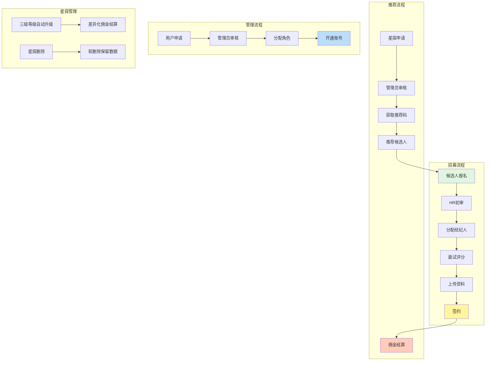
```mermaid
graph TB
    subgraph 招募流程
        A[候选人报名] --> B[HR初审]
        B --> C[分配经纪人]
        C --> D[面试评分]
        D --> E[上传资料]
        E --> F[签约]
    end
    
    subgraph 推荐流程
        G[星探申请] --> G1[管理员审核]
        G1 --> H[获取推荐码]
        H --> I[推荐候选人]
        I --> A
        F --> J[佣金结算]
    end

    subgraph 管理流程
        K[用户申请] --> L[管理员审核]
        L --> M[分配角色]
        M --> N[开通账号]
    end

    subgraph 星探管理
        O[三级等级自动升级] --> P[差异化佣金结算]
        Q[星探删除] --> R[软删除保留数据]
    end
    
    style A fill:#e1f5e1
    style F fill:#fff59d
    style J fill:#ffccbc
    style N fill:#bbdefb
```

### 流程汇总表

| 编号 | 流程名称 | 主要角色 | 状态 | 优先级 | 最近更新 |
|------|---------|---------|------|--------|---------|
| 1 | 候选人报名与审核 | 候选人/HR/经纪人 | ✅ 运行中 | 🔴 高 | 初始版本 |
| 2 | 星探推荐 | 星探/候选人 | 🔄 改造中 | 🔴 高 | 2026-03-13 |
| 3 | 经纪人面试评分 | 经纪人 | ✅ 增强 | 🔴 高 | 2026-03-10 |
| 4 | 用户申请审核 | 管理员/新用户 | ✅ 新增 | 🟡 中 | 2026-03-10 |
| 5 | 候选人批量分配 | HR/管理员 | ✅ 新增 | 🟡 中 | 2026-03-10 |
| 6 | 星探等级管理 | 管理员 | 🔄 改造中 | 🟡 中 | 2026-03-13 |
| 7 | 星探删除 | 管理员 | ✅ 运行中 | 🟢 低 | 2026-03-13 |
| 8 | 试镜视频上传 | 经纪人 | ✅ 新增 | 🟡 中 | 2026-03-10 |

---

## 核心业务流程

## 1. 候选人报名与审核流程

### 流程简介

候选人通过小程序报名成为主播，经过HR初审、面试评分、资料审核等环节，最终签约成为主播。

### 流程图

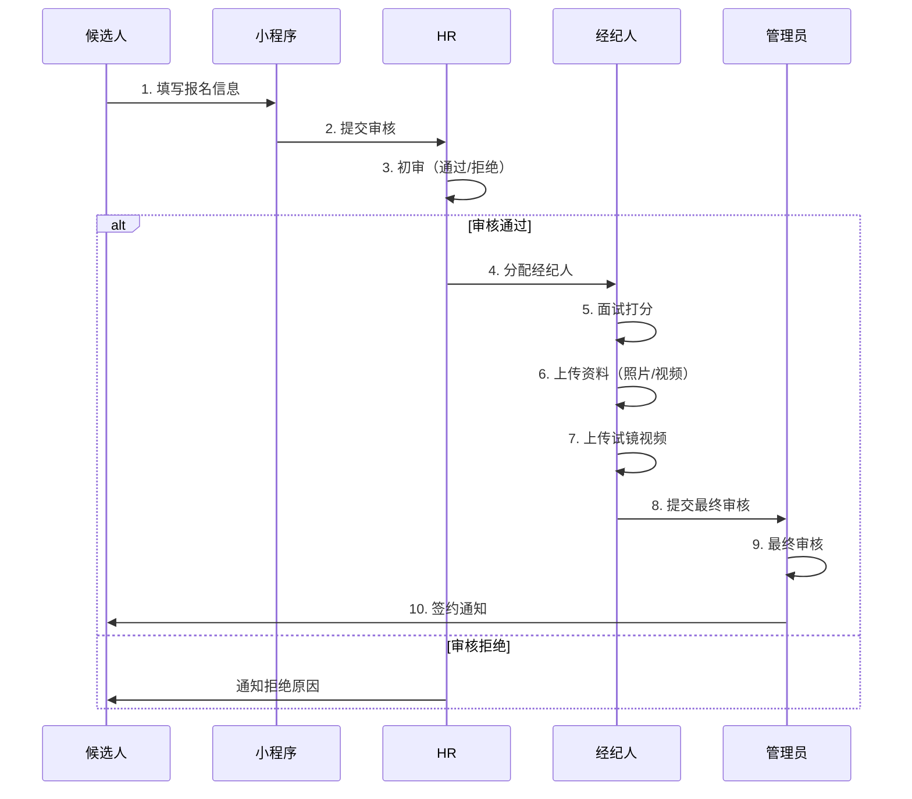
```mermaid
sequenceDiagram
    participant C as 候选人
    participant MP as 小程序
    participant HR as HR
    participant AG as 经纪人
    participant AD as 管理员
    
    C->>MP: 1. 填写报名信息
    MP->>HR: 2. 提交审核
    
    HR->>HR: 3. 初审（通过/拒绝）
    
    alt 审核通过
        HR->>AG: 4. 分配经纪人
        AG->>AG: 5. 面试打分
        AG->>AG: 6. 上传资料（照片/视频）
        AG->>AG: 7. 上传试镜视频
        AG->>AD: 8. 提交最终审核
        
        AD->>AD: 9. 最终审核
        AD->>C: 10. 签约通知
    else 审核拒绝
        HR->>C: 通知拒绝原因
    end
```

### 详细步骤

#### 阶段1：候选人报名

**操作人**: 候选人  
**入口**: 微信小程序 - 主播报名页

**填写信息**:
- **基本信息**: 姓名、性别、年龄、身高、体重、艺名
- **联系方式**: 手机号、微信号
- **所在地**: 省、市、详细地址
- **才艺信息**: 擅长才艺（唱歌/跳舞/乐器等）、才艺描述
- **直播经验**: 是否有直播经验、平台、粉丝数、直播名
- **社交账号**: 抖音/小红书/B站账号和粉丝数
- **个人照片**: 正面照、侧面照、全身照
- **爱好特长**: 个人爱好标签

**数据验证**:
- 必填字段验证
- 手机号格式验证
- 照片数量验证（至少3张）

**提交后状态**: `pending` (待审核)

---

#### 阶段2：HR初审

**操作人**: HR  
**入口**: 管理后台 - 候选人管理

**审核内容**:
- ✅ 基本信息完整性
- ✅ 照片质量
- ✅ 才艺描述合理性
- ✅ 是否符合招募标准

**操作选项**:
1. **通过** → 状态变为 `approved`，进入下一阶段
2. **拒绝** → 状态变为 `rejected`，填写拒绝原因
3. **批量通过** → 勾选多个候选人，一键批量通过

**数据脱敏**:
- HR可以看到所有信息（包括联系方式）

---

#### 阶段3：分配经纪人

**操作人**: HR / 管理员  
**入口**: 管理后台 - 候选人管理

**分配方式**:
1. **单个分配**: 在候选人详情页选择经纪人
2. **批量分配**: 勾选多个候选人，统一分配给某个经纪人

**系统行为**:
- 更新候选人的 `assignedAgent` 字段
- 更新经纪人的 `assignedCandidates` 列表
- 如果候选人已分配给其他经纪人，显示重新分配提示
- 记录操作日志

---

#### 阶段4：面试评分

**操作人**: 经纪人  
**入口**: 小程序 - 经纪人工作台 - 候选人详情

**可见信息**（已脱敏）:
- ✅ 基本信息（姓名、年龄、身高、体重、艺名）
- ✅ 才艺信息
- ✅ 直播经验
- ✅ 个人照片
- ❌ 手机号、微信号（已隐藏）
- ❌ 社交账号（已隐藏）
- ❌ 推荐人信息（已隐藏）

**评分维度**:

**1. 评分结果**（单选）:
- S级通过 - 优秀，强烈推荐
- A级通过 - 良好，推荐
- B级通过 - 合格，可以考虑
- 不通过 - 不符合要求
- 待定 - 需要进一步考察

**2. 评价标签**（多选，5个维度）:

| 维度 | 可选标签 |
|------|---------|
| 外形 | 高挑、精致、有气质、清新、性感 |
| 才艺 | 唱歌好、舞蹈好、乐器、表演力强 |
| 性格 | 外向、自信、亲和力、幽默、稳重 |
| 表达 | 口齿清晰、逻辑清晰、应变能力强 |
| 潜力 | 可塑性强、学习能力强、镜头感好 |

**3. 备注**: 自由文本，记录面试观察和建议

**数据结构**:
```json
{
  "interview": {
    "score": {
      "result": "pass_s",
      "tags": {
        "appearance": ["高挑", "精致"],
        "talent": ["唱歌好"],
        "personality": ["外向", "自信"],
        "communication": ["口齿清晰"],
        "potential": ["可塑性强"]
      },
      "comment": "备注内容",
      "scoredBy": "agent_id",
      "scoredByName": "张经纪",
      "scoredAt": "2026-03-10 14:30"
    }
  }
}
```

---

#### 阶段5：上传资料

**操作人**: 经纪人  
**入口**: 小程序 - 候选人详情 - 上传资料

**上传内容**:

**1. 面试照片**:
- 数量: 最多9张
- 来源: 拍照或相册选择
- 存储: 微信云存储
- 路径: `interview/{candidateId}/photo_*.jpg`

**2. 面试视频**:
- 数量: 最多5个
- 大小: 每个不超过100MB
- 来源: 录制或相册选择
- 存储: 微信云存储
- 路径: `interview/{candidateId}/video_*.mp4`

**3. 试镜视频** ⭐ 新增:
- 数量: 最多3个
- 大小: 每个不超过100MB
- 时长: 建议30秒-2分钟
- 内容: 才艺展示、自我介绍
- 存储: 微信云存储
- 路径: `audition-videos/{candidateId}/*.mp4`

**上传流程**:
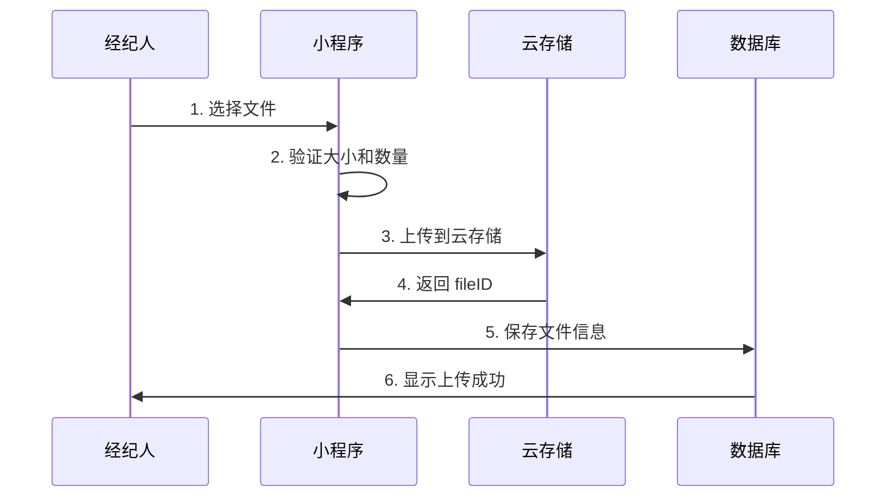
```mermaid
sequenceDiagram
    participant AG as 经纪人
    participant MP as 小程序
    participant CS as 云存储
    participant DB as 数据库
    
    AG->>MP: 1. 选择文件
    MP->>MP: 2. 验证大小和数量
    MP->>CS: 3. 上传到云存储
    CS->>MP: 4. 返回 fileID
    MP->>DB: 5. 保存文件信息
    DB->>AG: 6. 显示上传成功
```

---

#### 阶段6：最终审核

**操作人**: 管理员  
**入口**: 管理后台 - 候选人管理

**审核内容**:
- 评分结果
- 评价标签
- 面试照片/视频
- 试镜视频
- 综合评估

**操作选项**:
1. **签约** → 状态变为 `signed`
2. **拒绝** → 状态变为 `rejected`
3. **待定** → 保持当前状态

---

### 状态流转

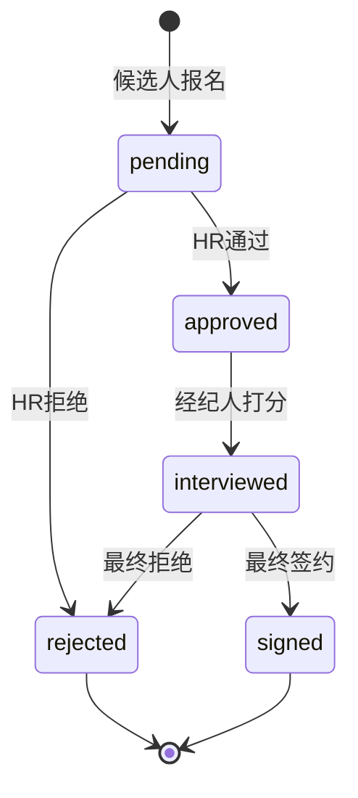
```mermaid
stateDiagram-v2
    [*] --> pending: 候选人报名
    pending --> approved: HR通过
    pending --> rejected: HR拒绝
    approved --> interviewed: 经纪人打分
    interviewed --> signed: 最终签约
    interviewed --> rejected: 最终拒绝
    rejected --> [*]
    signed --> [*]
```

### 关键数据表

**candidates 集合**:
```javascript
{
  _id: "candidate_id",
  basicInfo: { /* 基本信息 */ },
  talent: { /* 才艺信息 */ },
  experience: { /* 直播经验 */ },
  referral: { /* 推荐信息 */ },
  assignedAgent: {
    agentId: "agent_id",
    agentName: "张经纪",
    assignedAt: "2026-03-10 10:00",
    assignedBy: "admin_id"
  },
  interview: {
    score: { /* 评分信息 */ },
    materials: {
      photos: [],
      videos: []
    }
  },
  auditionVideos: [], // 试镜视频
  status: "pending", // pending/approved/rejected/interviewed/signed
  createdAt: "2026-03-10 09:00",
  updatedAt: "2026-03-10 14:30"
}
```

---

## 2. 星探推荐流程

### 流程简介

外部星探通过审核制注册，获取推荐码后推荐候选人。候选人成功签约后，星探根据等级和主播级别获得差异化佣金。

### 星探等级体系

#### 三级结构（直营模式）


```mermaid
graph LR
    A[新锐星探<br/>Rookie Scout] -->|签约≥5人| B[特约星探<br/>Special Scout]
    B -->|签约≥20人| C[合伙人星探<br/>Partner Scout]

    style A fill:#4CAF50,color:#fff
    style B fill:#2196f3,color:#fff
    style C fill:#ff9800,color:#fff
```

#### 等级特性对比

| 特性 | 新锐星探 | 特约星探 | 合伙人星探 |
|------|---------|---------|----------|
| **英文名称** | Rookie Scout | Special Scout | Partner Scout |
| **等级代码** | `rookie` | `special` | `partner` |
| **推荐码** | ✅ 有 | ✅ 有 | ✅ 有 |
| **推荐候选人** | ✅ 可以 | ✅ 可以 | ✅ 可以 |
| **签约奖金** | ¥200-500 | ¥300-800 | ¥500-1,200 |
| **月度佣金比例** | 2%-3% | 3%-5% | 3%-8% |
| **佣金周期** | 培养期+成长期 | 培养期+成长期+稳定期 | 全生命周期 |
| **注册方式** | 申请 + 审核 | 自动升级 | 自动升级 |
| **升级条件** | 审核通过即为新锐 | 签约≥5人 | 签约≥20人 |

---

### 流程图

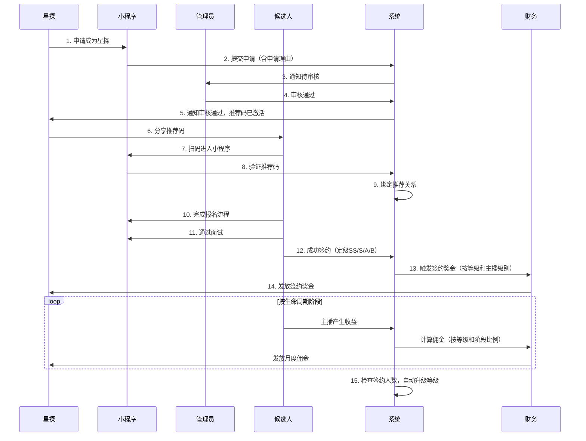
```mermaid
sequenceDiagram
    participant S as 星探
    participant MP as 小程序
    participant AD as 管理员
    participant C as 候选人
    participant SYS as 系统
    participant FIN as 财务

    S->>MP: 1. 申请成为星探
    MP->>SYS: 2. 提交申请（含申请理由）
    SYS->>AD: 3. 通知待审核

    AD->>SYS: 4. 审核通过
    SYS->>S: 5. 通知审核通过，推荐码已激活

    S->>C: 6. 分享推荐码
    C->>MP: 7. 扫码进入小程序
    MP->>SYS: 8. 验证推荐码
    SYS->>SYS: 9. 绑定推荐关系

    C->>MP: 10. 完成报名流程
    C->>MP: 11. 通过面试
    C->>SYS: 12. 成功签约（定级SS/S/A/B）

    SYS->>FIN: 13. 触发签约奖金（按等级和主播级别）
    FIN->>S: 14. 发放签约奖金

    loop 按生命周期阶段
        C->>SYS: 主播产生收益
        SYS->>FIN: 计算佣金（按等级和阶段比例）
        FIN->>S: 发放月度佣金
    end

    SYS->>SYS: 15. 检查签约人数，自动升级等级
```

---

### 详细步骤

#### 阶段1：星探申请与审核

**申请流程**:
1. 在小程序选择"成为星探"
2. 填写申请信息：
   - 个人信息（姓名、手机号、身份证）
   - 申请理由（必填，10-500字）
   - 推荐资源描述（选填）
3. 提交申请，等待管理员审核
4. 审核通过后，系统自动生成唯一推荐码
5. 初始等级为**新锐星探**

**审核流程**:
- 管理员在后台查看待审核的星探申请
- 审核标准：身份真实性、申请理由、推荐资源
- 通过：星探状态激活，推荐码生效
- 拒绝：填写拒绝原因，通知申请人

**推荐码规则**:
```javascript
// 格式: SC-{类型}-{日期}-{随机码}
SC-EXT-20260313-A3B9

// 类型:
// INT - 内部专职星探
// EXT - 外部合作星探

// 随机码: 4位大写字母+数字
```

**唯一性保证**:
- 生成时检查数据库，确保不重复
- 最多重试20次
- 失败则提示用户稍后重试

---

#### 阶段2：推荐候选人

**分享方式**:
1. **生成小程序码** - 带推荐码参数的二维码
2. **分享链接** - 包含推荐码的小程序链接
3. **直接输入** - 候选人手动输入推荐码

**候选人进入流程**:
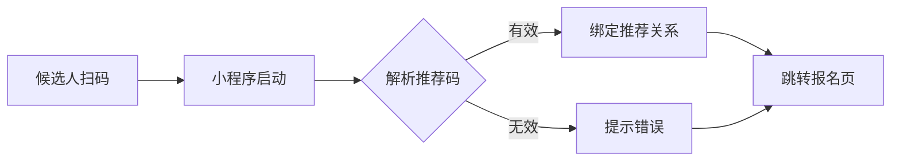
```mermaid
graph LR
    A[候选人扫码] --> B[小程序启动]
    B --> C{解析推荐码}
    C -->|有效| D[绑定推荐关系]
    C -->|无效| E[提示错误]
    D --> F[跳转报名页]
    E --> F
```

**推荐关系绑定**:
```javascript
// 候选人数据中记录推荐信息
{
  referral: {
    scoutId: "scout_id",
    scoutName: "张星探",
    scoutShareCode: "SC-EXT-20260313-A3B9",
    scoutGrade: "special", // rookie/special/partner
    referredAt: "2026-03-13 10:00"
  }
}

// 星探数据中记录推荐记录
{
  referrals: [
    {
      candidateId: "candidate_id",
      candidateName: "李候选",
      referredAt: "2026-03-13 10:00",
      status: "pending", // pending/signed/rejected
      anchorLevel: null,  // 签约后填入: ss/s/a/b
      commission: 0
    }
  ]
}
```

---

#### 阶段3：佣金结算

**结算时机**:
1. **签约奖金** - 候选人签约成功后，次月15日结算
2. **月度佣金** - 每月1日计算上月佣金，15日发放

**签约奖金标准**（按星探等级 × 主播级别）:

| 星探等级 | SS级主播 | S级主播 | A级主播 | B级主播 |
|---------|---------|---------|---------|---------|
| 新锐星探 | ¥500 | ¥400 | ¥300 | ¥200 |
| 特约星探 | ¥800 | ¥600 | ¥500 | ¥300 |
| 合伙人星探 | ¥1,200 | ¥1,000 | ¥800 | ¥500 |

**月度佣金比例**（按星探等级 × 主播生命周期阶段）:

| 星探等级 | 培养期(1-2月) | 成长期(3-4月) | 稳定期(5-6月) | 成熟期(7月+) |
|---------|-------------|-------------|-------------|-------------|
| 新锐星探 | 3% | 2% | - | - |
| 特约星探 | 5% | 4% | 3% | - |
| 合伙人星探 | 8% | 6% | 5% | 3% |

**计算示例**:
```
候选人：李四（A级主播）
推荐星探：张星探（特约星探）

签约时间：2026-03-13
签约奖金：¥500（次月15日发放）

第1个月 - 培养期（2026-04）：
  主播收益：¥8,000
  星探佣金：¥8,000 × 5% = ¥400

第2个月 - 培养期（2026-05）：
  主播收益：¥12,000
  星探佣金：¥12,000 × 5% = ¥600

第3个月 - 成长期（2026-06）：
  主播收益：¥15,000
  星探佣金：¥15,000 × 4% = ¥600

第4个月 - 成长期（2026-07）：
  主播收益：¥18,000
  星探佣金：¥18,000 × 4% = ¥720

第5个月 - 稳定期（2026-08）：
  主播收益：¥20,000
  星探佣金：¥20,000 × 3% = ¥600

第6个月 - 稳定期（2026-09）：
  主播收益：¥22,000
  星探佣金：¥22,000 × 3% = ¥660

第7个月起：特约星探不再获得佣金

总计：¥500 + ¥400 + ¥600 + ¥600 + ¥720 + ¥600 + ¥660 = ¥4,080
```

**数据记录**:
```javascript
{
  commissions: [
    {
      type: "signing_bonus",
      candidateId: "candidate_id",
      candidateName: "李四",
      anchorLevel: "a",
      scoutGrade: "special",
      amount: 500,
      paidAt: "2026-04-15",
      status: "paid"
    },
    {
      type: "monthly",
      candidateId: "candidate_id",
      candidateName: "李四",
      month: "2026-04",
      lifecycleStage: "nurturing",
      anchorRevenue: 8000,
      rate: 0.05,
      amount: 400,
      paidAt: "2026-05-15",
      status: "paid"
    }
  ]
}
```

---

### 星探管理功能

#### 6.1 等级自动升级 🔄 改造

**三级等级自动升级机制**:


```mermaid
graph LR
    A[新锐星探<br/>审核通过] -->|签约≥5人| B[特约星探<br/>自动升级]
    B -->|签约≥20人| C[合伙人星探<br/>自动升级]

    style A fill:#4CAF50,color:#fff
    style B fill:#2196f3,color:#fff
    style C fill:#ff9800,color:#fff
```

**升级触发时机**:
- 每次候选人签约成功后，系统自动检查推荐星探的签约人数
- 达到升级条件时自动升级，无需管理员手动操作
- 升级后发送通知给星探

**升级规则**:
- 新锐 → 特约：累计签约人数 ≥ 5
- 特约 → 合伙人：累计签约人数 ≥ 20
- 等级只升不降（除非管理员手动调整）

**管理员手动调整**:
- 特殊情况下管理员可以手动调整星探等级
- 需要填写调整理由
- 记录操作日志

---

#### 6.2 星探删除

**软删除机制**:
- 不真正删除数据，只标记 `status: 'deleted'`
- 保留所有历史推荐记录和佣金记录
- 可以恢复

**删除流程**:
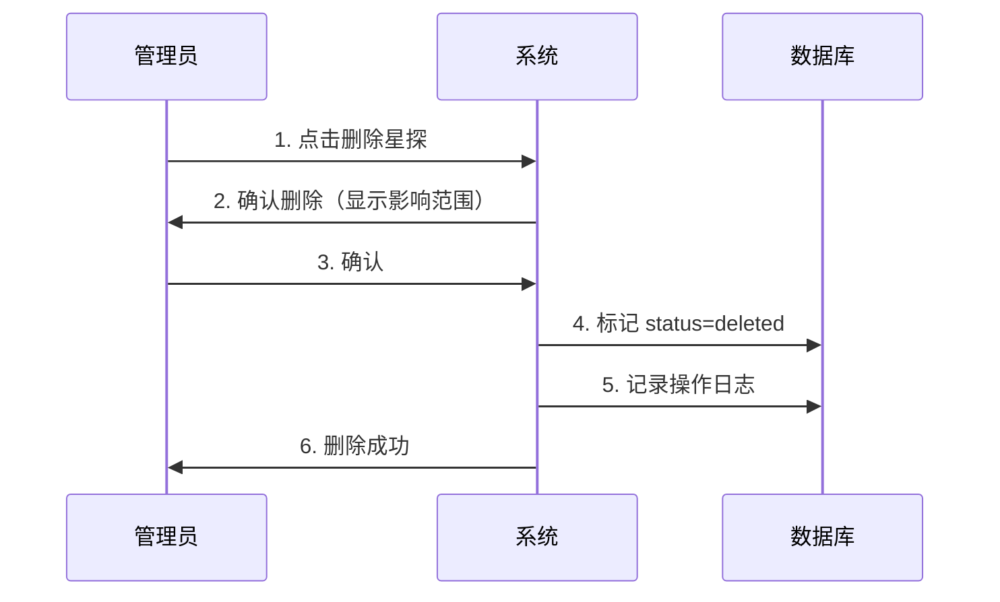
```mermaid
sequenceDiagram
    participant AD as 管理员
    participant SYS as 系统
    participant DB as 数据库

    AD->>SYS: 1. 点击删除星探
    SYS->>AD: 2. 确认删除（显示影响范围）
    AD->>SYS: 3. 确认
    SYS->>DB: 4. 标记 status=deleted
    SYS->>DB: 5. 记录操作日志
    SYS->>AD: 6. 删除成功
```

**恢复功能**:
```javascript
// 恢复星探
scout.status = 'active';
scout.deletedAt = null;
scout.deletedBy = null;
// 等级保持删除前的状态不变
```

---

### 关键数据表

**scouts 集合**:
```javascript
{
  _id: "scout_id",
  profile: {
    name: "张星探",
    phone: "13800138000",
    idCard: "110101199001011234"
  },
  // 等级信息（三级：rookie/special/partner）
  grade: "special",
  gradeUpgradedAt: "2026-06-01",
  gradeHistory: [],
  // 申请审核信息
  application: {
    reason: "有丰富的主播推荐资源",
    resourceDesc: "拥有抖音账号10万粉丝",
    appliedAt: "2026-03-13",
    status: "approved",
    reviewedBy: "admin_id",
    reviewedAt: "2026-03-14",
    reviewNote: ""
  },
  // 推荐码（所有星探统一拥有）
  shareCode: "SC-EXT-20260313-A3B9",
  // 统计数据
  stats: {
    referredCount: 15,
    signedCount: 5,
    totalCommission: 12500,
    paidCommission: 10000,
    pendingCommission: 2500
  },
  referrals: [],
  commissions: [],
  status: "active", // pending/active/rejected/deleted
  deletedAt: null,
  deletedBy: null,
  createdAt: "2026-03-13 09:00",
  updatedAt: "2026-03-13 14:30"
}
```

---

## 3. 经纪人面试评分流程

### 流程简介

经纪人对分配的候选人进行面试，完成打分、标签评价、资料上传等工作。

### 核心特性 ⭐ 2026-03-10 增强

1. **数据脱敏** - 经纪人无法看到敏感信息
2. **权限控制** - 只能操作分配给自己的候选人
3. **批量分配** - HR可批量分配候选人给经纪人
4. **试镜视频** - 支持上传试镜视频

### 流程图

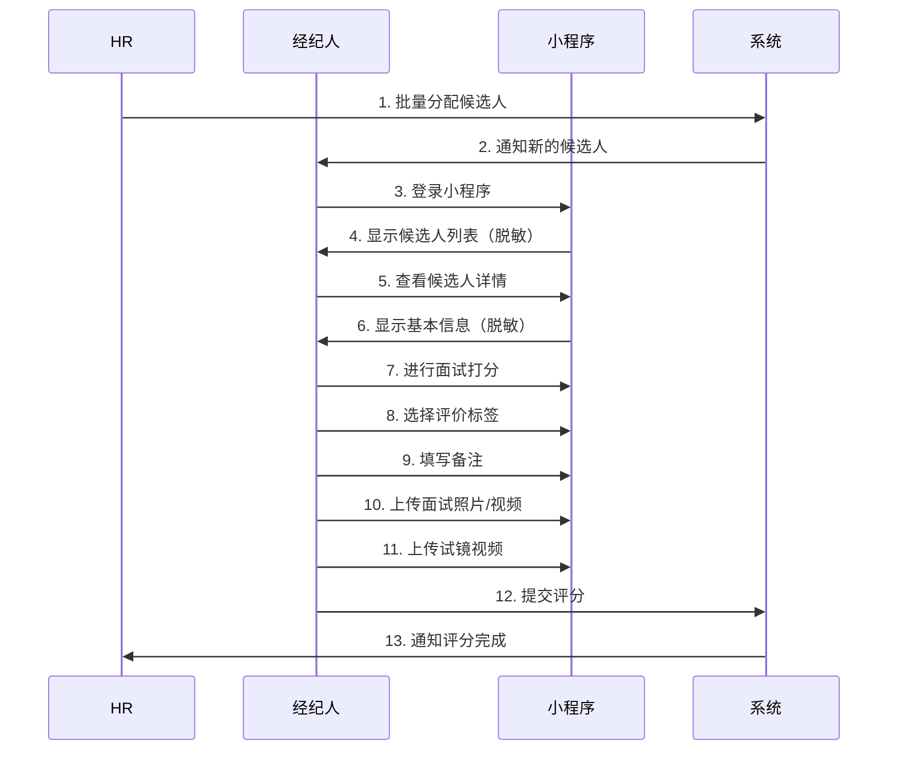
```mermaid
sequenceDiagram
    participant HR as HR
    participant AG as 经纪人
    participant MP as 小程序
    participant SYS as 系统
    
    HR->>SYS: 1. 批量分配候选人
    SYS->>AG: 2. 通知新的候选人
    
    AG->>MP: 3. 登录小程序
    MP->>AG: 4. 显示候选人列表（脱敏）
    
    AG->>MP: 5. 查看候选人详情
    MP->>AG: 6. 显示基本信息（脱敏）
    
    AG->>MP: 7. 进行面试打分
    AG->>MP: 8. 选择评价标签
    AG->>MP: 9. 填写备注
    AG->>MP: 10. 上传面试照片/视频
    AG->>MP: 11. 上传试镜视频
    
    AG->>SYS: 12. 提交评分
    SYS->>HR: 13. 通知评分完成
```

---

### 数据脱敏规则

#### 经纪人可见信息

✅ **可以看到**:
- 基本信息: 姓名、性别、年龄、身高、体重、艺名
- 所在地: 省、市
- 才艺信息: 擅长才艺、才艺描述
- 个人照片: 所有上传的照片
- 爱好特长: 个人爱好标签
- 直播经验: 是否有经验、经验年限

❌ **无法看到**:
- 联系方式: 手机号、微信号
- 详细地址
- 社交账号: 抖音、小红书、B站账号和粉丝数
- 推荐人信息: 星探信息、推荐码
- 其他敏感信息

#### 脱敏实现

```javascript
// 云函数中的脱敏函数
function desensitizeCandidateForAgent(candidate) {
  const sanitized = { ...candidate };
  
  // 移除联系方式
  if (sanitized.basicInfo) {
    delete sanitized.basicInfo.phone;
    delete sanitized.basicInfo.wechat;
    
    // 移除社交账号
    delete sanitized.basicInfo.douyin;
    delete sanitized.basicInfo.douyinFans;
    delete sanitized.basicInfo.xiaohongshu;
    delete sanitized.basicInfo.xiaohongshuFans;
    delete sanitized.basicInfo.bilibili;
    delete sanitized.basicInfo.bilibiliUsername;
    delete sanitized.basicInfo.bilibiliName;
    delete sanitized.basicInfo.bilibiliFans;
  }
  
  // 移除推荐人信息
  if (sanitized.referral) {
    delete sanitized.referral;
  }
  
  return sanitized;
}
```

---

### 详细步骤

#### 步骤1：批量分配候选人 ⭐ 新增

**操作人**: HR / 管理员  
**入口**: 管理后台 - 候选人管理

**操作流程**:
```
1. 勾选多个候选人
2. 点击"批量分配"按钮
3. 选择目标经纪人（显示已分配数量）
4. 确认分配
5. 系统自动更新分配关系
6. 如有重新分配，显示提示
```

**UI界面**:
```
已选择: 3 名候选人
- 李四（24岁）
- 王五（21岁）
- 孙七（25岁）

选择经纪人:
○ 张经纪（已分配: 5人）
○ 李经纪（已分配: 3人）
● 王经纪（已分配: 8人）

[取消] [确认分配]
```

**重新分配提示**:
```
以下候选人已从其他经纪人重新分配：
- 李四（原经纪人：张经纪）
- 王五（原经纪人：李经纪）
```

---

#### 步骤2：查看候选人列表

**操作人**: 经纪人  
**入口**: 小程序 - 经纪人工作台 - 候选人列表

**筛选选项**:
- 全部
- 待打分
- 已打分

**列表信息**:
- 姓名（含艺名）
- 年龄
- 所在地
- 才艺标签
- 报名时间
- 打分状态

---

#### 步骤3：面试打分

详见 [1. 候选人报名与审核流程 - 阶段4](#阶段4面试评分)

---

#### 步骤4：上传试镜视频 ⭐ 新增

**操作人**: 经纪人  
**入口**: 小程序 - 候选人详情 - 上传试镜视频

**上传界面**:
```
试镜视频（2/3）

[视频1预览]  [视频2预览]  [+添加视频]
30秒          1分15秒

说明：
• 每个视频不超过100MB
• 建议时长：30秒-2分钟
• 内容：才艺展示、自我介绍等
• 最多上传3个视频

[提交上传]
```

**上传流程**:
1. 录制或选择视频
2. 检查大小（≤100MB）
3. 显示上传进度
4. 上传到云存储
5. 保存视频信息
6. 提交到数据库

**技术实现**:
```javascript
// 上传视频
const cloudPath = `audition-videos/${candidateId}/${Date.now()}.mp4`;

const uploadTask = wx.cloud.uploadFile({
  cloudPath: cloudPath,
  filePath: video.tempPath
});

// 监听进度
uploadTask.onProgressUpdate((res) => {
  console.log('上传进度:', res.progress);
});

// 保存到数据库
await wx.cloud.callFunction({
  name: 'admin',
  data: {
    action: 'uploadAuditionVideos',
    data: {
      candidateId: candidateId,
      auditionVideos: [{
        url: fileID,
        fileID: fileID,
        cloudPath: cloudPath,
        duration: video.duration,
        size: video.size,
        uploadTime: Date.now()
      }]
    }
  }
});
```

---

### 权限控制

#### 云函数权限检查

```javascript
// 获取候选人详情
async function getCandidateDetail(data, token) {
  const user = await getUserFromToken(token);
  const { candidateId } = data;
  
  const candidate = await db.collection('candidates').doc(candidateId).get();
  
  // 如果是经纪人，检查权限
  if (user.role === 'agent') {
    const assignedIds = user.assignedCandidates || [];
    if (!assignedIds.includes(candidateId)) {
      return { success: false, error: '无权限查看该候选人' };
    }
    
    // 数据脱敏
    return {
      success: true,
      candidate: desensitizeCandidateForAgent(candidate.data)
    };
  }
  
  // 管理员和HR可以看到完整信息
  return {
    success: true,
    candidate: candidate.data
  };
}
```

---

## 4. 用户申请审核流程

### 流程简介 ⭐ 2026-03-10 新增

新用户通过申请页面提交申请，管理员审核并分配角色，审核通过后用户可登录系统。

### 流程图

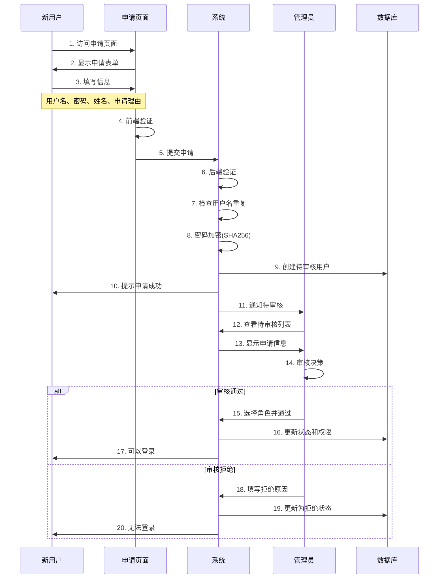
```mermaid
sequenceDiagram
    participant U as 新用户
    participant AP as 申请页面
    participant SYS as 系统
    participant AD as 管理员
    participant DB as 数据库
    
    U->>AP: 1. 访问申请页面
    AP->>U: 2. 显示申请表单
    
    U->>AP: 3. 填写信息
    Note over U,AP: 用户名、密码、姓名、申请理由
    
    AP->>AP: 4. 前端验证
    AP->>SYS: 5. 提交申请
    
    SYS->>SYS: 6. 后端验证
    SYS->>SYS: 7. 检查用户名重复
    SYS->>SYS: 8. 密码加密(SHA256)
    SYS->>DB: 9. 创建待审核用户
    
    SYS->>U: 10. 提示申请成功
    SYS->>AD: 11. 通知待审核
    
    AD->>SYS: 12. 查看待审核列表
    SYS->>AD: 13. 显示申请信息
    
    AD->>AD: 14. 审核决策
    
    alt 审核通过
        AD->>SYS: 15. 选择角色并通过
        SYS->>DB: 16. 更新状态和权限
        SYS->>U: 17. 可以登录
    else 审核拒绝
        AD->>SYS: 18. 填写拒绝原因
        SYS->>DB: 19. 更新为拒绝状态
        SYS->>U: 20. 无法登录
    end
```

---

### 详细步骤

#### 步骤1：用户提交申请

**访问方式**:
- URL: `https://your-domain/apply`
- 入口: 登录页 - "还没有账号？点击申请"

**申请表单**:

| 字段 | 类型 | 验证规则 | 说明 |
|------|------|---------|------|
| 用户名 | 文本 | 必填，3-20位，字母/数字/下划线 | 唯一标识 |
| 姓名 | 文本 | 必填，1-20位，中文/英文/空格 | 真实姓名 |
| 密码 | 密码 | 必填，≥6位 | 登录密码 |
| 确认密码 | 密码 | 必填，与密码一致 | 二次确认 |
| 申请理由 | 多行文本 | 选填，≤500字符 | 申请原因 |

**前端验证**:
```javascript
const rules = {
  username: [
    { required: true, message: '请输入用户名' },
    { min: 3, max: 20, message: '长度在3-20个字符' },
    { pattern: /^[a-zA-Z0-9_]+$/, message: '只能包含字母、数字、下划线' }
  ],
  name: [
    { required: true, message: '请输入姓名' },
    { min: 1, max: 20, message: '长度在1-20个字符' },
    { pattern: /^[\u4e00-\u9fa5a-zA-Z\s]+$/, message: '只能包含中文、英文和空格' }
  ],
  password: [
    { required: true, message: '请输入密码' },
    { min: 6, message: '密码长度至少6位' }
  ],
  confirmPassword: [
    { required: true, message: '请再次输入密码' },
    { validator: validateConfirmPassword }
  ]
}
```

**后端验证**:
```javascript
// 验证用户名格式
if (!/^[a-zA-Z0-9_]{3,20}$/.test(username)) {
  return { success: false, error: '用户名只能包含字母、数字、下划线，长度3-20位' };
}

// 验证密码长度
if (password.length < 6) {
  return { success: false, error: '密码长度不能少于6位' };
}

// 验证姓名长度和格式
if (name.length < 1 || name.length > 20) {
  return { success: false, error: '姓名长度应在1-20个字符之间' };
}
if (!/^[\u4e00-\u9fa5a-zA-Z\s]+$/.test(name)) {
  return { success: false, error: '姓名只能包含中文、英文和空格' };
}

// 验证申请理由长度
if (reason && reason.length > 500) {
  return { success: false, error: '申请理由不能超过500字符' };
}

// 检查用户名是否已存在
const existingUser = await db.collection('admins').where({
  username: username
}).get();

if (existingUser.data.length > 0) {
  return { success: false, error: '用户名已存在' };
}
```

**密码加密**:
```javascript
const crypto = require('crypto');
const hashedPassword = crypto
  .createHash('sha256')
  .update(password)
  .digest('hex');
```

**创建用户**:
```javascript
await db.collection('admins').add({
  data: {
    username: username,
    password: hashedPassword,
    name: name,
    role: 'pending',
    status: 'pending',
    application: {
      reason: reason || '',
      appliedAt: db.serverDate(),
      status: 'pending'
    },
    permissions: {},
    createdAt: db.serverDate(),
    updatedAt: db.serverDate()
  }
});
```

---

#### 步骤2：管理员审核

**操作人**: 管理员  
**入口**: 管理后台 - 用户管理

**用户列表**:

| 用户名 | 姓名 | 角色 | 状态 | 申请时间 | 操作 |
|-------|------|------|------|---------|------|
| zhangsan | 张三 | 待分配 | 待审核 | 2026-03-10 10:00 | [审核] |
| lisi | 李四 | 待分配 | 待审核 | 2026-03-10 11:00 | [审核] |
| wangwu | 王五 | HR | 已通过 | 2026-03-08 14:00 | [编辑] [停用] |

**筛选选项**:
- 全部
- 待审核（显示徽章）
- 已通过
- 已拒绝

**审核弹窗**:
```
审核用户申请

用户名：zhangsan
姓名：张三
申请时间：2026-03-10 10:00
申请理由：希望成为HR，有3年招聘经验

分配角色：
○ 管理员 (admin)
● HR (hr)
○ 经纪人 (agent)
○ 运营 (operations)
○ 培训师 (trainer)

审核备注：
┌────────────────────┐
│ （选填）           │
└────────────────────┘

[拒绝]  [通过]
```

**角色对应权限**:

| 角色 | 权限 |
|------|------|
| 管理员 | 所有权限 |
| HR | 候选人管理、面试安排 |
| 经纪人 | 面试打分、上传资料（仅分配的候选人） |
| 运营 | 数据查看、统计分析 |
| 培训师 | 培训管理、课程安排 |

**审核操作**:

**1. 通过审核**:
```javascript
// 前端验证
if (!reviewForm.role) {
  ElMessage.warning('请选择要分配的角色');
  return;
}

// 调用API
await adminAPI.reviewUser({
  userId: user._id,
  approved: true,
  role: 'hr', // 选择的角色
  note: '有相关经验，通过'
});

// 后端处理
const updateData = {
  role: 'hr',
  status: 'active',
  permissions: ROLE_PERMISSIONS['hr'],
  'application.status': 'approved',
  review: {
    reviewedBy: admin._id,
    reviewedByName: admin.username,
    reviewedAt: db.serverDate(),
    reviewNote: '有相关经验，通过',
    assignedRole: 'hr'
  },
  updatedAt: db.serverDate()
};

await db.collection('admins').doc(userId).update({ data: updateData });
```

**2. 拒绝申请**:
```javascript
await adminAPI.reviewUser({
  userId: user._id,
  approved: false,
  note: '暂不需要该岗位'
});

// 后端处理
const updateData = {
  status: 'rejected',
  'application.status': 'rejected',
  review: {
    reviewedBy: admin._id,
    reviewedByName: admin.username,
    reviewedAt: db.serverDate(),
    reviewNote: '暂不需要该岗位'
  },
  updatedAt: db.serverDate()
};
```

---

#### 步骤3：用户登录

**审核通过后**:
- 用户使用申请时的用户名和密码登录
- 系统根据分配的角色显示对应的权限和菜单
- 记录登录日志

**审核拒绝后**:
- 用户无法登录
- 提示：账号未通过审核或已被拒绝

---

### 关键数据表

**admins 集合**:
```javascript
{
  _id: "admin_id",
  username: "zhangsan",
  password: "hashed_password",
  name: "张三",
  role: "hr", // pending/admin/hr/agent/operations/trainer
  status: "active", // pending/active/rejected
  
  // 申请信息
  application: {
    reason: "希望成为HR",
    appliedAt: "2026-03-10 10:00",
    status: "approved" // pending/approved/rejected
  },
  
  // 审核信息
  review: {
    reviewedBy: "admin_id",
    reviewedByName: "管理员",
    reviewedAt: "2026-03-10 11:00",
    reviewNote: "有相关经验，通过",
    assignedRole: "hr"
  },
  
  permissions: {
    manageUsers: false,
    viewCandidates: true,
    updateCandidateStatus: true,
    // ... 其他权限
  },
  
  createdAt: "2026-03-10 10:00",
  updatedAt: "2026-03-10 11:00"
}
```

---

## 5. 候选人批量分配流程

### 流程简介 ⭐ 2026-03-10 新增

HR或管理员可以批量选择候选人，统一分配给指定经纪人，提升操作效率。

### 流程图

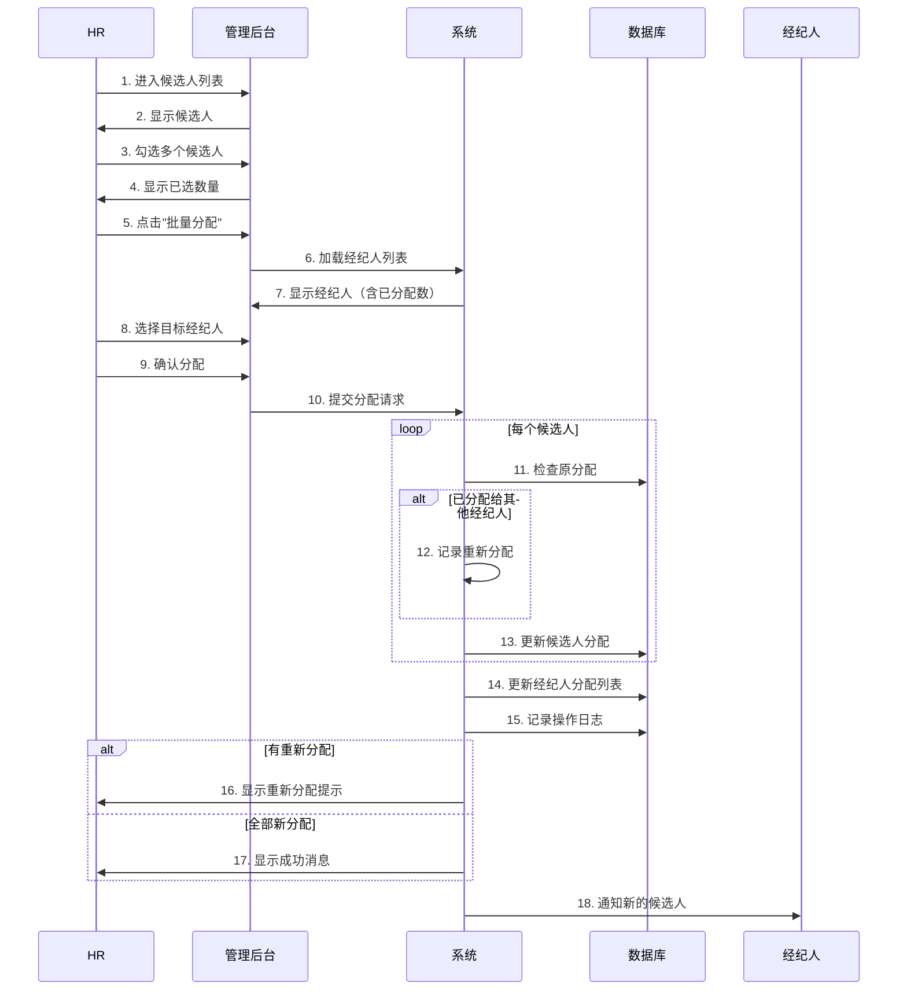
```mermaid
sequenceDiagram
    participant HR as HR
    participant UI as 管理后台
    participant SYS as 系统
    participant DB as 数据库
    participant AG as 经纪人
    
    HR->>UI: 1. 进入候选人列表
    UI->>HR: 2. 显示候选人
    
    HR->>UI: 3. 勾选多个候选人
    UI->>HR: 4. 显示已选数量
    
    HR->>UI: 5. 点击"批量分配"
    UI->>SYS: 6. 加载经纪人列表
    SYS->>UI: 7. 显示经纪人（含已分配数）
    
    HR->>UI: 8. 选择目标经纪人
    HR->>UI: 9. 确认分配
    
    UI->>SYS: 10. 提交分配请求
    
    loop 每个候选人
        SYS->>DB: 11. 检查原分配
        alt 已分配给其他经纪人
            SYS->>SYS: 12. 记录重新分配
        end
        SYS->>DB: 13. 更新候选人分配
    end
    
    SYS->>DB: 14. 更新经纪人分配列表
    SYS->>DB: 15. 记录操作日志
    
    alt 有重新分配
        SYS->>HR: 16. 显示重新分配提示
    else 全部新分配
        SYS->>HR: 17. 显示成功消息
    end
    
    SYS->>AG: 18. 通知新的候选人
```

---

### 详细步骤

#### 步骤1：勾选候选人

**操作界面**:
```
候选人管理  [批量分配] [导出]

□ 全选  [筛选▼] [搜索]    已选: 3人

□ 张三  | 22岁 | 待审核 | 未分配  | 星探推荐
☑ 李四  | 24岁 | 已通过 | 未分配  | 直接报名
☑ 王五  | 21岁 | 待审核 | 未分配  | 星探推荐
□ 赵六  | 23岁 | 已通过 | 张经纪  | 星探推荐
☑ 孙七  | 25岁 | 已通过 | 未分配  | 直接报名
```

**功能特性**:
- ✅ 支持单选
- ✅ 支持全选
- ✅ 实时显示已选数量
- ✅ 可以跨页勾选

---

#### 步骤2：选择经纪人

**弹窗界面**:
```
批量分配经纪人

已选择候选人：3人
• 李四（24岁）
• 王五（21岁）
• 孙七（25岁）

选择经纪人：
┌──────────────────────────┐
│ 请选择经纪人    ▼        │
└──────────────────────────┘

经纪人列表：
○ 张经纪（zhangsan） - 已分配: 5人
○ 李经纪（lisi）     - 已分配: 3人
● 王经纪（wangwu）   - 已分配: 8人

[取消]  [确认分配]
```

**经纪人信息**:
- 显示姓名和用户名
- 显示当前已分配的候选人数量
- 支持搜索和筛选

---

#### 步骤3：执行分配

**分配逻辑**:
```javascript
async function batchAssignCandidates(data, token) {
  const { candidateIds, agentId } = data;
  
  // 1. 验证经纪人存在
  const agent = await db.collection('admins').doc(agentId).get();
  if (!agent.data || agent.data.role !== 'agent') {
    return { success: false, error: '经纪人不存在' };
  }
  
  // 2. 更新经纪人的分配列表
  const currentAssigned = agent.data.assignedCandidates || [];
  const newAssigned = [...new Set([...currentAssigned, ...candidateIds])]; // 去重
  
  await db.collection('admins').doc(agentId).update({
    data: {
      assignedCandidates: newAssigned,
      updatedAt: db.serverDate()
    }
  });
  
  // 3. 批量更新候选人
  let successCount = 0;
  const errors = [];
  const reassignments = []; // 记录重新分配
  
  for (const candidateId of candidateIds) {
    try {
      // 检查是否已分配给其他经纪人
      const candidate = await db.collection('candidates').doc(candidateId).get();
      
      if (candidate.data.assignedAgent &&
          candidate.data.assignedAgent.agentId &&
          candidate.data.assignedAgent.agentId !== agentId) {
        reassignments.push({
          candidateId,
          candidateName: candidate.data.basicInfo?.name,
          oldAgentName: candidate.data.assignedAgent.agentName
        });
      }
      
      // 更新分配
      await db.collection('candidates').doc(candidateId).update({
        data: {
          assignedAgent: {
            agentId: agentId,
            agentName: agent.data.name,
            assignedAt: db.serverDate(),
            assignedBy: user._id
          },
          updatedAt: db.serverDate()
        }
      });
      
      successCount++;
    } catch (error) {
      errors.push({ candidateId, error: error.message });
    }
  }
  
  // 4. 记录操作日志
  await logAuditAction('batch_assign_candidates', user.username, agentId, {
    agentName: agent.data.name,
    candidateCount: candidateIds.length,
    successCount,
    failedCount: candidateIds.length - successCount
  });
  
  return {
    success: true,
    successCount,
    totalCount: candidateIds.length,
    failedCount: candidateIds.length - successCount,
    errors: errors.length > 0 ? errors : undefined,
    reassignments: reassignments.length > 0 ? reassignments : undefined
  };
}
```

---

#### 步骤4：分配结果提示

**成功提示**:
```
成功分配 3 人
```

**重新分配提示**:
```
分配成功

以下候选人已从其他经纪人重新分配：
- 李四（原经纪人：张经纪）
- 王五（原经纪人：李经纪）

[知道了]
```

**部分失败提示**:
```
部分分配成功

成功：2 人
失败：1 人

失败原因：
- 候选人ID xxx：候选人不存在
```

---

### 操作日志

**记录内容**:
```javascript
{
  action: "batch_assign_candidates",
  operator: "hr_user",
  target: "agent_id",
  details: {
    agentName: "王经纪",
    candidateCount: 3,
    successCount: 3,
    failedCount: 0,
    reassignedCount: 2
  },
  timestamp: "2026-03-10 14:30"
}
```

---

## 6. 星探等级管理流程

### 流程简介 🔄 2026-03-13 改造

星探等级基于签约人数自动升级，管理员可查看等级状态和手动调整。取消了旧的SP/SS手动升降级和上下级关系管理。

### 自动升级机制

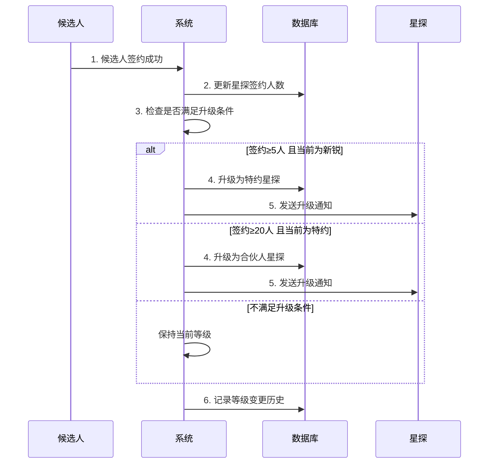
```mermaid
sequenceDiagram
    participant C as 候选人
    participant SYS as 系统
    participant DB as 数据库
    participant S as 星探

    C->>SYS: 1. 候选人签约成功
    SYS->>DB: 2. 更新星探签约人数
    SYS->>SYS: 3. 检查是否满足升级条件

    alt 签约≥5人 且当前为新锐
        SYS->>DB: 4. 升级为特约星探
        SYS->>S: 5. 发送升级通知
    else 签约≥20人 且当前为特约
        SYS->>DB: 4. 升级为合伙人星探
        SYS->>S: 5. 发送升级通知
    else 不满足升级条件
        SYS->>SYS: 保持当前等级
    end

    SYS->>DB: 6. 记录等级变更历史
```

**升级条件**:

| 当前等级 | 升级目标 | 条件 |
|---------|---------|------|
| 新锐星探 | 特约星探 | 累计签约 ≥ 5 人 |
| 特约星探 | 合伙人星探 | 累计签约 ≥ 20 人 |

**自动升级实现**:
```javascript
async function checkAndUpgradeScoutGrade(scoutId) {
  const scout = await db.collection('scouts').doc(scoutId).get();
  const signedCount = scout.data.stats.signedCount;
  const currentGrade = scout.data.grade;

  let newGrade = currentGrade;
  if (signedCount >= 20 && currentGrade !== 'partner') {
    newGrade = 'partner';
  } else if (signedCount >= 5 && currentGrade === 'rookie') {
    newGrade = 'special';
  }

  if (newGrade !== currentGrade) {
    await db.collection('scouts').doc(scoutId).update({
      data: {
        grade: newGrade,
        gradeUpgradedAt: db.serverDate(),
        gradeHistory: _.push({
          from: currentGrade,
          to: newGrade,
          signedCount: signedCount,
          upgradedAt: db.serverDate()
        })
      }
    });
  }
}
```

---

### 管理员手动调整

特殊情况下管理员可手动调整等级（需填写原因）：

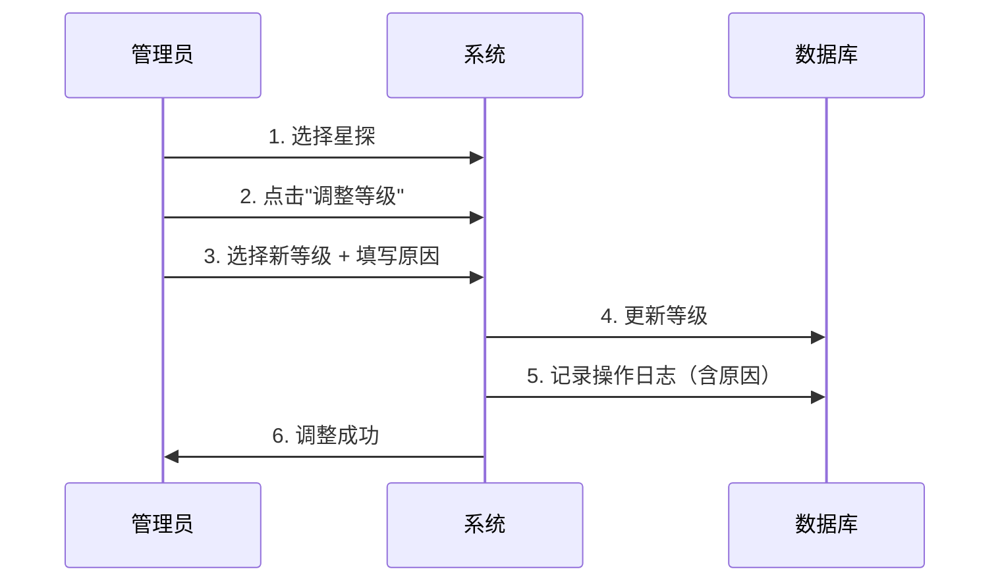
```mermaid
sequenceDiagram
    participant AD as 管理员
    participant SYS as 系统
    participant DB as 数据库

    AD->>SYS: 1. 选择星探
    AD->>SYS: 2. 点击"调整等级"
    AD->>SYS: 3. 选择新等级 + 填写原因
    SYS->>DB: 4. 更新等级
    SYS->>DB: 5. 记录操作日志（含原因）
    SYS->>AD: 6. 调整成功
```

---

### 管理界面

**星探管理页面**:
```
星探管理

[姓名]  [等级]      [推荐码]    [推荐数]  [签约数]  [佣金]    [操作]
张三    合伙人星探   SC-EXT...   25       22       ¥45,000  [详情] [删除]
李四    特约星探     SC-EXT...   12       8        ¥12,000  [详情] [删除]
王五    新锐星探     SC-EXT...   5        2        ¥2,000   [详情] [删除]
赵六    待审核       -           -        -        -        [审核]
```

**星探详情/等级调整**:
```
星探详情

基本信息：
姓名：张三
手机号：138****0000
等级：合伙人星探
推荐码：SC-EXT-20260313-A3B9

统计数据：
推荐人数：25
签约人数：22
累计佣金：¥45,000
已发放：¥38,000
待发放：¥7,000

等级历史：
2026-03-13 新锐星探（审核通过）
2026-05-20 特约星探（签约达5人，自动升级）
2026-09-15 合伙人星探（签约达20人，自动升级）

[调整等级]  [删除]
```

---

## 7. 星探删除流程

### 流程简介

管理员可以删除星探（软删除），保留历史数据，并支持恢复功能。新模式下无上下级关系，删除逻辑简化。

### 删除流程

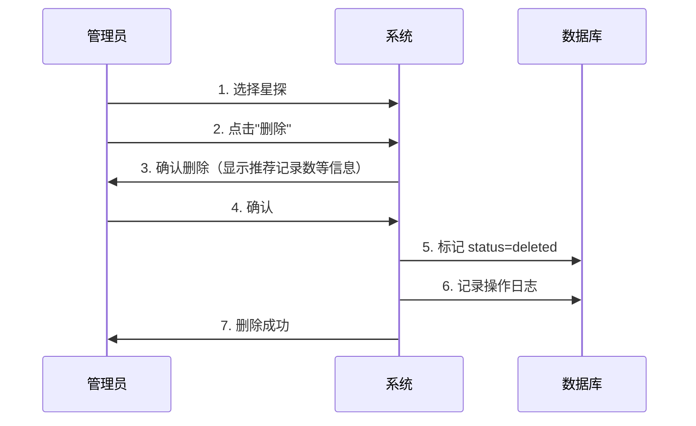
```mermaid
sequenceDiagram
    participant AD as 管理员
    participant SYS as 系统
    participant DB as 数据库

    AD->>SYS: 1. 选择星探
    AD->>SYS: 2. 点击"删除"
    SYS->>AD: 3. 确认删除（显示推荐记录数等信息）
    AD->>SYS: 4. 确认

    SYS->>DB: 5. 标记 status=deleted
    SYS->>DB: 6. 记录操作日志
    SYS->>AD: 7. 删除成功
```

**软删除实现**:
```javascript
async function deleteScout(data, token) {
  const { scoutId } = data;
  const scout = await db.collection('scouts').doc(scoutId).get();

  // 软删除星探
  await db.collection('scouts').doc(scoutId).update({
    data: {
      status: 'deleted',
      deletedAt: db.serverDate(),
      deletedBy: user._id,
      updatedAt: db.serverDate()
    }
  });

  // 记录操作日志
  await logAuditAction('delete_scout', user.username, scoutId, {
    scoutName: scout.data.profile.name,
    scoutGrade: scout.data.grade,
    referredCount: scout.data.stats.referredCount,
    signedCount: scout.data.stats.signedCount
  });

  return { success: true, message: '删除成功' };
}
```

---

### 恢复流程

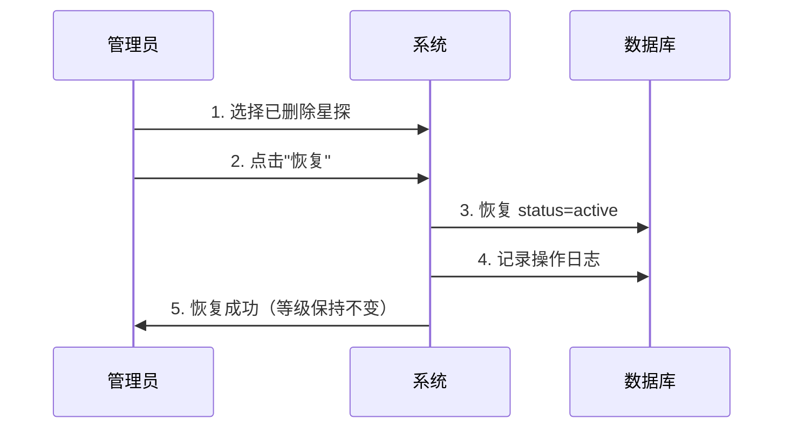
```mermaid
sequenceDiagram
    participant AD as 管理员
    participant SYS as 系统
    participant DB as 数据库

    AD->>SYS: 1. 选择已删除星探
    AD->>SYS: 2. 点击"恢复"
    SYS->>DB: 3. 恢复 status=active
    SYS->>DB: 4. 记录操作日志
    SYS->>AD: 5. 恢复成功（等级保持不变）
```

**恢复实现**:
```javascript
async function restoreScout(data, token) {
  const { scoutId } = data;

  await db.collection('scouts').doc(scoutId).update({
    data: {
      status: 'active',
      deletedAt: _.remove(),
      deletedBy: _.remove(),
      updatedAt: db.serverDate()
    }
  });

  await logAuditAction('restore_scout', user.username, scoutId, {
    scoutName: scout.data.profile.name
  });

  return { success: true, message: '恢复成功' };
}
```

---

### 数据保护

**软删除的优势**:
- 保留所有历史数据
- 保留推荐记录和佣金记录
- 可以恢复
- 支持数据审计

**不会被删除的数据**:
- 推荐关系记录
- 佣金计算记录
- 操作日志
- 等级变更历史

---

## 8. 试镜视频上传流程

### 流程简介 ⭐ 2026-03-10 新增

经纪人为候选人上传试镜视频，存储到云端，管理后台可查看。

详见 [3. 经纪人面试评分流程 - 步骤4](#步骤4上传试镜视频--新增)

---

## 角色权限矩阵

### 权限定义

| 权限名称 | 说明 | 涉及功能 |
|---------|------|---------|
| manageUsers | 用户管理 | 审核用户申请、分配角色 |
| viewCandidates | 查看候选人 | 候选人列表、详情 |
| updateCandidateStatus | 更新候选人状态 | 审核通过/拒绝 |
| assignAgent | 分配经纪人 | 候选人分配 |
| scoreInterview | 面试打分 | 经纪人评分 |
| uploadInterviewMaterials | 上传资料 | 照片/视频/试镜视频 |
| viewPersonalInfo | 查看个人信息 | 手机号、微信号 |
| viewReferralInfo | 查看推荐信息 | 星探信息、推荐码 |
| manageScouts | 管理星探 | 审核申请、等级调整、删除 |
| viewReports | 查看报表 | 数据统计 |

---

### 角色权限对照表

| 权限 | 管理员 | HR | 经纪人 | 运营 | 培训师 |
|------|-------|-----|-------|------|-------|
| manageUsers | ✅ | ❌ | ❌ | ❌ | ❌ |
| viewCandidates | ✅ | ✅ | ✅ 仅分配的 | ✅ | ❌ |
| updateCandidateStatus | ✅ | ✅ | ❌ | ❌ | ❌ |
| assignAgent | ✅ | ✅ | ❌ | ❌ | ❌ |
| scoreInterview | ✅ | ❌ | ✅ | ❌ | ❌ |
| uploadInterviewMaterials | ✅ | ❌ | ✅ | ❌ | ❌ |
| viewPersonalInfo | ✅ | ✅ | ❌ | ✅ | ❌ |
| viewReferralInfo | ✅ | ✅ | ❌ | ✅ | ❌ |
| manageScouts | ✅ | ❌ | ❌ | ❌ | ❌ |
| viewReports | ✅ | ✅ | ❌ | ✅ | ❌ |

---

## 数据流转图

### 候选人状态流转

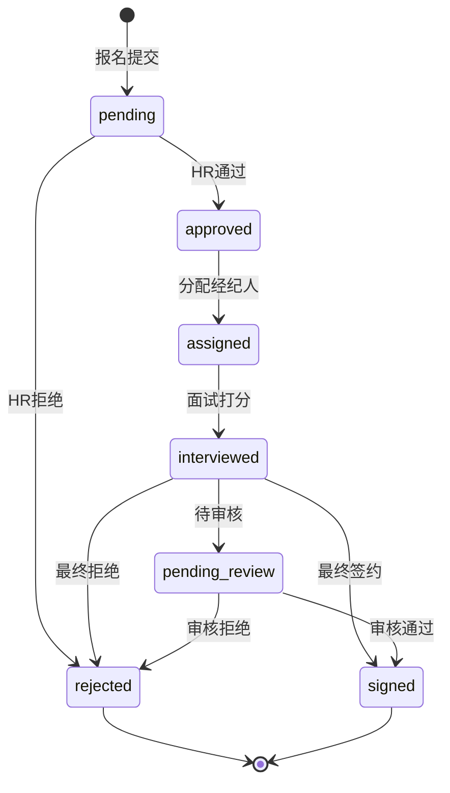
```mermaid
stateDiagram-v2
    [*] --> pending: 报名提交
    pending --> approved: HR通过
    pending --> rejected: HR拒绝
    
    approved --> assigned: 分配经纪人
    assigned --> interviewed: 面试打分
    
    interviewed --> signed: 最终签约
    interviewed --> rejected: 最终拒绝
    interviewed --> pending_review: 待审核
    
    pending_review --> signed: 审核通过
    pending_review --> rejected: 审核拒绝
    
    rejected --> [*]
    signed --> [*]
```

### 用户申请状态流转

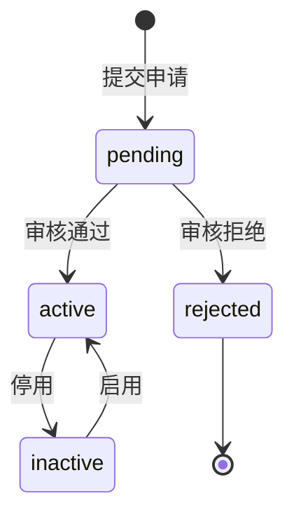
```mermaid
stateDiagram-v2
    [*] --> pending: 提交申请
    pending --> active: 审核通过
    pending --> rejected: 审核拒绝
    
    active --> inactive: 停用
    inactive --> active: 启用
    
    rejected --> [*]
```

### 星探等级流转

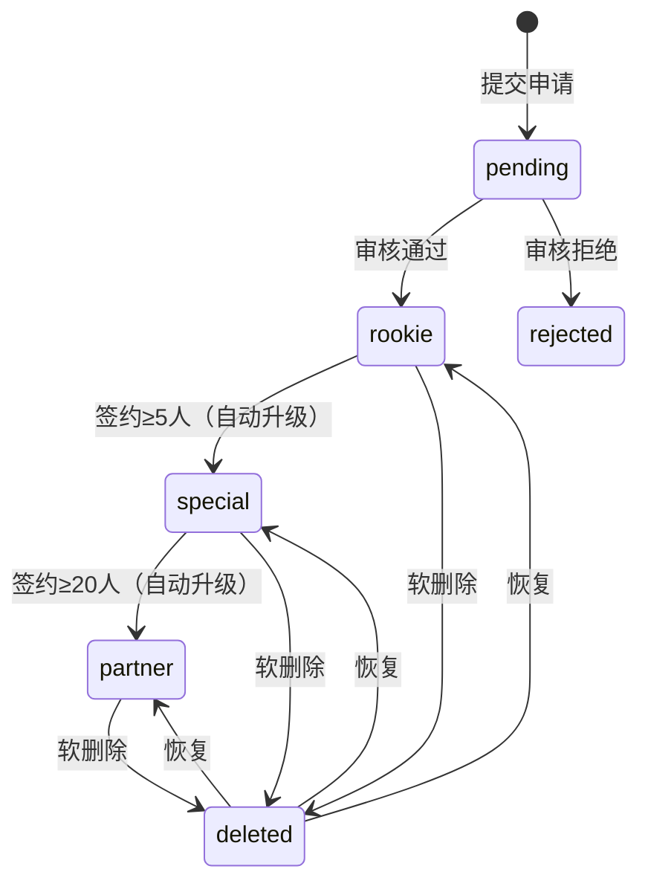
```mermaid
stateDiagram-v2
    [*] --> pending: 提交申请
    pending --> rookie: 审核通过
    pending --> rejected: 审核拒绝

    rookie --> special: 签约≥5人（自动升级）
    special --> partner: 签约≥20人（自动升级）

    rookie --> deleted: 软删除
    special --> deleted: 软删除
    partner --> deleted: 软删除

    deleted --> rookie: 恢复
    deleted --> special: 恢复
    deleted --> partner: 恢复
```

### 主播生命周期流转

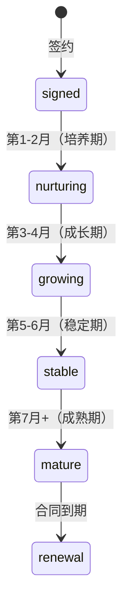
```mermaid
stateDiagram-v2
    [*] --> signed: 签约
    signed --> nurturing: 第1-2月（培养期）
    nurturing --> growing: 第3-4月（成长期）
    growing --> stable: 第5-6月（稳定期）
    stable --> mature: 第7月+（成熟期）
    mature --> renewal: 合同到期
```

---

## 变更历史

### 2026-03-13 - 星探体系改造（分销→直营）

**核心变更**：
- 星探层级从SP/SS两级改为新锐/特约/合伙人三级
- 取消上下级关系，实行扁平化管理
- 新增星探申请审核制
- 佣金规则改为按等级×主播级别差异化计算
- 新增主播定级（SS/S/A/B）
- 新增主播6阶段生命周期管理
- 结算周期从固定3个月改为按生命周期阶段
- scouts 集合数据结构重构
- candidates 集合新增 anchorLevel、lifecycleStage 字段

**移除功能**：
- 星探邀请码机制（SP邀请SS）
- 上下级关系管理
- SP/SS手动升降级
- 删除时下级自动升级逻辑

**详细设计文档**：[星探体系改造设计文档](../../dev-logs/2026-03/scout-system-redesign-2026-03-13.md)

---

### 2026-03-10 - 系统优化与功能增强

#### 第一批：高优先级需求（安全性+效率）

**需求1：候选人批量分配经纪人** ✅
- 新增批量勾选功能
- 新增批量分配弹窗
- 新增重新分配提示
- 云函数：`batchAssignCandidates`

**需求2：经纪人权限控制优化** ✅
- 实现多层数据脱敏
- 云函数强制脱敏
- 前端二次验证
- 路由权限控制
- 菜单权限控制

#### 第二批：品牌升级（星探系统）

**需求7：星探命名升级** ✅
- L1星探 → 星探合伙人 (SP - Senior Partner)
- L2星探 → 特约星探 (SS - Special Scout)
- 更新所有管理后台和小程序文案
- 创建统一的层级标签工具

**需求8：星探层级手动调整** ✅
- 新增层级编辑弹窗
- 实现升级逻辑（SS → SP）
- 实现降级逻辑（SP → SS）
- 自动处理上下级关系
- 邀请码唯一性保证
- 云函数：`updateScoutLevel`

**需求6：星探删除功能** ✅
- 实现软删除机制
- 自动升级下级为SP
- 恢复功能
- 数据一致性检查
- 云函数：`deleteScout`、`restoreScout`

#### 第三批：功能增强与体验优化

**需求3：试镜视频上传功能** ✅
- 新增试镜视频上传页面
- 支持最多3个视频
- 实时显示上传进度
- 云存储集成
- 云函数：`uploadAuditionVideos`

**需求4：用户申请审核制** ✅
- 新增用户申请页面
- 新增用户管理页面
- 实现审核与角色分配
- 登录页添加申请入口
- 多层验证（前端+后端）
- 云函数：`applyUser`、`getUserList`、`reviewUser`

**需求5：艺名显示优化** ✅
- 姓名后显示艺名：`张三 (艺名)`
- 移除单独的艺名行
- 保留直播名显示

#### 代码质量优化

**第一次 Review** - 修复8个问题：
1. ✅ 邀请码生成唯一性（3处）
2. ✅ 星探恢复数据一致性
3. ✅ 社交账号脱敏完整性（bilibili）
4. ✅ 批量分配覆盖提示
5. ✅ 视频数据验证和合并

**第二次 Review** - 修复4个问题：
1. ✅ 后端姓名格式验证
2. ✅ 后端申请理由长度限制
3. ✅ 前端姓名长度验证
4. ✅ 前端审核角色选择验证

---

### 初始版本

**核心功能** ✅
- 候选人报名与审核
- 星探推荐
- 面试评分
- 员工入职

---

## 相关文档

- [返回业务文档中心](../README.md)
- [系统概述](../architecture/multi-role-overview.md)
- [候选人旅程](./candidate-journey.md)
- [星探推荐流程](./scout-referral.md)
- [登录流程](./login-flow.md)
- [员工入职流程](./employee-onboarding.md)

---

**文档结束**

如有问题或建议，请联系开发团队。
