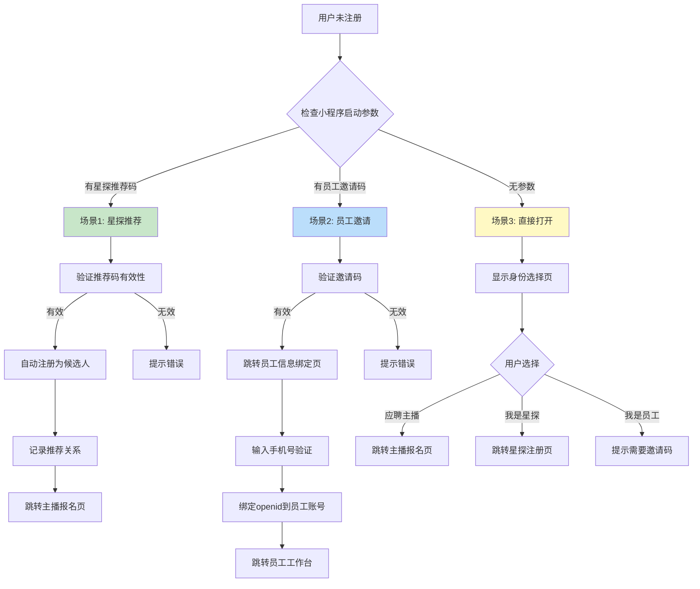
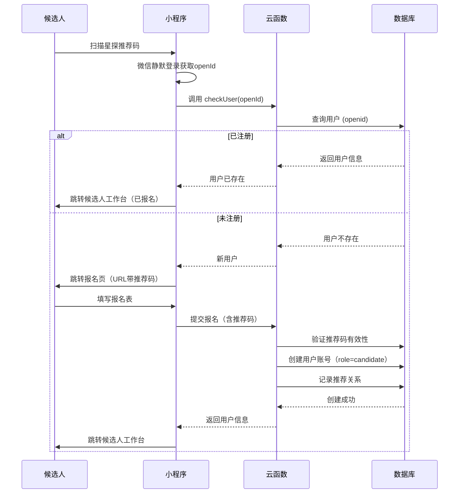
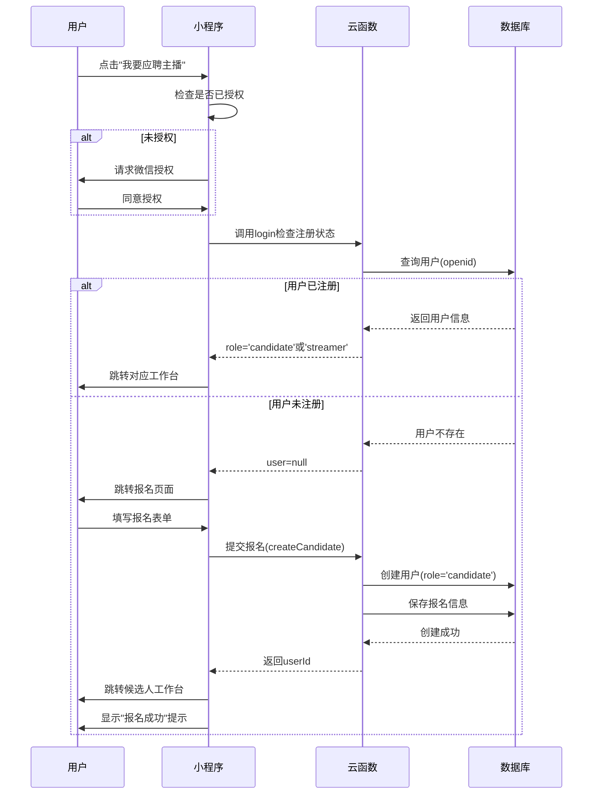

# 候选人旅程

> 从报名到成为主播的完整体验流程

**创建日期**: 2025-11-05
**最后更新**: 2025-11-05
**维护者**: 产品团队
**源文档**: multi-role-system.md

---

## 相关文档
- [返回业务文档中心](../README.md)
- [系统概述](../architecture/multi-role-overview.md)
- [登录流程](./login-flow.md)
- [角色升级机制](../architecture/upgrade-mechanism.md)

---

## 用户未注册处理方案

### 决策树



---

## 场景1：通过星探推荐码进入 ⭐

### 触发方式

用户扫描星探分享的二维码或点击分享链接进入小程序。

### 小程序启动参数

```javascript
// 场景值示例
{
  scene: 1047, // 扫描小程序码
  query: {
    scout_code: 'SC-EXT-20250102-A3B9' // 星探推荐码
  }
}
```

### 处理流程



### 关键代码实现

#### 1. 小程序端处理

```javascript
// pages/auth/login.js
Page({
  async onLoad(options) {
    const { scout_code } = options;

    // 1. 微信静默登录
    const loginRes = await wx.cloud.callFunction({
      name: 'login'
    });
    const { openId } = loginRes.result;

    // 2. 检查用户是否已注册
    const checkRes = await wx.cloud.callFunction({
      name: 'checkUser',
      data: { openId }
    });

    if (checkRes.result.exists) {
      // 已注册，直接跳转工作台
      const user = checkRes.result.user;
      this.routeToWorkspace(user.role);
    } else {
      // 未注册，跳转报名页
      wx.navigateTo({
        url: `/pages/candidate/apply/apply?scout_code=${scout_code || ''}`
      });
    }
  }
});
```

#### 2. 报名页处理

```javascript
// pages/candidate/apply/apply.js
Page({
  data: {
    scoutCode: '',
    formData: {
      basicInfo: {
        name: '',
        phone: '',
        idCard: '',
        birthday: '',
        height: '',
        weight: ''
      },
      experience: {
        hasExperience: false,
        platforms: [],
        followersCount: ''
      },
      // ... 其他表单字段
    }
  },

  onLoad(options) {
    // 获取推荐码
    this.setData({
      scoutCode: options.scout_code || ''
    });

    // 如果有推荐码，显示推荐人信息
    if (options.scout_code) {
      this.loadScoutInfo(options.scout_code);
    }
  },

  // 加载星探信息
  async loadScoutInfo(scoutCode) {
    const res = await wx.cloud.callFunction({
      name: 'getScoutInfo',
      data: { scoutCode }
    });

    if (res.result.success) {
      this.setData({
        scoutInfo: res.result.scout
      });
    }
  },

  // 提交报名
  async submitApplication() {
    // 表单验证
    if (!this.validateForm()) {
      return;
    }

    wx.showLoading({ title: '提交中...' });

    try {
      const result = await wx.cloud.callFunction({
        name: 'createCandidate',
        data: {
          ...this.data.formData,
          scoutCode: this.data.scoutCode
        }
      });

      wx.hideLoading();

      if (result.result.success) {
        // 提交成功，跳转工作台
        wx.showModal({
          title: '报名成功',
          content: '您的简历已提交，HR将在3个工作日内审核。',
          showCancel: false,
          success: () => {
            wx.reLaunch({
              url: '/pages/candidate/home/home'
            });
          }
        });
      }
    } catch (err) {
      wx.hideLoading();
      wx.showToast({
        title: err.message || '提交失败',
        icon: 'none'
      });
    }
  },

  // 表单验证
  validateForm() {
    const { basicInfo } = this.data.formData;

    if (!basicInfo.name) {
      wx.showToast({ title: '请输入姓名', icon: 'none' });
      return false;
    }

    if (!basicInfo.phone || !/^1[3-9]\d{9}$/.test(basicInfo.phone)) {
      wx.showToast({ title: '请输入正确的手机号', icon: 'none' });
      return false;
    }

    // ... 其他验证逻辑

    return true;
  }
});
```

#### 3. 云函数创建账号

```javascript
// cloudfunctions/createCandidate/index.js
const cloud = require('wx-server-sdk');
cloud.init({ env: cloud.DYNAMIC_CURRENT_ENV });
const db = cloud.database();

exports.main = async (event, context) => {
  const { OPENID } = cloud.getWXContext();
  const { formData, scoutCode } = event;

  try {
    // 1. 验证推荐码（如果有）
    let scoutInfo = null;
    if (scoutCode) {
      const scout = await db.collection('scouts')
        .where({ code: scoutCode, status: 'active' })
        .get();

      if (scout.data.length === 0) {
        throw new Error('推荐码无效或已失效');
      }
      scoutInfo = scout.data[0];
    }

    // 2. 检查用户是否已存在
    const existingUser = await db.collection('users')
      .where({ openId: OPENID })
      .get();

    if (existingUser.data.length > 0) {
      throw new Error('该微信账号已注册');
    }

    // 3. 创建用户账号（role=candidate）
    const userResult = await db.collection('users').add({
      data: {
        openId: OPENID,
        userType: 'candidate',
        role: 'candidate',

        candidateInfo: {
          status: 'pending', // 待审核
          source: scoutCode ? 'scout_referral' : 'self_apply',
          applyData: formData,
          applyAt: new Date()
        },

        accountStatus: {
          isActivated: true,
          isFirstLogin: false, // 报名即完成首次使用
          isProfileComplete: true
        },

        profile: {
          name: formData.basicInfo.name,
          phone: formData.basicInfo.phone
        },

        createdAt: new Date()
      }
    });

    // 4. 记录推荐关系（如果有）
    if (scoutInfo) {
      await db.collection('referral_records').add({
        data: {
          userId: userResult._id,
          scoutId: scoutInfo._id,
          scoutCode: scoutCode,
          referredAt: new Date(),
          status: 'pending', // 待转化
          commissionRate: 0.05
        }
      });
    }

    return { success: true, userId: userResult._id };

  } catch (err) {
    console.error('创建候选人失败', err);
    return {
      success: false,
      error: err.message
    };
  }
};
```

### 用户体验流程

```
用户扫描推荐码
    ↓
自动微信登录（无感知）
    ↓
【已报名用户】 → 直接进入候选人工作台
【新用户】 → 进入报名页
    ↓
显示推荐人信息（如：星探张三推荐）
    ↓
填写报名表
    ↓
提交 → 创建账号（role=candidate）
    ↓
跳转候选人工作台
```

---

## 场景3：无参数直接打开 🎯

### 触发方式

- 用户在微信搜索小程序名称
- 从小程序历史记录打开
- 收藏后打开

### 处理流程

显示**身份选择页**，引导用户选择身份。

### 页面设计

```
┌─────────────────────────────┐
│    欢迎使用 Aomi Star       │
│      请选择您的身份          │
└─────────────────────────────┘

┌─────────────────────────────┐
│  📸                         │
│  我要应聘主播                │
│  投递简历，开启直播之旅       │
└─────────────────────────────┘

┌─────────────────────────────┐
│  🔍                         │
│  我是星探                    │
│  推荐优质主播，赚取佣金       │
└─────────────────────────────┘

┌─────────────────────────────┐
│  💼                         │
│  我是公司员工                │
│  首次登录需要邀请码          │
└─────────────────────────────┘
```

### 选择处理逻辑

```javascript
// pages/auth/role-select/role-select.js
Page({
  data: {
    userInfo: null
  },

  onLoad() {
    // 获取微信授权
    this.getUserProfile();
  },

  // 获取用户授权
  async getUserProfile() {
    try {
      const { userInfo } = await wx.getUserProfile({
        desc: '用于完善用户资料'
      });
      this.setData({ userInfo });
    } catch (err) {
      console.log('用户取消授权', err);
    }
  },

  // 选择应聘主播
  async onSelectCandidate() {
    // 1. 确保已授权
    if (!this.data.userInfo) {
      await this.getUserProfile();
      if (!this.data.userInfo) {
        return; // 用户拒绝授权
      }
    }

    // 2. 调用登录，检查是否已注册
    wx.showLoading({ title: '加载中...' });

    try {
      const loginRes = await wx.cloud.callFunction({
        name: 'login',
        data: {}
      });

      const user = loginRes.result.user;

      if (user) {
        // 用户已注册，根据角色跳转
        wx.hideLoading();

        if (user.role === 'candidate') {
          // 已是候选人，跳转到候选人工作台
          wx.reLaunch({
            url: '/pages/candidate/home/home'
          });
        } else if (user.role === 'streamer') {
          // 已是主播，跳转到主播工作台
          wx.reLaunch({
            url: '/pages/streamer/home/home'
          });
        } else {
          // 其他角色，提示不能重复注册
          wx.showModal({
            title: '提示',
            content: '您已有其他身份，不能重复注册',
            showCancel: false
          });
        }
      } else {
        // 未注册，跳转到报名页
        wx.hideLoading();
        wx.navigateTo({
          url: '/pages/candidate/apply/apply'
        });
      }
    } catch (err) {
      wx.hideLoading();
      wx.showToast({
        title: '加载失败',
        icon: 'none'
      });
    }
  },

  // 选择星探
  async onSelectScout() {
    // 1. 确保已授权
    if (!this.data.userInfo) {
      await this.getUserProfile();
      if (!this.data.userInfo) {
        return;
      }
    }

    // 2. 检查是否已注册
    wx.showLoading({ title: '加载中...' });

    try {
      const loginRes = await wx.cloud.callFunction({
        name: 'login',
        data: {}
      });

      const user = loginRes.result.user;

      if (user && user.role === 'scout_external') {
        // 已是星探，跳转到星探工作台
        wx.hideLoading();
        wx.reLaunch({
          url: '/pages/scout-external/home/home'
        });
      } else if (user) {
        // 已有其他角色
        wx.hideLoading();
        wx.showModal({
          title: '提示',
          content: '您已有其他身份，不能重复注册',
          showCancel: false
        });
      } else {
        // 未注册，跳转到星探注册页
        wx.hideLoading();
        wx.navigateTo({
          url: '/pages/scout-external/register/register'
        });
      }
    } catch (err) {
      wx.hideLoading();
      wx.showToast({
        title: '加载失败',
        icon: 'none'
      });
    }
  },

  // 选择员工
  onSelectEmployee() {
    wx.showModal({
      title: '需要邀请码',
      content: '员工首次登录需要使用公司HR发送的邀请链接。\n\n如果您已收到邀请码，请点击"我有邀请码"输入。\n\n如果尚未收到，请联系您的HR。',
      confirmText: '我有邀请码',
      cancelText: '联系HR',
      success: (res) => {
        if (res.confirm) {
          // 显示邀请码输入框
          this.showInviteCodeInput();
        } else {
          // 显示HR联系方式
          this.showHRContact();
        }
      }
    });
  },

  // 输入邀请码
  showInviteCodeInput() {
    wx.navigateTo({
      url: '/pages/auth/invite-code-input/invite-code-input'
    });
  },

  // 显示HR联系方式
  showHRContact() {
    wx.showModal({
      title: 'HR联系方式',
      content: 'HR电话：400-123-4567\n工作时间：周一至周五 9:00-18:00',
      confirmText: '拨打电话',
      cancelText: '我知道了',
      success: (res) => {
        if (res.confirm) {
          wx.makePhoneCall({
            phoneNumber: '4001234567'
          });
        }
      }
    });
  }
});
```

### "我要应聘主播"完整流程



---

## 候选人工作台设计

### 首页布局

```
┌─────────────────────────────────────────┐
│  👤 张三                                 │
│  📱 138****8888                         │
└─────────────────────────────────────────┘

┌─────────────────────────────────────────┐
│  🔄 申请进度                             │
│  ━━━●━━━━━━━━━━━━━━━━━━━━━━━━━       │
│  ✅ 已提交   ⏳ 审核中   ⏸️ 待面试      │
│  ⏸️ 待录用   ⏸️ 待签约                  │
│                                          │
│  当前状态：审核中                        │
│  预计反馈时间：3个工作日内                │
└─────────────────────────────────────────┘

┌─────────────────────────────────────────┐
│  📋 我的申请                             │
│  提交时间：2025-01-05 14:30             │
│  来源：星探推荐 (张星探)                 │
│  [查看完整简历] [修改简历]               │
└─────────────────────────────────────────┘

┌─────────────────────────────────────────┐
│  📅 面试安排                             │
│                                          │
│  📍 线上面试                             │
│  🕐 2025-01-10 14:00-15:00             │
│  👥 面试官：HR-李经理、经纪人-王总       │
│                                          │
│  [查看面试须知] [加入面试间]             │
│  [重新预约时间]                          │
└─────────────────────────────────────────┘

┌─────────────────────────────────────────┐
│  📨 最新消息 (2条未读)                   │
│                                          │
│  🔔 您的简历已通过初审                   │
│     HR-李经理 | 1小时前                  │
│                                          │
│  📞 面试邀请通知                         │
│     系统通知 | 2天前                     │
│                                          │
│  [查看全部消息]                          │
└─────────────────────────────────────────┘

┌─────────────────────────────────────────┐
│  ℹ️ 帮助中心                             │
│  • 如何准备面试？                        │
│  • 面试常见问题                          │
│  • 联系HR（工作日 9:00-18:00）          │
└─────────────────────────────────────────┘
```

### 核心功能

#### 1. 实时进度追踪

```javascript
// pages/candidate/home/home.js
Page({
  data: {
    candidate: null,
    progressSteps: [
      { key: 'pending', label: '已提交', icon: 'check' },
      { key: 'reviewing', label: '审核中', icon: 'loading' },
      { key: 'interview_scheduled', label: '待面试', icon: 'calendar' },
      { key: 'offered', label: '待录用', icon: 'offer' },
      { key: 'signed', label: '待签约', icon: 'contract' }
    ]
  },

  onShow() {
    this.loadCandidateInfo();
  },

  async loadCandidateInfo() {
    const res = await wx.cloud.callFunction({
      name: 'getCandidateInfo'
    });

    if (res.result.success) {
      this.setData({
        candidate: res.result.candidate
      });
      this.updateProgressBar();
    }
  },

  updateProgressBar() {
    const { candidate, progressSteps } = this.data;
    const currentIndex = progressSteps.findIndex(
      step => step.key === candidate.status
    );

    // 更新进度条状态
    const updatedSteps = progressSteps.map((step, index) => ({
      ...step,
      status: index <= currentIndex ? 'completed' : 'pending'
    }));

    this.setData({
      progressSteps: updatedSteps,
      currentStep: currentIndex
    });
  }
});
```

#### 2. 简历管理

```javascript
// 查看简历
viewResume() {
  wx.navigateTo({
    url: '/pages/candidate/resume/resume'
  });
}

// 修改简历（仅 pending 状态可修改）
editResume() {
  const { candidate } = this.data;

  if (candidate.status !== 'pending') {
    wx.showModal({
      title: '提示',
      content: '简历已进入审核，无法修改',
      showCancel: false
    });
    return;
  }

  wx.navigateTo({
    url: '/pages/candidate/apply/apply?mode=edit'
  });
}
```

#### 3. 面试管理

```javascript
// 查看面试详情
viewInterview() {
  wx.navigateTo({
    url: '/pages/candidate/interview/detail/detail'
  });
}

// 加入面试间
joinInterview() {
  const { interview } = this.data;

  // 检查面试时间
  const now = new Date();
  const startTime = new Date(interview.startTime);
  const diff = (startTime - now) / 1000 / 60; // 分钟

  if (diff > 15) {
    wx.showModal({
      title: '提示',
      content: `面试将在${Math.floor(diff)}分钟后开始，请稍后再试`,
      showCancel: false
    });
    return;
  }

  // 跳转面试间（腾讯会议/钉钉链接）
  wx.navigateTo({
    url: `/pages/candidate/interview/room/room?id=${interview._id}`
  });
}

// 申请改约
requestReschedule() {
  wx.navigateTo({
    url: '/pages/candidate/interview/reschedule/reschedule'
  });
}
```

#### 4. 消息中心

```javascript
// 加载消息列表
async loadMessages() {
  const res = await wx.cloud.callFunction({
    name: 'getMessages',
    data: {
      type: 'candidate'
    }
  });

  if (res.result.success) {
    this.setData({
      messages: res.result.messages,
      unreadCount: res.result.unreadCount
    });
  }
}

// 查看消息详情
viewMessage(e) {
  const { id } = e.currentTarget.dataset;

  // 标记为已读
  wx.cloud.callFunction({
    name: 'markMessageRead',
    data: { messageId: id }
  });

  // 跳转详情页
  wx.navigateTo({
    url: `/pages/candidate/message/detail/detail?id=${id}`
  });
}
```

#### 5. 电子签约

```javascript
// 查看 Offer
viewOffer() {
  wx.navigateTo({
    url: '/pages/candidate/offer/detail/detail'
  });
}

// 签署合同
async signContract() {
  const { contract } = this.data;

  wx.showModal({
    title: '签署合同',
    content: '请仔细阅读合同条款，确认无误后签署',
    success: async (res) => {
      if (res.confirm) {
        wx.showLoading({ title: '签署中...' });

        const result = await wx.cloud.callFunction({
          name: 'signContract',
          data: {
            contractId: contract._id
          }
        });

        wx.hideLoading();

        if (result.result.success) {
          wx.showModal({
            title: '签署成功',
            content: '恭喜您成为正式主播！请等待入职通知。',
            showCancel: false,
            success: () => {
              // 刷新页面
              this.loadCandidateInfo();
            }
          });
        }
      }
    }
  });
}
```

---

## 候选人状态流转

### 状态说明

| 状态 | 说明 | 候选人可见内容 | 可操作功能 |
|------|------|---------------|----------|
| **pending** | 简历待审核 | "您的简历已提交，HR正在审核中" | 查看简历、修改简历 |
| **reviewing** | 初审中 | "初审进行中，预计3个工作日反馈" | 查看简历 |
| **interview_scheduled** | 已安排面试 | 面试时间、地点、面试官信息 | 查看面试须知、加入面试、改约 |
| **interviewed** | 面试已完成 | "面试已完成，等待最终结果" | 查看面试记录 |
| **offered** | 已发放Offer | Offer详情、薪资待遇、签约须知 | 确认接受、申请协商 |
| **contract_pending** | 待签署合同 | 电子合同内容 | 签署合同 |
| **signed** | 已签约 | "恭喜！即将成为正式主播" | 查看合同、等待入职 |
| **rejected** | 未通过 | 不通过原因（可选）、鼓励语 | 查看反馈、6个月后重新申请 |

### 状态变更通知

```javascript
// 云函数：updateCandidateStatus
exports.main = async (event, context) => {
  const { candidateId, newStatus, reason } = event;

  // 1. 更新候选人状态
  await db.collection('users').doc(candidateId).update({
    data: {
      'candidateInfo.status': newStatus,
      'candidateInfo.statusUpdatedAt': new Date()
    }
  });

  // 2. 发送微信模板消息
  const candidate = await db.collection('users').doc(candidateId).get();

  await sendTemplateMessage({
    touser: candidate.data.openId,
    template_id: getTemplateId(newStatus),
    data: getMessageData(newStatus, reason)
  });

  // 3. 创建站内消息
  await db.collection('messages').add({
    data: {
      userId: candidateId,
      type: 'status_update',
      title: getMessageTitle(newStatus),
      content: getMessageContent(newStatus, reason),
      read: false,
      createdAt: new Date()
    }
  });

  return { success: true };
};
```

---

## 下一步阅读

- [员工入职流程](./employee-onboarding.md) - 员工邀请码机制
- [星探推荐流程](./scout-referral.md) - 星探推荐码和佣金
- [角色升级机制](../architecture/upgrade-mechanism.md) - 候选人升级为主播

---

**文档版本**: v1.0
**最后更新**: 2025-11-05
**维护者**: 产品团队
