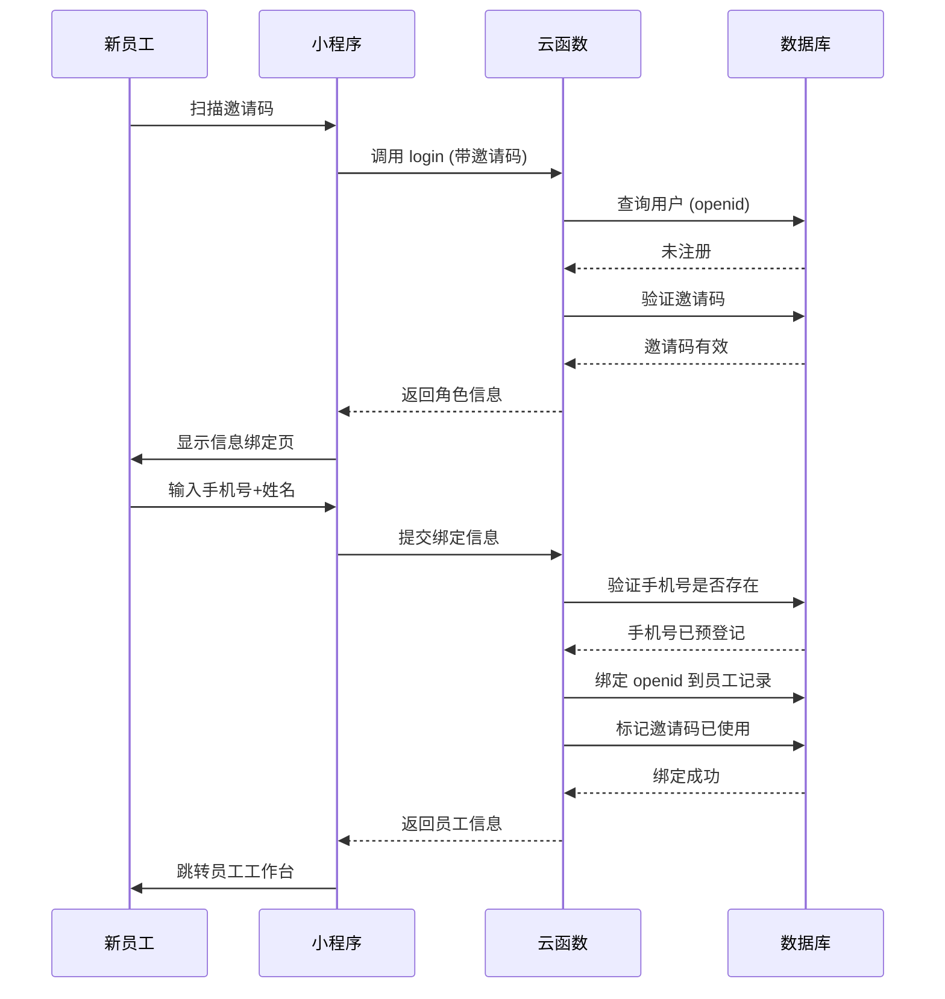

# 员工入职流程

> 基于邀请码的员工信息绑定机制

**创建日期**: 2025-11-05
**最后更新**: 2025-11-05
**维护者**: 产品团队
**源文档**: multi-role-system.md

---

## 相关文档
- [返回业务文档中心](../README.md)
- [系统概述](../architecture/multi-role-overview.md)
- [角色定义详解](../architecture/role-definitions.md)
- [邀请码 API](../api/invite-code-api.md)

---

## 场景2：通过员工邀请码进入 👔

### 触发方式

HR发送给新员工的专属邀请链接。

### 小程序启动参数

```javascript
// 场景值示例
{
  scene: 1011, // 扫描小程序码
  query: {
    invite_code: 'INV-HR-20250102-X7Y9' // 员工邀请码
  }
}
```

---

## 处理流程



---

## 邀请码生成（HR后台功能）

### 生成规则

**格式**：`INV-{角色简称}-{时间戳}-{随机码}`

**示例**：
- `INV-HR-20250102-X7Y9` - HR邀请码
- `INV-AG-20250102-B3K8` - 经纪人邀请码
- `INV-OP-20250102-M5N2` - 运营专员邀请码

### 实现代码

```javascript
// 云函数：generateInviteCode - HR生成邀请码
const cloud = require('wx-server-sdk');
cloud.init({ env: cloud.DYNAMIC_CURRENT_ENV });
const db = cloud.database();

exports.main = async (event, context) => {
  const { OPENID } = cloud.getWXContext();
  const { roleType, employeeName } = event;

  try {
    // 1. 验证调用者权限
    const caller = await db.collection('users')
      .where({ openid: OPENID })
      .get();

    if (caller.data.length === 0 ||
        !['hr_admin', 'super_admin'].includes(caller.data[0].role_type)) {
      throw new Error('无权限生成邀请码');
    }

    // 2. 生成唯一邀请码
    const timestamp = Date.now().toString(36);
    const random = Math.random().toString(36).substring(2, 6).toUpperCase();
    const rolePrefix = roleType.split('_')[0].toUpperCase();
    const inviteCode = `INV-${rolePrefix}-${timestamp}-${random}`;

    // 3. 保存到数据库
    const result = await db.collection('invite_codes').add({
      data: {
        code: inviteCode,
        role_type: roleType,
        employee_name: employeeName,
        created_by: caller.data[0]._id,
        created_at: new Date(),
        expires_at: new Date(Date.now() + 7 * 24 * 60 * 60 * 1000), // 7天有效期
        used: false,
        used_by: null,
        used_at: null
      }
    });

    // 4. 生成小程序码
    const qrCodeResult = await cloud.openapi.wxacode.getUnlimited({
      scene: `invite_code=${inviteCode}`,
      page: 'pages/auth/login/login'
    });

    return {
      success: true,
      inviteCode: inviteCode,
      qrCodeBuffer: qrCodeResult.buffer
    };

  } catch (err) {
    console.error('生成邀请码失败', err);
    return {
      success: false,
      error: err.message
    };
  }
};
```

---

## 员工信息绑定页面

### 页面元素

```
┌─────────────────────────────────────────┐
│  👔 员工信息绑定                         │
│                                          │
│  邀请码：INV-HR-20250102-X7Y9           │
│  职位：HR管理员                          │
│                                          │
│  ────────────────────────────────       │
│                                          │
│  📱 手机号（必填）                       │
│  ┌───────────────────────────┐          │
│  │ 请输入手机号              │          │
│  └───────────────────────────┘          │
│                                          │
│  👤 真实姓名（必填）                     │
│  ┌───────────────────────────┐          │
│  │ 请输入真实姓名            │          │
│  └───────────────────────────┘          │
│                                          │
│  ✅ 验证码（可选）                       │
│  ┌──────────────┐ ┌────────┐           │
│  │ 请输入验证码 │ │ 获取   │           │
│  └──────────────┘ └────────┘           │
│                                          │
│  ────────────────────────────────       │
│                                          │
│  [绑定并登录]                            │
│                                          │
└─────────────────────────────────────────┘
```

### 页面实现

```javascript
// pages/auth/bind-employee/bind-employee.js
Page({
  data: {
    inviteCode: '',
    inviteInfo: null,
    phone: '',
    realName: '',
    verifyCode: ''
  },

  onLoad(options) {
    const { invite_code } = options;
    this.setData({ inviteCode: invite_code });
    this.loadInviteInfo(invite_code);
  },

  // 加载邀请码信息
  async loadInviteInfo(inviteCode) {
    wx.showLoading({ title: '加载中...' });

    try {
      const res = await wx.cloud.callFunction({
        name: 'getInviteCodeInfo',
        data: { inviteCode }
      });

      wx.hideLoading();

      if (res.result.success) {
        this.setData({
          inviteInfo: res.result.inviteInfo
        });
      } else {
        throw new Error(res.result.error);
      }
    } catch (err) {
      wx.hideLoading();
      wx.showModal({
        title: '邀请码无效',
        content: err.message || '邀请码不存在或已过期',
        showCancel: false,
        success: () => {
          wx.navigateBack();
        }
      });
    }
  },

  // 输入事件
  onPhoneInput(e) {
    this.setData({ phone: e.detail.value });
  },

  onNameInput(e) {
    this.setData({ realName: e.detail.value });
  },

  // 获取验证码
  async getVerifyCode() {
    const { phone } = this.data;

    if (!phone || !/^1[3-9]\d{9}$/.test(phone)) {
      wx.showToast({
        title: '请输入正确的手机号',
        icon: 'none'
      });
      return;
    }

    wx.showLoading({ title: '发送中...' });

    try {
      await wx.cloud.callFunction({
        name: 'sendVerifyCode',
        data: { phone }
      });

      wx.hideLoading();
      wx.showToast({
        title: '验证码已发送',
        icon: 'success'
      });
    } catch (err) {
      wx.hideLoading();
      wx.showToast({
        title: '发送失败',
        icon: 'none'
      });
    }
  },

  // 提交绑定
  async submitBinding() {
    const { inviteCode, phone, realName } = this.data;

    // 验证
    if (!phone || !/^1[3-9]\d{9}$/.test(phone)) {
      wx.showToast({
        title: '请输入正确的手机号',
        icon: 'none'
      });
      return;
    }

    if (!realName) {
      wx.showToast({
        title: '请输入真实姓名',
        icon: 'none'
      });
      return;
    }

    wx.showLoading({ title: '绑定中...' });

    try {
      const res = await wx.cloud.callFunction({
        name: 'bindEmployee',
        data: {
          inviteCode,
          phone,
          realName
        }
      });

      wx.hideLoading();

      if (res.result.success) {
        wx.showModal({
          title: '绑定成功',
          content: '欢迎加入团队！',
          showCancel: false,
          success: () => {
            // 跳转员工工作台
            const { roleType } = res.result;
            wx.reLaunch({
              url: getWorkspaceUrl(roleType)
            });
          }
        });
      } else {
        throw new Error(res.result.error);
      }
    } catch (err) {
      wx.hideLoading();
      wx.showModal({
        title: '绑定失败',
        content: err.message || '绑定失败，请稍后重试',
        showCancel: false
      });
    }
  }
});

// 根据角色获取工作台URL
function getWorkspaceUrl(roleType) {
  const urlMap = {
    'hr_admin': '/pages/employee/hr/home/home',
    'agent': '/pages/employee/agent/home/home',
    'operator': '/pages/employee/operator/home/home',
    // ... 其他角色
  };
  return urlMap[roleType] || '/pages/index/index';
}
```

---

## 验证逻辑

### 云函数：绑定员工信息

```javascript
// cloudfunctions/bindEmployee/index.js
const cloud = require('wx-server-sdk');
cloud.init({ env: cloud.DYNAMIC_CURRENT_ENV });
const db = cloud.database();
const _ = db.command;

exports.main = async (event, context) => {
  const { OPENID } = cloud.getWXContext();
  const { inviteCode, phone, realName } = event;

  try {
    // 1. 验证邀请码
    const invite = await db.collection('invite_codes')
      .where({
        code: inviteCode,
        used: false,
        expires_at: _.gt(new Date())
      })
      .get();

    if (invite.data.length === 0) {
      throw new Error('邀请码无效或已过期');
    }

    const inviteData = invite.data[0];

    // 2. 检查手机号是否已预登记
    const employee = await db.collection('employees')
      .where({
        phone: phone,
        status: 'pending_bind' // 待绑定状态
      })
      .get();

    if (employee.data.length === 0) {
      throw new Error('该手机号未在系统中预登记，请联系HR确认');
    }

    const employeeData = employee.data[0];

    // 3. 验证姓名是否匹配
    if (employeeData.real_name !== realName) {
      throw new Error('姓名不匹配，请输入正确的姓名');
    }

    // 4. 验证角色是否匹配
    if (employeeData.role_type !== inviteData.role_type) {
      throw new Error('邀请码与您的职位不匹配');
    }

    // 5. 检查 openid 是否已绑定
    const existingUser = await db.collection('users')
      .where({ openid: OPENID })
      .get();

    if (existingUser.data.length > 0) {
      throw new Error('该微信账号已绑定其他身份');
    }

    // 6. 绑定 openid 到员工记录
    await db.collection('employees').doc(employeeData._id).update({
      data: {
        openid: OPENID,
        status: 'active',
        bound_at: new Date()
      }
    });

    // 7. 创建用户记录
    await db.collection('users').add({
      data: {
        openid: OPENID,
        role_type: employeeData.role_type,
        role_id: employeeData._id,
        created_at: new Date()
      }
    });

    // 8. 标记邀请码已使用
    await db.collection('invite_codes').doc(inviteData._id).update({
      data: {
        used: true,
        used_by: employeeData._id,
        used_at: new Date()
      }
    });

    return {
      success: true,
      employeeId: employeeData._id,
      roleType: employeeData.role_type
    };

  } catch (err) {
    console.error('绑定员工失败', err);
    return {
      success: false,
      error: err.message
    };
  }
};
```

---

## 员工预登记流程

### HR后台操作

**步骤1：创建员工记录（预登记）**

```javascript
// 云函数：createEmployee - HR创建待绑定的员工记录
exports.main = async (event, context) => {
  const { realName, phone, roleType, department } = event;

  try {
    // 验证权限（省略）

    // 创建员工记录
    const result = await db.collection('employees').add({
      data: {
        real_name: realName,
        phone: phone,
        role_type: roleType,
        department: department,
        openid: null, // 暂时为空
        status: 'pending_bind', // 待绑定
        created_by: hrUserId,
        created_at: new Date()
      }
    });

    return {
      success: true,
      employeeId: result._id
    };

  } catch (err) {
    return {
      success: false,
      error: err.message
    };
  }
};
```

**步骤2：生成对应角色的邀请码**

使用前面提到的 `generateInviteCode` 云函数。

**步骤3：发送邀请码给新员工**

- 通过微信发送小程序码图片
- 通过短信发送邀请链接
- 通过邮件发送邀请信息

**步骤4：新员工扫码后自动绑定**

按照前述流程完成绑定。

---

## 邀请码管理

### 有效期管理

- ⏱ **默认有效期**：7天
- ♻️ **可重新生成**：过期后HR可重新生成
- 🔒 **一次性使用**：每个邀请码只能使用一次
- ❌ **可作废**：HR可手动作废未使用的邀请码

### 邀请码列表页面

```javascript
// pages/employee/hr/invites/list/list.js
Page({
  data: {
    inviteCodes: []
  },

  onShow() {
    this.loadInviteCodes();
  },

  async loadInviteCodes() {
    const res = await wx.cloud.callFunction({
      name: 'getInviteCodes'
    });

    if (res.result.success) {
      this.setData({
        inviteCodes: res.result.codes
      });
    }
  },

  // 作废邀请码
  async revokeCode(e) {
    const { id } = e.currentTarget.dataset;

    wx.showModal({
      title: '确认作废',
      content: '作废后该邀请码将无法使用',
      success: async (res) => {
        if (res.confirm) {
          await wx.cloud.callFunction({
            name: 'revokeInviteCode',
            data: { codeId: id }
          });

          wx.showToast({
            title: '已作废',
            icon: 'success'
          });

          this.loadInviteCodes();
        }
      }
    });
  }
});
```

---

## 安全机制

### 防止暴力破解

```javascript
// 限制邀请码验证次数
const MAX_VERIFY_ATTEMPTS = 5;
const LOCK_DURATION = 30 * 60 * 1000; // 30分钟

async function checkVerifyAttempts(openid) {
  const key = `invite_verify:${openid}`;

  // 获取尝试次数（使用云开发的数据库或缓存）
  const attempts = await getAttemptCount(key);

  if (attempts >= MAX_VERIFY_ATTEMPTS) {
    throw new Error('验证次数过多，请在30分钟后重试');
  }

  // 增加尝试次数
  await incrementAttemptCount(key, LOCK_DURATION);
}
```

### 验证规则

```javascript
async function verifyInviteCode(code) {
  const invite = await db.collection('invite_codes')
    .where({ code })
    .get();

  // 检查1: 邀请码是否存在
  if (invite.data.length === 0) {
    throw new Error('邀请码不存在');
  }

  const inviteData = invite.data[0];

  // 检查2: 是否已使用
  if (inviteData.used) {
    throw new Error('该邀请码已被使用');
  }

  // 检查3: 是否过期
  if (new Date() > new Date(inviteData.expires_at)) {
    throw new Error('邀请码已过期');
  }

  return inviteData;
}
```

---

## 下一步阅读

- [星探推荐流程](./scout-referral.md) - 星探推荐码机制
- [邀请码 API](../api/invite-code-api.md) - 邀请码相关云函数
- [角色定义详解](../architecture/role-definitions.md) - 内部员工角色说明

---

**文档版本**: v1.0
**最后更新**: 2025-11-05
**维护者**: 产品团队
