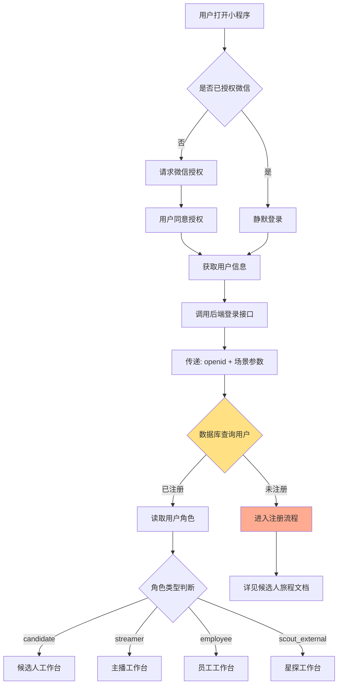

# 登录和角色识别流程

> 基于微信授权的智能登录和自动路由设计

**创建日期**: 2025-11-05
**最后更新**: 2025-11-05
**维护者**: 产品团队
**源文档**: multi-role-system.md

---

## 相关文档
- [返回业务文档中心](../README.md)
- [系统概述](../architecture/multi-role-overview.md)
- [角色定义详解](../architecture/role-definitions.md)
- [候选人旅程](./candidate-journey.md)

---

## 完整流程图



---

## 技术实现要点

### 1. 微信授权登录

#### 首次登录

**场景**：用户首次打开小程序，尚未授权

```javascript
// app.js - 小程序启动
onLaunch(options) {
  // 获取场景参数
  this.globalData.sceneParams = {
    scene: options.scene,
    query: options.query,
    referrerInfo: options.referrerInfo
  };

  // 检查是否授权
  wx.getSetting({
    success: (res) => {
      if (res.authSetting['scope.userInfo']) {
        // 已授权，静默登录
        this.silentLogin();
      } else {
        // 未授权，跳转授权页
        wx.navigateTo({
          url: '/pages/auth/login/login'
        });
      }
    }
  });
}
```

#### 授权页面实现

```javascript
// pages/auth/login/login.js
Page({
  data: {
    canIUse: wx.canIUse('button.open-type.getUserInfo')
  },

  // 用户点击授权按钮
  bindGetUserInfo(e) {
    if (e.detail.userInfo) {
      // 用户同意授权
      this.doLogin(e.detail.userInfo);
    } else {
      // 用户拒绝授权
      wx.showModal({
        title: '提示',
        content: '需要您的授权才能使用小程序',
        showCancel: false
      });
    }
  },

  async doLogin(userInfo) {
    wx.showLoading({ title: '登录中...' });

    try {
      // 调用登录云函数
      const res = await wx.cloud.callFunction({
        name: 'login',
        data: {
          userInfo: userInfo,
          sceneParams: getApp().globalData.sceneParams
        }
      });

      wx.hideLoading();

      if (res.result.registered) {
        // 已注册，跳转对应工作台
        getApp().routeToWorkspace(res.result.userRole);
      } else {
        // 未注册，进入注册流程
        getApp().handleUnregistered(res.result);
      }
    } catch (err) {
      wx.hideLoading();
      wx.showToast({
        title: '登录失败',
        icon: 'none'
      });
    }
  }
});
```

---

### 2. 静默登录

**场景**：用户已授权，再次打开小程序

```javascript
// app.js
silentLogin() {
  wx.cloud.callFunction({
    name: 'login',
    data: {
      sceneParams: this.globalData.sceneParams
    }
  }).then(res => {
    if (res.result.registered) {
      // 已注册，跳转对应工作台
      this.routeToWorkspace(res.result.userRole);
    } else {
      // 未注册，进入注册流程
      this.handleUnregistered(res.result);
    }
  });
}
```

---

### 3. 角色识别逻辑

#### 后端云函数

```javascript
// cloudfunctions/login/index.js
const cloud = require('wx-server-sdk');
cloud.init({ env: cloud.DYNAMIC_CURRENT_ENV });
const db = cloud.database();

exports.main = async (event, context) => {
  const { OPENID } = cloud.getWXContext();
  const { sceneParams } = event;

  // 1. 查询用户是否已注册
  const userRecord = await db.collection('users')
    .where({ openid: OPENID })
    .get();

  if (userRecord.data.length > 0) {
    // 已注册，返回角色信息
    const user = userRecord.data[0];
    return {
      registered: true,
      userId: user._id,
      userRole: user.role_type,
      roleData: await getRoleData(user.role_type, user.role_id)
    };
  } else {
    // 未注册，返回场景参数用于注册
    return {
      registered: false,
      openid: OPENID,
      sceneParams: sceneParams
    };
  }
};

// 获取角色详细数据
async function getRoleData(roleType, roleId) {
  switch (roleType) {
    case 'candidate':
      return await db.collection('candidates').doc(roleId).get();
    case 'streamer':
      return await db.collection('streamers').doc(roleId).get();
    case 'agent':
      return await db.collection('agents').doc(roleId).get();
    case 'scout_external':
      return await db.collection('scouts').doc(roleId).get();
    // ... 其他角色
    default:
      return null;
  }
}
```

---

### 4. 自动路由跳转

#### 根据角色跳转

```javascript
// app.js
routeToWorkspace(roleType) {
  const routeMap = {
    'candidate': '/pages/candidate/home/home',
    'streamer': '/pages/streamer/home/home',
    'hr_admin': '/pages/employee/hr/home/home',
    'agent': '/pages/employee/agent/home/home',
    'operator': '/pages/employee/operator/home/home',
    'dance_teacher': '/pages/employee/teacher/home/home',
    'makeup_artist': '/pages/employee/teacher/home/home',
    'stylist': '/pages/employee/teacher/home/home',
    'finance': '/pages/employee/finance/home/home',
    'videographer': '/pages/employee/videographer/home/home',
    'scout_external': '/pages/scout-external/home/home'
  };

  const targetPage = routeMap[roleType] || '/pages/auth/role-select/role-select';

  wx.reLaunch({ url: targetPage });
}
```

#### 处理未注册用户

```javascript
// app.js
handleUnregistered(result) {
  const { sceneParams } = result;

  // 检查场景参数
  if (sceneParams && sceneParams.query) {
    const { invite_code, scout_code } = sceneParams.query;

    if (scout_code) {
      // 有星探推荐码，跳转报名页
      wx.navigateTo({
        url: `/pages/candidate/apply/apply?scout_code=${scout_code}`
      });
    } else if (invite_code) {
      // 有员工邀请码，跳转绑定页
      wx.navigateTo({
        url: `/pages/auth/bind-employee/bind-employee?invite_code=${invite_code}`
      });
    } else {
      // 无参数，显示身份选择页
      wx.navigateTo({
        url: '/pages/auth/role-select/role-select'
      });
    }
  } else {
    // 无参数，显示身份选择页
    wx.navigateTo({
      url: '/pages/auth/role-select/role-select'
    });
  }
}
```

---

## 场景参数处理

### 支持的场景参数

| 参数名 | 含义 | 示例 | 处理方式 |
|-------|------|------|---------|
| `scout_code` | 星探推荐码 | `SC-EXT-20250102-A3B9` | 跳转候选人报名页 |
| `invite_code` | 员工邀请码 | `INV-HR-20250102-X7Y9` | 跳转员工绑定页 |
| 无参数 | 直接搜索小程序 | - | 显示身份选择页 |

### 场景参数获取

```javascript
// app.js
onLaunch(options) {
  // 保存场景参数
  this.globalData.sceneParams = {
    scene: options.scene,
    query: options.query,
    referrerInfo: options.referrerInfo
  };

  // 解析场景参数
  this.parseSceneParams(options);
}

parseSceneParams(options) {
  const { scene, query } = options;

  // 场景1: 扫描二维码/小程序码
  if (scene === 1011 || scene === 1047) {
    if (query && query.scout_code) {
      this.globalData.entryType = 'scout_referral';
      this.globalData.scoutCode = query.scout_code;
    } else if (query && query.invite_code) {
      this.globalData.entryType = 'employee_invite';
      this.globalData.inviteCode = query.invite_code;
    }
  }
  // 场景2: 直接搜索
  else if (scene === 1001) {
    this.globalData.entryType = 'direct';
  }
  // 场景3: 聊天附件栏
  else if (scene === 1104) {
    this.globalData.entryType = 'share';
  }
}
```

---

## 登录状态管理

### 1. 全局状态存储

```javascript
// app.js
App({
  globalData: {
    // 用户信息
    userInfo: null,
    openId: null,
    userId: null,
    userRole: null,

    // 场景参数
    sceneParams: null,
    entryType: null,
    scoutCode: null,
    inviteCode: null,

    // 登录状态
    isLoggedIn: false,
    isFirstLogin: false
  },

  // 更新用户信息
  updateUserInfo(userInfo) {
    this.globalData.userInfo = userInfo;
    this.globalData.userId = userInfo._id;
    this.globalData.userRole = userInfo.role_type;
    this.globalData.isLoggedIn = true;

    // 保存到本地缓存
    wx.setStorageSync('userInfo', userInfo);
  },

  // 清除登录状态
  clearUserInfo() {
    this.globalData.userInfo = null;
    this.globalData.userId = null;
    this.globalData.userRole = null;
    this.globalData.isLoggedIn = false;

    wx.removeStorageSync('userInfo');
  }
});
```

### 2. 登录状态检查

```javascript
// utils/auth.js
function checkLogin() {
  const app = getApp();

  if (!app.globalData.isLoggedIn) {
    // 未登录，跳转登录页
    wx.showModal({
      title: '提示',
      content: '请先登录',
      success: (res) => {
        if (res.confirm) {
          wx.reLaunch({
            url: '/pages/auth/login/login'
          });
        }
      }
    });
    return false;
  }

  return true;
}

module.exports = {
  checkLogin
};
```

### 3. 页面级登录检查

```javascript
// pages/candidate/home/home.js
const { checkLogin } = require('../../utils/auth.js');

Page({
  onLoad() {
    // 检查登录状态
    if (!checkLogin()) {
      return;
    }

    // 加载页面数据
    this.loadData();
  }
});
```

---

## Token 管理（可选）

### 1. 生成自定义登录凭证

```javascript
// cloudfunctions/login/index.js
const jwt = require('jsonwebtoken');

exports.main = async (event, context) => {
  const { OPENID } = cloud.getWXContext();

  // 查询用户
  const user = await db.collection('users')
    .where({ openid: OPENID })
    .get();

  if (user.data.length > 0) {
    const userData = user.data[0];

    // 生成 JWT Token
    const token = jwt.sign(
      {
        userId: userData._id,
        openid: OPENID,
        role: userData.role_type
      },
      'your-secret-key',
      { expiresIn: '7d' }
    );

    return {
      registered: true,
      token: token,
      userInfo: userData
    };
  }
};
```

### 2. Token 验证

```javascript
// cloudfunctions/verifyToken/index.js
const jwt = require('jsonwebtoken');

exports.main = async (event, context) => {
  const { token } = event;

  try {
    const decoded = jwt.verify(token, 'your-secret-key');
    return {
      valid: true,
      userId: decoded.userId,
      role: decoded.role
    };
  } catch (err) {
    return {
      valid: false,
      error: 'Token 无效或已过期'
    };
  }
};
```

---

## 登录安全机制

### 1. 防止重复登录

```javascript
// cloudfunctions/login/index.js
exports.main = async (event, context) => {
  const { OPENID } = cloud.getWXContext();

  // 检查是否有活跃的登录会话
  const activeSession = await db.collection('sessions')
    .where({
      openid: OPENID,
      status: 'active',
      expiresAt: db.command.gt(new Date())
    })
    .get();

  if (activeSession.data.length > 0) {
    // 已有活跃会话，返回现有会话
    return {
      registered: true,
      sessionId: activeSession.data[0]._id,
      userInfo: activeSession.data[0].userInfo
    };
  }

  // 创建新会话
  // ...
};
```

### 2. 登录日志记录

```javascript
// 记录登录日志
async function recordLoginLog(userId, openid, sceneParams) {
  await db.collection('login_logs').add({
    data: {
      userId: userId,
      openid: openid,
      scene: sceneParams.scene,
      query: sceneParams.query,
      loginAt: new Date(),
      ip: context.ENV,
      userAgent: context.ENV
    }
  });
}
```

---

## 错误处理

### 常见错误及处理

```javascript
// cloudfunctions/login/index.js
exports.main = async (event, context) => {
  try {
    const { OPENID } = cloud.getWXContext();

    if (!OPENID) {
      throw new Error('获取用户信息失败');
    }

    // ... 登录逻辑

  } catch (err) {
    console.error('登录失败', err);

    return {
      success: false,
      error: {
        code: err.code || 'UNKNOWN_ERROR',
        message: err.message || '登录失败，请稍后重试'
      }
    };
  }
};
```

### 前端错误提示

```javascript
// pages/auth/login/login.js
async doLogin(userInfo) {
  try {
    const res = await wx.cloud.callFunction({
      name: 'login',
      data: { userInfo }
    });

    if (!res.result.success) {
      throw new Error(res.result.error.message);
    }

    // 登录成功
    // ...

  } catch (err) {
    wx.showModal({
      title: '登录失败',
      content: err.message || '网络错误，请稍后重试',
      showCancel: false
    });
  }
}
```

---

## 下一步阅读

- [候选人旅程](./candidate-journey.md) - 候选人完整流程
- [员工入职流程](./employee-onboarding.md) - 员工邀请码机制
- [星探推荐流程](./scout-referral.md) - 星探推荐码处理

---

**文档版本**: v1.0
**最后更新**: 2025-11-05
**维护者**: 产品团队
