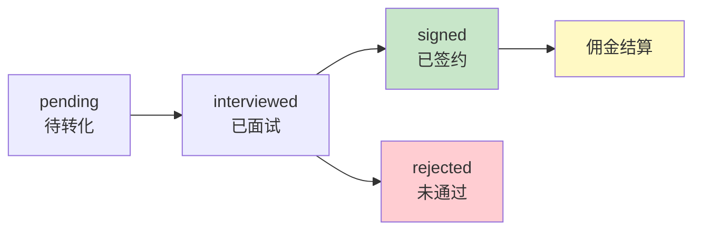

# 星探推荐流程

> 外部星探推荐码机制和佣金计算

**创建日期**: 2025-11-05
**最后更新**: 2025-11-05
**维护者**: 产品团队
**源文档**: multi-role-system.md

---

## 相关文档
- [返回业务文档中心](../README.md)
- [系统概述](../architecture/multi-role-overview.md)
- [候选人旅程](./candidate-journey.md)
- [邀请码 API](../api/invite-code-api.md)

---

## 星探推荐码机制

### 生成规则

**格式**：`SC-{类型}-{时间戳}-{随机码}`

**类型**：
- `INT` - 内部专职星探
- `EXT` - 外部合作星探

**示例**：
- `SC-INT-20250102-A3B9` - 内部星探推荐码
- `SC-EXT-20250102-K7M5` - 外部星探推荐码

### 推荐码特性

- 🔄 **永久有效**：星探推荐码长期有效
- ♾️ **无限使用**：可以推荐无限多人
- 📊 **数据追踪**：记录每个推荐的转化情况
- 💰 **佣金绑定**：自动绑定佣金关系

---

## 佣金计算规则

### 签约奖金

- 候选人成功签约 → 星探获得 ¥500 签约奖金

### 持续佣金（前3个月）

- 主播月收益 × 5% = 星探月佣金

### 示例

```
第1个月：主播收益 ¥10,000 → 星探佣金 ¥500
第2个月：主播收益 ¥15,000 → 星探佣金 ¥750
第3个月：主播收益 ¥20,000 → 星探佣金 ¥1,000
─────────────────────────────────────────
签约奖金：¥500
持续佣金：¥2,250
总计佣金：¥2,750
```

---

## 推荐关系追踪

### 数据模型

```javascript
// referral_records 表
{
  _id: 'ref_001',
  candidate_id: 'user_123',
  scout_id: 'scout_456',
  scout_type: 'external', // internal / external
  scout_code: 'SC-EXT-20250102-K7M5',

  // 推荐信息
  referred_at: '2025-01-05',
  status: 'signed', // pending / interviewed / signed / rejected

  // 佣金信息
  commission: {
    sign_bonus: 500, // 签约奖金
    commission_rate: 0.05, // 5%
    total_commission: 2750.00, // 总佣金
    paid_commission: 2750.00, // 已支付
    last_commission_date: '2025-04-30' // 最后佣金日期
  }
}
```

### 推荐状态流转



---

## 星探工作台设计

### 首页布局

```
┌─────────────────────────────┐
│  🔍 星探：王推荐             │
│  佣金等级：金牌星探          │
└─────────────────────────────┘

┌─────────────────────────────┐
│  📊 本月数据                 │
│  推荐人数: 8人               │
│  成功签约: 3人               │
│  佣金收入: ¥4,500           │
└─────────────────────────────┘

┌─────────────────────────────┐
│  📱 我的推荐码               │
│  SC-EXT-20250102-A3B9       │
│  [复制] [生成二维码]         │
└─────────────────────────────┘

┌─────────────────────────────┐
│  👥 推荐记录 (8人)           │
│  待面试: 2人                │
│  面试中: 3人                │
│  已签约: 3人                │
│  [查看详情]                  │
└─────────────────────────────┘

┌─────────────────────────────┐
│  💰 佣金明细                 │
│  本月: ¥4,500               │
│  累计: ¥28,900              │
│  可提现: ¥15,000            │
│  [去提现]                   │
└─────────────────────────────┘
```

### 核心功能实现

#### 1. 生成推荐码

```javascript
// pages/scout-external/home/home.js
Page({
  data: {
    scoutCode: '',
    qrCodeUrl: ''
  },

  onShow() {
    this.loadScoutInfo();
  },

  async loadScoutInfo() {
    const res = await wx.cloud.callFunction({
      name: 'getScoutInfo'
    });

    if (res.result.success) {
      this.setData({
        scoutCode: res.result.scout.scout_code,
        scoutInfo: res.result.scout
      });
      this.generateQRCode();
    }
  },

  // 生成二维码
  async generateQRCode() {
    const res = await wx.cloud.callFunction({
      name: 'generateScoutQRCode',
      data: {
        scoutCode: this.data.scoutCode
      }
    });

    if (res.result.success) {
      this.setData({
        qrCodeUrl: res.result.qrCodeUrl
      });
    }
  },

  // 复制推荐码
  copyCode() {
    wx.setClipboardData({
      data: this.data.scoutCode,
      success: () => {
        wx.showToast({
          title: '已复制',
          icon: 'success'
        });
      }
    });
  },

  // 分享推荐码
  shareCode() {
    const { scoutCode } = this.data;
    const shareUrl = `pages/index/index?scout_code=${scoutCode}`;

    wx.navigateTo({
      url: `/pages/scout-external/share/share?url=${encodeURIComponent(shareUrl)}`
    });
  }
});
```

#### 2. 查看推荐记录

```javascript
// pages/scout-external/candidates/list/list.js
Page({
  data: {
    candidates: [],
    filter: 'all' // all / pending / interviewed / signed / rejected
  },

  onShow() {
    this.loadCandidates();
  },

  async loadCandidates() {
    const res = await wx.cloud.callFunction({
      name: 'getScoutReferrals',
      data: {
        filter: this.data.filter
      }
    });

    if (res.result.success) {
      this.setData({
        candidates: res.result.referrals
      });
    }
  },

  // 切换筛选
  onFilterChange(e) {
    this.setData({
      filter: e.currentTarget.dataset.filter
    });
    this.loadCandidates();
  },

  // 查看候选人详情
  viewCandidate(e) {
    const { id } = e.currentTarget.dataset;
    wx.navigateTo({
      url: `/pages/scout-external/candidates/detail/detail?id=${id}`
    });
  }
});
```

#### 3. 查看佣金明细

```javascript
// pages/scout-external/commission/list/list.js
Page({
  data: {
    commissions: [],
    totalCommission: 0,
    paidCommission: 0,
    pendingCommission: 0
  },

  onShow() {
    this.loadCommissions();
  },

  async loadCommissions() {
    const res = await wx.cloud.callFunction({
      name: 'getScoutCommissions'
    });

    if (res.result.success) {
      this.setData({
        commissions: res.result.commissions,
        totalCommission: res.result.total,
        paidCommission: res.result.paid,
        pendingCommission: res.result.pending
      });
    }
  },

  // 查看佣金详情
  viewCommission(e) {
    const { id } = e.currentTarget.dataset;
    wx.navigateTo({
      url: `/pages/scout-external/commission/detail/detail?id=${id}`
    });
  }
});
```

#### 4. 申请提现

```javascript
// pages/scout-external/commission/withdraw/withdraw.js
Page({
  data: {
    availableAmount: 0,
    withdrawAmount: '',
    bankInfo: null
  },

  onLoad() {
    this.loadWithdrawInfo();
  },

  async loadWithdrawInfo() {
    const res = await wx.cloud.callFunction({
      name: 'getWithdrawInfo'
    });

    if (res.result.success) {
      this.setData({
        availableAmount: res.result.availableAmount,
        bankInfo: res.result.bankInfo
      });
    }
  },

  // 提交提现申请
  async submitWithdraw() {
    const { withdrawAmount, availableAmount } = this.data;

    // 验证
    if (!withdrawAmount || withdrawAmount <= 0) {
      wx.showToast({
        title: '请输入提现金额',
        icon: 'none'
      });
      return;
    }

    if (withdrawAmount > availableAmount) {
      wx.showToast({
        title: '余额不足',
        icon: 'none'
      });
      return;
    }

    wx.showLoading({ title: '提交中...' });

    try {
      const res = await wx.cloud.callFunction({
        name: 'submitWithdrawRequest',
        data: {
          amount: parseFloat(withdrawAmount)
        }
      });

      wx.hideLoading();

      if (res.result.success) {
        wx.showModal({
          title: '提现申请已提交',
          content: '预计3个工作日内到账',
          showCancel: false,
          success: () => {
            wx.navigateBack();
          }
        });
      }
    } catch (err) {
      wx.hideLoading();
      wx.showToast({
        title: err.message || '提交失败',
        icon: 'none'
      });
    }
  }
});
```

---

## 佣金结算流程

### 签约奖金结算

```javascript
// 云函数：候选人签约时触发
exports.main = async (event, context) => {
  const { candidateId, contractId } = event;

  // 1. 查询推荐记录
  const referral = await db.collection('referral_records')
    .where({ candidate_id: candidateId })
    .get();

  if (referral.data.length === 0) {
    // 非推荐候选人，跳过
    return { success: true };
  }

  const referralData = referral.data[0];

  // 2. 更新推荐状态为已签约
  await db.collection('referral_records')
    .doc(referralData._id)
    .update({
      data: {
        status: 'signed',
        signed_at: new Date(),
        contract_id: contractId,

        'commission.sign_bonus': 500,
        'commission.sign_bonus_status': 'pending'
      }
    });

  // 3. 创建佣金结算记录
  await db.collection('commission_settlements').add({
    data: {
      referral_id: referralData._id,
      scout_id: referralData.scout_id,
      type: 'sign_bonus',
      amount: 500,
      status: 'pending_payment',
      created_at: new Date()
    }
  });

  return { success: true };
};
```

### 月佣金结算（定时任务）

```javascript
// 云函数：monthlyCommissionSettlement - 每月1号执行
exports.main = async (event, context) => {
  // 1. 查询上月所有已签约的推荐记录（3个月内）
  const threeMonthsAgo = new Date();
  threeMonthsAgo.setMonth(threeMonthsAgo.getMonth() - 3);

  const referrals = await db.collection('referral_records')
    .where({
      status: 'signed',
      signed_at: db.command.gte(threeMonthsAgo)
    })
    .get();

  // 2. 遍历每个推荐记录，计算佣金
  for (const referral of referrals.data) {
    const candidateId = referral.candidate_id;

    // 2.1 获取候选人上月收益
    const lastMonthIncome = await getLastMonthIncome(candidateId);

    if (lastMonthIncome > 0) {
      const commission = lastMonthIncome * 0.05; // 5%

      // 2.2 创建佣金结算记录
      await db.collection('commission_settlements').add({
        data: {
          referral_id: referral._id,
          scout_id: referral.scout_id,
          type: 'monthly_commission',
          amount: commission,
          month: getLastMonth(),
          status: 'pending_payment',
          created_at: new Date()
        }
      });

      // 2.3 更新推荐记录的总佣金
      await db.collection('referral_records')
        .doc(referral._id)
        .update({
          data: {
            'commission.total_commission': db.command.inc(commission),
            'commission.last_commission_date': new Date()
          }
        });
    }
  }

  return { success: true };
};
```

---

## 防滥用机制

### 限制规则

- ⏱ **频率限制**：同一星探每天最多推荐10人
- 🔍 **异常检测**：识别批量注册行为
- ❌ **黑名单机制**：作弊星探永久封禁

### 实现

```javascript
// 检查推荐频率
async function checkRecommendFrequency(scoutId) {
  const today = new Date().toISOString().split('T')[0];

  const count = await db.collection('referral_records')
    .where({
      scout_id: scoutId,
      referred_at: db.command.gte(new Date(today))
    })
    .count();

  if (count.total >= 10) {
    throw new Error('今日推荐次数已达上限（10人/天）');
  }
}

// 异常检测
async function detectAbnormalBehavior(scoutId) {
  // 检测1: 短时间内大量推荐
  const last1Hour = await db.collection('referral_records')
    .where({
      scout_id: scoutId,
      referred_at: db.command.gte(new Date(Date.now() - 60 * 60 * 1000))
    })
    .count();

  if (last1Hour.total > 5) {
    await flagScoutForReview(scoutId, '短时间内大量推荐');
  }

  // 检测2: 推荐的候选人质量过低
  const recentReferrals = await db.collection('referral_records')
    .where({
      scout_id: scoutId,
      referred_at: db.command.gte(new Date(Date.now() - 7 * 24 * 60 * 60 * 1000))
    })
    .get();

  const rejectedCount = recentReferrals.data.filter(r => r.status === 'rejected').length;
  const rejectionRate = rejectedCount / recentReferrals.data.length;

  if (rejectionRate > 0.8 && recentReferrals.data.length > 5) {
    await flagScoutForReview(scoutId, '推荐质量过低');
  }
}
```

---

## 下一步阅读

- [候选人旅程](./candidate-journey.md) - 候选人完整流程
- [邀请码 API](../api/invite-code-api.md) - 推荐码相关云函数
- [角色升级机制](../architecture/upgrade-mechanism.md) - 候选人升级触发佣金

---

**文档版本**: v1.0
**最后更新**: 2025-11-05
**维护者**: 产品团队
