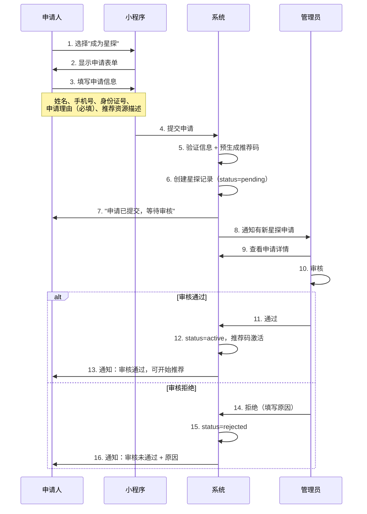
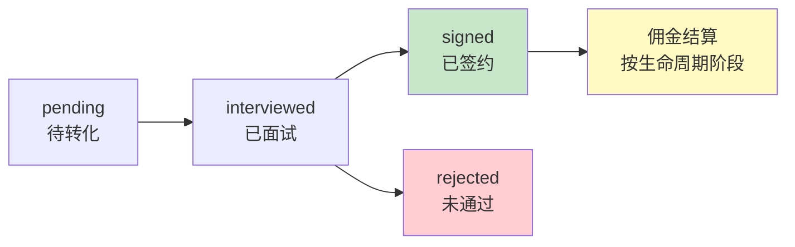

# 星探推荐流程

> 外部星探推荐码机制、审核准入制和差异化佣金计算

**创建日期**: 2025-11-05
**最后更新**: 2026-03-13
**维护者**: 产品团队
**版本**: v2.0

---

## 相关文档
- [返回业务文档中心](../README.md)
- [系统概述](../architecture/multi-role-overview.md)
- [候选人旅程](./candidate-journey.md)
- [推荐码 API](../api/invite-code-api.md)
- [星探体系改造设计文档](../../dev-logs/2026-03/scout-system-redesign-2026-03-13.md)

---

## 星探等级体系

### 三级结构（直营模式）


```mermaid
graph LR
    A[新锐星探<br/>Rookie Scout] -->|签约≥5人| B[特约星探<br/>Special Scout]
    B -->|签约≥20人| C[合伙人星探<br/>Partner Scout]

    style A fill:#4CAF50,color:#fff
    style B fill:#2196f3,color:#fff
    style C fill:#ff9800,color:#fff
```

### 等级对比

| 特性 | 新锐星探 | 特约星探 | 合伙人星探 |
|------|---------|---------|----------|
| **等级代码** | `rookie` | `special` | `partner` |
| **推荐码** | 有 | 有 | 有 |
| **推荐候选人** | 可以 | 可以 | 可以 |
| **签约奖金** | ¥200-500 | ¥300-800 | ¥500-1,200 |
| **月度佣金** | 2%-3% | 3%-5% | 3%-8% |
| **佣金周期** | 培养期+成长期 | 培养期+成长期+稳定期 | 全生命周期 |
| **升级方式** | 审核通过即为新锐 | 自动（签约≥5人） | 自动（签约≥20人） |

---

## 星探申请审核流程

### 申请流程

所有星探必须通过审核制注册，不再支持直接注册或邀请码注册。


```mermaid
sequenceDiagram
    participant U as 申请人
    participant MP as 小程序
    participant SYS as 系统
    participant AD as 管理员

    U->>MP: 1. 选择"成为星探"
    MP->>U: 2. 显示申请表单

    U->>MP: 3. 填写申请信息
    Note over U,MP: 姓名、手机号、身份证号、<br/>申请理由（必填）、推荐资源描述

    MP->>SYS: 4. 提交申请
    SYS->>SYS: 5. 验证信息 + 预生成推荐码
    SYS->>SYS: 6. 创建星探记录（status=pending）

    SYS->>U: 7. "申请已提交，等待审核"
    SYS->>AD: 8. 通知有新星探申请

    AD->>SYS: 9. 查看申请详情
    AD->>AD: 10. 审核

    alt 审核通过
        AD->>SYS: 11. 通过
        SYS->>SYS: 12. status=active，推荐码激活
        SYS->>U: 13. 通知：审核通过，可开始推荐
    else 审核拒绝
        AD->>SYS: 14. 拒绝（填写原因）
        SYS->>SYS: 15. status=rejected
        SYS->>U: 16. 通知：审核未通过 + 原因
    end
```

### 申请表单

| 字段 | 类型 | 必填 | 验证规则 | 说明 |
|------|------|------|---------|------|
| 姓名 | 文本 | 是 | 1-20位，中文/英文 | 真实姓名 |
| 手机号 | 文本 | 是 | 11位手机号格式 | 联系电话 |
| 身份证号 | 文本 | 是 | 18位身份证格式 | 身份验证 |
| 申请理由 | 多行文本 | 是 | 10-500字 | 为什么想成为星探 |
| 推荐资源描述 | 多行文本 | 否 | ≤500字 | 拥有的推荐渠道和资源 |

---

## 星探推荐码机制

### 生成规则

**格式**：`SC-{类型}-{时间戳}-{随机码}`

**类型**：
- `INT` - 内部专职星探
- `EXT` - 外部合作星探

**示例**：
- `SC-INT-20260313-A3B9` - 内部星探推荐码
- `SC-EXT-20260313-K7M5` - 外部星探推荐码

### 推荐码特性

- 永久有效：星探推荐码长期有效
- 无限使用：可以推荐无限多人
- 数据追踪：记录每个推荐的转化情况
- 佣金绑定：自动绑定佣金关系
- 所有等级：新锐/特约/合伙人星探都有推荐码

---

## 佣金计算规则

### 签约奖金（一次性）

签约奖金按星探等级和主播级别确定：

| 星探等级 | SS级主播 | S级主播 | A级主播 | B级主播 |
|---------|---------|---------|---------|---------|
| 新锐星探 | ¥500 | ¥400 | ¥300 | ¥200 |
| 特约星探 | ¥800 | ¥600 | ¥500 | ¥300 |
| 合伙人星探 | ¥1,200 | ¥1,000 | ¥800 | ¥500 |

### 月度佣金（按生命周期阶段）

| 星探等级 | 培养期(1-2月) | 成长期(3-4月) | 稳定期(5-6月) | 成熟期(7月+) |
|---------|-------------|-------------|-------------|-------------|
| 新锐星探 | 3% | 2% | - | - |
| 特约星探 | 5% | 4% | 3% | - |
| 合伙人星探 | 8% | 6% | 5% | 3% |

"-" 表示该阶段不再获得佣金。

### 结算周期

- **签约奖金**：主播签约后，次月15日结算
- **月度佣金**：每月1日计算上月佣金，15日发放
- **最低提现**：¥100 起提

### 示例

```
星探等级：特约星探
推荐主播：A级主播

签约奖金：¥500（次月15日发放）

培养期（第1-2月）：佣金比例 5%
  第1月：¥8,000 × 5% = ¥400
  第2月：¥12,000 × 5% = ¥600

成长期（第3-4月）：佣金比例 4%
  第3月：¥15,000 × 4% = ¥600
  第4月：¥18,000 × 4% = ¥720

稳定期（第5-6月）：佣金比例 3%
  第5月：¥20,000 × 3% = ¥600
  第6月：¥22,000 × 3% = ¥660

第7月起：特约星探不再获得佣金

总计：¥500 + ¥400 + ¥600 + ¥600 + ¥720 + ¥600 + ¥660 = ¥4,080
```

---

## 推荐关系追踪

### 数据模型

```javascript
// candidates 集合中的推荐信息
{
  referral: {
    scoutId: "scout_id",
    scoutName: "张星探",
    scoutShareCode: "SC-EXT-20260313-A3B9",
    scoutGrade: "special",  // rookie/special/partner
    referredAt: "2026-03-13"
  },
  anchorLevel: {
    current: "a",           // ss/s/a/b
    initialLevel: "a"
  },
  lifecycleStage: "nurturing" // signed/nurturing/growing/stable/mature/renewal
}
```

### 推荐状态流转


```mermaid
graph LR
    A[pending<br/>待转化] --> B[interviewed<br/>已面试]
    B --> C[signed<br/>已签约]
    B --> D[rejected<br/>未通过]

    C --> E[佣金结算<br/>按生命周期阶段]

    style C fill:#c8e6c9
    style D fill:#ffcdd2
    style E fill:#fff9c4
```

---

## 星探工作台设计

### 首页布局

```
┌─────────────────────────────┐
│  星探：王推荐                │
│  等级：特约星探              │
│  ━━━━━━━━━━●━━━━━━━        │
│  签约 8/20 → 合伙人         │
└─────────────────────────────┘

┌─────────────────────────────┐
│  本月数据                    │
│  推荐人数: 8人               │
│  成功签约: 3人               │
│  佣金收入: ¥4,500           │
└─────────────────────────────┘

┌─────────────────────────────┐
│  我的推荐码                  │
│  SC-EXT-20260313-A3B9       │
│  [复制] [生成二维码]         │
└─────────────────────────────┘

┌─────────────────────────────┐
│  推荐记录 (8人)              │
│  待面试: 2人                │
│  面试中: 3人                │
│  已签约: 3人                │
│  [查看详情]                  │
└─────────────────────────────┘

┌─────────────────────────────┐
│  佣金明细                    │
│  本月: ¥4,500               │
│  累计: ¥28,900              │
│  可提现: ¥15,000            │
│  [去提现]                   │
└─────────────────────────────┘
```

### 等级卡片详情

```
┌─────────────────────────────┐
│  当前等级：特约星探          │
│                              │
│  签约人数：8 / 20            │
│  ━━━━━━━━━━●━━━━━━━━━━     │
│  距离合伙人还需签约 12 人    │
│                              │
│  当前佣金比例：              │
│  培养期 5% | 成长期 4%       │
│  稳定期 3%                   │
│                              │
│  等级历史：                  │
│  03-13 新锐星探（审核通过）  │
│  05-20 特约星探（签约达5人） │
└─────────────────────────────┘
```

### 核心功能实现

#### 1. 生成推荐码

```javascript
Page({
  data: {
    scoutCode: '',
    scoutGrade: '',
    upgradeProgress: {}
  },

  onShow() {
    this.loadScoutInfo();
  },

  async loadScoutInfo() {
    const res = await wx.cloud.callFunction({
      name: 'getScoutInfo'
    });

    if (res.result.success) {
      const scout = res.result.scout;
      this.setData({
        scoutCode: scout.shareCode,
        scoutGrade: scout.grade,
        upgradeProgress: this.calcUpgradeProgress(scout)
      });
    }
  },

  calcUpgradeProgress(scout) {
    const signedCount = scout.stats.signedCount;
    if (scout.grade === 'rookie') {
      return { current: signedCount, target: 5, nextGrade: '特约星探' };
    } else if (scout.grade === 'special') {
      return { current: signedCount, target: 20, nextGrade: '合伙人星探' };
    }
    return { current: signedCount, target: null, nextGrade: null };
  },

  copyCode() {
    wx.setClipboardData({
      data: this.data.scoutCode,
      success: () => {
        wx.showToast({ title: '已复制', icon: 'success' });
      }
    });
  }
});
```

#### 2. 查看佣金明细（含生命周期阶段）

```javascript
Page({
  data: {
    commissions: [],
    totalCommission: 0,
    paidCommission: 0,
    pendingCommission: 0
  },

  onShow() {
    this.loadCommissions();
  },

  async loadCommissions() {
    const res = await wx.cloud.callFunction({
      name: 'getScoutCommissions'
    });

    if (res.result.success) {
      this.setData({
        commissions: res.result.commissions,
        totalCommission: res.result.total,
        paidCommission: res.result.paid,
        pendingCommission: res.result.pending
      });
    }
  }
});
```

---

## 佣金结算流程

### 签约奖金结算

```javascript
// 候选人签约时触发
async function settleSigningBonus(candidateId, scoutId) {
  const scout = await db.collection('scouts').doc(scoutId).get();
  const candidate = await db.collection('candidates').doc(candidateId).get();

  const scoutGrade = scout.data.grade;
  const anchorLevel = candidate.data.anchorLevel.current;

  // 根据等级和主播级别查询签约奖金
  const bonusAmount = getSigningBonus(scoutGrade, anchorLevel);

  await db.collection('commission_settlements').add({
    data: {
      scoutId: scoutId,
      candidateId: candidateId,
      type: 'sign_bonus',
      scoutGrade: scoutGrade,
      anchorLevel: anchorLevel,
      amount: bonusAmount,
      status: 'pending_payment',
      createdAt: new Date()
    }
  });

  // 检查星探是否需要升级
  await checkAndUpgradeScoutGrade(scoutId);
}
```

### 月佣金结算（定时任务）

```javascript
// 每月1号执行
async function monthlyCommissionSettlement() {
  // 查询所有活跃的推荐关系
  const candidates = await db.collection('candidates').where({
    status: 'signed',
    'referral.scoutId': _.exists(true)
  }).get();

  for (const candidate of candidates.data) {
    const scoutId = candidate.referral.scoutId;
    const scout = await db.collection('scouts').doc(scoutId).get();

    if (scout.data.status !== 'active') continue;

    const scoutGrade = scout.data.grade;
    const lifecycleStage = candidate.lifecycleStage;

    // 获取佣金比例
    const rate = getCommissionRate(scoutGrade, lifecycleStage);
    if (rate === 0) continue; // 该等级在该阶段无佣金

    // 获取上月收益
    const lastMonthIncome = await getLastMonthIncome(candidate._id);
    if (lastMonthIncome <= 0) continue;

    const commission = lastMonthIncome * rate;

    await db.collection('commission_settlements').add({
      data: {
        scoutId: scoutId,
        candidateId: candidate._id,
        type: 'monthly_commission',
        scoutGrade: scoutGrade,
        anchorLevel: candidate.anchorLevel.current,
        lifecycleStage: lifecycleStage,
        anchorRevenue: lastMonthIncome,
        rate: rate,
        amount: commission,
        month: getLastMonth(),
        status: 'pending_payment',
        createdAt: new Date()
      }
    });
  }
}
```

---

## 防滥用机制

### 限制规则

- **频率限制**：同一星探每天最多推荐10人
- **异常检测**：识别批量注册行为
- **黑名单机制**：作弊星探永久封禁
- **审核准入**：申请审核制防止低质量星探

### 实现

```javascript
async function checkRecommendFrequency(scoutId) {
  const today = new Date().toISOString().split('T')[0];

  const count = await db.collection('referral_records')
    .where({
      scout_id: scoutId,
      referred_at: db.command.gte(new Date(today))
    })
    .count();

  if (count.total >= 10) {
    throw new Error('今日推荐次数已达上限（10人/天）');
  }
}
```

---

## 变更历史

### 2026-03-13 - 星探体系改造（v2.0）

- 从分销模式（SP/SS两级）改为直营模式（新锐/特约/合伙人三级）
- 新增星探申请审核制
- 移除邀请码机制（不再有SP邀请SS）
- 佣金计算改为差异化标准（按等级×主播级别×生命周期阶段）
- 工作台新增等级卡片、升级进度展示
- 结算周期改为按主播生命周期阶段
- 移除星探发展下级的所有内容

### 2025-11-05 - 初始版本（v1.0）

- 推荐码机制和佣金计算规则
- 推荐关系追踪
- 星探工作台基本设计

---

## 下一步阅读

- [候选人旅程](./candidate-journey.md) - 候选人完整流程
- [推荐码 API](../api/invite-code-api.md) - 推荐码相关云函数
- [角色升级机制](../architecture/upgrade-mechanism.md) - 候选人升级触发佣金

---

**文档版本**: v2.0
**最后更新**: 2026-03-13
**维护者**: 产品团队
